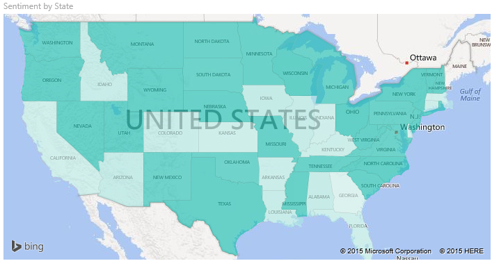
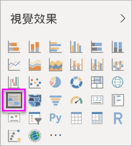
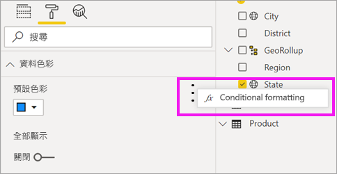
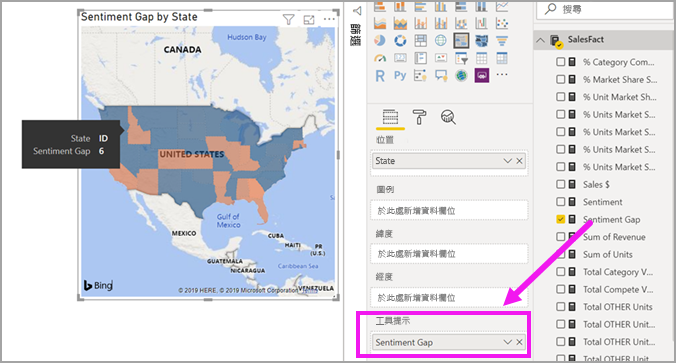

# Power BI 中的區域分布圖 (分區著色圖)

[!INCLUDE [power-bi-visuals-desktop-banner](../includes/power-bi-visuals-desktop-banner.md)]

區域分布圖使用陰影、濃淡或圖樣，顯示值的比例如何隨著地理位置或地區而有所不同。  可使用範圍介於淺色 (較不常見/較低) 到深色 (較常見/較多) 的陰影，快速顯示這些相對差異。    

## 傳送至 Bing 的項目
Power BI 與 Bing 整合以提供預設地圖座標 (這個程序稱為地理編碼)。 當您在 Power BI 服務或 Power BI Desktop 中建立地圖視覺效果時，[位置]  、[緯度]  和 [經度]  貯體中的資料 (用來建立該視覺效果) 會傳送至 Bing。

您或您的系統管理員可能需要更新防火牆，以允許存取 Bing 用以進行地理編碼的 URL。  這些 URL 是：
- https://dev.virtualearth.net/REST/V1/Locations    
- https://platform.bing.com/geo/spatial/v1/public/Geodata    
- https://www.bing.com/api/maps/mapcontrol

如需有關傳送至 Bing 之資料的詳細資訊，以及提升地理編碼成功率的祕訣，請參閱[地圖視覺效果的祕訣和訣竅](power-bi-map-tips-and-tricks.md)。

## 使用區域分布圖的時機
區域分布圖極適合：

* 當您要在地圖上顯示量化資訊。
* 當您要顯示空間模式和關聯性。
* 當您的資料已標準化。
* 當您使用的是社會經濟資料。
* 當定義的區域相當重要。
* 當您要取得跨地理位置的分佈概觀。

### 先決條件
本教學課程使用[銷售與行銷範例 PBIX 檔案](https://download.microsoft.com/download/9/7/6/9767913A-29DB-40CF-8944-9AC2BC940C53/Sales%20and%20Marketing%20Sample%20PBIX.pbix)。
1. 從功能表列的左上方區段，選取 [檔案]   > [開啟] 
   
2. 尋找您的**銷售與行銷範例 PBIX 檔案**複本

1. 在報表檢視  中開啟**銷售與行銷範例 PBIX 檔案**。

1. 選取  新增頁面。

## 建立基本的區域分布圖
在這段影片中，Kim 會建立一個基本地圖，並將其轉換成區域分布圖。
   > [!NOTE]
   > 此影片使用舊版的 Power BI Desktop。
   > 
   > 

[影片 https://www.youtube.com/embed/ajTPGNpthcg ]

### 建立區域分布圖
1. 從 [欄位] 窗格中，選取 [地理]  \> [州]  欄位。    

   ![[狀態] 旁的黃色核取記號](media/power-bi-visualization-filled-maps-choropleths/power-bi-state.png)
2. [將圖表轉換](power-bi-report-change-visualization-type.md)成區域分布圖。 請注意，[州]  現在處於 [位置]  部分。 Bing 地圖服務會使用 [位置]  部分中的欄位來建立地圖。  此位置可以是各種不同的有效位置：國家/地區、州、縣市、城市、郵遞區號或其他郵遞區號等。Bing 地圖服務提供世界各地位置的區域分布圖。 如果 [位置] 部分沒有有效項目，Power BI 就不能建立區域分布圖。  

   
3. 篩選地圖，只顯示美國本土。

   a.  在 [視覺效果] 窗格左邊尋找 [篩選]  窗格。 若它已最小化，請將它展開

   b.  將滑鼠游標停在 [州]  上方，然後選取展開＞形箭號。  
   ![顯示 [狀態(全部)] 的視覺效果層級篩選](media/power-bi-visualization-filled-maps-choropleths/img004.png)

   c.  在 [全部]  旁邊放置一個核取記號，然後移除 [AK]  旁邊的核取記號。

   ![未選取 [全部] 和 [AK] 的 [狀態] 下拉式清單](media/power-bi-visualization-filled-maps-choropleths/img005.png)
4. 選取油漆滾筒圖示來開啟 [格式化] 窗格，然後選擇 [資料色彩]  q。

    ![顯示 [資料色彩] 選項的 [格式化] 窗格](media/power-bi-visualization-filled-maps-choropleths/power-bi-colors-data.png)

5. 選取三個垂直點並選擇 [設定格式化的條件]  。

    

6. 使用 [預設色彩 - 資料色彩]  畫面來決定您的已填滿地圖將如何套用陰影。 可用選項包括要以哪個欄位作為陰影套用基底，以及如何套用陰影。 在此範例中，我們將會使用欄位 [SalesFact]   > [人氣]  ，然後將人氣的最小值設定為橙色，並將最大值設定為藍色。 落在最大值與最小值之間的值將套用橙色與藍色陰影。 畫面底部的圖解顯示將使用的色彩範圍。 

    ![已選取 [情感] 的預設色彩窗格](media/power-bi-visualization-filled-maps-choropleths/power-bi-sentiment-field.png)

7. 區域分布圖會呈綠色，並以紅色代表人氣指數較低，而綠色代表人氣較高、較為正向。  若要顯示額外的詳細資料，請一併將欄位拖曳到 [工具提示]。  在這裡，我們新增了 [SalesFact]   > [人氣落差]  。 醒目提示愛達荷州 (ID) 來顯示人氣落差很低，只有 6。
   

10. [儲存報表](../service-report-save.md)。

Power BI 提供您眾多對區域分布圖外觀的控制。 試試看這些資料色彩控制項，直到獲得您想要的外觀。 

## 反白顯示和交叉篩選
如需使用 [篩選] 窗格的資訊，請參閱[將篩選加入報表](../power-bi-report-add-filter.md)。

在區域分布圖中醒目提示位置，會交叉篩選報表頁面上的其他視覺效果，反之亦然。

1. 若要跟著做，請先選取 [檔案] > [儲存]  來儲存此報表。 

2. 使用 CTRL-C 複製區域分布圖。

3. 從報表畫布底部，選取 [人氣]  索引標籤，開啟 [人氣] 報表頁面。

    ![已選取 [人氣] 索引標籤](media/power-bi-visualization-filled-maps-choropleths/power-bi-sentiment-tab.png)

4. 移動並調整頁面上視覺效果的大小以便挪出空間空間，然後按 CTRL-V 從先前的報表貼上區域分布圖。 (查看下列影像)

   ![區域分布圖已新增至 [人氣] 頁面](media/power-bi-visualization-filled-maps-choropleths/power-bi-map.png)

5. 在區域分布圖中選取一個州。  這會交叉醒目提示及交叉篩選頁面上的其他視覺效果。 例如，選取 [德州]  會交叉篩選卡片並交叉醒目提示橫條圖。 我由此得知人氣為 75，且德州位於中央區 #23。   
   ![已選取 [德州]](media/power-bi-visualization-filled-maps-choropleths/power-bi-filter.png)
2. 選取 [VanArsdel - 依月份的人氣] 折線圖上的資料點。 這樣會篩選區域分布圖，來顯示 VanArsdel 的人氣，而不顯示其競賽的人氣。  
   

## 考量與疑難排解
地圖資料可能模稜兩可。  例如，有在法國的巴黎，但也有「德州，巴黎」(Paris, Texas)。 您的地理資料可能會儲存在個別資料行 (縣市名稱的資料行、州或省名稱的資料行等等)，所以 Bing 可能無法判斷這裡的巴黎是哪個巴黎。 如果您的資料集已經包含經度和緯度資料，Power BI 有特殊欄位可協助避免地圖資料模稜兩可。 直接將包含緯度資料的欄位拖曳到 [視覺效果] \> [緯度] 區域。  然後對經度資料執行相同的動作。    

![[視覺效果] 和 [欄位] 窗格](media/power-bi-visualization-filled-maps-choropleths/pbi-latitude.png)

如果您有權限可編輯 Power BI Desktop 中的資料集，請觀賞這段影片，以協助解決地圖模稜兩可的情況。

[影片 https://www.youtube.com/embed/Co2z9b-s_yM ]

如果您沒有經度和緯度資料的存取權，但有資料集的編輯存取權，請[遵循這些指示來更新您的資料集](https://support.office.com/article/Maps-in-Power-View-8A9B2AF3-A055-4131-A327-85CC835271F7)。

如需地圖視覺效果的更多說明，請參閱[地圖視覺效果的祕訣和訣竅](../power-bi-map-tips-and-tricks.md)。

## 後續步驟

[圖形地圖](desktop-shape-map.md)

[Power BI 中的視覺效果類型](power-bi-visualization-types-for-reports-and-q-and-a.md)