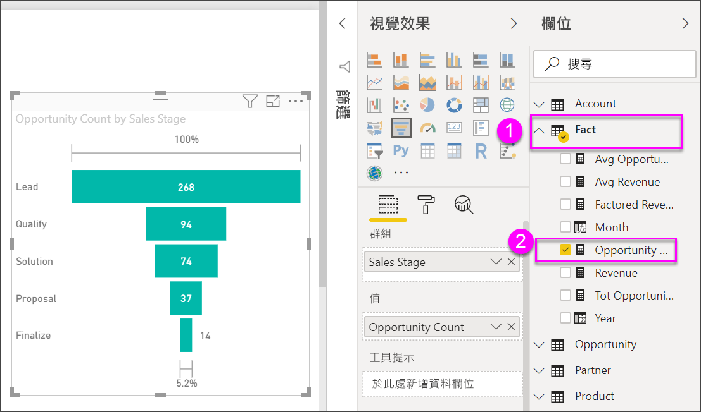

# 建立和使用漏斗圖

[!INCLUDE [power-bi-visuals-desktop-banner](../includes/power-bi-visuals-desktop-banner.md)]

漏斗圖幫您將有循序連接階段的線性程序視覺化。 例如，銷售漏斗圖透過以下階段追蹤客戶：潛在客戶 \> 合格的潛在客戶 \> 期望 \> 合約 \> 結案。  漏斗圖的圖形一看就能表達出您追蹤中程序的健全狀況。

漏斗圖的每個階段代表總數中所佔的百分比。 因此，在大部分情況下，漏斗圖形狀像漏斗 -- 第一階段最大，然後每個後續階段比前一階段小。  梨狀的漏斗圖也很實用，能識別出程序中的問題。  但通常第一階段，也就是「引入」階段佔最大部分。

## 使用漏斗圖的時機
漏斗圖極適合：

* 當資料具有循序性，並至少通過 4 個以上的階段時。
* 當第一階段「項目」數目預期大於最後階段的數目時。
* 當您要分階段計算潛在項目 (營收/銷售額/成交量/等等) 時。
* 當您要計算及追蹤轉換率和留客率時。
* 當您要顯示線性程序中的瓶頸時。
* 當您要追蹤購物車的工作流程時。
* 當您要追蹤點選連結廣告/行銷活動的進度及成功與否時。

## 使用漏斗圖
漏斗圖：

* 可以進行排序。
* 支援多個圖表。
* 可以在相同報表頁面上，藉由其他視覺效果反白顯示及交叉篩選。
* 可以在相同報表頁面上，用於反白顯示及交叉篩選其他視覺效果。
   > [!NOTE]
   > 觀賞這段影片，了解 Will 如何使用銷售與行銷範例來建立漏斗圖。 然後遵循影片下方的步驟，使用商機分析 .PBIX 範例檔案親自試試看
   > 
   > 
## 必要條件

本教學課程使用[商機分析範例 PBIX 檔案](https://download.microsoft.com/download/9/1/5/915ABCFA-7125-4D85-A7BD-05645BD95BD8/Opportunity%20Analysis%20Sample%20PBIX.pbix
)。

1. 從功能表列的左上方區段中，選取 [檔案]   > [開啟] 
   
2. 尋找您的**商機分析範例 PBIX 檔案**複本

1. 在報表檢視 **報表檢視圖示的螢幕擷取畫面** 中開啟。

1. Select  新增頁面。

## 建立基本漏斗圖
觀賞這段影片，了解 Will 如何使用銷售與行銷範例來建立漏斗圖。

<iframe width="560" height="315" src="https://www.youtube.com/embed/qKRZPBnaUXM" frameborder="0" allow="autoplay; encrypted-media" allowfullscreen></iframe>

現在建立您自己的漏斗圖，其中可顯示每個銷售階段中擁有的商機數。

1. 從空白報告頁面開始，選取 [SalesStage]  \> [銷售階段]  欄位。
   
    ![選取 [銷售階段]](media/power-bi-visualization-funnel-charts/funnelselectfield-new.png)

1. 選取漏斗圖示  將直條圖轉換成漏斗圖。

2. 從 [欄位]  窗格，選取 [事實]  \> [商機計數]  。
   
    
4. 暫留在列上會顯示豐富的資訊。
   
   * 階段名稱
   * 此階段目前商機數
   * 整體轉換率 (潛在客戶 %) 
   * 至下一階段 (也稱為下滑率)，是前一階段的 % (在本案例中是提案階段/解決方案階段)
     
     

6. [儲存報表](../service-report-save.md)。

## 反白顯示和交叉篩選
如需使用 [篩選] 窗格的資訊，請參閱[將篩選新增至報表](../power-bi-report-add-filter.md)。

在漏斗圖中反白顯示列，會篩選報表頁面上的其他視覺效果，反之亦然。 如果要跟著做，請將其他一些視覺效果加入包含漏斗圖的報表頁面中。

1. 在漏斗圖中選取 [提案]  列。 這會交叉醒目提示頁面上的其他視覺效果。 使用 CTRL 進行多重選取。
   
   
2. 若要設定視覺效果互相交叉醒目提示及交叉篩選之方式的喜好設定，請參閱[在 Power BI 中與視覺效果互動](../service-reports-visual-interactions.md)

## 後續步驟

[Power BI 中的量測計](power-bi-visualization-radial-gauge-charts.md)

[Power BI 中的視覺效果類型](power-bi-visualization-types-for-reports-and-q-and-a.md)
