# 建立關鍵影響因素視覺效果

[!INCLUDE[consumer-appliesto-nyyn](../includes/consumer-appliesto-nyyn.md)]    

[!INCLUDE [power-bi-visuals-desktop-banner](../includes/power-bi-visuals-desktop-banner.md)]

關鍵影響因素視覺效果可協助您了解影響您感興趣計量的因素。 可分析您的資料、為重要因素排名並將其顯示為關鍵影響因素。 例如，假設您想要了解影響員工流動率 (也稱為變換) 的因素。 其中一項因素可能是雇用合約長度，另一項因素可能是員工年齡。 
 
## 何時使用關鍵影響因素 
如果您想要執行下列作業，關鍵影響因素視覺效果會是不錯的選擇： 
- 查看哪些因素會影響正在分析的計量。
- 對比這些因素的相對重要性。 例如，針對客戶流失，短期合約是否比長期合約的影響更大？ 

## 關鍵影響因素視覺效果的功能

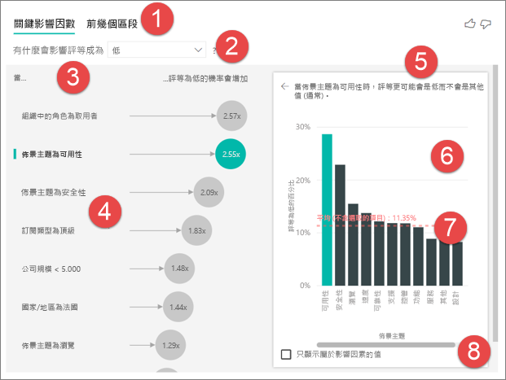

1. **索引標籤**：選取索引標籤以切換檢視。 [關鍵影響因素] 顯示所選計量值的主要參與者。 [主要區段] 顯示參與所選計量值的主要區段。 「區段」是值的組合。 例如，其中一個區段可能是已成為客戶至少 20 年並住在西部區域的取用者。 

2. **下拉式清單方塊**：正在調查的計量值。 在此範例中，請查看計量**評等**。 選取的值為 [低]。

3. **重述**：可協助您解譯左窗格中的視覺效果。

4. **左窗格**：左窗格包含一個視覺效果。 在此案例中，左窗格會顯示主要關鍵影響因素清單。

5. **重述**：可協助您解譯右窗格中的視覺效果。

6. **右窗格**：右窗格包含一個視覺效果。 在此案例中，直條圖會顯示左窗格中所選關鍵影響因素 (**主題**) 的所有值。 左窗格中的特定值 (**可用性**) 會以綠色顯示。 **主題**的所有其他值會以黑色顯示。

7. **平均線**：計算**可用性** (這是選取的影響因素) 以外**主題**所有可能值的平均值。 因此，計算會套用至所有黑色的值。 這會告訴您有多少百分比的其他**主題**擁有低評等。 在此案例中，11.35% 擁有低評等 (以虛線顯示)。

8. **核取方塊**：篩選出右窗格中的視覺效果，只顯示屬於該欄位影響因素的值。 在此範例中，這會將視覺效果篩選為可用性、安全性和瀏覽。

## 分析類別目錄計量
 
觀看這段影片以了解如何使用類別目錄計量來建立關鍵影響因素視覺效果。 然後遵循下列步驟建立一個視覺效果。 

   > [!NOTE]
   > 此影片使用舊版的 Power BI Desktop。
   > 
   > 
<iframe width="560" height="315" src="https://www.youtube.com/embed/fDb5zZ3xmxU" frameborder="0" allow="accelerometer; autoplay; encrypted-media; gyroscope; picture-in-picture" allowfullscreen></iframe>

產品經理希望您了解哪些因素會導致客戶對您的雲端服務留下負面評論。 若要跟著做，請在 Power BI Desktop 中開啟[客戶意見反應 PBIX 檔案](https://github.com/microsoft/powerbi-desktop-samples/tree/master/Monthly%20Desktop%20Blog%20Samples/2019/customerfeedback.pbix)。 您也可以下載 [Power BI 服務或 Power BI Desktop 的客戶意見反應 Excel 檔案](https://github.com/microsoft/powerbi-desktop-samples/tree/master/Monthly%20Desktop%20Blog%20Samples/2019/customerfeedback.xlsx)。 選取任一連結，然後從出現的 GitHub 頁面選取 [下載]。

> [!NOTE]
> 客戶意見反應資料集乃基於 [Moro et al., 2014] S. Moro、P. Cortez 和 P. Rita。 "A Data-Driven Approach to Predict the Success of Bank Telemarketing" (預測銀行電話行銷成功的資料導向方法)。 *Decision Support Systems*，Elsevier，62:22-31，2014 年 6 月。 

1. 開啟報表，然後選取**關鍵影響因素**圖示。 

    ![從 [視覺效果] 窗格中選取 [關鍵影響因素] 範本](media/power-bi-visualization-influencers/power-bi-template-new.png)

2. 將您想要調查的計量移至 [分析] 欄位。 若要了解造成客戶對服務給予低評等的因素，請選取 [客戶資料表] > [評等]。

3. 將您認為可能會影響**評等**的欄位移至 [說明依據] 欄位。 您可以視需要移動許多欄位。 在此案例中，請從下列欄位開始：
    - 國家/地區 
    - 組織中的角色 
    - 訂閱類型 
    - 公司規模 
    - 佈景主題
    
4. 將 [展開依據] 欄位保留空白。 只有在分析量值或摘要欄位時，才會使用此欄位。 

5. 若要專注於負面評等，請在 [哪些影響因素評等為] 下拉式清單方塊中選取 [低]。  

    ![從下拉式清單方塊中選取 [低]](media/power-bi-visualization-influencers/power-bi-key-influencers.png)

分析會在所分析欄位的資料表層級執行。 在此案例中為**評等**計量。 此計量是在客戶層級定義。 每個客戶已給予高分或低分。 所有說明因素都必須在客戶層級定義，以供視覺效果使用。 

在上述範例中，所有說明因素都與計量具有一對一或多對一關聯性。 在此案例中，每個客戶已將單一主題指派給其評等。 同樣地，來自同一國家/地區的客戶在其組織中都有一種成員資格類型並執行一個角色。 說明因素已經是客戶的屬性且不需要轉換。 視覺效果可以立即使用。 

稍後在教學課程中，您將探討更複雜的範例，包含一對多關聯性。 在這些案例中，資料行必須先向下彙總至客戶層級，才能執行分析。 

用於說明因素的量值和彙總，也會在 [分析] 計量的資料表層級進行評估。 本文稍後會顯示一些範例。 

## 解譯類別目錄關鍵影響因素 
讓我們探討對於低評等的關鍵影響因素。 

### 可能對低評等造成影響的最主要單一因素

此範例中的客戶可能有三個角色：取用者、管理員和發行者。 取用者是導致低評等的主要因素。 

![選取 [組織中的角色是取用者]](media/power-bi-visualization-influencers/power-bi-role-consumer.png)

更精確地說，取用者給予服務負分的可能性是 2.57 倍。 關鍵影響因素圖表在左側清單中先列出 [組織中的角色是取用者]。 透過選取 [組織中的角色是取用者]，Power BI 會在右窗格中顯示其他詳細資料。 這會顯示比較每個角色影響低評等的可能性。
  
- 14.93% 的取用者給予低分。 
- 平均而言，所有其他角色在 5.78% 的時間會給予低分。
- 與所有其他角色相比，取用者給予低分的可能性是 2.57 倍。 您可以透過使用紅色虛線劃分綠色直條來進行判斷。 

### 可能對低評等造成影響的第二個單一因素

關鍵影響因素視覺效果比較來自許多不同變數的因素並進行排名。 第二個影響因素與**組織中角色**無關。在清單中選取第二個影響因素，也就是 [主題是可用性]。 

![選取 [主題是可用性]](media/power-bi-visualization-influencers/power-bi-theme.png)

第二個最重要因素與客戶評論的主題相關。 評論產品可用性的客戶，與評論其他主題 (例如可靠性、設計或速度) 的客戶相比，給予低分的可能性高 2.55 倍。 

視覺效果之間的平均值 (以紅色虛線顯示) 已從 5.78% 變更為 11.34%。 平均值乃基於所有其他值的平均，因此為動態。 針對第一個影響因素，平均值排除了客戶角色。 針對第二個影響因素，則排除了可用性主題。 
 
選取 [只顯示屬於影響因素的值] 核取方塊，只使用具影響力的值進行篩選。 在此案例中為造成低分的角色。 十二個主題會縮減為 Power BI 認定造成低評等的四個主題。 

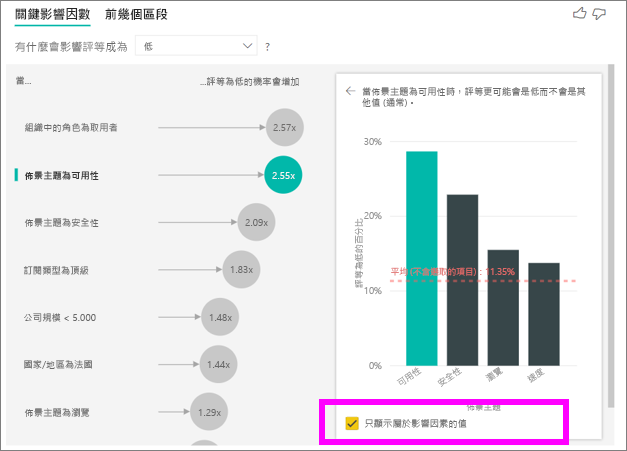

## 與其他視覺效果互動 
 
您每次選取交叉分析篩選器、篩選條件或畫布上的其他視覺效果時，關鍵影響因素視覺效果會在資料的新部分重新執行分析。 例如，您可以將 [公司規模] 移至報表作為交叉分析篩選器。 使用它來查看您企業客戶的關鍵影響因素是否與一般母體不同。 企業公司規模大於 50,000 名員工。
 
選取 [>50,000] 重新執行分析，您可以看到影響因素已變更。 針對大型企業客戶，低評等之主要影響因素具有與安全性相關的主題。 您可能想要進一步調查，確認您的大型客戶是否對特定安全功能不滿意。 

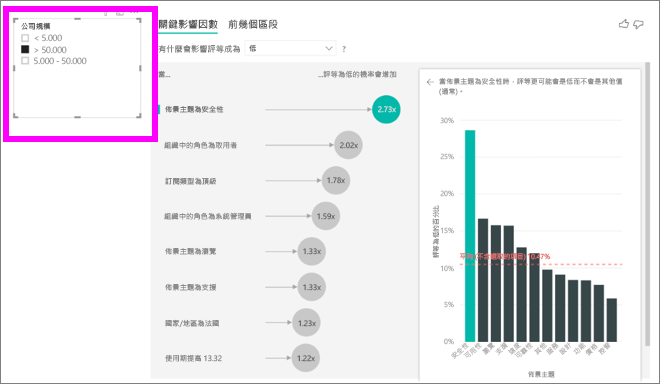

## 解譯連續關鍵影響因素 
 
到目前為止，您已了解如何使用視覺效果來探索不同的類別目錄欄位如何影響低評等。 您也可以在 [說明依據] 欄位中使用連續因素，例如年齡、高度和價格。 讓我們看看將客戶資料表中的 [使用期] 移至 [說明依據] 時，會發生什麼狀況。 使用期顯示客戶已使用服務多長時間。 
 
隨著使用期提升，收到較低評等的可能性隨之提高。 此趨勢表示長期客戶較可能給予負面分數。 這是有趣的見解，您可能想要在稍後進行追蹤。 
 
視覺效果顯示每當使用期增加 13.44 個月，收到低評等的可能性平均而言會增加 1.23 倍。 在此案例中，13.44 月表示使用期的標準差。 因此，您得到的見解將探討以標準數量增加之使用期 (使用期的標準差) 會如何影響收到低評等的可能性。 
 
右窗格中散佈圖會針對每個使用期值繪製低評等的平均百分比。 它使用趨勢線來醒目提示斜率。

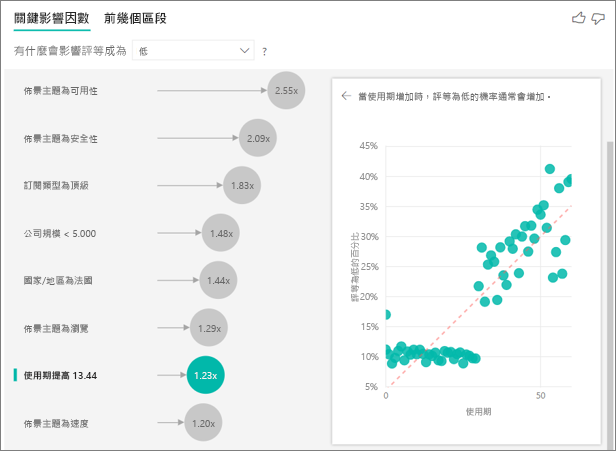

## 量化連續關鍵影響因素

在某些情況下，您可能會發現連續因素已自動轉換成類別因素。 這是因為我們已了解變數之間的關聯性非為線性，因此我們無法將關聯性描述為只是增加或減少 (就像我們在上述範例中所做的一樣)。

我們會執行相互關聯測試，以判斷影響因素對於目標的線性程度。 如果目標為連續，我們會執行皮爾生 (Pearson) 相互關聯，且若目標為類別目錄，我們會執行點二系列 (Point Biserial) 相互關聯測試。 如果我們偵測到關聯性不夠線性，我們會進行受監督量化，並產生最多 5 個 Bin。為了找出哪些 Bin 最合理，我們使用受監督量化方法，它會查看說明因素與分析中目標之間的關聯性。

## 將量值和彙總解譯為關鍵影響因素 
 
您可以使用量值和彙總作為分析中的說明因素。 例如，您可能想要了解客戶支援票證計數或開啟票證的平均持續時間，對您收到的分數會造成什麼影響。 
 
在此案例中，您想要了解客戶支援票證數量是否會影響他們給予的分數。 現在，您將從支援服務票證資料表帶入**支援票證識別碼**。 由於客戶可能有多個支援票證，因此您需要將識別碼彙總至客戶層級。 彙總十分重要，因為分析是在客戶層級執行，因此必須在該層級的資料粒度上定義所有驅動因素。 
 
讓我們看看識別碼的計數。 每個客戶資料列都具有與其建立關聯的支援票證計數。 在此案例中，隨著支援票證計數提升，收到低評等的可能性隨之提高 5.51 倍。 右側視覺效果顯示不同**評等**值的支援票證平均數量會在客戶層級評估。 

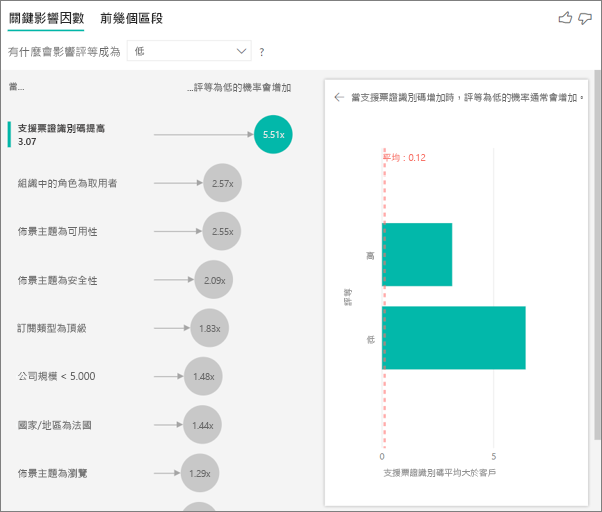

## 解譯結果：前幾個區段 
 
您可以使用 [關鍵影響因素] 索引標籤來個別評估每個因素。 您也可以使用 [主要區段] 索引標籤來了解各種因素組合會如何影響您正在分析的計量。 
 
主要區段一開始會顯示 Power BI 發現的所有區段概觀。 下列範例顯示已找到六個區段。 這些區段依區段內低評等的百分比排名。 例如，區段 1 中 74.3% 的客戶評等為低。 泡泡圖愈高，低評等的比例也愈高。 泡泡圖大小代表該區段內有多少客戶。 

![選取 [主要區段] 索引標籤](media/power-bi-visualization-influencers/power-bi-top-segments-tab.png)

選取泡泡圖可深入了解該區段。 例如，如果您選取 [區段 1]，您會發現其由相對較資深的客戶所組成。 他們成為客戶已超過 29 個月，並擁有四個以上的支援票證。 最後，他們並非發行者 (所以他們是取用者或管理員)。 
 
在此群組中，74.3% 的客戶給予低評等。 平均客戶在 11.7% 的時間給予低評等，因此該區段的低評等比例較高。 高出 63 個百分點。 區段 1 也包含約 2.2% 的資料，因此其代表母體的可定址部分。 

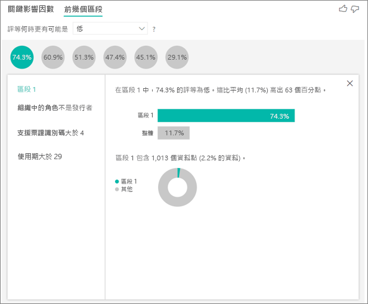

## 新增計數

有時影響因素可能會有重大影響，但代表非常少的資料。 例如，[主題] **是 [可用性]**  為低評等的第二大影響因素。 不過，可能只有少數客戶抱怨可用性。 計數可協助您排列想要專注的影響因素優先順序。

您可以透過格式設定窗格的 [分析] 卡片來開啟計數。

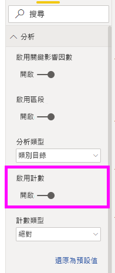

一旦開啟計數，您就會在每個影響因素的泡泡周圍看到環形，代表影響因素所包含資料的約略百分比。 環形包圍泡泡的面積越多，它所包含的資料就越多。 我們可以看到 [主題]**為** [可用性] 包含非常小的資料比例。

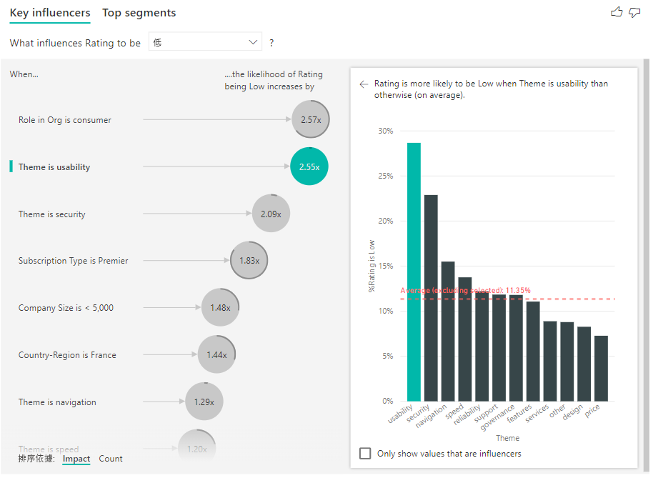

您也可以使用視覺效果左下方的 [排序依據] 切換，先依計數 (而不是影響) 來排序泡泡。 [訂閱類型] **為 [頂級]**  是根據計數的前幾名影響因素。

在圓形周圍具有全環表示影響因素包含 100% 的資料。 您可以使用格式設定窗格 [分析] 卡片中的 [計數類型] 下拉式清單，將計數類型變更為相對於最大影響因素。 現在，具有最多資料量的影響因素會以全環表示，而所有其他計數會相對於它。

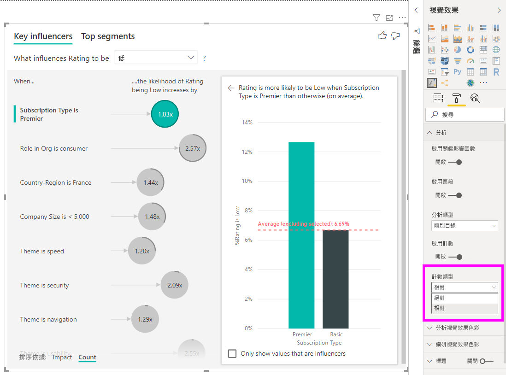

## 分析數值計量

如果您將未摘要的數值欄位移至 [分析] 欄位，您就可以選擇如何處理該案例。 您可以變更視覺效果的行為，方法是移至 [格式設定] 窗格，然後在**類別目錄分析類型**與**連續分析類型**之間切換。

![從 [類別目錄] 變更為 [連續]](media/power-bi-visualization-influencers/power-bi-ki-formatting.png)

**類別目錄分析類型**的行為會如上所述。 例如，如果您正在查看範圍 1 到 10 的問卷分數，您可以詢問「哪些因素會影響問卷分數變成 1」。

**連續分析類型**會將問題變更為連續問題。 在上述範例中，我們的新問題會是「哪些因素會影響問卷分數變高/變低」。

當您所分析的欄位中有許多唯一值時，這項區別會很有幫助。 在下列範例中，我們將探討房價。 詢問「哪些因素會影響房價變成 156,214」並無太大意義， 因為這很特定，我們可能沒有足夠的資料來推斷模式。

相反地，我們可能想要詢問「哪些因素會影響房價變高」， 這可讓我們以一段範圍而不是相異值來處理房價。

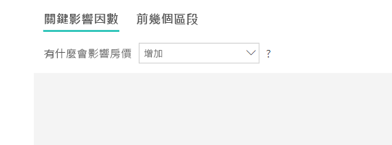

## 解譯結果：關鍵影響因數 

在此案例中，我們將探討「哪些因素會影響房價變高」。 我們將探討一些可能影響房價的說明因素，例如 **Year Built** (房屋建造年份)、**KitchenQual** (廚房品質) 和 **YearRemodAdd** (房屋改建年份)。 

在下列範例中，我們將探討絕佳廚房品質的主要影響因素。 結果與我們在分析類別目錄計量時所看到的結果非常類似，但有一些重大差異：

- 右側直條圖會顯示平均值，而不是百分比。 因此會顯示具有絕佳廚房的房屋平均房價 (綠色直條)，與沒有絕佳廚房的房屋平均房價 (虛線) 比較結果
- 泡泡圖中的數字仍然是紅色虛線與綠色直條之間的差異，但會以數字 ($158.49K) 而不是機率 (1.93x) 表示。 因此平均而言，具有絕佳廚房的房屋比沒有絕佳廚房的房屋幾乎貴 $160K。

在下列範例中，我們將探討連續因素 (房屋改建年份) 對房價造成的影響。 這相較於我們如何分析類別目錄計量的連續影響因素有下列不同之處：

-   右窗格中的散佈圖繪製每個改建年份相異值的平均房價。 
-   泡泡圖中的值顯示當房屋改建年份隨著其標準差提升時 (在此案例中為 20 年)，平均房價會隨之提高多少 (在此案例中為 $2.87k)

最後，在量值案例中，我們將探討平均房屋建造年份。 其分析如下：

-   右窗格中的散佈圖繪製資料表中每個相異值的平均房價
-   泡泡圖中的值顯示當平均年份隨著其標準差提升時 (在此案例中為 30 年)，平均房價會隨之提高多少 (在此案例中為 $1.35K)

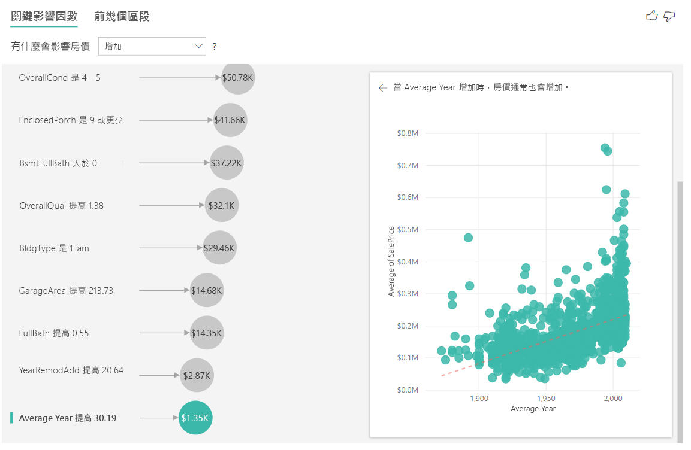

## 解譯結果：主要區段

數值目標主要區段顯示房價平均高於整體資料集的群組。 例如，我們在下面可以看到組成 [區段 1] 的房屋其 **GarageCars** (車庫可容納的汽車數量) 大於 2，而 **RoofStyle** 為 Hip。 相較於資料的整體平均值 $180K，具有這些特性的房屋平均價格為 $355K。

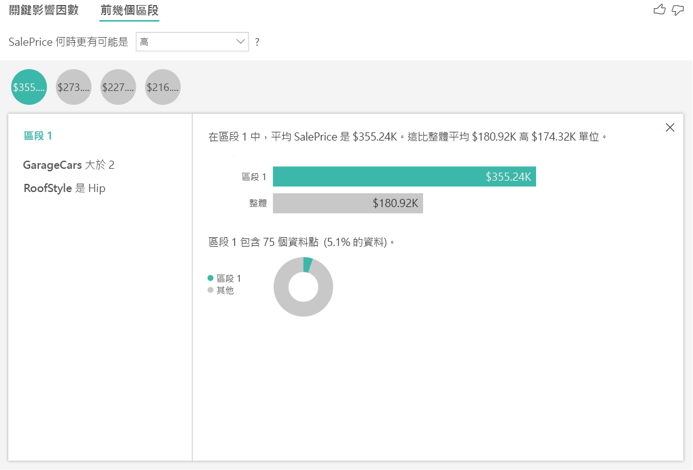

## 分析量值或摘要資料行計量

在量值或摘要資料行的案例中，分析會預設為[上述](#analyze-a-metric-that-is-numeric)的**連續分析類型**。 這無法變更。 分析量值/摘要資料行與未摘要數值資料行之間的最大差異，在於分析執行的層級。

在未摘要資料行的案例中，分析一律會在資料表層級執行。 在上述房價範例中，我們分析了 [房價] 計量來查看哪些因素會影響房價變高/變低。 分析會自動在資料表層級執行。 在我們的資料表中，每個房屋有唯一的識別碼，因此分析會在房屋層級執行。

針對量值和摘要資料行，我們不會立即得知分析所在的層級。 如果 [房價] 已摘要為 [平均值]，我們必須考慮想要計算此平均房價的層級。 這是鄰近地區層級的平均房價嗎？ 還是區域層級？

量值和摘要資料行會自動在所使用的 [說明依據] 欄位層級分析。 假設我們對 [說明依據] 中的三個欄位感興趣：[廚房品質]、[建築物類型] 和 [空調]。 我們會針對這三個欄位的每個唯一組合計算 [平均房價]。 切換至資料表檢視以查看所要評估的資料外觀通常會很有幫助。

此分析經過相當程度的摘要，因此迴歸模型很難在資料中找到可從中學習的任何模式。 我們應該以更詳細的層級執行分析，以獲得更好的結果。 如果我們想要在房屋層級分析房價，則必須明確將 [識別碼] 欄位新增至分析。 不過，我們不想要將房屋識別碼視為影響因素。 了解房價是否會隨著房屋識別碼增加而增加並沒有幫助。 此時 [展開依據] 欄位部分選項會派上用場。 您可以使用 [展開依據] 新增要用於設定分析層級的欄位，而不需要尋找新的影響因素。

讓我們看看將 [識別碼] 新增至 [展開依據] 之後的視覺效果外觀。 定義您要評估量值的層級之後，解譯影響因素的方式會與[未摘要的數值資料行](#analyze-a-metric-that-is-numeric)完全相同。

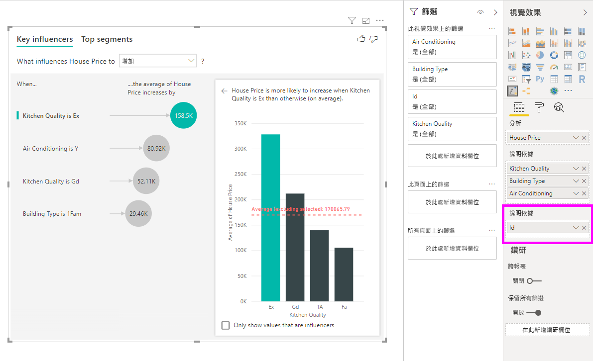

如果您想要深入了解如何使用關鍵影響因素視覺效果來分析量值，請觀看下列教學課程。

<iframe width="1167" height="631" src="https://www.youtube.com/embed/2X1cW8oPtc8" frameborder="0" allow="accelerometer; autoplay; encrypted-media; gyroscope; picture-in-picture" allowfullscreen></iframe>

## 考量與疑難排解 
 
**視覺效果的限制有哪些？** 
 
關鍵影響因素視覺效果有一些限制：

- 不支援 Direct Query
- 不支援即時連線到 Azure Analysis Services 和 SQL Server Analysis Services
- 不支援發佈到 Web
- 需要 .NET Framework 4.6 或更高版本
- 不支援 SharePoint Online 內嵌

**我看到一項錯誤，指出未發現影響因素或區段。為什麼會這樣？** 

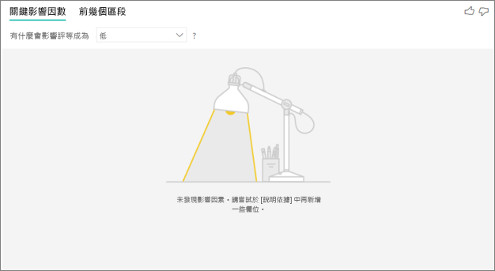

如果您在 [說明依據] 中包含欄位但未發現影響因素，則會出現此錯誤。 
- 您在 [分析] 和 [說明依據] 中包含了您正在分析的計量。 請從 [說明依據] 中將其移除。 
- 您的說明欄位具有太多類別與太少觀察值。 這種情況會讓視覺效果難以判斷哪些因素是影響因素。 它很難根據少數觀察值來進行一般化。 如果您正在分析數值欄位，您可能想要在 [分析] 卡片下的 [格式設定] 窗格中，從**類別目錄分析**切換為**連續分析**。
- 您的說明因素有足夠觀察值來進行一般化，但視覺效果找不到任何有意義的關聯性來回報。
 
**我看到一項錯誤，指出我正在分析的計量沒有足夠資料來執行分析。為什麼會這樣？** 

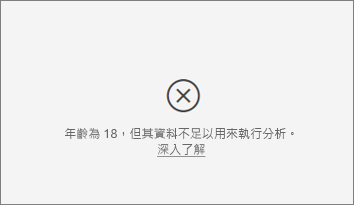

視覺效果運作方式是查看一個群組與其他群組的資料模式比較結果。 例如，它會尋找給予低評等和給予高評等的客戶比較結果。 如果您模型中的資料只有少數觀察值，則很難找到模式。 如果視覺效果沒有足夠資料來尋找有意義的影響因素，則會指出需要更多資料來執行分析。 

建議您對所選狀態進行至少 100 次觀察。 在此案例中，狀態是流失的客戶。 您也需要對用於比較的狀態進行至少 10 次觀察。 在此案例中，比較狀態是未流失的客戶。

如果您正在分析數值欄位，您可能想要在 [分析] 卡片下的 [格式設定] 窗格中，從**類別目錄分析**切換為**連續分析**。

**我看到一項錯誤，指出未執行摘要「分析」時，分析一律會在其父資料表的資料列集層執行。不允許透過 [展開依據] 欄位變更此層級。為什麼會這樣？**

分析數值或類別目錄資料行時，分析一律會在資料表層級執行。 例如，如果您想要分析房價，且您的資料表包含 [識別碼] 資料行，則分析會自動在房屋識別碼層級執行。 

當您想要分析量值或摘要資料行時，您必須明確指定分析要執行的層級。 您可以使用 [展開依據] 來變更量值和摘要資料行的分析層級，而不需要新增影響因素。 如果已將 [房價] 定義為量值，您可以將 [房屋識別碼] 資料行新增至 [展開依據] 來變更分析層級。

**我看到一項錯誤，指出 [說明依據] 中的欄位與包含所分析計量的資料表不具有唯一關聯性。為什麼會這樣？**
 
分析會在所分析欄位的資料表層級執行。 例如，如果您分析客戶對服務的意見反應，您可能會擁有告訴您客戶給予高評等或低評等的資料表。 在此案例中，您的分析會執行於客戶資料表層級。 

如果相關資料表的定義層級比包含計量的資料表更精細，您會看到此錯誤。 以下為範例： 
 
- 您分析導致客戶給予服務低評等的原因。
- 您想要了解客戶使用服務的所在裝置，是否會影響他們給予的評論。
- 客戶可以透過多種不同方式來使用服務。
- 在下列範例中，客戶 10000000 使用瀏覽器和平板電腦來與服務互動。

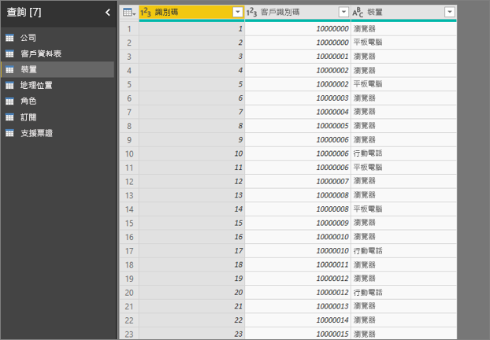

如果您嘗試使用裝置的資料行作為說明因素，您會看到下列錯誤： 

因為裝置並非在客戶層級上定義，所以會出現此錯誤。 一個客戶可以在多部裝置上使用服務。 若要讓視覺效果找出模式，裝置必須是客戶的屬性。 根據您對商務的理解，有幾個解決方法： 
 
- 您可以將裝置摘要變更為計數。 例如，如果裝置數量可能會對客戶給予的分數造成影響，請使用計數。 
- 您可以轉換裝置資料行，查看在特定裝置上使用服務是否會影響客戶的評等。
 
在此範例中，資料已經樞紐分析，以建立瀏覽器、行動和平板電腦的新資料行 (請務必在轉換資料之後，在模型化視圖中刪除並重新建立關聯性)。 您現在可以在 [說明依據] 中使用這些特定的裝置。 所有裝置都是影響因素，而瀏覽器對客戶分數的影響最大。

更精確地說，不透過瀏覽器來使用服務的客戶，比透過瀏覽器的客戶，給予低分的可能性高出 3.79 倍。 在清單的較下方處，行動裝置的情況則相反。 使用行動裝置應用程式的客戶，比不使用行動裝置應用程式的客戶較可能給予低分。 

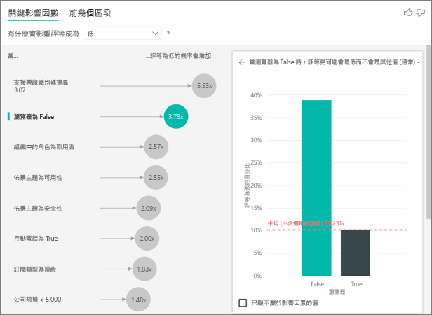

**我看到一項警告，指出我的分析中未包含量值。為什麼會這樣？** 

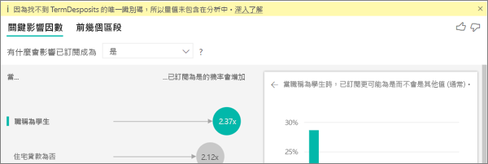

分析會在所分析欄位的資料表層級執行。 如果您分析客戶流失，您可能會擁有告訴您客戶是否流失的資料表。 在此案例中，您的分析會執行於客戶資料表層級。
 
根據預設，量值和彙總都會在該資料表層級進行分析。 如果有平均每月消費的量值，該量值會在客戶資料表層級進行分析。 

如果客戶資料表不具有唯一識別碼，您即無法評估該量值且分析會將其忽略。 若要避免這種情況，請確定包含計量的資料表具有唯一識別碼。 在此案例中為客戶資料表，而唯一識別碼為客戶識別碼。 使用 Power Query 來新增索引資料行也很容易。
 
**我看到一項警告，指出我正在分析的計量具有超過 10 個唯一值，此數量可能會影響我的分析品質。為什麼會這樣？** 

AI 視覺效果可以分析類別目錄欄位和數值欄位。 在類別目錄欄位案例中，範例可能包括流失為「是」或「否」，以及客戶滿意度為「高」、「中」或「低」。 增加要分析的類別數量，表示每個類別中的觀察值會較少。 這種情況會導致視覺效果更難在資料中找到模式。 

分析數值欄位時，您可以選擇將數值欄位當作文字來處理，在此情況下，您會執行與針對類別目錄資料所執行相同的分析 (**類別目錄分析**)。 如果您有許多相異值，建議您將分析切換為**連續分析**，這表示我們可以透過數字增加或減少來推斷模式，而不是以相異值來處理。 您可以在 [分析] 卡片下的 [格式設定] 窗格中，從**類別目錄分析**切換為**連續分析**。

若要尋找更強的影響因素，建議您將類似的值分組至單一單位。 例如，如果您有價格的計量，則將類似價格分組為「高」、「中」和「低」類別，可能會取得比使用個別價格點更好的結果。 

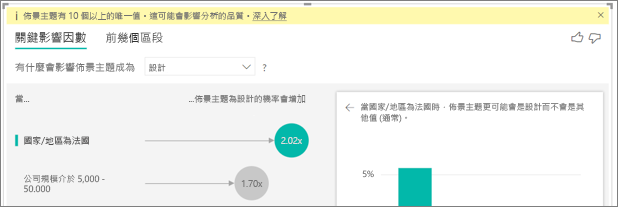

**我的資料中有一些因素看起來應該是關鍵影響因素，但事實上並不是。為何會發生此情況？**

在下列範例中，身分為取用者的客戶會造成低評等 (14.93% 的評等為低)。 管理員角色也具有高比例的低評等 (13.42%)，但不視為影響因素。 

此判斷的原因是視覺效果在尋找影響因素時也會考慮資料點的數量。 下列範例有超過 29,000 名取用者，比管理員人數 (大約 2,900) 少 10 倍。 只有 390 名給予低評等。 視覺效果沒有足夠資料來判斷它是使用管理員評等來發現模式或只是碰巧發現。 

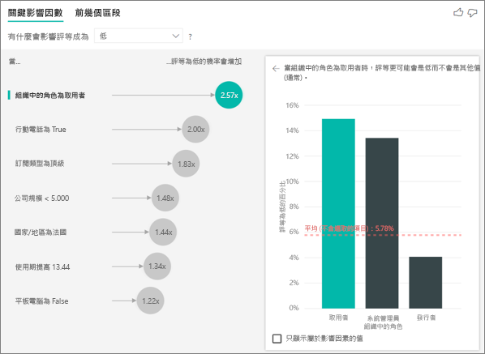

**關鍵影響因素的資料點限制為何？**
我們對包含 10,000 個資料點的範例執行分析。 其中一側中泡泡會顯示所有找到的影響因素。 另一側中直條圖和散佈圖則會遵守這些核心視覺效果的取樣策略。

**您如何計算類別目錄分析的關鍵影響因素？**

在幕後，AI 視覺效果會使用 [ML.NET](https://dotnet.microsoft.com/apps/machinelearning-ai/ml-dotnet) 來執行羅吉斯迴歸以計算關鍵影響因素。 羅吉斯迴歸是一種統計模型，將不同的群組互相比較。 

如果您想要了解造成低評等的因素，羅吉斯迴歸會查看給予低分和給予高分的客戶有何不同。 如果您有多個類別 (例如高分、中間分數和低分)，您可以查看給予低評等與未給予低評等的客戶有何不同。 在此案例中，給予低分和給予高評等或中間評等的客戶有何不同？ 
 
羅吉斯迴歸會搜尋資料中的模式，並找出給予低評等和給予高評等的客戶有何不同。 例如，它可能會發現擁有較多支援票證的客戶，會比幾乎沒有或完全沒有支援票證之客戶給予更高百分比的低評等。
 
羅吉斯迴歸也會考慮有多少資料點存在。 例如，如果扮演管理員角色的客戶在比例上給予更多負面分數，但管理員為少數，則不會將此因素視為具影響力。 此判斷的原因是因為沒有足夠資料點可用於推斷模式。 統計測試 (稱為 Wald 測試) 用於判斷某因素是否視為影響因素。 視覺效果會使用 0.05 的 p 值來決定閾值。 

**您如何計算數值分析的關鍵影響因素？**

在幕後，AI 視覺效果會使用 [ML.NET](https://dotnet.microsoft.com/apps/machinelearning-ai/ml-dotnet) 執行線性迴歸來計算關鍵影響因素。 線性迴歸是一種統計模型，查看您正在分析之欄位結果如何根據您的說明因素變更。

例如，如果我們正在分析房價，線性迴歸將查看具有絕佳廚房對房價造成的影響。 具由絕佳廚房的房屋相較於沒有絕佳廚房的房屋，房價通常較低或較高？

線性迴歸也會考慮資料點數量。 例如，如果具有網球場的房屋價格較高，但具有網球場的房屋為少數，則不會將此因素視為具影響力。 此判斷的原因是因為沒有足夠資料點可用於推斷模式。 統計測試 (稱為 Wald 測試) 用於判斷某因素是否視為影響因素。 視覺效果會使用 0.05 的 p 值來決定閾值。 

**您如何計算區段？**

在幕後，AI 視覺效果會使用 [ML.NET](https://dotnet.microsoft.com/apps/machinelearning-ai/ml-dotnet) 執行決策樹來尋找感興趣的子群組。 決策樹最終目標是取得資料點的子群組，該資料點在您感興趣的計量中相對較高。 這可能是給予低評等的客戶或高價格房屋。

決策樹會採用每個說明因素，並嘗試判斷哪些因素會提供最佳「分割」。 例如，如果您篩選資料來僅包含大型企業客戶，其是否會將給予高評等和給予低評等的客戶做出區隔？ 或者，若篩選資料來僅包含評論安全性的客戶，是否會更好？ 

決策樹分割之後，會擷取資料的子群組，並針對該資料判斷下一個最佳分割。 在此案例中，子群組是評論安全性的客戶。 每次分割之後，它也會考慮是否有足夠資料點，讓此群組夠代表性能從中推斷模式，或是否為資料中的異常，而不是真正的區段。 另一個統計測試會套用來檢查分割條件的統計顯著性，其 p 值為 0.05。 

決策樹完成執行之後，會擷取所有分割 (例如安全性評論和大型企業) 並建立 Power BI 篩選條件。 此篩選條件的組合，會在視覺效果中封裝為區段。 
 
**為什麼在我將更多欄位移至 [說明依據] 欄位時，某些因素會成為影響因素或停止成為影響因素？**

視覺效果會將所有說明因素一起評估。 某個因素本身可能是影響因素，但考慮到其他因素時，則可能不是。 假設您想要分析是什麼造成高房價，臥室和房屋大小為說明因素：

- 就其本身而言，較多臥室可能是造成高房價的因素。
- 將房屋大小包含於分析中，表示您現在要探討當房屋大小保持不變時，臥室會如何變化。
- 如果房屋大小固定在 1,500 平方英呎，不斷增加臥室數量將不太可能大幅提高房價。 
- 相較於之前考慮房屋大小，臥室可能並非重要因素。 

若要與 Power BI 同事共用報表，必須兩人都擁有個人的 Power BI Pro 授權，或將報表儲存在 Premium 容量中。 請參閱[共用報告](../collaborate-share/service-share-reports.md)。

## 後續步驟
- [Power BI 中的組合圖](power-bi-visualization-combo-chart.md)
- [Power BI 中的視覺效果類型](power-bi-visualization-types-for-reports-and-q-and-a.md)