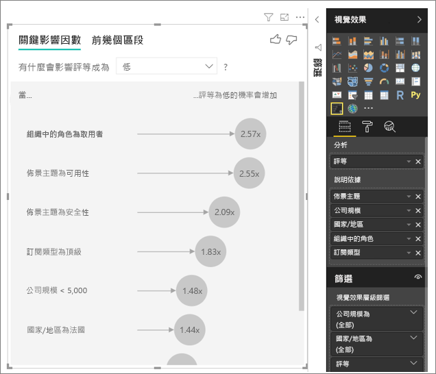
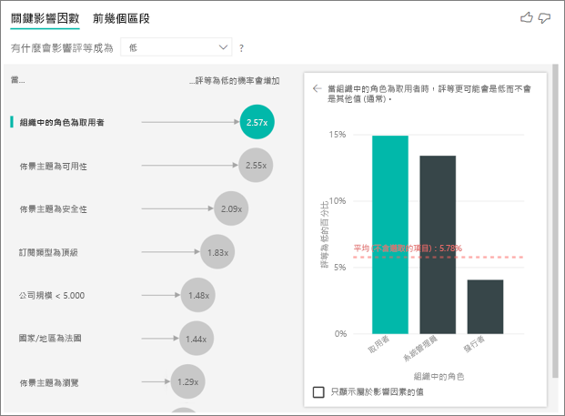
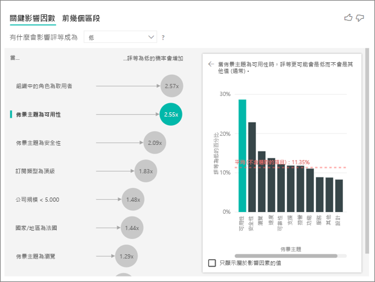
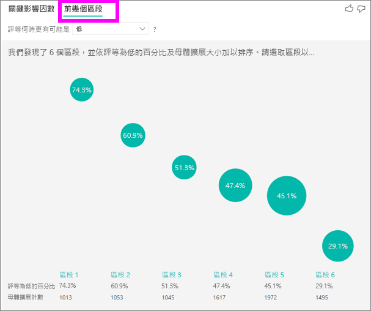
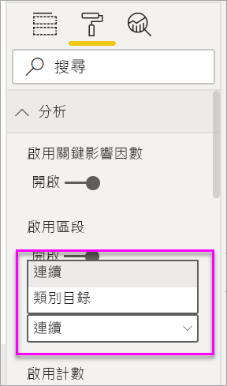

# 關鍵影響因素視覺效果
視覺化的關鍵影響因數可協助您了解您感興趣的度量該磁碟機的因素。 可分析您的資料、為重要因素排名並將其顯示為關鍵影響因素。 例如，假設您想要找出員工營業額，也就是所謂變換何種影響。 一項因素可能會雇用合約長度，和另一個因素可能是員工的年齡。 
 
## 何時使用關鍵影響因數 
如果您想要的關鍵影響因數視覺項目會是不錯的選擇： 
- 請參閱哪些因素會影響正在分析的計量。
- 這些因素的相對重要性的對比。 例如，針對客戶流失，短期合約是否比長期合約的影響更大？ 

## 關鍵影響因素需求 
您所分析的計量必須是類別或數字的欄位 （彙總以及量值不尚未支援）。

## 視覺化的關鍵影響因數的功能

1. **索引標籤**:選取索引標籤，以檢視之間切換。 **索引鍵影響因數**顯示前幾名投稿到選取的計量值。 **前幾大區段**參與所選取的計量值的上方區段會顯示。 「區段」  是值的組合。 例如，一個區段可能已經被客戶至少 20 年，而且住在西部區域的客戶。 

2. **下拉式清單方塊**:調查中計量的值。 在此範例中，查看 計量**分級**。 選取的值是**低**。

3. **重新陳述**:它可協助您解譯的視覺物件的左窗格中。

4. **左的窗格**:左的窗格包含一個視覺效果。 在此情況下，左的窗格會顯示一份最上層的關鍵影響因數。

5. **重新陳述**:它可協助您解譯視覺效果在右窗格中。

6. **右窗格**:右窗格中有一個視覺效果。 在此情況下，直條圖會顯示所有值的關鍵影響者**佈景主題**之前選取的左窗格中。 特定的值**可用性**從左窗格會顯示為綠色。 針對其他所有值皆**佈景主題**會顯示為黑色。

7. **平均值線**:針對所有其他可能值的計算平均值**佈景主題**除了**可用性**。 因此，計算會套用至所有黑色的值。 它會告訴您另一個的百分比**佈景主題**給予您低的評等。 換句話說，客戶指定的評等時，該客戶也會描述原因或評等的佈景主題。 某些主題會使用性、 速度和安全性。 

   **佈景主題是使用性**是低的費率，根據視覺效果的左窗格中的第二個最高關鍵影響者。 如果您的平均所有其他佈景主題和其所佔比重的評等**低**，您會得到結果顯示為紅色。 所有其他佈景主題中的指定，只有 11.35%會高於**可用性**。

8. **核取方塊**:**只顯示值的影響因數**。

## 建立關鍵影響因素視覺效果 
 
觀看這段影片以了解如何建立視覺效果的關鍵影響因數。 然後遵循下列步驟來建立一個。 

<iframe width="560" height="315" src="https://www.youtube.com/embed/fDb5zZ3xmxU" frameborder="0" allow="accelerometer; autoplay; encrypted-media; gyroscope; picture-in-picture" allowfullscreen></iframe>

您的產品經理想要您找出其中通盤考量潛在客戶的客戶離開負檢閱關於您的雲端服務。 若要跟著做，請在 Power BI Desktop 中開啟[客戶意見反應 PBIX 檔案](https://github.com/Microsoft/powerbi-desktop-samples/blob/master/2019/customerfeedback.pbix)。 您也可以下載[Power BI 服務或 Power BI Desktop 的客戶意見反應 Excel 檔](https://github.com/Microsoft/powerbi-desktop-samples/blob/master/2019/customerfeedback.xlsx)。 

> [!NOTE]
> 客戶的意見反應資料集是根據在 [Moro 要是，2014年] S Moro P.Cortez，P.Rita。 「 資料驅動的方法以預測銀行清單式成功。 」 *決策支援系統*，Elsevier，62:22-31，2014 年 6 月。 

1. 開啟報表，然後選取**金鑰影響因數**圖示。 

    ![從 [視覺效果] 窗格中選取 [關鍵影響因素] 範本](media/power-bi-visualization-influencers/power-bi-template-new.png)

2. 移動您想要調查到的計量**分析**欄位。 **分析**欄位支援類別，或 noncontinuous，變數。 若要查看推動客戶評等的服務，以很低，選取**Customer 資料表** > **分級**。 
3. 您認為可能會影響移動欄位**分級**成**所說明**欄位。 您可以移動您想要的欄位。 在此情況下，開始：
    - 國家/地區 
    - 組織中的角色 
    - 訂閱類型 
    - 公司規模 
    - 佈景主題 
1. 若要專注的負評等，請選取**低**中**影響評等為**下拉式清單方塊。  

    

正在分析之欄位的資料表層級上，執行分析。 在此情況下，它有**分級**計量。 此標準會在客戶層級定義。 每個客戶已授與分數高或較低的分數。 所有的說明因素必須定義要視覺效果的客戶層級使用它們。 

在上述範例中，所有說明因素都有一對一或多對一關聯性包含下列度量。 在此情況下，每個分數會有一個與其相關聯的佈景主題。 此佈景主題已在客戶檢閱的主旨。 同樣地，客戶會出現一個國家/地區中，從有成員資格類型，且其組織內執行一個角色。 說明的因素已經是一位客戶的特性和不需要任何轉換。 視覺效果可立即使用它們。 

稍後在教學課程中，您看看更複雜的範例有一個對多關聯性。 在這些情況下，資料行必須先加以彙總到客戶層級才能執行分析。 

量值和做為說明因素也會評估資料表層級的彙總**分析**計量。 在本文稍後，會顯示一些範例。 

## 解譯類別的關鍵影響因數 
讓我們看看低評等的關鍵影響因數。 

### 前一項因素會影響低評等的可能性

此範例中的組織有三個角色： 消費者、 管理員和發行者。 取用者是提供給低評等的最上層因素。 

更精確地說，您的取用者會 2.57 時間更容易就能提供您服務的負數的分數。 關鍵影響因數的圖表清單**組織中的角色是取用者**左側清單中的第一個。 藉由選取**組織中的角色是取用者**，Power BI 會顯示在右窗格中的其他詳細資料。 會顯示每個角色的比較影響低評等的可能性。
  
- 14.93%的取用者提供較低的分數。 
- 平均而言，所有其他角色可讓較低的分數 5.78%的時間。
- 取用者會比較 2.57 時間可能提供低的分數，相較於其他所有角色。 您可以將它判斷的紅點虛線除以綠色列。 

### 第二個會影響低評等的可能性的單一因素

視覺化的關鍵影響因數比較，並排列次序因素從許多不同的變數。 第二個影響者具有與無關**組織中的角色**。在清單中，會選取第二個影響者**佈景主題是使用性**。 

第二個最重要的因素被與客戶的檢閱的佈景主題。 標記為註解相關的產品可用性的客戶都比較 2.55 時間提供低的分數，相較於其他佈景主題，例如可靠性、 設計或速度加上註解的客戶。 

視覺效果，之間平均值，其會顯示紅色虛線，變更 5.78%11.34%。 平均值是動態的因為它根據所有其他值的平均值。 第一個影響者，如平均值中排除 [客戶] 角色。 針對第二個影響者，它會排除可用性佈景主題。 
 
選取 **只會顯示值的影響因數**核取方塊，以利用具影響力的值來篩選。 在此情況下，它們的磁碟機的低的分數的角色。 十二個佈景主題會縮減至 Power BI 識別為磁碟機評分很低的佈景主題的四個。 

## 與其他視覺效果互動 
 
每次您選取交叉分析篩選器、 篩選或畫布上的其他視覺效果，視覺化的關鍵影響因數會傳回其分析資料的新部分。 例如，您可以在其中移動**公司的規模**到報表並使用它作為交叉分析篩選器。 您可以使用它來查看適用於企業客戶的關鍵影響因數是否不同於一般的母體擴展。 企業公司大小大於 50000 的員工。
 
選取 **> 50,000**重新執行分析，而且您可以查看影響因數的變更。 大型企業客戶的最上層的影響者低評等會有與安全性相關的佈景主題。 您可能想要調查，請參閱進一步，如果有大型客戶滿意系統有關的特定安全性功能。 

## 解譯連續的關鍵影響因數 
 
到目前為止，您已了解如何使用瀏覽不同的類別欄位的視覺效果影響評分很低。 也是可以有連續的因素，例如年齡、 高度和中的價格**所說明**欄位。 讓我們看看會發生什麼事時**任職**移至 customer 資料表**所說明**。 任職描述多久客戶已使用的服務。 
 
任職增加時，接收較低的評等的可能性也會增加。 這種趨勢表示較長期的客戶更容易就能為負數的分數。 此深入解析很有趣，您可能想要在稍後追蹤，另一個。 
 
視覺效果會顯示，每次是以 13.44 月份上去任職，平均低評等的可能性會增加 1.23 的時間。 在此案例中，13.44 月表示使用期的標準差。 因此，您收到的深入解析會探討如何以標準的數量，也就是任職的標準差，增加任職會影響接收低評等的可能性。 
 
在右窗格中的散佈圖會繪製任職的每個值的評分很低的平均百分比。 它會反白顯示使用趨勢線的斜率。

## 解譯的關鍵影響因數的量值和彙總 
 
您可以使用 說明的因素為量值和彙總，在您的分析。 比方說，您可能要查看您收到何種影響客戶支援票證的計數或平均持續時間，開啟票證的分數。 
 
在此情況下，您會想要看到是否客戶擁有的支援票證數目會影響它們所提供的分數。 現在您納入**支援票證識別碼**支援票證資料表中。 客戶可以有多個支援票證，因為您彙總至客戶層級的識別碼。 彙總很重要的因為客戶層級中，會執行分析，因此所有的驅動程式必須定義層級的資料粒度。 
 
讓我們看看識別碼的計數。 每個客戶的資料列有與其相關聯的支援票證的計數。 在此情況下，支援票證的增加的計數評等的可能性低上去 5.51 的時間。 在右側的視覺顯示支援票證的平均數目的不同**分級**評估客戶層級的值。 

## 解譯結果：前幾個區段 
 
您可以使用**金鑰影響因數** 索引標籤，來個別評估每個因素。 您也可以使用**前幾大區段**索引標籤，以了解如何因素的組合會影響您分析的計量。 
 
上方區段一開始會顯示 Power BI 探索到的所有區段的概觀。 下列範例會顯示六個區段找不到。 這些區段會依區段內的評分很低的百分比排名。 區段 1，比方說，具有較低的 74.3%客戶評等。 泡泡圖愈高，低評等的比例也愈高。 泡泡的大小代表多少客戶為區段內。 

選取泡泡圖可深入了解該區段。 如果您選取區段 1，比方說，您發現，它個相當既有客戶。 它們已經客戶超過 29 個月，而且有四個以上的支援票證。 最後，不是發行者，以便您取用者或系統管理員。 
 
在此群組中，74.3%的客戶提供了低評等。 平均客戶提供了低評等的情況下，11.7%，讓此區段有評分很低的較大比例。 它是 63 百分比點為單位較高。 區段 1 也包含約有 2.2%的資料，因此它代表母體擴展可定址的一部分。 

## 使用 數值資料

如果您將移至數字欄位**分析** 欄位中，您可以選擇如何處理這種情況。 您可以變更視覺效果的行為，方法是移到**格式化窗格**以及切換**類別的分析類型**並**連續的分析類型**。

A**類別的分析類型**行為方式如上所述。 比方說，如果您正在看著問卷分數範圍從 1 到 10，您可以詢問 '什麼影響問卷分數為 1' 嗎？

A**連續的分析類型**變成一個連續的問題。 在上述範例中，我們新的問題會是 '影響來增加/減少的問卷分數？'

如果您要分析的欄位中有許多唯一值，這項區別是很有幫助。 在下列範例中我們探討房屋價格。 不是非常有意義，要求 '什麼影響房屋代價趕上 156,214' 嗎？ 這很特定，我們可能會不有足夠的資料來推斷模式。

而是我們可能想要問，'影響房屋價格，以增加' 嗎？ 這可讓我們視為屋價格範圍，而不是相異值。

## 解譯結果：關鍵影響因數 

在此案例中我們探討 '影響房屋價格，以增加'。 我們會查看許多說明可能會影響像房屋價格的因素**年建置**（年建置房子）、 **KitchenQual** （廚房品質） 和**YearRemodAdd**（年房子重塑）。 

在下列範例中，我們看看我們最上層的影響者即廚房正在極佳的品質。 結果是非常類似於我們所分析類別的計量，但有一些重要的差異時所看到的項目：

- 在右側直條圖查看平均值，而不是百分比。 因此顯而易見我們絕佳廚房房子的平均房屋價格為何 （綠色列） 相較於一棟房子沒有很好的廚房 （虛線） 的平均房屋價格
- 泡泡圖中的數字仍然是紅色虛線和綠色列之間的差異，但是它會以數字 ($158。 49 K) 而不是，很可能 (1.93 x)。 依此類推平均，與這些絕佳的房屋幾乎 $160 K 成本高於而不需要這些絕佳的房屋。

在下列範例中我們會查看影響連續的因素 （年房屋重塑） 對房屋價格。 相較於我們如何分析連續分類度量的影響因數的差異如下所示：

-   在右窗格中的散佈圖繪製改變的年度的每一個相異值的平均房屋價格。 
-   泡泡圖中的值顯示多少平均房子的價格會增加 (在此情況下 $2。 第 87 k) 房屋的年份時改變增加由其標準差 （在此情況下 20 年）

最後，在我們查看平均年的量值的情況下，建立一棟房子。 這裡的分析如下所示：

-   在右窗格中的，散佈圖繪製在資料表中每一個相異值的平均房屋價格
-   泡泡圖中的值顯示多少平均房子的價格會增加 (在此情況下 $1。 35 K) 平均年增加其標準差 （在此情況下 30 年）

## 解譯結果：上方區段

上方區段數值目標顯示群組房子其中平均價格會高於整體資料集內。 比方說下, 面我們可以看到**區段 1**組成的房屋其中**GarageCars** （汽車車庫可容納的數目） 大於 2 而**RoofStyle**是 Hip。 具有這些特性的房屋有平均的價格的 $355 K 相較於 $180 K 資料中的整體平均。

## 考量與疑難排解 
 
**預覽版限制有哪些？** 
 
關鍵影響因數 visual 目前為公開預覽狀態，並有一些限制。 目前無法使用。 的功能包括： 
- 分析會彙總或量值的計量。
- 使用 Power BI Embedded 中的視覺效果。
- 使用 Power BI 行動裝置應用程式上的視覺效果。
- 支援 RLS。
- 直接查詢支援。
- 即時連接支援。

**我看到的錯誤，找不到任何影響因數或區段。為什麼會這樣？** 

包含中的欄位時，就會發生此錯誤**所說明**但找不到任何影響因數。 
- 您在包含您所分析的度量**分析**並**所說明**。 移除從**所說明**。 
- 您的說明欄位具有太多類別與太少觀察值。 這種情況下可讓您更難判斷哪些因素會影響因數的視覺效果。 很難一般化依據只有少數的觀察值。 如果您要分析的數值欄位可能會想要從切換**類別的分析**要**持續分析**中**格式化窗格**下**分析**卡。
- 說明的因素有足夠的觀察值，將一般化，但是視覺效果找不到任何有意義的相互關聯報表。
 
**我看到錯誤，我要分析的度量沒有足夠的資料執行分析。為什麼會這樣？** 

視覺效果的運作方式是查看相較於其他群組的一個群組的資料中的模式。 比方說，它會尋找客戶提供高評等的客戶提供相較的評分很低。 如果您的模型中的資料有只有少數的觀察值，就有一個模式難以進行尋找。 如果視覺效果不會有足夠資料以尋找有意義的影響因數，則表示不需要更多的資料執行分析。 

我們建議您所選取狀態的最少 100 個觀察。 在此情況下，狀態為流失的客戶。 您也需要至少 10 個觀察值，您要用於比較的狀態。 在此情況下，比較狀態為沒有流失的客戶。

如果您要分析的數值欄位可能會想要從切換**類別的分析**要**持續分析**中**格式化窗格**下**分析**卡。

**我看到錯誤，中的欄位*所說明*唯一不相關資料表，其中包含我要分析的計量。為什麼會這樣？**
 
正在分析之欄位的資料表層級上，執行分析。 例如，如果您要分析客戶的意見反應為您的服務，您可能會告訴您是否為客戶提供高評等或低的評等的資料表。 在此情況下，您的分析在客戶資料表層級執行。 

如果您在更細微的層級，於包含您的度量的資料表有相關的資料表定義，您會看到此錯誤。 以下是範例： 
 
- 您可以分析推動客戶給予您的服務評分很低。
- 您想要查看的裝置的客戶會使用您的服務是否影響它們所提供的評論。
- 客戶可以在多個不同的方式取用服務。
- 在下列範例中，客戶 10000000 使用瀏覽器和平板電腦與服務互動。

如果您嘗試使用裝置的資料行做為說明的因素，您會看到下列錯誤： 

因為裝置不在客戶層級定義，就會出現這個錯誤。 一位客戶可以使用多個裝置上的服務。 視覺效果來尋找模式中，裝置必須是客戶的屬性。 有數個取決於您了解商務的解決方案： 
 
- 您可以變更裝置來計算的摘要。 例如，使用計數，如果裝置的數目可能會影響客戶提供的分數。 
- 您可以查看如果使用特定裝置上的服務會影響客戶的評等的裝置資料行進行樞紐分析。
 
在此範例中，資料的樞紐來建立新的資料行的瀏覽器、 行動和平板電腦。 您現在可以使用這些特定的裝置，在**所說明**。 所有的裝置會變得影響因數，以及瀏覽器具有客戶分數的最大效果。

更精確地說，不使用瀏覽器來取用服務的客戶很低的分數高於執行的客戶提供給 3.79 倍可能的。 在清單中，適用於行動裝置的反向較低的向下是如此。 使用行動應用程式的客戶則可能會更容易讓低的分數，高於不的客戶。 

**我看到量值並未包含在分析中的警告。為什麼會這樣？** 

正在分析之欄位的資料表層級上，執行分析。 如果您要分析客戶流失，您可能會告訴您客戶變換與否的資料表。 在此情況下，您的分析會在客戶資料表層級執行。
 
量值和彙總都預設在資料表層級分析。 如果有平均每月消費的量值，它會在客戶資料表層級分析。 

如果 customer 資料表沒有唯一的識別項，就無法評估量值，並分析會忽略它。 若要避免這種情況下，請確定您的度量的資料表都有唯一識別碼。 在此情況下，它是客戶的資料表和唯一識別碼是客戶識別碼。 它也是您輕鬆使用 Power Query 中加入索引資料行。
 
**我會看到警告我要分析的計量有 10 個以上的唯一值，這個數量，可能會影響我的分析的品質。為什麼會這樣？** 

類別的欄位和數值欄位，可以分析 AI 視覺效果。 如果類別的欄位是範例可能會變換是 Yes 或 No、0 和客戶滿意度是高、 中或低。 要分析的類別數目增加，表示有較少的觀察值，每個類別。 這種情況下讓您更難的視覺效果，以尋找資料中的模式。 

分析的數值欄位時您可以選擇將在此情況下您會執行相同的分析一樣的分類資料的類似文字的數值欄位 (**類別的分析**)。 如果您有許多相異值，我們建議您切換分析**連續分析**，這表示我們可以推斷時數字來增加或減少而不用將它們作為不同的值中的模式。 您可以從切換**類別的分析**來**連續分析**中**格式化窗格**下**Analysis**卡。

若要尋找更強的影響因數，我們建議您為單一單位分組類似的值。 比方說，如果您有個價格的度量，您可能會藉由將類似的價格分組為高、 中和低的分類與使用個別的資料點，取得更好的結果。 

**我看起來像是應有的關鍵影響因數的資料中的因素，但它們不是。為何會發生此情況？**

在下列範例中，取用者的客戶會驅動評分很低，14.93%的較低的評等。 系統管理員角色也會有高比例的評分很低，13.42%，但它不被認為是影響者。 

這項決定的原因是，視覺效果也會考慮資料點數目時發現影響因數。 下列範例具有多個 29,000 取用者和 10 次較少的系統管理員，大約 2,900。 唯一的 390，其中提供了低評等。 視覺效果不會有足夠的資料，以判斷是否找到的模式，以系統管理員的評等或其是否就有機會尋找。 

**您要如何計算進行分類的分析關鍵影響因數？**

在幕後使用 AI 視覺效果[ML.NET](https://dotnet.microsoft.com/apps/machinelearning-ai/ml-dotnet)執行來計算關鍵影響因數的羅吉斯迴歸。 羅吉斯迴歸是一種統計模型，將不同的群組互相比較。 

如果您想要查看推動評分很低，羅吉斯迴歸會探討與提供給最高分的客戶的客戶提供較低的分數有何不同。 如果您有多個類別，例如高、 中性和低的分數，您會查看未提供低評等的客戶與的指定低評等的客戶有何不同。 在此情況下，請勿提供較低的分數的客戶有何不同的客戶提供高評等或中性的評等？ 
 
羅吉斯迴歸搜尋的資料中的模式，並尋找提供低評等的客戶可能會有何不同的客戶提供高評等。 比方說，它可能會發現更多的支援票證的客戶提供幾乎不需要支援票證的客戶比更高百分比的評分很低。
 
羅吉斯迴歸也會考慮有多少資料點。 例如，如果播放系統管理員角色的客戶提供按比例負值的分數，但只有少數的系統管理員，這項因素不被視為具影響力。 因為沒有資料點不足推斷模式做出此判斷。 統計的測試中，稱為 wald 會測試，用來判斷是否視為一項因素影響者。 視覺效果會使用 0.05 的 p 值來決定閾值。 

**您要如何計算數值分析關鍵影響因數？**

在幕後使用 AI 視覺效果[ML.NET](https://dotnet.microsoft.com/apps/machinelearning-ai/ml-dotnet)執行線性迴歸，來計算關鍵影響因數。 線性迴歸是一種統計的模型，探討如何變更您要分析之欄位的結果會根據您說明的因素。

比方說，如果我們要分析房屋價格，線性迴歸會查看影響有絕佳的廚房會對房屋價格。 這些絕佳的房屋通常有相較於房屋，而不需要這些絕佳的低或較高的房屋價格？

線性迴歸也會考慮資料點數目。 例如，如果網球法院的房屋擁有較高的價格，但我們有很少有網球法院的待售屋，這項因素不是具影響力。 因為沒有資料點不足推斷模式做出此判斷。 統計的測試中，稱為 wald 會測試，用來判斷是否視為一項因素影響者。 視覺效果會使用 0.05 的 p 值來決定閾值。 

**您如何計算區段？**

在幕後使用 AI 視覺效果[ML.NET](https://dotnet.microsoft.com/apps/machinelearning-ai/ml-dotnet)執行決策樹來尋找感興趣的子群組。 決策樹的目的是要得到的資料點中您感興趣的計量相當高的子群組。 這可能是客戶評分很低或高價格的房屋。

決策樹會採用每個說明的因素，並嘗試將哪些因素為其提供最佳的原因*分割*。 比方說，如果您篩選要包含只有大型企業客戶的資料，請將區隔客戶提供高評等與低評等？ 或者，也許最好是篩選資料，以包含只有標記為註解安全性的客戶？ 

決策樹分岔完成之後，它會採用的資料子群組，並決定下一個最佳分割該資料。 在此情況下，子群組是在安全性加上註解的客戶。 之後每個分割中，它也會考量是否有足夠的資料點，此群組來代表夠推斷中的模式，或是否為異常的資料，而且不是真正的區段。 另一個統計測試套用至達到統計顯著性的分割條件的 p 值 0.05 的檢查。 

決策樹完成執行後，它會採用所有分割，例如安全性註解和大型企業中，並建立 Power BI 會篩選。 此篩選條件的組合，會在視覺效果中封裝為區段。 
 
**為什麼執行某些因素會影響因數或停止正在影響因數，當我移動到更多欄位*所說明*欄位？**

視覺效果會將所有說明因素一起評估。 一項因素可能會影響者本身，但時它會被視為與其他因素也可能不夠。 假設您想要分析推動房屋代價很高，個房間的清單與房屋大小作為說明的因素：

- 單獨使用時，多個房間的清單可能很高的房屋價格的驅動程式。
- 在分析中包括的房屋大小表示您現在看看會發生什麼事個房間的清單而房屋大小會維持不變。
- 如果房子大小固定在 1,500 平方英呎，也不太可能臥房數目持續增加，將會大幅增加房屋價格。 
- 個房間的清單可能不重要的因素之前被視為屋大小。 

## 後續步驟
- [Power BI 中的組合圖](power-bi-visualization-combo-chart.md)
- [Power BI 中的視覺效果類型](power-bi-visualization-types-for-reports-and-q-and-a.md)
