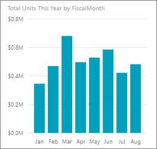
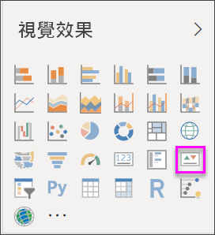
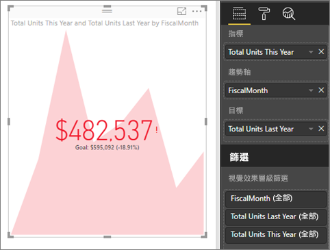

# KPI 視覺效果
關鍵效能指標 (KPI) 是一種視覺提示，指出對於可測量目標已達成的進度。 如需 KPI 的詳細資訊，請參閱 [Microsoft Developer Network](https://msdn.microsoft.com/library/hh272050)

如果您尚未註冊 Power BI，請先進行[免費註冊](https://app.powerbi.com/signupredirect?pbi_source=web)再開始。

## 先決條件
* [Power BI Desktop - 免費！](https://powerbi.microsoft.com/en-us/get-started/)
* [零售分析範例 PBIX 檔案](http://download.microsoft.com/download/9/6/D/96DDC2FF-2568-491D-AAFA-AFDD6F763AE3/Retail%20Analysis%20Sample%20PBIX.pbix)

## 使用 KPI 的時機
KPI 極適合：

* 測量進度 (超前或落後了那些項目？)
* 測量離目標的距離 (超前或落後了多少？)   

## KPI 需求
關鍵效能指標 (KPI) 根據特定量值，設計來協助您評估針對定義目標的目前值和指標狀態。 因此，KPI 視覺效果需要評估為值的「基底」量值和「目標」量值或值，以及「臨界值」或「目標」。

目前的 KPI 資料集必須包含 KPI 目標值。 若您的資料集未包含目標值，可透過將具有目標的 Excel 工作表新增至您的資料模型或 PBIX 檔案，以建立目標。

## 如何建立 KPI
若要跟著做，請在 Power BI Desktop 中開啟[零售分析 .PBIX 檔案](http://download.microsoft.com/download/9/6/D/96DDC2FF-2568-491D-AAFA-AFDD6F763AE3/Retail%20Analysis%20Sample%20PBIX.pbix)。 我們將建立 KPI，測量我們對業務目標已達成的進度。

或觀看 Will 說明如何建立單一計量的視覺效果︰量測計、卡片及 KPI。

<iframe width="560" height="315" src="https://www.youtube.com/embed/xmja6EpqaO0?list=PL1N57mwBHtN0JFoKSR0n-tBkUJHeMP2cP" frameborder="0" allowfullscreen></iframe>

1. 在 [報表] 檢視中開啟報表並選取黃色索引標籤來新增頁面。    
2. 從 [欄位] 窗格中選取 [銷售額] > [本年度的總單位]。  這會是指標。
3. 新增 [時間] > [FiscalMonth]。  這會顯示趨勢。
4. 重要：請依據 **FiscalMonth** 進行圖表排序。 將視覺效果轉換為 KPI 之後，即沒有選項可供排序。

    
5. 從 [視覺效果] 窗格中選取 KPI 圖示，將視覺效果轉換為 KPI。
   
    
6. 新增目標。 新增去年銷售為目標。 將 [去年度的總單位] 拖放至 [目標] 欄位。
   
    
7. (選擇性) 選取畫刷圖示可開啟 [格式化] 窗格來格式化 KPI。
   
   * **指標**：控制指標的顯示單位和小數位數。
   * **趨勢軸**：若設定為 [開啟]，就會顯示趨勢軸，作為 KPI 視覺效果的背景。  
   * **目標**：若設定為 [開啟]，視覺效果會顯示目標，並以百分比顯示離目標的距離。
   * **[色彩編碼] > [方向]** - 某些 KPI 的值較高可視為「更好」，而某些則是值較低可視為「更好」。 例如，盈餘和等待時間。 通常盈餘值較高代表「更好」，而等待時間更高通常代表「更糟」。 選取 [高更好]，以及選擇性變更色彩設定。

KPI 在 Power BI 服務和行動裝置上也可供使用，讓您可隨時連線到貴企業的活動訊號。

## 考量與疑難排解
* 若您的 KPI 看起來不像上述說明，可能是因為您需要依照會計月份排序。 因為 KPI 沒有排序選項，所以將視覺效果轉換為 KPI *之前*，必須先依照會計月份排序。

## 後續步驟

[Power BI 中的基本地圖](power-bi-map-tips-and-tricks.md)

[Power BI 中的視覺效果類型](power-bi-visualization-types-for-reports-and-q-and-a.md)