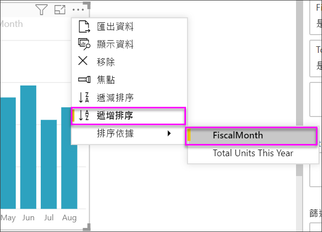

# 關鍵效能指標 (KPI) 視覺效果

[!INCLUDE [power-bi-visuals-desktop-banner](../includes/power-bi-visuals-desktop-banner.md)]

關鍵效能指標 (KPI) 是一種視覺提示，指出對於可測量目標已達成的進度。 如需 KPI 的詳細資訊，請參閱 [PowerPivot 中的關鍵效能指標 (KPI)](/previous-versions/sql/sql-server-2012/hh272050(v=sql.110))。

請觀看 Will 說明如何建立單一計量的視覺效果︰量測計、卡片及 KPI。
   > [!NOTE]
   > 這部影片使用舊版的 Power BI Desktop。
   > 
   > 
<iframe width="560" height="315" src="https://www.youtube.com/embed/xmja6EpqaO0?list=PL1N57mwBHtN0JFoKSR0n-tBkUJHeMP2cP" frameborder="0" allowfullscreen></iframe>

## 使用 KPI 的時機

KPI 極適合：

* 測量進度。 解答以下問題：「超前或落後了那些項目？」

* 測量與目標的距離。 解答以下問題：「超前或落後了多少？」

## KPI 需求

設計者將特定量值作為 KPI 視覺效果的基礎。 KPI 的意圖在於協助您針對定義的目標評估計量的目前值與狀態。 KPI 視覺效果需要評估為值的「基底」  量值、「目標」  量值或值，以及「臨界值」  或「目標」  。

KPI 資料集必須包含 KPI 目標值。 如果您的資料集未包含目標值，可透過將具有目標的 Excel 工作表新增至您的資料模型或 PBIX 檔案，以建立它們。

## 先決條件

本教學課程使用[零售分析範例 PBIX 檔案](https://download.microsoft.com/download/9/6/D/96DDC2FF-2568-491D-AAFA-AFDD6F763AE3/Retail%20Analysis%20Sample%20PBIX.pbix)。

1. 從功能表列的左上方區段中，選取 [檔案]   > [開啟] 

1. 尋找您的**零售分析範例 PBIX 檔案**複本

1. 在報表檢視中開啟**零售分析範例 PBIX 檔案**。 

1. 選取 **+** 以新增頁面。 

## 如何建立 KPI

在此範例中，您將建立 KPI 以測量達成的銷售目標進度。

1. 從 [欄位]  窗格中選取 [銷售額] > [本年度的總單位]  。  此值將是指標。

1. 新增 [時間] > [FiscalMonth]  。  此值將代表趨勢。

1. 在視覺效果的右上角，選取省略符號，然後檢查 Power BI 是否依 **FiscalMonth** 以遞增順序排序資料行。

    > [!IMPORTANT]
    > 將視覺效果轉換為 KPI 之後，即「沒有」  選項可供排序。 您必須立即正確排序它。

    

    一旦正確排序，您的視覺效果就會看起來像這樣：

    

1. 從 [視覺效果]  窗格中選取 **KPI** 圖示，將視覺效果轉換為 KPI。

    ![標示 KPI 圖示的 [視覺效果] 窗格螢幕擷取畫面。](media/power-bi-visualization-kpi/power-bi-kpi-template.png)

1. 若要新增目標，請將 [去年度的總單位]  拖曳至 [目標]  欄位。

    ![KPI 視覺效果已完成且 [欄位] 窗格具有所述值的螢幕擷取畫面。](media/power-bi-visualization-kpi/power-bi-kpi-done.png)

1. (選擇性) 選取畫刷圖示可開啟 [格式化] 窗格來格式化 KPI。

    * **指標**：控制指標的顯示單位和小數位數。

    * **趨勢軸** - 設為 [開啟]  時，視覺效果會顯示趨勢軸，作為 KPI 視覺效果的背景。  

    * **目標**：設為 [開啟]  時，視覺效果會顯示目標，並以百分比顯示與目標的距離。

    * **[色彩編碼] > [方向]** - 人們會將某些「更高」  的 KPI 值視為更好，而會將某些「更低」  的 KPI 值視為更好。 例如，盈餘和等待時間。 通常盈餘值較高代表「更好」，而等待時間更高通常代表「更糟」。 選取 [高即好]  ，並選擇性變更色彩設定。

在 Power BI 服務中和您的行動裝置上，也可以使用 KPI。 它可讓您選擇一律連線到您的業務活動訊號。

## 考量與疑難排解

若您的 KPI 看起來不像上述的 KPI，可能是因為您未依 **FiscalMonth** 排序。 Kpi 沒有排序選項。 您需要重新開始，並在將視覺效果轉換為 KPI「之前」  ，必須先依 **FiscalMonth** 排序。

## 後續步驟

* [Power BI 地圖視覺效果的秘訣和訣竅](power-bi-map-tips-and-tricks.md)

* [Power BI 中的視覺效果類型](power-bi-visualization-types-for-reports-and-q-and-a.md)

有其他問題嗎？ [試試 Power BI 社群](https://community.powerbi.com/)
