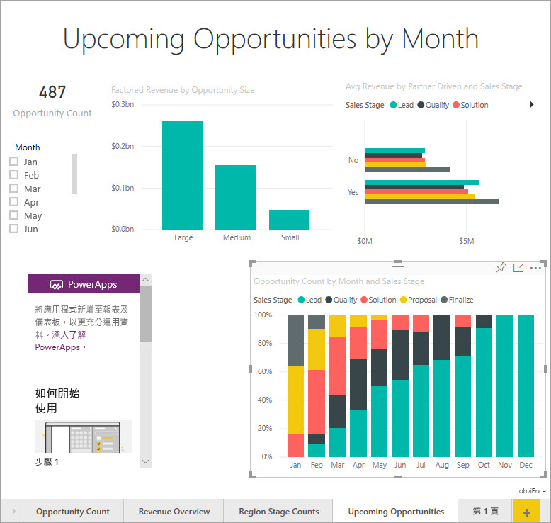
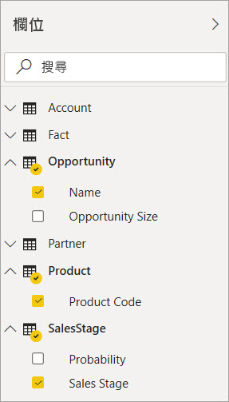
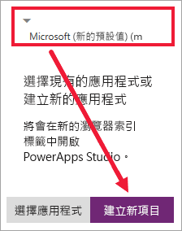
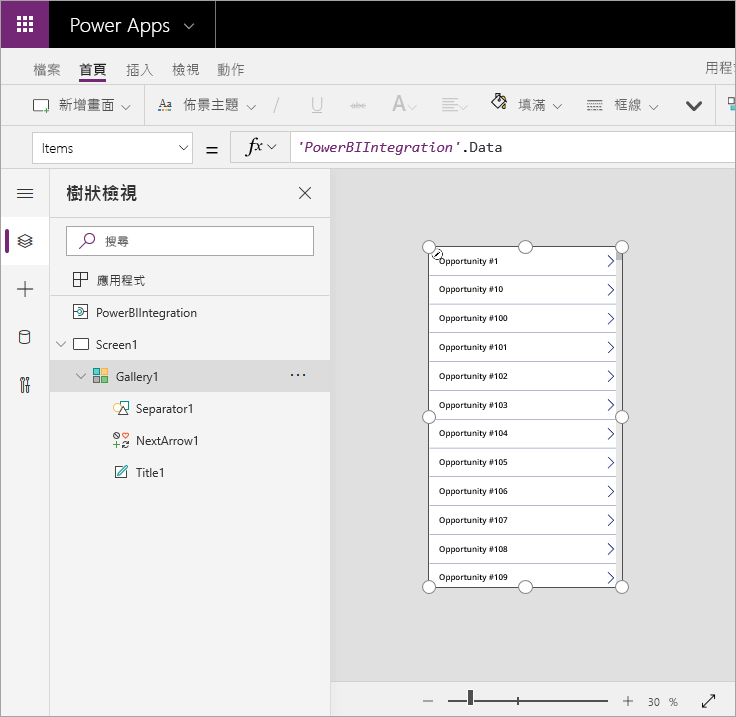
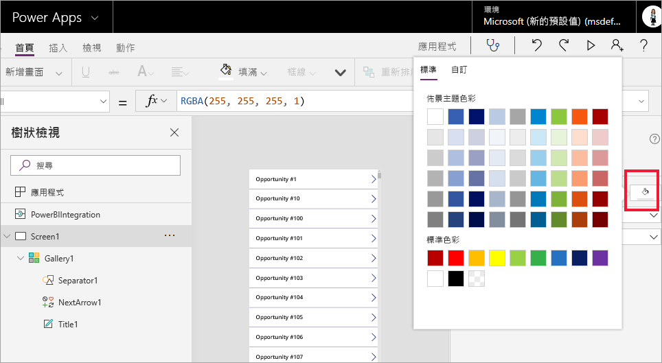
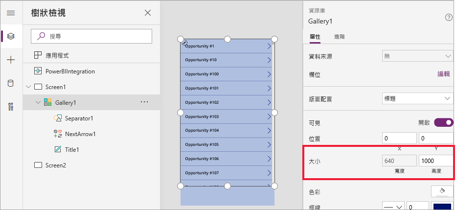
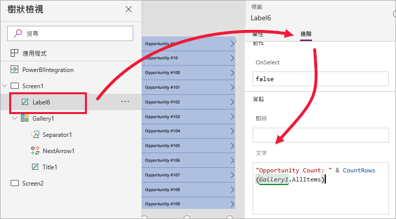
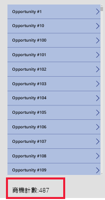
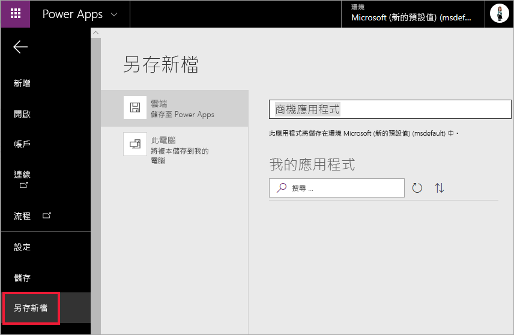

# 教學課程：在 Power BI 報表中內嵌 Power Apps 視覺效果

在此教學課程中，您會使用 Power Apps 視覺效果來建立新的應用程式，並內嵌至 Power BI 範例報表中。 此應用程式會與該報表中的其他視覺效果互動。

如果您還沒有 Power Apps 訂用帳戶，請先[建立免費帳戶](https://web.powerapps.com/signup?redirect=marketing&email=)後再開始進行。

在本教學課程中，您會了解如何：
> [!div class="checklist"]
> * 將 Power Apps 視覺效果新增至 Power BI 報表
> * 在 Power Apps 中工作，以建立使用 Power BI 報表資料的新應用程式
> * 在報表中檢視 Power Apps 視覺效果並進行互動

## 必要條件

* [Google Chrome](https://www.google.com/chrome/browser/) 或 [Microsoft Edge](https://www.microsoft.com/windows/microsoft-edge) 瀏覽器
* [Power BI 訂用帳戶](https://docs.microsoft.com/power-bi/service-self-service-signup-for-power-bi)，並已安裝[商機分析範例](https://docs.microsoft.com/power-bi/sample-opportunity-analysis#get-the-content-pack-for-this-sample)
* 了解如何[在 Power Apps 中建立應用程式](https://docs.microsoft.com/powerapps/maker/canvas-apps/data-platform-create-app-scratch)及如何[編輯 Power BI 報表](https://docs.microsoft.com/power-bi/service-the-report-editor-take-a-tour)

## 建立新的應用程式
當您將 Power Apps 視覺效果新增至報表時，即會啟動 Power Apps Studio，並建立 Power Apps 與 Power BI 之間的即時資料連線。

1. 開啟商機分析範例報表，然後選取 [近期商機]  頁面。 

2. 移動並調整某些報表圖格的大小，以挪出空間給新的視覺效果。

    

2. 從 [視覺效果] 窗格中，選取 Power Apps 圖示，然後調整視覺效果的大小，以符合您空出的空間。

    ![已選取 Power Apps 圖示的 [視覺效果] 窗格](media/power-bi-visualization-powerapp/power-bi-powerapps-icon.jpg)

3. 在 [欄位]  窗格中，選取 [名稱]  、[產品代碼]  和 [銷售階段]  。 

    

4. 在 Power Apps 視覺效果上，選取您要建立應用程式的 Power Apps 環境，然後選取 [建立新的]  。

    

    在 PowerApps Studio 中，您會看到已建立基本應用程式，且其「資源庫」  顯示您在 Power BI 中選取的其中一個欄位。

    

5.  調整資源庫的大小，讓其佔用螢幕的一半。 

6. 在左窗格中，選取 [Screen1]  ，然後將螢幕的 **Fill** 屬性設定為 "LightBlue" (以在報表中更清楚地顯示)。

    

6. 空出要建立標籤控制項的空間。 

    

8. 在 [資源庫]  下，插入文字標籤控制項。

   

7. 將標籤拖曳至視覺效果的底部。 將 **Text** 屬性設定為 `"Opportunity Count: " & CountRows(Gallery1.AllItems)` 它現在會顯示資料集中的總商機數。

    

    

7. 儲存應用程式並命名為「商機應用程式」。 

    

## 在報表中檢視應用程式
此應用程式現在可在 Power BI 報表中使用，而且由於共用相同的資料來源，因此會與其他視覺效果互動。

在 Power BI 報表中，選取交叉分析篩選器中的 **Jan** 來篩選整個報表，其中包括應用程式中的資料。

請注意，應用程式中的商機計數符合報表左上方的計數。 您可以選取報表中的其他項目，應用程式中的資料會隨即更新。

## 清除資源
如果您不想再使用商機分析範例，您可以刪除儀表板、報表和資料集。

## 後續步驟
[問與答視覺效果](power-bi-visualization-types-for-reports-and-q-and-a.md)    
[教學課程：在 Power BI 報表中內嵌 Power Apps 視覺效果](https://docs.microsoft.com/powerapps/maker/canvas-apps/powerapps-custom-visual)    
