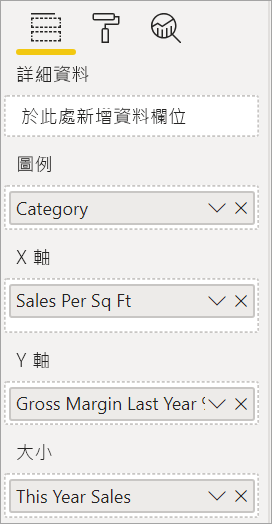
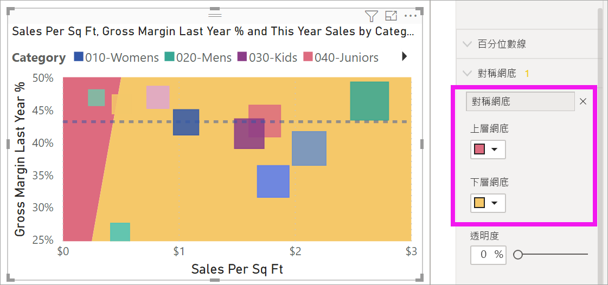
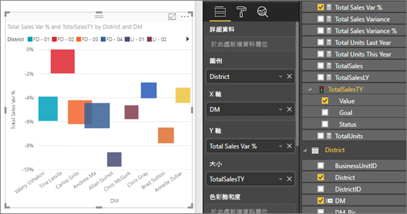

# Power BI 中的散佈圖、泡泡圖與點圖

[!INCLUDE [power-bi-visuals-desktop-banner](../includes/power-bi-visuals-desktop-banner.md)]

散佈圖一律會有兩個值座標軸：沿著水平軸顯示一組數值資料，沿著垂直軸顯示另一組數值。 此圖表顯示 x 與 y 數交集處的點，結合這些值可形成單一的資料點。 Power BI 可以在水平軸上平均或不平均地分佈這些資料點。 這會依圖表所代表的資料而定。

觀賞這段影片來了解 Will 如何建立散佈圖，然後依照下列步驟自行建立一個散佈圖。
   > [!NOTE]
   > 這部影片使用舊版的 Power BI Desktop。
   > 
   > 
<iframe width="560" height="315" src="https://www.youtube.com/embed/PVcfPoVE3Ys?list=PL1N57mwBHtN0JFoKSR0n-tBkUJHeMP2cP" frameborder="0" allowfullscreen></iframe>

您可以設定資料點數目，最多 10,000 個。  

## 何時使用散佈圖、泡泡圖或點圖

### 散佈圖和泡泡圖

散佈圖會顯示兩個數值之間的關聯性。 泡泡圖會將資料點以泡泡取代，而泡泡的「大小」  代表第三個額外的資料維度。

散佈圖極適合：

* 顯示兩個數值之間的關聯性。

* 將兩組數字繪製成一系列的 x 和 y 座標。

* 用來取代折線圖 (若想要變更水平軸的刻度)。

* 將水平軸轉為對數刻度。

* 顯示包含成對值或一組值的工作表資料。

    > [!TIP]
    > 在散佈圖中，您可以調整獨立的軸刻度，以顯示群組值的詳細資訊。

* 顯示大量資料集的模式，例如顯示線性或非線性趨勢、叢集與極端值。

* 比較大量資料點，而不考慮時間。  您在散佈圖中包含的資料越多，就能做出越好的比較。

散佈圖有以上這些用處，而泡泡圖相當適用於：

* 如果您的資料有三個資料數列，而每個數列包含一組值。

* 呈現財務數據。  不同的泡泡大小很適合以視覺化方式強調特定值。

* 與象限一起使用。

### 點圖

點圖類似於泡泡圖和散佈圖，但會用於沿著 X 軸繪製類別資料。

如果您想要在 X 軸包含類別資料，這會是不錯的選擇。

## 必要條件

本教學課程使用[零售分析範例 PBIX 檔案](https://download.microsoft.com/download/9/6/D/96DDC2FF-2568-491D-AAFA-AFDD6F763AE3/Retail%20Analysis%20Sample%20PBIX.pbix)。

1. 從功能表列的左上方區段中，選取 [檔案]   > [開啟] 
   
2. 尋找您的**零售分析範例 PBIX 檔案**複本

1. 在報表檢視  中開啟**零售分析範例 PBIX 檔案**。

1. 選取  新增頁面。

## 建立散佈圖

1. 從空白報表頁面開始，並從 [欄位]  窗格選取下列欄位：

    * [Sales] (銷售)   > [Sales Per Sq Ft] (每平方英呎的銷售) 

    * [Sales] (銷售)   > [Total Sales Variance %] (總銷售差異 %) 

    * [District] (區域)   > District (區域) 

    ![標示出叢集直條圖、[視覺效果] 窗格，以及已選取欄位的 [欄位] 窗格螢幕擷取畫面。](media/power-bi-visualization-scatter/power-bi-bar-chart.png)

1. 在 [視覺效果]  窗格中，選取 。 將叢集直條圖轉換成散佈圖。

   

1. 將 [區域]  從 [詳細資料]  拖曳至 [圖例]  。

    Power BI 會顯示沿著 Y 軸繪製**總銷售差異 %** 的散佈圖，以及沿著 X 軸繪製**每平方英呎的銷售**的散佈圖。 資料點色彩代表區域：

    

現在讓我們加入第三個維度。

## 建立泡泡圖

1. 從 [欄位]  窗格，將 [銷售額]   > [本年度銷售額]   > [值]  拖曳至 [大小]  部分。 資料點會擴張為與銷售值成正比的數量。

   ![藉由將銷售額的 [值] 新增至 [大小] 部分，讓散佈圖變成泡泡圖的螢幕擷取畫面。](media/power-bi-visualization-scatter/power-bi-scatter-chart-size.png)

1. 暫留在泡泡圖上。 泡泡的大小反映 **本年度銷售額**的值。

    

1. 若要設定泡泡圖中顯示的資料點數目，請在 [視覺效果]  窗格的 [格式]  區段中，展開 [一般]  ，然後調整 [資料量]  。

    ![標示出格式圖示、[一般] 下拉式清單和 [資料量] 選項的 [視覺效果] 窗格螢幕擷取畫面。](media/power-bi-visualization-scatter/pbi-scatter-data-volume.png)

    您可以將資料量上限設為任何大小，上限 10,000。 當您設定更高的數字時，建議先進行測試以確保良好效能。

    > [!NOTE]
    > 資料點越多，載入時間可能越久。 如果您選擇發佈限制規模較高的報表，請務必在 Web 及行動裝置上測試您的報表。 您想要確認圖表的效能符合使用者的期望。

1. 繼續將視覺效果色彩、標籤、標題、背景等項目格式化。 若要[改善協助工具](../desktop-accessibility.md)，請考慮在每一行新增標記圖形。 若要選取標記圖形，請展開 [圖形]  ，然後依序選取 [標記圖形]  和一個圖形。

    ![標示出 [標記圖形] 選項的 [圖形] 下拉式清單螢幕擷取畫面。](media/power-bi-visualization-scatter/pbi-scatter-marker.png)

    將標記圖形變更為菱形、三角形或正方形。 為每一行使用不同的標記圖形，可讓報表取用者更容易區分不同的行 (或區域)。

1. 開啟分析窗格  將其他資訊新增至您的視覺效果。  
    - 新增中線。 選取 [中線]   > [新增]  。 根據預設，Power BI 會為 [Sales per sq ft] \(每平方英呎的銷售額\)  新增中線。這並不是很有幫助，因為我們可以看到有 10 個資料點，且知道系統會在每一端都具有五個資料點的情況下建立中位數。 相反地，請將 [量值]  切換為 [Total sales variance %] \(總銷售額差異百分比\)  。  

        

    - 新增對稱網底，以顯示比 Y 軸量值更高的 X 軸量值，反之亦然。 當在 [分析] 窗格中開啟對稱網底時，Power BI 會根據目前的軸上限和下限，對稱地顯示散佈圖的背景。 這是一種非常快速的方法，可識別資料點偏重於哪個軸量值，特別是當 X 和 Y 軸有不同的軸範圍時。

        a. 將 [Total sales variance %] \(總銷售額差異百分比\)  欄位變更為 [Gross margin last year %] \(去年毛利率百分比\) 

        

        b. 從 [分析] 窗格新增 [對稱網底]  。 我們可以從網底看到，襪子 (粉紅色陰影區域中的綠色泡泡) 是偏向毛利率而不是每個商店坪數銷售額的唯一分類。 

        

    - 繼續探索 [分析] 窗格，以在資料中探索感興趣的見解。 

        

## 建立點圖

若要建立點圖，請使用類別欄位取代數值 **X 軸**欄位。

從 [X 軸]  窗格，移除 [每平方英呎的銷售]  ，並將它取代為 [區域]   > [區域經理]  。

## 考量與疑難排解

### 散佈圖只有一個資料點

散佈圖有只有一個資料點，彙總了 X 軸與 Y 軸上的所有值嗎？  或其也許彙總單一水平或垂直線的所有值？

將欄位新增至 [詳細資料]  部分，以告知 Power BI 如何將值分組。 此欄位對於您想要繪製的每個點都不得重複。 可以使用簡單的資料列編號或識別碼欄位。

![已將 [RowNum] 新增至 [詳細資料] 部分的散佈圖螢幕擷取畫面。](media/power-bi-visualization-scatter/pbi-scatter-tshoot.png)

如果資料中沒有該項目，請建立一個欄位，將 X 與 Y 值串連成每個點的獨特內容：

![已將 [TempTime] 新增至 [詳細資料] 部分的散佈圖螢幕擷取畫面。](media/power-bi-visualization-scatter/pbi-scatter-tshoot2.png)

若要建立新的欄位，請[使用 Power BI Desktop 查詢編輯器新增索引資料行](../desktop-add-custom-column.md)至資料集。 然後將此資料行新增至您視覺效果的 [詳細資料]  部分。

## 後續步驟

您可能也會對下列文章感興趣：

* [Power BI 散佈圖中的高密度取樣](desktop-high-density-scatter-charts.md)
* [Power BI 中的視覺效果類型](power-bi-visualization-types-for-reports-and-q-and-a.md)
* [排序和散發 Power BI 報表中資料繪圖的提示](../guidance/report-tips-sort-distribute-data-plots.md)

有其他問題嗎？ [試試 Power BI 社群](https://community.powerbi.com/)
