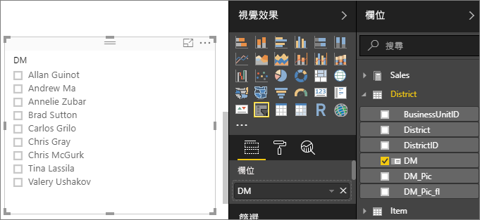
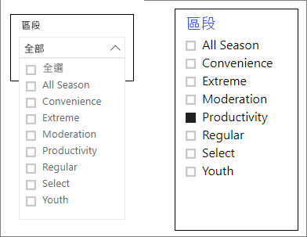

# Power BI 中的交叉分析篩選器

[!INCLUDE [applies-to](../includes/applies-to.md)] [!INCLUDE [yes-desktop](../includes/yes-desktop.md)] [!INCLUDE [yes-service](../includes/yes-service.md)]

假設您希望報表讀者能夠查看整體銷售計量，且還能夠醒目提示個別區經理和不同時間範圍的績效。 您可以建立個別的報告或比較圖表。 或者，您可使用「交叉分析篩選器」  。 交叉分析篩選器是一種替代的篩選方式，可縮小報表內其他視覺效果中顯示的資料集部分。 

本文會逐步說明如何使用免費的[零售分析範例](../create-reports/sample-retail-analysis.md)來建立和格式化基本交叉分析篩選器。 也會示範如何控制哪些視覺效果受到交叉分析篩選器影響，以及如何與其他頁面上的交叉分析篩選器同步。 以下是一些其他文章，其說明如何製作特定類型的交叉分析篩選器：

- [數值範圍交叉分析篩選器](../create-reports/desktop-slicer-numeric-range.md)。
- [相對日期交叉分析篩選器](desktop-slicer-filter-date-range.md)。
- 回應式且[可調整大小的交叉分析篩選器](../create-reports/power-bi-slicer-filter-responsive.md)。
- 具有多個欄位的[階層交叉分析篩選器](../create-reports/power-bi-slicer-hierarchy-multiple-fields.md)。

## 使用交叉分析篩選器的時機
當您想要執行下列作業時，交叉分析篩選器是很棒的選擇：

* 在報表畫布上顯示常用或重要篩選，以方便存取。
* 不需要開啟下拉式清單，即可輕鬆查看目前篩選的狀態。 
* 依資料行篩選不必要的資料，並隱藏在資料表中。
* 將交叉分析篩選器放在重要的視覺效果旁邊，以建立更多重點報表。

Power BI 交叉分析篩選器不支援：

- 輸入欄位
- 向下鑽研

## 建立交叉分析篩選器

這個交叉分析篩選器會依區經理篩選資料。 如果想要遵循此程序，請下載[零售分析範例 PBIX 檔案](https://download.microsoft.com/download/9/6/D/96DDC2FF-2568-491D-AAFA-AFDD6F763AE3/Retail%20Analysis%20Sample%20PBIX.pbix)。

1. 開啟 Power BI Desktop，並從功能表列中選取 [檔案]   > [開啟]  。
   
1. 瀏覽至**零售分析範例 PBIX.pbix** 檔案，然後選取 [開啟]  。

1. 在左窗格中，選取**報表**圖示 ，以在報表檢視中開啟檔案。

1. 在 [概觀]  頁面的報表畫布上未選取任何項目情況下，選取 [視覺效果]  窗格中的**交叉分析篩選器**圖示 ，以建立新的交叉分析篩選器。 

1. 在已選取新交叉分析篩選器的情況下，從 [欄位]  窗格中選取 [District] \(區域\)   > [DM]  ，以填入交叉分析篩選器。 

    新交叉分析篩選器現在已填入區經理名稱及其選取方塊的清單。
    
    
    
1. 針對畫布上的項目調整大小並進行拖曳，以騰出空間給交叉分析篩選器。 請注意，如果您將交叉分析篩選器的大小調整成太小，則交叉分析篩選器的項目就會被截斷。 

1. 選取交叉分析篩選器上的名稱，並注意對頁面上其他視覺效果造成的影響。 再次選取名稱以將其取消選取，或按住 **Ctrl** 鍵以選取多個名稱。 選取所有名稱與全部不選取的效果相同。 

1. 或者，在 [視覺效果]  窗格中選取**格式** (油漆滾筒圖示) 來格式化交叉分析篩選器。 

   我們將不會描述每個選項；請自行實驗並建立適合的交叉分析篩選器。 在下圖中，第一個交叉分析篩選器具有水平方向，並對項目使用彩色背景。 第二個交叉分析篩選器具有垂直方向和彩色文字，以提供更標準的外觀。

   

   >[!TIP]
   >交叉分析篩選器的清單項目預設會依遞增順序排序。 若要依遞減順序排序，請選取交叉分析篩選器右上角的省略符號 ( **...** )，然後選擇 [遞減排序]  。

## 控制受交叉分析篩選器影響的頁面視覺效果
根據預設，報表頁面上的交叉分析篩選器會影響該頁面上的所有其他視覺效果，包括彼此。 當您選擇剛建立清單和日期滑桿中的值時，請注意對其他視覺效果造成的影響。 篩選出的資料是在兩個交叉分析篩選器中所選值的交集。 

使用視覺效果互動可將某些頁面視覺效果排除，使其不受其他視覺效果影響。 在 [概觀]  頁面上，[Total Sales Variance by FiscalMonth and District Manager] \(依會計月份和區經理的總銷售額差異\)  圖表會顯示您想要隨時保持顯示的區經理 (依月份) 整體比較資料。 也可以使用視覺效果互動，讓交叉分析篩選器選項不要篩選此圖表。 

1. 移至報表的 [概觀]  頁面，然後選取先前建立的 **DM** 交叉分析篩選器。

1. 在 Power BI Desktop 功能表中，選取 [視覺效果工具]  下的 [格式]  功能表，然後選取 [編輯互動]  。
   
   篩選控制項  (每一個都有 [篩選]  和 [無]  選項) 會出現在頁面上的所有視覺效果上方。 一開始，所有控制項上會預先選取 [篩選]  選項。
   
1. 在 [Total Sales Variance by FiscalMonth and District Manager] \(依會計月份和區經理的總銷售額差異\)  圖表上方的篩選控制項中選取 [無]  選項，以停止 **DM** 交叉分析篩選器使其不要進行篩選。 

1. 選取 [OpenDate] \(開幕日期\)  交叉分析篩選器，然後再次選取 [Total Sales Variance by FiscalMonth and District Manager] \(依會計月份和區經理的總銷售額差異\)  圖表上方的 [無]  選項，以停止此交叉分析篩選器使其不要進行篩選。 

   現在，當選取交叉分析篩選器中的名稱和日期範圍時，[Total Sales Variance by FiscalMonth and District Manager] \(依會計月份和區經理的總銷售額差異\)  圖表會保持不變。

如需編輯互動的詳細資訊，請參閱[變更 Power BI 報表中的視覺效果互動方式](../create-reports/service-reports-visual-interactions.md)。

## 將交叉分析篩選器同步至其他頁面上使用
從 2018 年 2 月版的 Power BI 更新開始，您可以同步交叉分析篩選器並在報表的任何或所有頁面上使用它。 

在目前的報表中，[District Monthly Sales] \(區域每月銷售額\)  頁面有 [District Manager] \(區經理\)  交叉分析篩選器，但如果我們想要該交叉分析篩選器出現在 [New Stores] \(新商店\)  頁面上，該怎麼辦？ [New Stores] \(新商店\)  頁面有交叉分析篩選器，但只提供 [Store Name] \(商店名稱\)  資訊。 使用 [同步交叉分析篩選器]  ，我們可以將 [District Manager] \(區經理\)  交叉分析篩選器同步至這些頁面，以便讓任何頁面上選取的交叉分析篩選器影響所有三個頁面上視覺效果。

1. 在 Power BI Desktop 的 [檢視]  功能表上，選取 [同步交叉分析篩選器]  。

    ![選取 [同步交叉分析篩選器]](media/power-bi-visualization-slicers/power-bi-slicer-view-sync.png)

    [同步交叉分析篩選器]  窗格隨即出現在 [篩選]  與 [視覺效果]  窗格之間。

    ![[同步交叉分析篩選器] 窗格](media/power-bi-visualization-slicers/power-bi-slicer-sync-pane.png)

1. 在 [District Monthly Sales] \(區域每月銷售額\)  頁面上，選取 [District Manager] \(區經理\)  交叉分析篩選器。 

    因為您已經在 [概觀]  頁面上建立了 [District Manager] \(區經理\)  (**DM**) 交叉分析篩選器，所以 [同步交叉分析篩選器]  窗格會如下所示：
    
    
    
1. 在 [同步交叉分析篩選器]  窗格的**同步**資料行中，選取 [概觀]  、[District Monthly Sales] \(區域每月銷售額\)  和 [New Stores] \(新商店\)  頁面。 

    這項選擇會導致 [istrict Monthly Sales] \(區域每月銷售額\)  交叉分析篩選器在這三個頁面之間同步處理。 
    
1. 在 [同步交叉分析篩選器]  窗格的**可見**資料行中，選取 [New Stores] \(新商店\)  頁面。 

    這項選擇會導致 [istrict Monthly Sales] \(區域每月銷售額\)  交叉分析篩選器顯示在這三個頁面中。 [同步交叉分析篩選器]  窗格現在會如下所示：

    ![選取 [同步交叉分析篩選器] 中的頁面](media/power-bi-visualization-slicers/power-bi-sync-slicer-finished.png)

1. 觀察同步該交叉分析篩選器的效果，並讓它顯示在其他頁面上。 在 [District Monthly Sales] \(每月區域銷售額\)  頁面上，請注意 [District Manager] \(區經理\)  交叉分析篩選器現在會顯示與 [概觀]  頁面上相同的選取項目。 在 [New Stores] \(新商店\)  頁面上，現在可以看到 [District Manager] \(區經理\)  交叉分析篩選器，且其選取項目會影響 [Store Name] \(商店名稱\)  交叉分析篩選器中可見的選取項目。 
    
    >[!TIP]
    >雖然交叉分析篩選器一開始會依照原始頁面上相同的大小和位置出現在所同步的頁面上，但您可以個別在不同的頁面上移動所同步的交叉分析篩選器、調整其大小及設定其格式。 

    >[!NOTE]
    >如果您將交叉分析篩選器同步至某個頁面，但未讓其顯示在該頁面上，則在其他頁面上選取交叉分析篩選器時，仍然會篩選該頁面上的資料。
 
## 篩選交叉分析篩選器
您可將視覺效果層級的篩選套用至交叉分析篩選器，以減少交叉分析篩選器所顯示的值清單。 例如，您可從清單交叉分析篩選器中篩選出空白值，或從範圍交叉分析篩選器中篩選出特定的日期。 當這樣做時，選項只會影響「交叉分析篩選器所顯示的值」  ，而不是「交叉分析篩選器套用至其他視覺效果的篩選」  。 例如，假設您對範圍交叉分析篩選器套用只顯示特定日期的篩選。 交叉分析篩選器上選項只會顯示該範圍的第一個和最後一個日期，但您仍會在其他視覺效果中看到其他日期。 一旦變更交叉分析篩選器的選取範圍，即會看到其他視覺效果隨之更新。 清除交叉分析篩選器會再次顯示所有日期。

如需視覺效果層級篩選的詳細資訊，請參閱[篩選類型](../create-reports/power-bi-report-filter-types.md)。

## 格式交叉分析篩選器
視交叉分析篩選器類型而定，會提供不同的格式設定選項。 藉由使用 [水平]  方向、[回應式]  版面配置及 [項目]  著色，您可以產生按鈕或磚而不是標準清單項目，然後讓交叉分析篩選器項目調整大小，以符合不同的螢幕大小和版面配置。  

1. 在任何頁面上已選取 [District Manager] \(區經理\)  交叉分析篩選器的情況下，於 [視覺效果]  窗格中，選取**格式**圖示 以顯示格式設定控制項。 
    
    
    
1. 選取每個類別旁的下拉式清單箭頭以顯示和編輯選項。 

### 一般選項
1. 在 [格式]  下選取 [一般]  ，選取 [外框色彩]  下的紅色色彩，然後將 [外框寬度]  變更為 *2*。 

    此設定會變更標頭和項目外框及底線的色彩和粗細。

1. 針對 [方向]  ，預設會選取 [垂直]  。 請選取 [水平]  以產生具有水平排列磚或按鈕的交叉分析篩選器，然後捲動箭頭以存取交叉分析篩選器容納不下的項目。
    
    ![[一般] 的選取項目](media/power-bi-visualization-slicers/4-horizontal.png)
    
1. 將 [回應式]  配置切換至 [開啟]  ，以根據檢視螢幕和交叉分析篩選器大小，變更交叉分析篩選器項目的大小和排列方式。 

    就清單交叉分析篩選器而言，回應式配置可防止項目在小螢幕上被截斷。 該配置只在水平方向才有提供。 就範圍滑桿交叉分析篩選器而言，回應式格式設定則會變更滑桿的樣式，而可提供更彈性的大小調整。 這兩種類型的交叉分析篩選器在大小很小時都會變成篩選圖示。
    
    
    
    >[!NOTE]
    >回應式配置變更可能會覆寫您設定的特定標題和項目格式。 
    
1. 在 [X 位置]  、[Y 位置]  、[寬度]  和 [高度]  下，使用數值有效位數來設定交叉分析篩選器的位置和大小，或直接在畫布上移動交叉分析篩選器並調整其大小。 

    以不同的項目大小和排列方式進行實驗，然後注意回應式格式設定如何相應地發生變化。 只有當您選取水平方向時，才可以使用這些選項。 

    

如需水平方向和回應式配置的詳細資訊，請參閱[在 Power BI 中建立可以調整大小的回應式交叉分析篩選器](../create-reports/power-bi-slicer-filter-responsive.md)。

### 選取控制項選項 (僅適用於清單交叉分析篩選器)
1. 在 [選取控制項]  下，將 [顯示 [全選] 選項]  切換至 [開啟]  ，將 [全選]  項目新增至交叉分析篩選器。 

    [顯示 [全選] 選項]  預設為 [關閉]  。 啟用時，此選項會在切換時選取或取消選取所有項目。 如果您選取所有項目，則選取某個項目就會將其取消選取，進而允許「非為」  類型的篩選。
    
    
    
1. 將 [單選]  切換至 [關閉]  ，即無須按住 **Ctrl** 鍵便能選取多個項目。 

    [單選]  預設為 [開啟]  。 選取某個項目就會選取該項目，且按住 **Ctrl** 鍵同時選取可選取多個項目。 再次選取項目即會將其取消選取。

### 標題選項
[標題]  預設為 [開啟]  。 此選項會在交叉分析篩選器的頂端顯示資料欄位名稱。 
- 在本文中，請將標題文字格式化，如下所示： 
   - **字型色彩**：紅色
   - **文字大小**：**14 pt**
   - **對齊方式**：**置中**
   - **字型家族**：**Arial Black**

### 項目選項 (僅適用於清單交叉分析篩選器)
1. 在本文中，請將 [項目]  選項格式化，如下所示：
    - **字型色彩**：黑色
    - **背景**：淺紅色
    - **文字大小**：**10 pt**
    - **字型家族**：**Arial**
 
1. 針對 [外框]  ，選擇 [框架]  ，以使用您在 [一般]  選項下所設定大小和色彩來繪製每個項目的框線。 
    
    
    
    >[!TIP]
    >- 選取 [一般]   > [方向]   > [水平]  後，已取消選取的項目會顯示所選文字和背景色彩，而已選取的項目則會使用系統預設值，通常是黑底白字。
    >- 選取 [一般]   > [方向] > [垂直]  後，項目一律顯示所選取的色彩，而核取方塊在選取時一律為黑色。 

### 日期/數值輸入和交叉分析篩選器選項 (僅適用於範圍滑桿交叉分析篩選器)
- 針對清單交叉分析篩選器，日期/數值輸入選項與 [項目]  選項相同，只是沒有外框或底線選項。
- [滑桿]  選項可讓您設定範圍滑桿的色彩，或將滑桿切換至 [關閉]  ，只保留數值輸入。

### 其他格式化選項
其他格式設定選項預設為 [關閉]  。 將這些選項切換至 [開啟]  可控制下列： 
- [背景]  ：將背景色彩新增至交叉分析篩選器，並設定其透明度。
- [鎖定長寬]  ：調整交叉分析篩選器大小時，保留其形狀。
- [框線]  ：在交叉分析篩選器週圍新增框線，並設定其色彩。 此交叉分析篩選器框線和 [一般]  設定不同，不受其影響。 

## 後續步驟
如需詳細資訊，請參閱下列文章：

- [Power BI 中的視覺效果類型](power-bi-visualization-types-for-reports-and-q-and-a.md)

- [Power BI 中的資料表](power-bi-visualization-tables.md)
