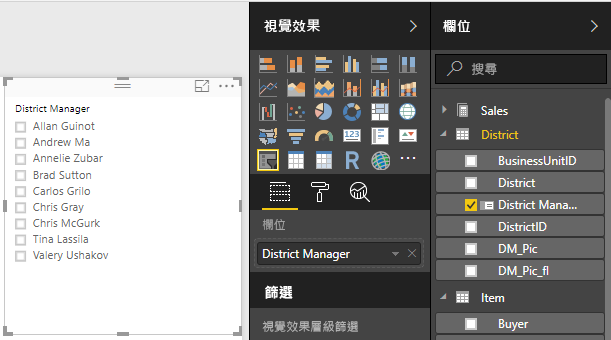
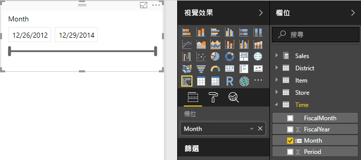
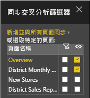
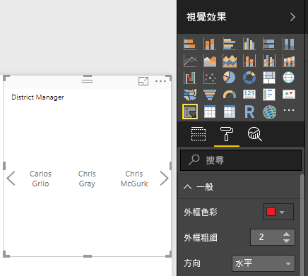
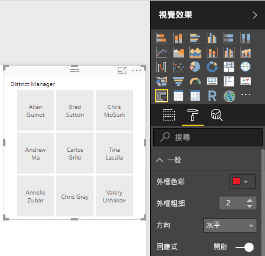
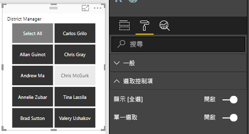
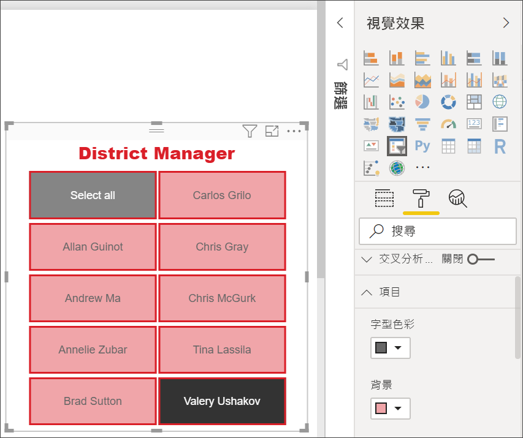

# Power BI 中的交叉分析篩選器
您希望報告讀者能夠查看整體銷售計量，但也能夠醒目提示個別區經理和不同時間範圍的績效。 您可以建立個別的報告或比較圖表，或是使用交叉分析篩選器。 交叉分析篩選器是一種替代的篩選方式，可縮小報表內其他視覺效果中顯示的資料集部分。 

本教學課程使用免費的[零售分析範例](../sample-retail-analysis.md)，可逐步引導您建立清單和日期範圍交叉分析篩選器、設定其格式及使用此篩選器。 享受探索格式化及使用交叉分析篩選器的樂趣。 

## 使用交叉分析篩選器的時機
當您想要執行下列作業時，交叉分析篩選器是很棒的選擇：

* 在報表畫布上顯示常用或重要篩選，以方便存取。
* 不需要開啟下拉式清單，即可輕鬆查看目前篩選的狀態。 
* 依資料行篩選不必要的資料，並隱藏在資料表中。
* 將交叉分析篩選器放在重要的視覺效果旁邊，以建立更多重點報表。

Power BI 交叉分析篩選器具有下列限制：

- 交叉分析篩選器不支援輸入欄位。
- 交叉分析篩選器無法釘選到儀表板。
- 交叉分析篩選器不支援向下鑽研。
- 交叉分析篩選器不支援視覺效果等級篩選。

## 建立交叉分析篩選器

若要建立新的交叉分析篩選器，您可以選取交叉分析篩選器圖示，然後選取要作為篩選依據的資料欄位 (或將其拖曳至 [視覺效果] 窗格中的 [欄位] 方塊)，或是先選取或拖曳資料欄位以建立視覺效果，然後再選取交叉分析篩選器圖示以將視覺效果轉換成交叉分析篩選器。 不同的資料類型會建立具有不同效果和選項的不同類型交叉分析篩選器。 

您初次變更報表時，[重設為預設值] 的按鈕會亮起。 這是為了提醒您，原始的報表設定已經過變更。 若您從報表瀏覽到別處，該變更隨即儲存 (持續)。 當您回到報表時，不必再重新配量報表。  不過，如果您想要將報表重設為作者的預設設定，請從頂端功能表列選取 [重設為預設值]。

> [!NOTE]
> 若您的 [重設為預設值] 按鈕維持停用，就代表報表作者已停用該報表的這項功能，或報表包含自訂視覺效果。 只要暫留在按鈕上，就能閱讀工具提示以取得說明。 

**建立新的交叉分析篩選器以依區經理篩選資料**

1. 在 Power BI Desktop 或 Power BI 服務中，開啟[零售分析範例](../sample-retail-analysis.md)。 (在 Power BI 服務中，選取左上角的 [編輯報表])。
2. 在 [概觀] 頁面上，於畫布上未選取任何項目的情況下，選取 [視覺效果] 窗格中的 [交叉分析篩選器] 圖示 ，以建立新的交叉分析篩選器。 
3. 在已選取新交叉分析篩選器的情況下，選取 [欄位] 窗格中 [District] \(區域\) 底下的 [District Manager] \(區經理\)，以填入交叉分析篩選器。 新交叉分析篩選器是一個各個名稱前面有選取方塊的清單。 
    
    
    
4. 針對交叉分析篩選器及畫布上的其他元素調整大小並進行拖曳，以騰出空間給交叉分析篩選器。 請注意，如果您將交叉分析篩選器的大小調整成太小，交叉分析篩選器項目就會被截斷。 
5. 選取交叉分析篩選器上的名稱，並注意對頁面上其他視覺效果造成的影響。 再次選取名稱以將名稱取消選取，然後按住 **Ctrl** 鍵以選取多個名稱。 選取所有名稱與全部不選取的效果相同。 

>[!TIP]
>清單交叉分析篩選器項目預設會依英數字元遞增順序排序。 若要依遞減順序排序，請選取交叉分析篩選器右上角的省略符號 (**...**)，然後選擇下拉式清單中的 [Sort by District Manager] \(依區經理排序\)。 

**建立新的交叉分析篩選器以依日期範圍篩選資料**

1. 在畫布上未選取任何項目的情況下，下拉 [欄位] 窗格中的 [時間]，然後將 [月份] (或在 Power BI 服務中是 [日期]) 拖曳至 [視覺效果] 窗格中的 [值] 方塊，以建立新的視覺效果。
2. 在已選取新視覺效果的情況下，選取 [交叉分析篩選器] 圖示，以將新的視覺效果轉換成交叉分析篩選器。 這個交叉分析篩選器是一個已填入日期範圍的滑桿控制項。
    
    
    
4. 針對交叉分析篩選器及畫布上的其他元素調整大小並進行拖曳，以騰出空間給交叉分析篩選器。 請注意，滑桿大小會隨著交叉分析篩選器大小調整，但如果您將交叉分析篩選器的大小調整成太小，日期就會被截斷。 
4. 使用滑桿來選取不同的日期範圍，或選取一個日期欄位來輸入值，或是顯示行事曆快顯來進行更精確的選取。 請注意對頁面上其他視覺效果造成的影響。
    
    >[!NOTE]
    >數值和日期/時間資料類型預設會產生範圍滑桿交叉分析篩選器。 從 2018 年 2 月的 Power BI 更新開始，整數資料類型範圍滑桿現在會貼齊整數值，而不會顯示小數位數。 

>[!TIP]
>雖然 [月份] 資料欄位預設會產生 [介於] 範圍滑桿交叉分析篩選器類型，但您可以將它變更為其他交叉分析篩選器類型和選取選項。 若要變更交叉分析篩選器類型，請選取交叉分析篩選器，將滑鼠游標暫留在交叉分析篩選器的右上方區域，下拉出現的插入號 (^)，然後選擇其中一個其他選項，例如 [清單] 或 [之前]。 請注意交叉分析篩選器外觀和選取項目如何變化。 

如需有關建立日期和數值範圍交叉分析篩選器的詳細資訊，請觀看下列影片及參閱[在 Power BI Desktop 中使用數值範圍交叉分析篩選器](../desktop-slicer-numeric-range.md)。
<iframe width="560" height="315" src="https://www.youtube.com/embed/zIZPA0UrJyA" frameborder="0" allowfullscreen></iframe> 

## 控制受交叉分析篩選器影響的頁面視覺效果
根據預設，報表頁面上的交叉分析篩選器會影響該頁面上的所有其他視覺效果，包括彼此。 當您選擇剛建立清單和日期滑桿中的值時，請注意對其他視覺效果造成的影響。 篩選出的資料是在兩個交叉分析篩選器中所選值的交集。 

您可以使用 [視覺效果互動] 將某些頁面視覺效果排除，使其不受其他視覺效果影響。 在 [概觀] 頁面上，"Total Sales Variance by FiscalMonth and District Manager" (依 FiscalMonth 和區經理的總銷售額差異) 圖表會顯示您想要隨時保持顯示的 [District Managers by Month] \(依月份的區經理\) 整體比較資料。 您可以使用 [視覺效果互動]，讓交叉分析篩選器選項不要篩選此圖表。 

1. 在已選取 [District Manager] \(區經理\) 交叉分析篩選器的情況下：
    - 在 Power BI Desktop 中，選取 [視覺效果工具] 下的 [格式] 功能表，然後選取 [編輯互動]。
    - 在 Power BI 服務中，從功能表列向下拉開 [視覺互動] 並開啟 [編輯互動]。 
   
   篩選控制項  會出現在頁面上所有其他視覺效果的上方。 一開始會選取所有 [篩選] 圖示。
   
2. 選取 **Total Sales Variance by FiscalMonth and District Manager** \(依 FiscalMonth 和區經理的總銷售額差異\) 圖表上方的 [無] 圖示，讓交叉分析篩選器停止篩選它。 
3. 選取 [月份] 交叉分析篩選器，然後再次選取 **Total Sales Variance by FiscalMonth and District Manager**\(依 FiscalMonth 和區經理的總銷售額差異\) 圖表上方的 [無] 圖示，讓此交叉分析篩選器停止篩選它。 現在，當您選取交叉分析篩選器中的名稱和日期範圍時，Total Sales Variance by FiscalMonth and District Manager \(依 FiscalMonth 和區經理的總銷售額差異\) 圖表會保持不變。 

如需編輯互動的詳細資訊，請參閱 [Power BI 報表中的視覺互動](../consumer/end-user-interactions.md)。

## 將交叉分析篩選器同步至其他頁面上使用
從 2018 年 2 月版的 Power BI 更新開始，您可以同步交叉分析篩選器並在報表的任何或所有頁面上使用它。 

在目前的報表中，[District Monthly Sales] \(每月區域銷售額\) 頁面也有一個 [District Manager] \(區經理\) 交叉分析篩選器，但並未與您在 [概觀] 頁面上建立的交叉分析篩選器同步 (兩個交叉分析篩選器可能有不同的已選取項目)。 [New Stores] \(新商店\) 頁面只有 [Store Name] \(商店名稱\) 交叉分析篩選器。 您可以將新的 [District Manager] \(區經理\) 交叉分析篩選器同步至這些頁面，以便讓任何頁面上選取的交叉分析篩選器影響所有三個頁面上的視覺效果。 

1. 在 [檢視] 功能表上，選取 Power BI Desktop 中的 [同步交叉分析篩選器] (或開啟 Power BI 服務中的 [同步交叉分析篩選器] 窗格)。 [同步交叉分析篩選器] 窗格隨即出現。 
2. 在 [概觀] 頁面上，選取 [District Manager] \(區經理\) 交叉分析篩選器。 請注意，[可見] 資料行中已經選取 [District Monthly Sales] \(每月區域銷售額\) 頁面，因為該頁面上也有一個 [District Manager] \(區經理\) 交叉分析篩選器，但 [同步] 資料行中並未選取該交叉分析篩選器。 
    
    
    
3. 在 [同步] 資料行中，選取 [New Stores] \(新商店\) 頁面和 [District Monthly Sales] \(每月區域銷售額\) 頁面，以將 [概觀] 交叉分析篩選器同步至這些頁面。 
    
3. 在 [可見] 資料行中，選取 [New Stores] \(新商店\) 頁面，並保持選取 [District Monthly Sales] \(每月區域銷售額\) 頁面。 
4. 觀察同步該交叉分析篩選器的效果，並讓它顯示在其他頁面上。 在 [District Monthly Sales] \(每月區域銷售額\) 頁面上，[District Manager] \(區經理\) 交叉分析篩選器現在會顯示與 [概觀] 頁面上交叉分析篩選器相同的選取項目。 在 [New Stores] \(新商店\) 頁面上，[District Manager] \(區經理\) 交叉分析篩選器中的選取項目會影響 [Store Name] \(商店名稱\) 交叉分析篩選器中可用的選取項目。 
    
    >[!TIP]
    >雖然交叉分析篩選器一開始會依照原始頁面上相同的大小和位置出現在所同步的頁面上，但您可以個別在不同的頁面上移動所同步的交叉分析篩選器、調整其大小及設定其格式。 

>[!NOTE]
>如果您將交叉分析篩選器同步至某個頁面，但未讓它顯示在該頁面上，在其他頁面上選取交叉分析篩選器時，仍然會篩選該頁面上的資料。
 
## 格式交叉分析篩選器
視交叉分析篩選器類型而定，會提供不同的格式設定選項。 藉由使用 [水平] 方向、[回應式] 版面配置及 [項目] 著色，您可以產生按鈕或磚而不是標準清單項目，然後讓交叉分析篩選器項目調整大小，以符合不同的螢幕大小和版面配置。  

1. 在於任何頁面上已選取 [District Manager] \(區經理\) 交叉分析篩選器的情況下，在 [視覺效果] 窗格中，選取 [格式] 圖示  以顯示格式設定控制項。 
    
    
    
2. 選取每個類別旁的下拉式清單箭頭以顯示和編輯選項。 

### 一般選項
1. 在 [外框色彩] 下選取紅色，並將 [外框寬度] 變更為 "2"。 這會在啟用時，設定標頭和項目外框或底線的色彩和粗細。 
2. 在 [方向] 底下，預設值是 [垂直]。 選取 [水平] 以產生具有水平排列磚或按鈕的交叉分析篩選器，然後捲動箭頭以存取交叉分析篩選器容納不下的項目。
    
    
    
3. 開啟 [回應式] 版面配置以根據檢視螢幕和交叉分析篩選器大小，變更交叉分析篩選器項目的大小和排列方式。 就清單交叉分析篩選器而言，回應式版面配置只在水平方向才有提供，而可防止項目在小螢幕上被截斷。 就範圍滑桿交叉分析篩選器而言，回應式格式設定則會變更滑桿的樣式，而可提供更彈性的大小調整。 這兩種類型的交叉分析篩選器在大小非常小時都會變成篩選圖示。 
    
    
    
    >[!NOTE]
    >回應式配置變更可能會覆寫您設定的特定標題和項目格式。 
    
4. 使用 [X 位置]、[Y 位置]、[寬度] 和 [高度] 底下的數值有效位數來設定交叉分析篩選器的位置和大小。 以不同的項目大小和排列方式進行實驗，然後注意回應式格式設定如何相應地發生變化。  

    

如需有關水平方向和回應式版面配置的詳細資訊，請參閱[在 Power BI 中建立可以調整大小的回應式交叉分析篩選器](../power-bi-slicer-filter-responsive.md)。

### 選取控制項選項 (僅適用於清單交叉分析篩選器)
1. [顯示 [全選]] 預設為 [關閉]。 將它切換至 [開啟] 即可將 [全選] 項目新增至交叉分析篩選器，以在切換時選取或取消選取所有項目。 當選取所有項目時，按一下或點選一個項目就會將該項目取消選取，而允許「不是」類型的篩選條件。 
    
    
    
2. [單一選取] 預設為 [開啟]。 按一下或點選每個項目便會選取它，而按住 **Ctrl** 鍵同時按一下或點選則可選取多個項目。 將 [單一選取] 切換至 [關閉]，即可允許無須按住 **Ctrl** 鍵便能選取多個項目。 再次按一下或點選每個項目就會將其取消選取。 

### 標頭選項
[標頭] 預設為 [開啟]，會在交叉分析篩選器頂端顯示資料欄位名稱。 
1. 將標頭文字格式化為 [字型色彩] 為紅色、[文字大小] 為 14 pt 和 [字型家族] 為 Arial Black。 
2. 在 [外框] 底下，選擇 [僅底端]，以使用您在 [一般] 選項底下設定的大小和色彩來產生底線。 

### 項目選項 (僅適用於清單交叉分析篩選器)
1. 將項目文字和背景格式化為 [字型色彩] 為黑色、[背景] 為淺紅色、[文字大小] 為 10 pt 和 [字型家族]  為 Arial。 
2. 在 [外框] 底下，選擇 [框架]，以使用您在 [一般] 選項底下設定的大小和色彩來繪製每個項目的外框。 
    
    
    
    >[!TIP]
    >- 使用 [方向] > [水平] 時，已取消選取的項目會顯示所選文字和背景色彩，而已選取的項目則會使用系統預設值，通常是黑底白字。
    >- 使用 [方向] > [垂直] 時，項目一律顯示所設定的色彩，而選取方塊在已選取時一律為黑色。 

### 日期/數值輸入和交叉分析篩選器選項 (僅適用於範圍滑桿交叉分析篩選器)
- 日期/數值輸入選項與清單交叉分析篩選器的 [項目] 選項相同，只是沒有 [外框] 或底線。
- 滑桿選項可讓您設定範圍滑桿的色彩，或將滑桿切換至 [關閉]，只保留數值輸入。

### 其他格式化選項
其他格式化選項預設關閉。 轉換為 [開啟] 時： 
- **標題：** 在交叉分析篩選器的上方新增並格式化標題 (除標頭外，且不受標頭影響)。 
- **背景：** 新增整體交叉分析篩選器的背景色彩，並設定其透明度。
- **鎖定長寬：** 如果調整大小，保留交叉分析篩選器的形狀。
- **框線：** 新增交叉分析篩選器的 1 像素框線，並設定其色彩。 (此交叉分析篩選器框線和 [General Outline] (一般外框) 設定不同，不受其影響。) 

## 後續步驟
[註冊以免費試用](https://powerbi.microsoft.com/get-started/)

您對如何改進 Power BI 有任何想法嗎？ [送出想法](https://ideas.powerbi.com/forums/265200-power-bi-ideas)。

有其他問題嗎？ [試試 Power BI 社群](http://community.powerbi.com/)

[將視覺效果新增至報表](power-bi-report-add-visualizations-i.md)

[Power BI 中的視覺效果類型](power-bi-visualization-types-for-reports-and-q-and-a.md)

[Power BI - 基本概念](../consumer/end-user-basic-concepts.md)

