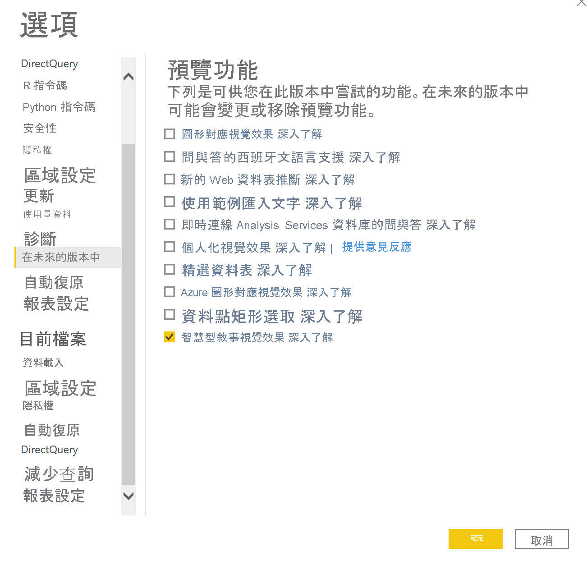
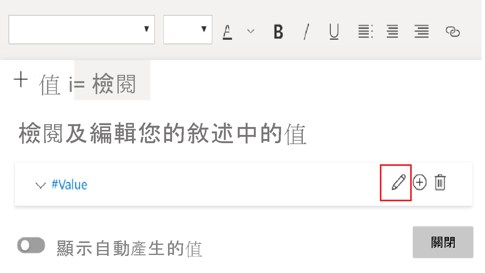
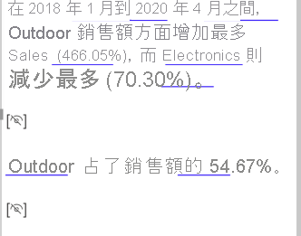

# 建立智慧型敘事 (預覽)

[!INCLUDE[consumer-appliesto-nyyn](../includes/consumer-appliesto-nyyn.md)]    

[!INCLUDE [power-bi-visuals-desktop-banner](../includes/power-bi-visuals-desktop-banner.md)]

智慧型敘事視覺效果會提供相關的現成深入解析，且可供自訂，有助於快速提出視覺效果和報表的摘要。

使用此功能，建立者可以將敘事加入報表中，用以處理關鍵的重點、指出趨勢所在、編輯語言，並設定成符合特定對象的格式。 現在可以將敘事新增至報表，且每次重新整理時都會更新，不用在 PowerPoint 中貼上報表重點更新的螢幕擷取畫面。 您的終端使用者可以透過敘事來了解資料、更快速地把握重點，並向他人說明。

>[!NOTE]
> 由於這項功能仍在預覽狀態，因此必須先開啟功能。請前往 [檔案] > [選項及設定] > [選項] > [預覽功能]，並確定已開啟 [Smart narrative visual]\(智慧型敘事視覺效果\) ****  ：

您可以在[此](https://github.com/microsoft/powerbi-desktop-samples/blob/master/Monthly%20Desktop%20Blog%20Samples/2020/2020SU09%20Blog%20Demo%20-%20September.pbix)文件中找到用於線上銷售案例的 pbix。

## 開始使用 

按一下 [視覺效果] 窗格中的新增智慧型敘事圖示，即可自動產生摘要。

 您會看到根據頁面上所有視覺效果建立的敘事。 例如，您可以按一下圖示，以自動產生關於此報表中收益、網站造訪次數和銷售量的視覺效果摘要。 請注意，Power BI 會自動進行趨勢分析，顯示出收益和造訪次數同時增加，甚至會計算出其所發現的成長程度，在此例中增加了 72%。
 
 
 
 您也可以在視覺效果上按一下滑鼠右鍵，並選取 [摘要]。 如此會產生該視覺效果的自動摘要。 例如，當您在顯示各種交易的散佈圖上以滑鼠右鍵按一下 [->摘要] 時，Power BI 會分析資料，並顯示哪個城市/地區的每筆交易收益最高，以及交易數目最多。 也會顯示這些計量的預期範圍值，因此可了解到大部分城市的的每筆交易收益低於 $45，且交易少於 10 筆。
 
  
 
 
 ## 編輯摘要
 
 摘要可供高度**自訂**，可使用與一般文字方塊相同的控制功能來新增文字或編輯現有文字。 例如可以將文字設為粗體，或變更文字顏色。
 
  
  
  您也可以新增**動態值**，藉此自訂摘要並新增您自己的深入解析。 您可以將文字對應至現有的欄位和量值，或使用自然語言來定義要對應至文字的新量值。 例如，如果您想要新增退貨項目數目的資訊，您可以使用如 gif 所示的新增值體驗。 我們整合了問與答介面，以便新增動態值。 當您輸入時，下拉式清單會提供建議，如同問與答視覺效果，只要將其儲存為值即可。  因此，除了能夠在問與答中針對資料提問以外，範圍也進一步擴大，甚至不需要執行 DAX，即可建立您自己的計算。 
  
   
  
  您可以設定動態值的格式，例如，顯示為貨幣、指定小數位數、千位分隔符號等等。 
   
   
   
   您可以直接按一下摘要中的值來設定格式，或按一下 [編輯] 按鈕，其對應到文字方塊控制項的 [檢閱] 索引標籤中的值。 
   
   
   
   您也可以使用 [檢閱] 索引標籤來檢閱、刪除或重複使用先前定義的值。  按一下加號圖示即會在摘要中插入值。 您也可以切換底部的選項，藉此顯示自動產生的值。

有時候會看到隱藏的摘要符號，指出「目前的資料和篩選條件不會針對此值產生結果」。 這是因為有些摘要可能為空，因為沒有需要關注的內容。 例如，在折線圖中查看高值和低值的摘要可能為空，但在其他情況下可能並不會為空。 只有在您嘗試編輯摘要時，才會顯示這些符號。

   
   
   ## 視覺效果互動
   摘要是動態的，且在您交叉篩選時，會自動更新所產生的文字和動態值。 例如，如果您在環圈圖中選取電子產品，報表的其餘部分將會進行交叉篩選，且摘要也會交叉篩選，把重點也放在電子產品上。  在此情況下，造訪次數和收益有不同的趨勢，因此文字會更新以反映該情況。 而且您新增的傳回值計數會更新為 $4196。 當您交叉篩選時，也可能會更新某些空白摘要。
   
   
   
   您也可以執行更多進階篩選。 舉例來說，如果您只對此視覺效果 (可看到多種不同產品的趨勢) 中的某一季趨勢感興趣，只需要選取相關的資料點，即可取得該片段的更新摘要。
   
   
   
   ## 限制
   - 不支援釘選到儀表板。
   - 不支援使用動態值和條件式格式設定 (例如資料繫結標題)。
   - 不支援 Azure Analysis Services 內部部署 AS。
   - KPI、卡片、多列卡片、地圖、資料表、矩陣、R/Python 視覺效果、自訂視覺效果不支援摘要。 日後會新增這些視覺效果。
   - 對於具有資料行 (依其他資料行和 [資料群組] 欄位上建置的資料行進行分組) 的視覺效果，不支援摘要。 
   - 不支援交叉篩選視覺效果。
   - 不支援重新命名動態值或編輯自動產生的動態值。
   - 不支援匯總即時計算上包含的視覺效果，例如 QnA 算術、總計百分比等等。
   

