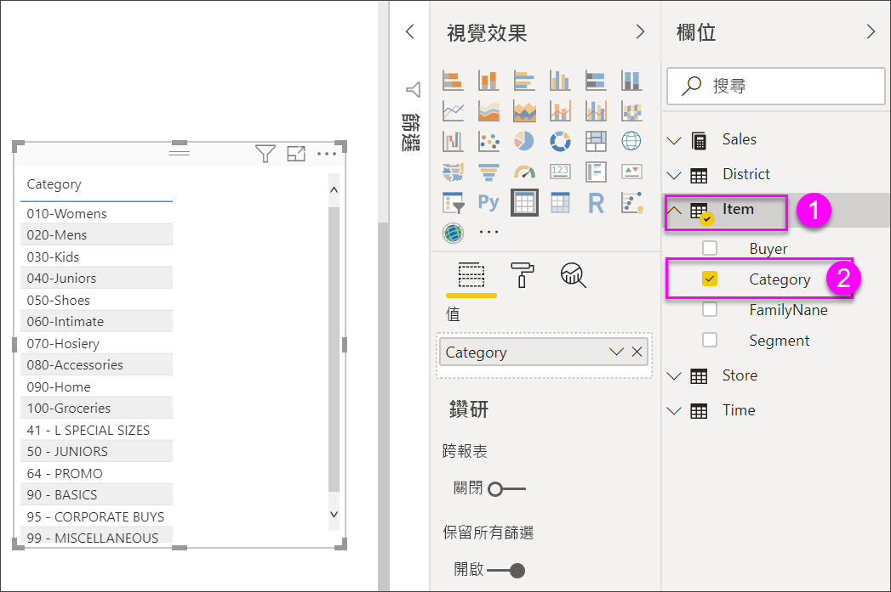
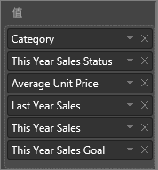
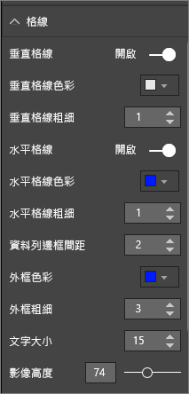
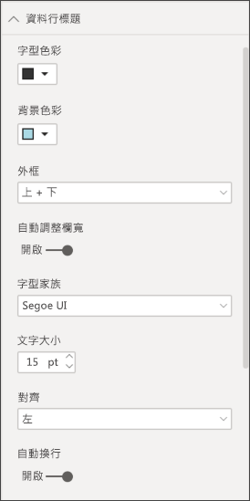
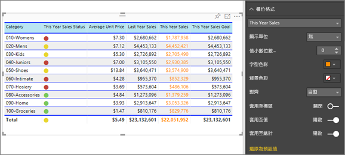
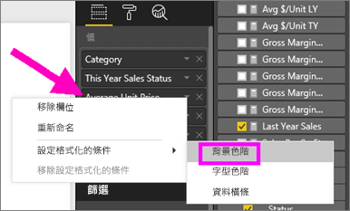
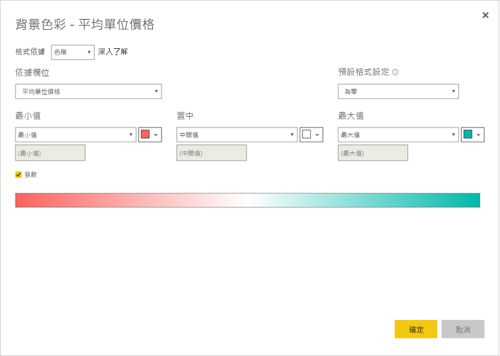
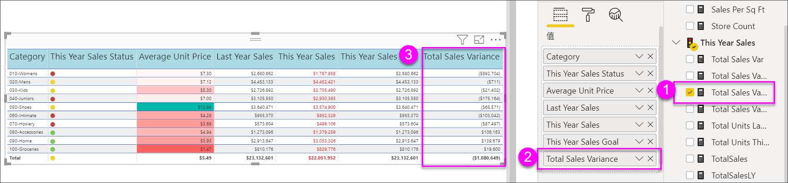
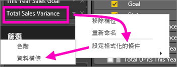
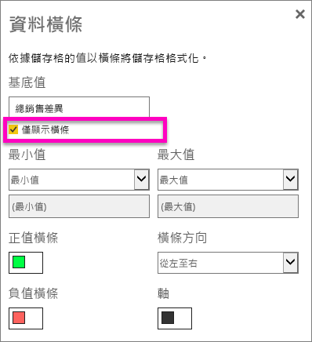

# Power BI 報表和儀表板中的資料表
資料表是一個方格，其中以資料列和資料行的邏輯數列包含相關的資料。 它也可能包含標頭和總計資料列。 資料表適合處理您要在許多值裡尋找單一類別的量化比較。 例如，這個資料表會顯示**類別**的 5 個不同量值。

## 使用資料表的時機
資料表極適合：

* 查看並比較詳細資料和實際值 (而非視覺表示法)
* 以表格格式顯示資料
* 依類別顯示數值資料   

> [!NOTE]
> 如果資料表有太多值，請考慮將它轉換成矩陣和/或使用向下鑽研。 資料表會顯示的資料點數目上限為 3,500。

## 先決條件
- Power BI 服務或 Power BI Desktop
- 零售分析範例

## 建立資料表
我們將建立上述的資料表，依項目類別顯示銷售值。 若要跟著做，請登入 Power BI 服務並選取 [取得資料] \> [範例] \> [零售分析範例] > [連線]，然後選擇 [移至儀表板]。 建立視覺效果需要有資料集和報表的編輯權限。 幸運的是，所有的 Power BI 範例都是可編輯的。 如果有報表已與您共用，您將無法在報表中建立視覺效果。

1. 從左側瀏覽窗格中，選取 [工作區] > [我的工作區]。    
2. 選取 [資料集] 索引標籤，並向下捲動至您剛剛新增的 [零售分析範例] 資料集。  選取**建立報表**圖示。

    
2. 在報表編輯器中，選取 [項目]  >  [類別]。  Power BI 會自動建立資料表，列出所有類別。

    
3. 選取 [銷售] > [平均單價] 和 [銷售] > [去年度銷售額] 和 [銷售] > [本年度銷售額]，並選擇所有 3 個選項 (值、目標、狀態)。   
4. 在 [視覺效果] 窗格中，找出 [值] 並拖放值，直到您的圖表資料行順序符合此頁面上的第一個影像。  您的值應該看起來像這樣。

    
5. 選取釘選圖示將資料表釘選到儀表板  

     

## 格式化資料表
您可以透過許多方式格式化資料表，然而我們將只會討論其中幾種。 若要了解其他格式化選項，建議您開啟 [格式化] 窗格 (滾筒刷圖示 ) 並進行探索。

* 嘗試格式化資料表格線。 我們新增了一條藍色的垂直格線，將空白新增至資料列，並稍微增加了邊框及文字的大小。

    

    
* 針對資料行標頭，我們變更了背景色彩，新增了邊框，並增加了字型大小。 

    

    

* 您甚至可以將格式套用至個別資料行和資料行標頭。 首先展開**欄位格式化**，然後從下拉式清單中選取要格式化的資料行。 根據資料行的值，欄位格式化可讓您設定下列項目：顯示單位、字型色彩、小數位數、背景、對齊方式等。 一旦您調整設定，請決定是否將這些設定套用至標頭及總計資料列。

    

* 在進行一些額外的格式化之後，以下是我們最後完成的資料表。 由於您有許多可以使用的格式化選項，我們建議您從預設格式設定開始學習，開啟 [格式化] 窗格 ，並進行探索。 

    

### 條件式格式化
格式化的其中一種類型稱為 [條件式格式化設定]，並會套用至 Power BI 服務或 Desktop [視覺效果] 窗格之 [值] 集區中的欄位。 

設定資料表格式化的條件時，您可以根據資料格值指定自訂資料格背景色彩和字型色彩，包括使用漸層色彩。 

1. 在 Power BI 服務或 Desktop [視覺效果] 窗格中，選取您要格式化的 [值] 集區中，值旁邊的向下箭號 (或以滑鼠右鍵按一下欄位)。 您只能管理 [欄位] 集區之 [值] 區域中的欄位條件式格式設定。

    
2. 選取 [背景色階]。 在出現的對話方塊中，您可以設定色彩以及 [最小值] 和 [最大值]。 如果您選取 [發散] 方塊，您也可以設定選擇性的「中間」值。

    

    讓我們將一些自訂格式化套用至平均單位價格值。 選取 [發散]，新增一些色彩，然後選擇 [確定]。 

    
3. 將一個新的欄位新增至同時具有正值及負值的資料表。  選取 [銷售額] > [總銷售額差異]。 

    
4. 透過選取 [總銷售額差異] 旁邊的向下箭頭，並選擇 [條件式格式設定] > [資料橫條] 來新增資料橫條條件式格式設定。

    
5. 在出現的對話方塊中，設定 [正值橫條] 與 [負值橫條] 的色彩，在 [只顯示橫條] 旁邊進行勾選，並完成您想要的其他變更。

    

    當您選取 [確定] 之後，資料橫條就會取代資料表中的數值，使其變得更容易閱讀。

    
6. 若要從視覺效果移除設定格式化的條件，只要以滑鼠右鍵再按一次欄位，然後選取 [移除設定格式化的條件] 即可。

> [!TIP]
> 您也可以從格式化窗格 (滾筒刷圖示) 中存取條件式格式設定。 選取要格式化的值，然後將 [色階] 或 [資料橫條] 設定為 [開啟]，以套用預設的設定；或者，您也可以藉由選取 [進階控制項] 來自訂設定。
> 
> 

## 調整資料表的資料行寬度
有時候 Power BI 會截斷報表和儀表板的資料行標題。 若要顯示整個資料行名稱，請將滑鼠停駐在標題右邊的空間以顯示雙箭號，選取並拖曳。

## 考量與疑難排解
* 套用資料行的格式設定時，您只能為每個資料行選擇一個對齊選項：自動、靠左、置中、靠右。 通常，一個資料行包含所有文字或所有數字，並不混用。 但在資料行同時包含數字和文字的情況下，[自動] 會將文字靠左對齊、將數字靠右對齊。 此行為支援從左到右閱讀的語言。   

## 後續步驟

[Power BI 中的矩形式樹狀結構圖](power-bi-visualization-treemaps.md)

[Power BI 中的視覺效果類型](power-bi-visualization-types-for-reports-and-q-and-a.md)