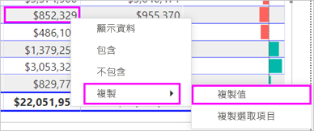
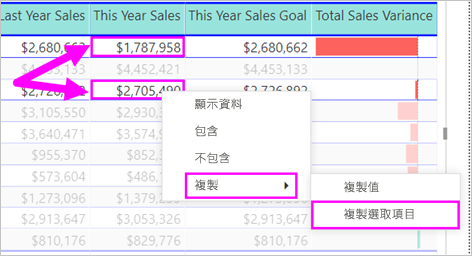

# Power BI 報表和儀表板中的資料表

資料表是一個方格，其中以資料列和資料行的邏輯數列包含相關的資料。 它也可能包含標頭和總計資料列。 資料表適合處理您要在許多值裡尋找單一類別的量化比較。 例如，這個資料表會顯示「類別」  的五個不同量值。

在報表中建立資料表，並在資料表中交叉醒目提示元素，並在相同的報表頁面上顯示其他視覺效果。 您可以選取資料列、資料行，甚至是個別資料格，然後交叉醒目提示。 您也可以複製個別資料格和多個資料格的選取項目，並將其貼至其他應用程式。

## 使用資料表的時機

資料表極適合：

* 查看並比較詳細資料和實際值 (而非視覺表示法)。

* 以表格格式顯示資料。

* 依類別顯示數值資料。

## 先決條件

* Power BI 服務或 Power BI Desktop

* 零售分析範例報表

## 取得零售分析範例報表

這些指示使用零售分析範例。 建立視覺效果需要有資料集和報表的編輯權限。 幸運的是，所有的 Power BI 範例都是可編輯的。 如果有人與您共用報表，您就無法在報表中建立視覺效果。 若要跟著做，請取得[零售分析範例報表](../sample-datasets.md)。

取得 [零售分析範例]  資料集之後，您就可以開始進行。

## 建立資料表

我們將建立文章開頭描述的資料表，依項目類別顯示銷售值。

1. 從 [我的工作區]  中，選取 [資料集]   > [建立報表]  。

    ![[資料集] > [建立報表] 的螢幕擷取畫面。](media/power-bi-visualization-tables/power-bi-create-a-report.png)

1. 從 [欄位]  窗格中，選取 [項目]   > [類別目錄]  。

    Power BI 會自動建立資料表，列出所有類別。

    

1. 選取 [銷售 > 平均單價]  和 [銷售 > 去年度銷售額] 

1. 然後，選取 [銷售 > 本年度銷售額]  ，並選取全部三個選項：[值]  、[目標]  和 [狀態]  。

1. 在 [視覺效果]  窗格中，找出 [值]  區 並拖曳值，直到您的圖表資料行順序符合此頁面上的第一個影像。 您的 [值]  區看起來像這樣：

    

1. 選取釘選圖示將資料表釘選到儀表板  位於視覺效果的右上角。

## 格式化資料表

有許多種方式來格式化資料表。 這裡只涵蓋少數幾個。 若要了解其他格式化選項，建議您開啟 [格式]  窗格 (油漆滾筒圖示)  並進行探索。

* 嘗試格式化資料表格線。 在這裡您會新增一條藍色的垂直格線、將空白新增至資料列，並增加邊框及文字的大小。

    

    

* 針對資料行標頭，請變更背景色彩、新增邊框，並增加字型大小。

    

    

* 您甚至可以將格式套用至個別資料行和資料行標頭。 首先展開 [欄位格式化]  ，然後從下拉式清單中選取要格式化的資料行。 根據資料行的值，[欄位格式化]  可讓您設定下列項目：顯示單位、字型色彩、小數位數、背景、對齊方式等。 一旦您調整設定，請決定是否將這些設定套用至標頭及總計資料列。

    

    

* 在進行一些額外的格式化之後，以下是我們最後完成的資料表。

    

### 設定格式化的條件

「條件式格式設定」  是某種類型的格式化。 Power BI 會將條件式格式設定套用至 [視覺效果]  窗格 [值]  區中的欄位。

設定資料表格式化的條件時，您可以根據資料格值指定自訂資料格背景色彩和字型色彩，包括使用漸層色彩。

1. 在 [視覺效果]  窗格中，選取 [欄位]  圖示 。

1. 選取您要格式化的 [值]  區中，值旁邊的向下箭號 (或以滑鼠右鍵按一下欄位)。

    > [!NOTE]
    > 您只能管理 [欄位]  集區之 [值]  區域中的欄位條件式格式設定。

    

1. 選取 [背景色彩]  。

1. 在出現的對話方塊中，您可以設定色彩、[最小值]  和 [最大值]  。 如果選取 [發散]  方塊，您也可以設定選擇性的 [中心]  值。

    

    讓我們將一些自訂格式化套用至平均單位價格值。 選取 [發散]  、新增一些色彩，然後選取 [確定]  。

    
1. 將一個新的欄位新增至同時具有正值及負值的資料表。 選取 [銷售額] > [總銷售額差異]  。

    

1. 透過選取 [總銷售額差異]  旁邊的向下箭頭，並選擇 [條件式格式設定] > [資料橫條]  來新增資料橫條條件式格式設定。

    

1. 在出現的對話方塊中，設定 [正值橫條]  與 [負值橫條]  的色彩、選取 [只顯示橫條]  選項，並進行您想要的任何其他變更。

    

1. 選取 [確定]  。

    資料橫條即會取代資料表中的數值，使其變得更容易閱讀。

    

如果想要從視覺效果中移除條件式格式設定，請再次以滑鼠右鍵按一次欄位，然後選取 [移除條件式格式設定]  。

> [!TIP]
> 您也可以從 [格式]  窗格中使用條件式格式設定。 選取要設定格式的值，然後將 [色階]  或 [資料橫條]  設定為 [開啟]  ，以套用預設的設定；或者，您也可以透過選取 [進階控制項]  來自訂設定。

## 複製 Power BI 資料表中的值，以用於其他應用程式

您的資料表或矩陣可能包含您希望在其他應用程式中使用的內容，例如 Dynamics CRM、Excel，甚至其他 Power BI 報表。 在 Power BI 中，當您在資料格內按一下滑鼠右鍵時，可以將單一資料格或資料格選取範圍中的資料複製到剪貼簿，並貼到其他應用程式。

若要複製單一資料格的值：

1. 選取您想要複製的資料格。

1. 在資料格內按一下滑鼠右鍵。

1. 選取 [複製]   > [複製值]  。

    

    使用剪貼簿上未格式化的資料格的值，您可以將它貼至另一個應用程式。

若要複製多個單一資料格：

1. 選取資料格範圍，或使用 **Ctrl** 來選取一或多個資料格。

1. 在您選取的其中一個儲存格內按一下滑鼠右鍵。

1. 選取 [複製]   > [複製選取範圍]  。

    

    該複本包含資料行和資料列標頭。

    

## 調整資料表的資料行寬度

有時候 Power BI 會截斷報表和儀表板的資料行標題。 若要顯示整個資料行名稱，請將滑鼠停駐在標題右邊的空間以顯示雙箭號，選取並拖曳。

## 考量與疑難排解

套用資料行的格式設定時，您只能為每個資料行選擇一個對齊選項：[自動]  、[靠左]  、[置中]  、[靠右]  。 通常，一個資料行包含所有文字或所有數字，並不混用。 在資料行同時包含數字和文字的情況下，[自動]  會將文字靠左對齊、將數字靠右對齊。 此行為支援從左到右閱讀的語言。

## 後續步驟

* [Power BI 中的矩形式樹狀結構圖](power-bi-visualization-treemaps.md)

* [Power BI 中的視覺效果類型](power-bi-visualization-types-for-reports-and-q-and-a.md)
