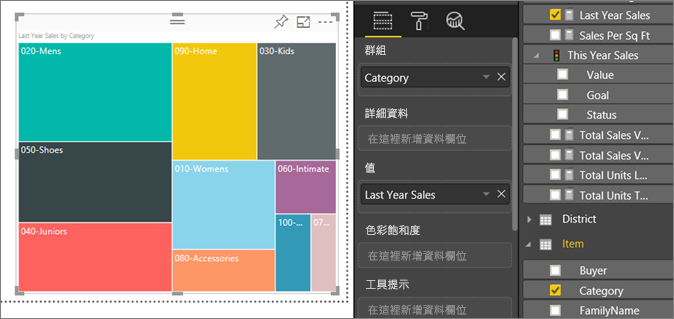

# Power BI 中的矩形式樹狀結構圖

矩形式樹狀結構圖會將階層式資料顯示成一組巢狀矩形。 每個階層層級會以包含較小矩形 (分葉) 的彩色矩形 (分支) 表示。 Power BI 會根據測量值決定每個矩形內的空間大小。 矩形會依大小從左上角 (最大) 排列到右下角 (最小)。

例如，如果您要分析銷售額，最上層的分支可能是服裝類別：[都市]  、[鄉村]  、[青少年]  和 [混合]  。 Power BI 會將您的類別矩形分成多個分葉，代表該類別內的服裝製造商。 這些分葉會根據銷售數目，調整大小和陰影。

在上述的 [都市]  分支，售出了許多 **VanArsdel** 服裝。 售出了較少 **Natura** 和 **Fama**。 只售出了少量 **Leo**。 因此，矩形式樹狀結構圖的 [都市]  分支會有：

* 在左上角有 **VanArsdel** 的最大矩形。

* 略小一點的 **Natura** 和 **Fama** 矩形。

* 其他所有售出服裝的多個矩形。

* 很小的 **Leo** 矩形。

您可以藉由比較每個分葉節點的大小和陰影，去比較其他服裝類別的售出項目數；矩形越大且顏色越深，表示值越高。

想要先觀賞其他人建立矩形式樹狀結構圖嗎？ 請跳至這段影片的 2:10 處，觀看 Amanda 建立矩形式樹狀結構圖。

<iframe width="560" height="315" src="https://www.youtube.com/embed/IkJda4O7oGs" frameborder="0" allowfullscreen></iframe>

## 使用矩形式樹狀結構圖的時機

矩形式樹狀結構圖極適合：

* 顯示大量的階層式資料。

* 橫條圖無法有效處理大量值的時候。

* 顯示各部分與整體之間的比例。

* 顯示量值在階層中每個類別層級的分佈模式。

* 使用大小和色彩編碼顯示屬性。

* 找出模式、極端值、最重要的因素和例外狀況。

## 先決條件

* Power BI 服務或 Power BI Desktop

* 零售分析範例報表

## 取得零售分析範例報表

這些指示使用零售分析範例。 建立視覺效果需要有資料集和報表的編輯權限。 幸運的是，所有的 Power BI 範例都是可編輯的。 如果有人與您共用報表，您就無法在報表中建立視覺效果。 若要跟著做，請取得[零售分析範例報表](../sample-datasets.md)。

取得**零售分析範例**資料集之後，您就可以開始進行。

## 建立基本的矩形式樹狀結構圖

您將建立報表並新增基本的矩形式樹狀結構圖。

1. 從 [我的工作區]  ，選取 [資料集]   > [建立報表]  。

    ![[資料集] > [建立報表] 的螢幕擷取畫面。](media/power-bi-visualization-treemaps/power-bi-create-a-report.png)

1. 從 [欄位]  窗格，選取 [銷售額]   > [去年度銷售額]  量值。

   ![選取 [銷售額] > [去年度銷售額] 後產生的視覺效果螢幕擷取畫面。](media/power-bi-visualization-treemaps/treemapfirstvalue_new.png)

1. 選取矩形式樹狀結構圖圖示  將圖表轉換成矩形式樹狀結構圖。

   

1. 將 [項目]   > [類別]  拖曳到 [群組]  部分。

    Power BI 會建立矩形式樹狀結構圖，其中的矩形大小是根據總銷售額，而色彩則代表類別目錄。 在本質上，您已建立以視覺方式描述依類別目錄的總銷售額相對大小的階層。 [男裝]  類別目錄的銷售額最高，[襪子]  類別目錄則最低。

    

1. 將 [商店]   > [鏈結]  拖曳到 [詳細資料]  部分以完成矩形式樹狀結構圖。 您現在可以依照類別目錄和鏈結比較去年的銷售額。

   ![將 [商店] > [鏈結] 新增至 [詳細資料] 的矩形式樹狀結構圖螢幕擷取畫面。](media/power-bi-visualization-treemaps/power-bi-details.png)

   > [!NOTE]
   > 不能同時使用 [色彩飽和度] 與 [詳細資料]。

1. 將游標暫留在 [鏈結]  區域，以顯示 [類別]  部分的工具提示。

    例如，暫留在 **090-Home** 矩形中的 **Fashions Direct** 會顯示 [首頁] 類別 Fashion Direct 部分的工具提示。

   ![顯示 [首頁] 工具提示的螢幕擷取畫面。](media/power-bi-visualization-treemaps/treemaphoverdetail_new.png)

1. 新增矩形式樹狀結構圖作為[儀表板磚 (釘選視覺效果)](../service-dashboard-tiles.md)。

1. 儲存[報表](../service-report-save.md)。

## 反白顯示和交叉篩選

如需使用 [篩選]  窗格的資訊，請參閱[將篩選新增至報表](../power-bi-report-add-filter.md)。

在矩形式樹狀結構圖中醒目提示某個 [類別]  或 [詳細資料]  ，可交叉醒目提示及交叉篩選報表頁面上的其他視覺效果，反之亦然。 若要跟著做，請將一些視覺效果新增至此報表頁面或是將矩形式樹狀結構圖複製到此報表中其他頁面的其中一個。

1. 在矩形式樹狀結構圖上，選取 [類別]  或 [類別]  中的 [鏈結]  。 這會交叉醒目提示頁面上的其他視覺效果。 例如，選取 [050-鞋子]  會顯示鞋子的去年銷售額美金 **$3,640,471** 元，這些銷售額中有美金 **$2,174,185** 元來自 **Fashions Direct**。

   ![顯示交叉醒目提示的 [銷售門市概觀] 報表螢幕擷取畫面。](media/power-bi-visualization-treemaps/treemaphiliting.png)

1. 在 [依鏈結的去年銷售額]  圓形圖中，選取 [Fashion Direct]  配量，對矩形式樹狀結構圖進行交叉篩選。
   

1. 若要管理圖表互相交叉醒目提示及交叉篩選的方式，請參閱[變更 Power BI 報表中的視覺效果互動方式](../service-reports-visual-interactions.md)。

## 後續步驟

* [Power BI 中的瀑布圖](power-bi-visualization-waterfall-charts.md)

* [Power BI 中的視覺效果類型](power-bi-visualization-types-for-reports-and-q-and-a.md)
