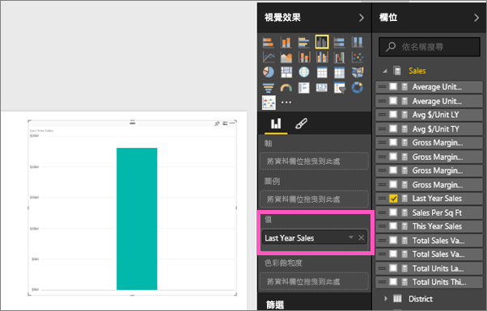
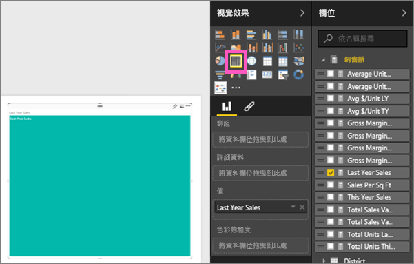
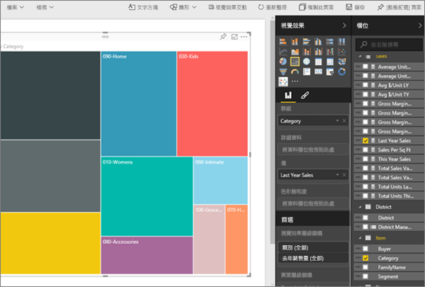
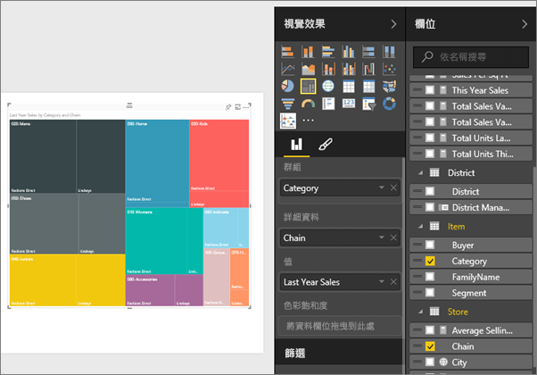
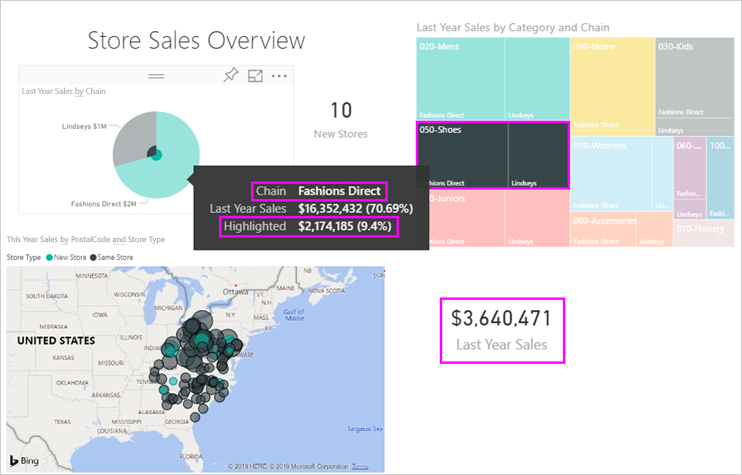

# Power BI 中的矩形式樹狀結構圖
矩形式樹狀結構圖會將階層式資料顯示成一組巢狀矩形。  階層的每個層級會由包含其他矩形 (「分葉」) 的彩色矩形 (通常稱為「分支」) 代表。  每個矩形內的空間是根據測量的量化值來配置，並且矩形會依大小從左上角 (最大) 排列到右下 (最小)。

例如，如果我要分析我的銷售額，則最上層的矩形 (分支) 可能是服裝類別目錄：[都市] 、[鄉村] 、[青少年] 和 [混合] 。  我的類別目錄矩形會包含較小的矩形 (分葉) 代表該類別目錄內的衣服製造商，而這些較小的矩形會依照售出數目調整大小並加上陰影。  上述的 [都市]  分支中售出了許多 Maximus 服裝，較少 Natura 和 Fama，Leo 則很少售出。  因此，矩形式樹狀結構圖的 [都市] 分支會以最大矩形代表 Maximus (在左上角)、較小的矩形代表 Natura 和 Fama，其他許多矩形代表所有其他售出的服裝，還有一個很小的矩形代表 Leo。  我可以藉由比較每個分葉節點的大小和陰影，來比較其他服裝類別目錄的售出項目數；矩形越大且陰影越深，值就越高。

## 使用矩形式樹狀結構圖的時機
矩形式樹狀結構圖極適合：

* 顯示大量的階層式資料。
* 橫條圖無法有效處理大量值的時候。
* 顯示各部分與整體之間的比例。
* 顯示量值在階層中每個類別目錄層級的分佈模式。
* 使用大小和色彩編碼顯示屬性。
* 找出模式、極端值、最重要的參與者和例外狀況。

### 先決條件
 - Power BI 服務或 Power BI Desktop
 - 零售分析範例

## 建立基本的矩形式樹狀結構圖
想要先觀賞其他人建立矩形式樹狀結構圖嗎？  請跳至這段影片的 2:10 處，觀看 Amanda 建立矩形式樹狀結構圖。

<iframe width="560" height="315" src="https://www.youtube.com/embed/IkJda4O7oGs" frameborder="0" allowfullscreen></iframe>

或是建立您自己的矩形式樹狀結構圖。 這些指示使用零售分析範例。 若要跟著做，請登入 Power BI 服務 (而非 Desktop)，並選取 [取得資料] \> [範例] \> [零售分析範例] \> [連線] \> [移至儀表板]。 在報表中建立視覺效果，需要有資料集和報表的編輯權限。 幸運的是，Power BI 範例都是可編輯的。 但如果有人與您共用報表，您將會無法新增新的視覺效果。

1. 選取 [所有門市] 磚以開啟 [零售分析範例] 報表。    
2. 開啟[編輯檢視](../service-interact-with-a-report-in-editing-view.md)，並選取 [銷售額] > [去年銷售額] 量值。   
      
3. 將圖表轉換成矩形式樹狀結構圖。  
      
4. 將 [項目] > [類別] 拖曳到 [群組] 部分。 Power BI 會建立矩形式樹狀結構圖，其中的矩形大小會反映總銷售額，而色彩則代表類別。  在本質上，您已建立以視覺方式描述依類別目錄的總銷售額相對大小的階層。  [男裝]  類別目錄的銷售額最高，[襪子]  類別目錄則最低。   
      
5. 將 [商店] > [鏈結] 拖曳到 [詳細資料] 部分以完成矩形式樹狀結構圖。 您現在可以依照類別目錄和鏈結比較去年的銷售額。   
   
   
   > [!NOTE]
   > 不能同時使用 [色彩飽和度] 與 [詳細資料]。
   > 
   > 
5. 將游標暫留在 [鏈結]  區域，以顯示 [類別] 部分的工具提示。  舉例來說，將滑鼠停留在 [040-童裝]  矩形中的 [Lindseys]  ，會顯示童裝類別目錄 Lindsey 部分的工具提示。  
   
6. [將矩形式樹狀結構圖以儀表板磚加入 (釘選視覺效果)](../consumer/end-user-tiles.md)。 
7. [儲存報表](../service-report-save.md)。

## 反白顯示和交叉篩選
如需使用 [篩選] 窗格的資訊，請參閱[將篩選加入報表](../power-bi-report-add-filter.md)。

在矩形式樹狀結構圖中醒目提示某個類別或詳細資料，可交叉醒目提示及交叉篩選報表頁面上的其他視覺效果，反之亦然。 如果要跟著做，請將一些視覺效果加入同一個頁面中，或將矩形式樹狀結構圖複製/貼上已有其他視覺效果的報表頁面。

1. 在矩形式樹狀結構圖上，選取類別目錄或類別目錄中的鏈結。  這會交叉醒目提示頁面上的其他視覺效果。 例如，選取 [050-鞋子] 會顯示鞋子的去年銷售額美金 $3,640,471 元，其中有美金 $2,174,185 元來自 Fashions Direct。  
   

2. 在 [依鏈結的去年銷售額] 圓形圖中，選取 [Fashion Direct] 配量，對矩形式樹狀結構圖進行交叉篩選。  
       

3. 若要管理圖表互相交叉醒目提示及交叉篩選的方式，請參閱[在 Power BI 報表中與視覺效果互動](../consumer/end-user-interactions.md)

## 後續步驟
[將視覺效果釘選到儀表板](../service-dashboard-pin-tile-from-report.md)  
[Power BI - 基本概念](../consumer/end-user-basic-concepts.md)  

有其他問題嗎？ [試試 Power BI 社群](http://community.powerbi.com/)  

