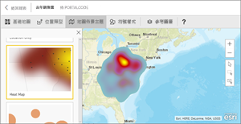
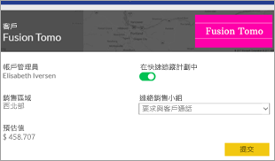
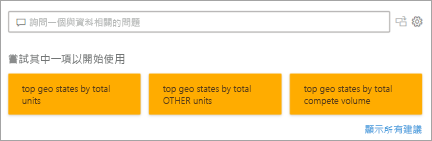
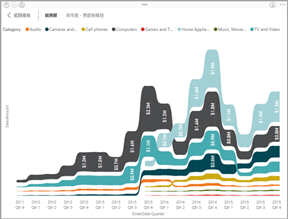
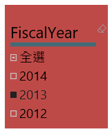
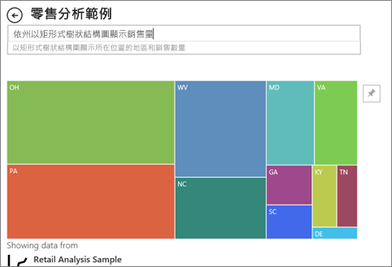

# Power BI 中的視覺效果類型
## Power BI 視覺效果
近期將加入新的視覺效果，請密切注意！

另請查看 [Microsoft AppSource](https://appsource.microsoft.com/marketplace/apps?product=power-bi-visuals)，您會發現這裡有一份持續成長的 [Power BI 視覺效果](../developer/visuals/power-bi-custom-visuals.md)清單，供您下載並用在自己的儀表板和報告中。 腦中充滿創造力嗎？ [了解如何建立您自己的視覺效果並新增至這個社群網站](../developer/visuals/office-store.md)。  

## Power BI 提供的視覺效果清單
所有這些視覺效果皆可加入 Power BI 報表、在問與答中指定，並釘選到儀表板。

### 區域圖：基本 (分層) 與堆疊

>[!TIP]
>基本區域圖以折線圖為基礎，會將軸與折線之間的區域填滿。

如需詳細資訊，請參閱[基本區域圖](power-bi-visualization-basic-area-chart.md)。

### 橫條圖和直條圖

 

>[!TIP]
>橫條圖是查看不同類別間特定值的標準作法。

### 卡片：多列

### 卡片：單一數字

如需詳細資訊，請參閱[建立卡片 (大數字圖格)](power-bi-visualization-card.md)。

### 組合圖

>[!TIP]
>組合圖結合了直條圖和折線圖。 選擇「折線圖加堆疊直條圖」  及「折線圖加群組直條圖」  。

如需詳細資訊，請參閱 [Power BI 中的組合圖](power-bi-visualization-combo-chart.md)。

### 環圈圖

>[!TIP]
>環圈圖類似於圓形圖。  它們會顯示部分與整體的關聯性。

如需詳細資訊，請參閱 [Power BI 中的環圈圖](power-bi-visualization-doughnut-charts.md)。

### 漏斗圖

>[!TIP]
>漏斗圖利於以視覺化方式展現具有階段和項目的程序，依序從一個階段過渡到下一個階段的流程。  當階段與階段間有循序流程時請使用漏斗圖，例如始於潛在客戶名單、止於採購履約的銷售程序。

如需詳細資訊，請參閱 [Power BI 中的漏斗圖](power-bi-visualization-funnel-charts.md)。

### 量表圖

>[!TIP]
>顯示目標內容的目前狀態。

如需詳細資訊，請參閱 [Power BI 中的量表圖](power-bi-visualization-radial-gauge-charts.md)。

### 關鍵影響因素圖表

關鍵影響因素圖表顯示出所選結果或值的主要成因。

如需詳細資訊，請參閱 [Power BI 中的關鍵影響因數圖表](power-bi-visualization-influencers.md)

### KPI

>[!TIP]
>顯示重要目標的進度。

如需詳細資訊，請參閱 [Power BI 中的 KPI](power-bi-visualization-kpi.md)。

### 折線圖

>[!TIP]
>強調完整連續值的整體圖形，通常是一段期間。

### 地圖：基本地圖

>[!TIP]
>用來將類別和數量資訊與空間位置產生關聯。

如需詳細資訊，請參閱[地圖視覺效果的秘訣和訣竅](power-bi-map-tips-and-tricks.md)。

### 地圖：ArcGIS 地圖

如需詳細資訊，請參閱 [Power BI 中的 ArcGIS 地圖](power-bi-visualization-arcgis.md)。

### 地圖：區域分布圖 (分級著色圖)

>[!TIP]
>顏色愈深，值愈大。

如需詳細資訊，請參閱 [Power BI 中的區域分布圖](power-bi-visualization-filled-maps-choropleths.md)。

### 地圖：圖形地圖

>[!TIP]
>依色彩比較區域。

如需詳細資訊，請參閱 [Power BI 中的圖形地圖](desktop-shape-map.md)。

### 矩陣圖

>[!TIP]
>資料表支援兩個維度，但是矩陣可讓您更輕鬆地顯示跨多個維度 (支援分層式的配置) 的資料，更具意義。 矩陣會自動彙總資料，並啟用向下鑽研。 

如需詳細資訊，請參閱 [Power BI 中的矩陣視覺效果](desktop-matrix-visual.md)。

### 圓形圖

>[!TIP]
>圓形圖會顯示部分與整體的關聯性。 

### Power Apps 視覺效果

報表設計師可以建立 Power App，並將其內嵌到 Power BI 報表中作為視覺效果。 取用者可以在 Power BI 報表內與該視覺效果互動。 

如需詳細資訊，請參閱[將 Power Apps 視覺效果新增至您的報表](power-bi-visualization-powerapp.md)。

### 問與答視覺效果

>[!TIP]
>問與答視覺效果類似於[儀表板上的問與答體驗](../power-bi-tutorial-q-and-a.md)，可讓您使用自然語言來詢問資料的相關問題。 

如需詳細資訊，請參閱 [Power BI 中的問與答視覺效果](power-bi-visualization-q-and-a.md)。

### R 指令碼視覺效果

>[!TIP]
>以 R 指令碼建立的視覺效果通常稱為「R 視覺效果」  ，可以使用 R 豐富的分析和視覺效果功能，呈現進階的資料成形和分析，例如預測。R 視覺效果可以在 Power BI Desktop 建立，然後發佈到 Power BI 服務。   

如需詳細資訊，請參閱 [Power BI 中的 R 視覺效果](service-r-visuals.md)。

### 功能區圖表

>[!TIP]
>功能區圖表會顯示哪些資料類別具有最高的等級 (最大值)。 功能區圖表適合顯示等級變更，最高等級 (值) 一律顯示於每個時段的最上方。

如需詳細資訊，請參閱 [Power BI 中的緞帶圖](desktop-ribbon-charts.md)。

### 散佈圖和泡泡圖

>[!TIP]
>顯示 2 (散佈圖) 或 3 (泡泡圖) 量值之間的關聯性 -- 是否有關聯性，以及關聯性順序為何等等。

如需詳細資訊，請參閱 [Power BI 中的散佈圖](power-bi-visualization-scatter.md)。

### 散佈圖高密度

>[!TIP]
>視覺效果上有太多資料點可能會導致停滯，所以使用了複雜的取樣演算法來確保視覺效果的精確度。

如需詳細資訊，請參閱 [Power BI 中的高密度散佈圖](desktop-high-density-scatter-charts.md)。

### 交叉分析篩選器

如需詳細資訊，請參閱 [Power BI 中的交叉分析篩選器](power-bi-visualization-slicers.md)。

### 獨立映像

如需詳細資訊，請參閱[將影像 Widget 加入儀表板中](../service-dashboard-add-widget.md).

### 資料表

>[!TIP]
>適合有許多類別之項目間的數量比較。

如需詳細資訊，請參閱[在 Power BI 中使用資料表](power-bi-visualization-tables.md)。

### 矩形式樹狀結構圖

如需詳細資訊，請參閱 [Power BI 中的矩形式樹狀結構圖](power-bi-visualization-treemaps.md)。

>[!TIP]
>彩色矩形圖，值以矩形大小表示。  它們可以是階層式，各矩形可以巢嵌在主要矩形內。

### 瀑布圖

>[!TIP]
>瀑布圖會顯示總額的增減變動。

如需詳細資訊，請參閱 [Power BI 中的瀑布圖](power-bi-visualization-waterfall-charts.md)。

## 告訴問與答要使用的視覺效果
在 Power BI 問與答輸入自然語言查詢時，您可以在查詢中指定視覺效果的類型。  範例︰

***依州以矩形式樹狀結構圖顯示銷售額***.

## 後續步驟
[Power BI 報表中的視覺效果](power-bi-report-visualizations.md)    
[來自 sqlbi.com 的正確視覺效果參考](https://www.sqlbi.com/wp-content/uploads/videotrainings/dashboarddesign/visuals-reference-may2017-A3.pdf)