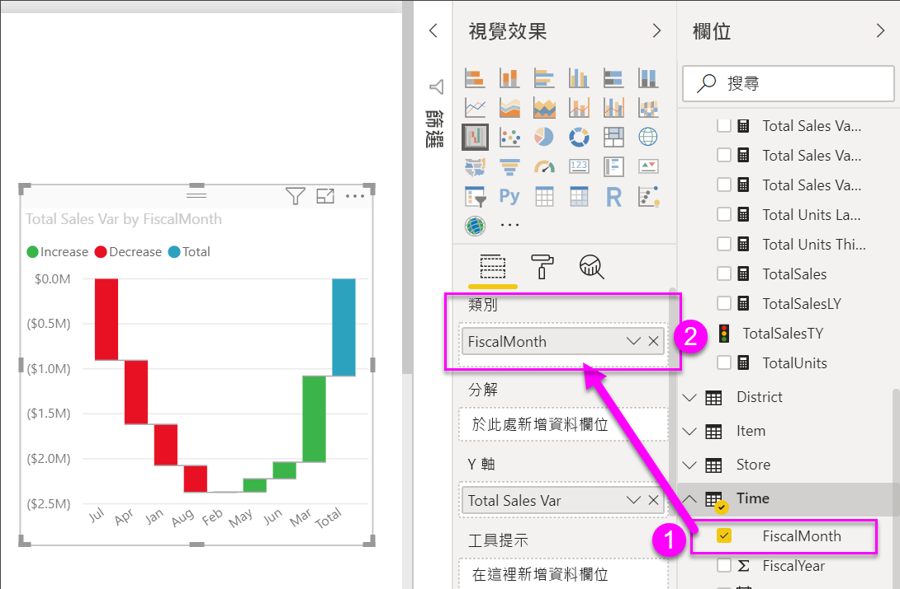

# Power BI 中的瀑布圖
瀑布圖會顯示總額的增減變動。 它適用於了解起始值 (例如淨收益) 如何受到一系列正面和負面變更的影響。

資料行會標示色彩，讓您快速地分辨增加和減少。 起始值和最終值資料行通常[在水平軸上開始](https://support.office.com/article/Create-a-waterfall-chart-in-Office-2016-for-Windows-8de1ece4-ff21-4d37-acd7-546f5527f185#BKMK_Float "在水平軸上開始")，而中間值則是浮動的資料行。 由於其「外觀」，瀑布圖也稱為橋樑圖 (bridge chart)。

<iframe width="560" height="315" src="https://www.youtube.com/embed/qKRZPBnaUXM" frameborder="0" allow="autoplay; encrypted-media" allowfullscreen></iframe>

## 使用瀑布圖的時機
瀑布圖極適合：

* 您擁有跨越時間序列或不同類別目錄的量值變更時
* 稽核對總值造成的重大變更
* 藉由顯示營收的各種來源來標示貴公司的年度收益，並達到總收益 (或虧損)
* 呈現貴公司一年的開始和結束人數
* 以視覺化方式顯示您的每月收入與支出，以及帳戶的日常餘額 

## 建立瀑布圖
我們將會建立一個顯示了每月銷售額差異 (估計銷售額與實際銷售額) 的瀑布圖。 如果要跟著做，請登入 Power BI 並選取 [取得資料] \> [範例] \> [零售分析範例]。 

1. 選取 [資料集] 索引標籤，並捲動至新的 [零售分析範例] 資料集。  選取**建立報表**圖示，在報表編輯檢視中開啟資料集。 
   
    ![醒目提示的 [資料集] 索引標籤](media/power-bi-visualization-waterfall-charts/power-bi-waterfall-report.png)
2. 從 [欄位] 窗格中，選取 [銷售額] \> [總銷售額差異]。 
3. 將圖表轉換成 [瀑布圖] 。 如果 [總銷售額差異]  並非位於 [Y 軸]  區域，請將它拖曳到該處。
   
    
4. 選取 [時間] \> [會計月份] 將其加入 [類別] 部分。 
   
    
5. 依時間先後順序來排序瀑布圖。 在圖表右上角選取省略符號 (...)，然後選擇 [會計月份]。
   
    ![選擇 [排序依據] > [FiscalMonth]](media/power-bi-visualization-waterfall-charts/power-bi-sort-by.png)
   
    
6. 深入了解造成每個月變化的最大因素為何。 將 [存放區]  >  [地區] 拖曳至 [分解] 貯體。
   
    ![顯示 [分解] 貯體中的 [存放區]](media/power-bi-visualization-waterfall-charts/power-bi-waterfall-breakdown.png)
7. 根據預設，Power BI 會新增造成每個月增加或減少的前 5 個因素。 但是，我們只想了解前 2 個因素。  在 [格式化] 窗格中，選取 [分解]，然後將 [最大值] 設定為 2。
   
    ![[格式化] > [分解]](media/power-bi-visualization-waterfall-charts/power-bi-waterfall-breakdown-maximum.png)
   
    快速檢閱會顯示俄亥俄州和賓夕法尼亞州地區是造成我們瀑布圖負向及正向移動的最大因素。 
   
    
8. 這是一個相當有趣的發現。 是因為俄亥俄州和賓夕法尼亞州這 2 個地區的銷售額遠高於其他地區的銷售額，才使得他們造成如此顯著的影響嗎？  我們可以確認這一點。 建立依地區劃分的今年銷售額與去年銷售額地圖。  
   
    
   
    我們的地圖證實了我們的理論。  它顯示了這 2 個地區在去年 (泡泡大小) 和今年 (泡泡陰影) 都擁有最高的銷售額。

## 反白顯示和交叉篩選
如需使用 [篩選] 窗格的資訊，請參閱[將篩選加入報表](../power-bi-report-add-filter.md)。

在瀑布圖中反白顯示資料行會交叉篩選報表頁面上的其他視覺效果，反之亦然。 不過，[總計] 資料行不會觸發反白顯示或回應交叉篩選。

## 後續步驟

[視覺效果互動](../service-reports-visual-interactions.md)

[Power BI 中的視覺效果類型](power-bi-visualization-types-for-reports-and-q-and-a.md)