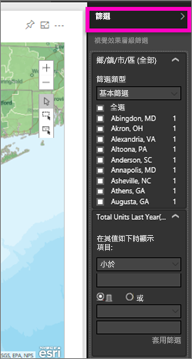
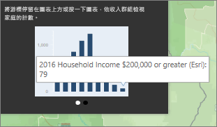
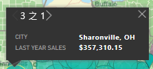
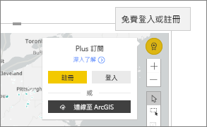

# 在 Power BI 中與 ArcGIS 地圖互動
此主題是從在 Power BI 服務、Power BI Desktop 或 Power BI Mobile 中「取用」ArcGIS 地圖的人員觀點來撰寫。 一旦建立者與您共用 ArcGIS 地圖，可利用許多方法與該地圖互動。  若要深入了解如何建立 ArcGIS 地圖，請參閱[由 Esri 提供的 ArcGIS 地圖教學課程](../power-bi-visualization-arcgis.md)。

ArcGIS 地圖與 Power BI 的結合，把在點之外加上地圖的做法帶到了全新境界。 您可以使用基礎地圖、位置類型、佈景主題、符號樣式及參考圖層等選項，建立具有豐富資訊的絶佳地圖視覺效果。 地圖上的官方資料圖層 (例如人口普查資料) 與空間分析結合之後，能讓人更深入了解視覺效果中的資料。

> [!TIP]
> GIS 是 Geographic Information System (地理資訊系統) 的縮寫。
> 

我們所使用的範例是[由 ESRI 提供的 ArcGIS 地圖教學課程](../power-bi-visualization-arcgis.md)中所建立的相同 ArcGIS 地圖。 它會依鄉/鎮/市/區查看去年銷售量，使用街道基礎地圖、泡泡符號來表示大小，並使用平均家庭收入的參考圖層。 此地圖包含 3 個圖釘及一個行車時間半徑範圍 (以紫色顯示)。

> [!TIP]
> 若要查看多個範例及閱讀見證，請前往 [Power BI 上的 Esri 頁面](https://www.esri.com/powerbi)。 接著請參閱 Esri 的 [ArcGIS Maps for Power BI Getting Started (ArcGIS Maps for Power BI 使用者入門) 頁面](https://doc.arcgis.com/en/maps-for-powerbi/get-started/about-maps-for-power-bi.htm)。
> 
> 

 

## 使用者同意
當同事第一次與您共用 ArcGIS 地圖時，Power BI 會顯示提示。 ArcGIS Maps for Power BI 是由 Esri (www.esri.com) 提供，因此，您的 ArcGIS Maps for Power BI 使用方式受到 Esri 的條款及隱私權原則的規範。 如果 Power BI 使用者想要使用 ArcGIS Maps for Power BI 的視覺效果，就必須接受同意對話方塊。

## 選取工具
ArcGIS Maps for Power BI 具有三個選取模式。 一次最多可以選取 250 個資料點。

選取個別資料點。

在地圖上繪製一個矩形，並選取包含的資料點。 使用 CTRL 鍵可選取多個矩形區域。

可讓您使用參考圖層內的界限或多邊形，進而選取包含的資料點。

 

## 與 ArcGIS 地圖互動
您可以使用的功能取決於您是「建立者」(建立地圖的人) 或「取用者」(與您共用 ArcGIS 地圖的人)。 如果您以取用者身分與 ArcGIS 地圖互動 (也稱為[閱讀檢視](../consumer/end-user-reading-view.md))，以下是您可以採取的動作。

* 如果您是擁有「檢視」權限的進階取用者，您將能夠[檢視用於建立視覺效果的資料](../consumer/end-user-show-data.md)、[訂閱](../consumer/end-user-subscribe.md)、查看[焦點模式與全螢幕模式](../consumer/end-user-focus.md)中的地圖、[檢視相關內容](../consumer/end-user-related.md)，[與報表建立者設定的篩選互動](../consumer/end-user-report-filter.md)，[共用報表](../service-share-reports.md)等等。

* 與其他視覺效果類型一樣，Power BI **Pro** 取用者可以執行進階取用者可以執行的所有操作，再加上[匯出基礎資料](power-bi-visualization-export-data.md)、[取得使用計量](../service-usage-metrics.md)、儲存複本並[發行至 Web](../service-publish-to-web.md) 等等。

    
* 展開 [篩選] 窗格以使用篩選探索地圖。   
      
* 如果地圖有參考圖層，選取位置即可在工具提示中顯示詳細資料。 我們在這裡選取了亞當斯郡，並查看建立者新增至地圖之平均家庭收入參考圖層中的資料。
  
      
  
    在本例中，我們也會取得一個圖表。 選取圖表上的長條以深入了解相關資料。 我們在這裡看到亞當斯郡有 79 戶的收入為美金 $200,000 元 (含) 以上。
  
    
  
    選取箭號即可顯示任何其他圖表。
* 將滑鼠停留在基礎地圖位置符號上方，以在工具提示中顯示詳細資料。     
  
  
  > [!TIP]
  > 您可能必須放大才能選取特定位置。  否則，如果有位置重疊，Power BI 可能會一次提供多個工具提示。 選取箭號即可在工具提示之間移動
  > 
  > 
  > 
  > 
* 如果建立者將資訊圖層新增至 ArcGIS 地圖，您將會在地圖右上角看到其他資料顯示。  例如，地圖建立者在這裡新增了「14 歲以下兒童」。
  
    

## 考量與限制
ArcGIS Maps for Power BI 可在下列服務和應用程式中使用：

<table>
<tr><th>服務/應用程式</th><th>可用性</th></tr>
<tr>
<td>Power BI Desktop</td>
<td>是</td>
</tr>
<tr>
<td>Power BI 服務 (app.powerbi.com)</td>
<td>是</td>
</tr>
<tr>
<td>Power BI 行動應用程式</td>
<td>是</td>
</tr>
<tr>
<td>Power BI 的發佈至網路功能</td>
<td>否</td>
</tr>
<tr>
<td>Power BI Embedded</td>
<td>否</td>
</tr>
<tr>
<td>Power BI 服務內嵌 (PowerBI.com)</td>
<td>否</td>
</tr>
</table>

**如何搭配 ArcGIS Maps for Power BI 運作？**
ArcGIS Maps for Power BI 由 Esri (www.esri.com) 提供。 因此，您的 ArcGIS Maps for Power BI 使用方式受到 Esri 的[條款](https://go.microsoft.com/fwlink/?LinkID=8263222)及[隱私權原則](https://go.microsoft.com/fwlink/?LinkID=826323)的規範。 如果 Power BI 使用者想要使用 ArcGIS Maps for Power BI 的視覺效果，就必須接受同意對話方塊 (如需詳細資訊，請參閱＜使用者同意＞)。  Esri 的 ArcGIS Maps for Power BI 使用方式受到 Esri 的條款及隱私權原則的規範，同意對話方塊也提供相關連結。 每位使用者第一次使用 ArcGIS Maps for Power BI 之前都必須先同意。 一旦使用者接受同意對話方塊，繫結至視覺效果的資料就會傳送至 Esri 服務至少進行地理編碼，這表示會將位置資訊轉換成可在地圖上表示的緯度和經度資訊。 您應該假設任何繫結至資料視覺效果的資料都可能會傳送至 Esri 服務。 Esri 提供基本地圖、空間分析、地理編碼等服務。ArcGIS Maps for Power BI 視覺效果透過受到 Esri 所提供及維護的憑證保護的 SSL 連線與這些服務互動。 您可以從 Esri 的 [ArcGIS Maps for Power BI 產品頁面](https://www.esri.com/powerbi)取得 ArcGIS Maps for Power BI 的其他資訊。

**Power BI Plus**    

當使用者透過 ArcGIS Maps for Power BI 註冊由 Esri 提供的 Plus 訂閱時，即進入與 Esri 的直接關聯性。 Power BI 不會將使用者的個人資訊傳送至 Esri。 使用者使用自己的 AAD 身分識別登入並信任 Esri 提供的 AAD 應用程式。 如此一來，使用者便可以直接與 Esri 共用其個人資訊。 一旦使用者將 Plus 內容新增至 ArcGIS Maps for Power BI 視覺效果，其他 Power BI 使用者也需要 Esri 的 Plus 訂閱才能檢視或編輯該內容。 

如有 Esri 之 ArcGIS Maps for Power BI 運作方式的詳細技術性問題，請透過其支援網站與 Esri 聯繫。

**ArcGIS 地圖未顯示**    
在無法使用 ArcGIS Maps for Power BI 的服務或應用程式中，視覺效果將顯示為帶有 Power BI 標誌的空白視覺效果。

**我在地圖上看不到我所有的資訊**    
在地圖上對緯度/經度進行地理編碼時，最多可顯示 30,000 個資料點。 對郵遞區號或街道地址等資料點進行地理編碼時，只會對前 15,000 個資料點進行地理編碼。 為位置的名稱或國家/地區進行地理編碼時，不受 1500 個地址的限制。

**使用 ArcGIS Maps for Power BI 會產生任何費用嗎？**

所有 Power BI 使用者皆可免費使用 ArcGIS Map for Power BI。 它是一個由 **Esri** 所提供的元件，因此，您的使用方式受到 **Esri** 的條款及隱私權原則的規範 (如此文章稍早所述)。 如果您有訂閱 ArcGIS **Plus**，則需要付費。

**我收到有關快取將滿的錯誤訊息**

目前正在解決此 BUG。  在此同時，請選取出現在錯誤訊息中的連結，以取得清除 Power BI 快取的相關指示。

**我可以離線檢視我的 ArcGIS 地圖嗎？**

不能，Power BI 需要網路連線才能顯示地圖。

## 後續步驟
取得說明：**Esri** 有提供 **ArcGIS Maps for Power BI** 功能集的[完整文件](https://go.microsoft.com/fwlink/?LinkID=828772)。

您可以參與 [**ArcGIS Maps for Power BI** 相關的 Power BI 社群對話](https://go.microsoft.com/fwlink/?LinkID=828771)，提出問題、了解最新資訊、回報問題及尋找解答。

如果您有建議的改進項目，請將其提交到 [Power BI 的集思廣益清單](https://ideas.powerbi.com)。

[ArcGIS Maps for Power BI 產品頁面](https://www.esri.com/powerbi)
