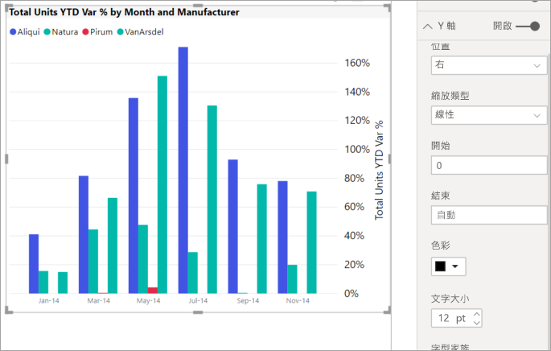
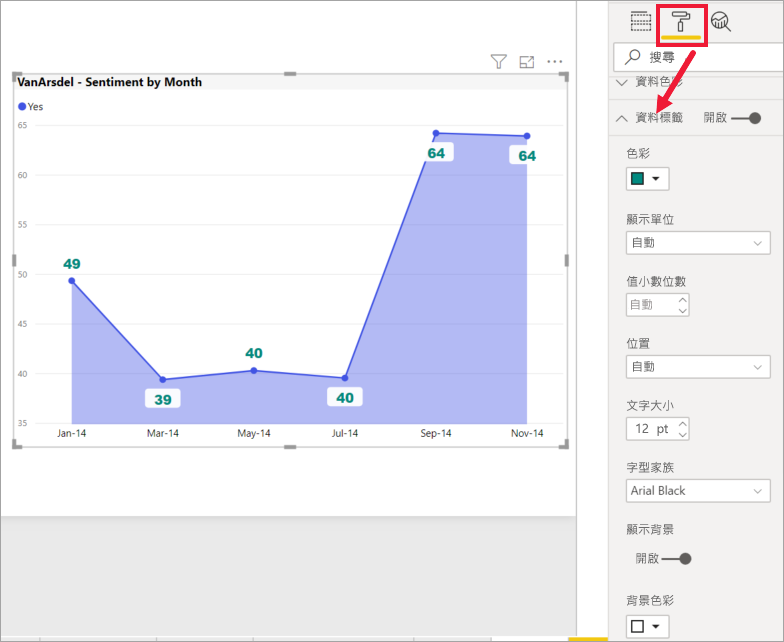

# 開始使用格式化窗格

[!INCLUDE[consumer-appliesto-nyyn](../includes/consumer-appliesto-nyyn.md)]    

如果您擁有報表的編輯權限，則有許多格式化選項可供您使用。 在 Power BI 報表中，您可以變更資料數列、資料點，甚至視覺效果背景的色彩。 您可以變更 X 軸和 Y 軸的呈現方式。 您甚至可以格式化視覺效果、圖形和標題的字型屬性。 Power BI 能讓您完全控制報表的顯示方式。

請在 Power BI Desktop 或 Power BI 服務開啟報表以開始使用。 這兩者提供近乎相同的格式化選項。 在 Power BI 服務中開啟報表時，請務必從功能表列選取 [編輯]。 

![顯示 [編輯] 選項的功能表列](media/service-getting-started-with-color-formatting-and-axis-properties/power-bi-edit.png)

當您在編輯報表期間選取視覺效果時，[視覺效果] 窗格會隨即出現。 使用此窗格來變更視覺效果。 [視覺效果] 窗格的正下方有三個圖示：[欄位] 圖示 (堆疊的橫條)、[格式] 圖示 (滾筒筆刷) 和 [分析] 圖示 (放大鏡)。 在下圖中，已選取 [欄位] 圖示 (由圖示下方的黃色列所指出)。

![已選取 [欄位] 圖示的 [視覺效果] 窗格](media/service-getting-started-with-color-formatting-and-axis-properties/power-bi-format.png)

當您選取 [格式] 時，圖示下的區域會顯示目前所選視覺效果可用的自訂。  

![已選取 [格式] 圖示的 [視覺效果] 窗格](media/service-getting-started-with-color-formatting-and-axis-properties/power-bi-format-selected.png)

您可以針對每個視覺效果自訂許多項目。 可用的選項取決於選取的視覺效果。 其中一些選項如下：

* 圖例
* X 軸
* Y 軸
* 資料色彩
* 資料標籤
* 圖形
* 繪圖區
* 標題
* 背景
* 鎖定外觀比例
* 框線
* 工具提示
* 視覺效果標題
* 圖形
* 位置    
不勝枚舉。

> [!NOTE]
>  
> 您看不到每個視覺效果類型的所有這些項目。 您選取的視覺效果會影響可用的自訂，例如，如果選取圓形圖就不會看到 X 軸，因為圓形圖沒有 X 軸。

另請注意，如果未選取任何視覺效果，圖示的位置上就會出現 [篩選]，讓您將篩選套用至頁面上的所有視覺效果。

了解如何使用 [格式化] 選項的最好方式便是實際試試看。您一律可以復原變更或是還原為預設值。 有相當大量的選項可供使用，且隨時都會新增新的選項。 我們不可能在一篇文章中描述所有格式化選項。 但為了協助您開始，讓我們一起檢閱其中幾個。 

1. 變更視覺效果中使用的色彩   
2. 套用樣式    
3. 變更軸屬性    
4. 新增資料標籤    

## 使用色彩

讓我們一步步完成自訂視覺效果色彩的必要步驟。

1. 選取要啟用的視覺效果。

2. 選取油漆滾筒圖示來開啟 [格式化] 索引標籤。[格式化] 索引標籤會顯示選取視覺效果的所有可用格式化元素。

    ![已選取 [格式化] 索引標籤的圖表](media/service-getting-started-with-color-formatting-and-axis-properties/power-bi-formatting.png)

3. 選取 [資料色彩] 來展開其可用的自訂。  

    ![已開啟 [格式化] 索引標籤並展開 [資料色彩] 的圖表](media/service-getting-started-with-color-formatting-and-axis-properties/power-bi-data-colors.png)

4. 將 [全部顯示] 變更為 [開啟]，並為直條選取不同的色彩。

    

以下是一些處理色彩上的有用提示。 接下來的畫面也會顯示下列清單中的數字，指出可以存取或變更這些有用項目的位置。

1. 不喜歡那個色彩嗎？ 沒問題，只要選取 [還原為預設值]，所有選項就會還原為預設的設定。 

2. 所有的色彩變更都不喜歡嗎？ 從 [資料色彩] 區段底部選取 [還原為預設值]，您的色彩便會還原為預設設定。 

3. 想要調色盤中沒有的色彩嗎？ 只要選取 [自訂色彩] ，然後從色譜中選擇即可。  

   ![已開啟色彩調色盤的 [資料色彩] 區段](media/service-getting-started-with-color-formatting-and-axis-properties/power-bi-color-extras.png)

對剛才的變更不興奮激動？ 請使用 **CTRL+Z** 復原，就像您以前習慣的。

## 將樣式套用到資料表
某些 Power BI 視覺效果會有 [樣式] 選項。 只要按一下，系統便會將一組完整的格式化選項同時套用到您的視覺效果。 

1. 選取資料表或矩陣以使其成為作用中。   
1. 開啟 [格式化] 索引標籤，然後選取 [樣式]。

   ![從 [格式化] 索引標籤選取 [樣式]](media/service-getting-started-with-color-formatting-and-axis-properties/power-bi-style.png)

1. 從下拉式清單選取某個樣式。 

   ![已套用 [粗體標頭亮色資料列] 的相同資料表](media/service-getting-started-with-color-formatting-and-axis-properties/power-bi-style-flashy.png)

即使在您套用樣式之後，您還是可以繼續為該視覺效果格式化屬性 (包括色彩)。

## 變更軸屬性

修改 X 軸或 Y 軸通常很有用。 其方法與處理色彩類似，您可以選取要變更的軸左邊的向下箭號圖示來修改座標軸，如下圖所示。  
![具有指向 [Y 軸] 卡片之箭頭的 [格式] 窗格](media/service-getting-started-with-color-formatting-and-axis-properties/power-bi-y-axis.png)

在下列範例中，我們已將 Y 軸格式化為：
- 將標籤移至視覺效果的右側

- 將起始值變更為零。

- 將標籤字型色彩變更為黑色

- 將標籤字型大小增加至 12

- 新增 Y 軸標題

    

您可以切換 **X 軸**或 **Y 軸**旁的選項按鈕，將軸標籤整個移除。 也可以選取 [標題] 旁邊的選項按鈕，選擇開啟或關閉軸標題。  

## 新增資料標籤    

這是我們在您開始自行探索之前，所會提供的最後一個格式化範例。  讓我們將資料標籤新增至區域圖。 

以下是「之前」的圖片。 

以下是「之後」的圖片。

我們已選取視覺效果來使其成為作用中，並開啟 [格式化] 索引標籤。我們已選取 [資料標籤] 並將其設定為 [開啟]。 然後我們將字型增加至 12，將字型系列變更為 Arial Black，將 [顯示背景] 設定為 [開啟]，然後將背景色彩設定為白色且透明度為 5%。

這只是其中幾個可能的格式化工作。 在 [編輯] 模式中開啟報表並盡情探索 [格式化] 窗格，以建立美麗且富有資訊的視覺效果。

## 後續步驟
如需詳細資訊，請參閱下列文章： 

* [共用報告](../collaborate-share/service-share-reports.md)

* [在 Power BI 中色彩格式設定的秘訣和訣竅](service-tips-and-tricks-for-color-formatting.md)  
* [設定資料表格式化的條件](../create-reports/desktop-conditional-table-formatting.md)

