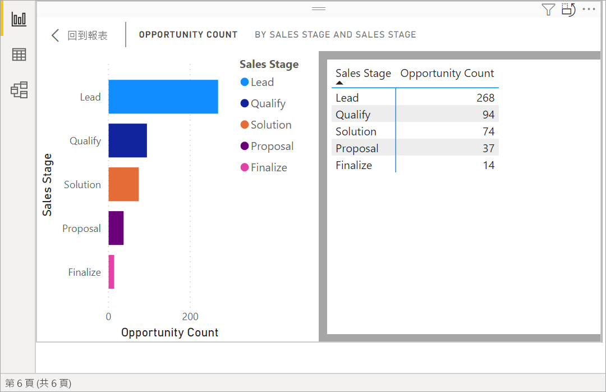
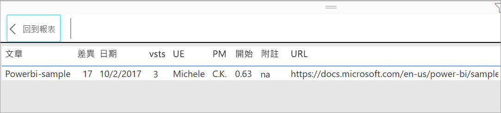

# 顯示用於建立視覺效果的資料
## 顯示資料
Power BI 視覺效果是使用您資料集中的資料所建構的。 如果您對背景資料有興趣，Power BI 可讓您「顯示」  用來建立視覺效果的資料。 當您選取 [顯示資料]  時，Power BI 會在視覺效果下方 (或旁邊) 顯示資料。

您也可以將用來建立視覺效果的資料匯出為 .xlsx 或 .csv 檔案，並在 Excel 中檢視。 如需詳細資訊，請參閱[從 Power BI 視覺效果匯出資料](power-bi-visualization-export-data.md)。

> [!NOTE]
> [顯示資料]  和 [匯出資料]  在 Power BI 服務和 Power BI Desktop 中均可使用。 但是，Power BI Desktop 提供額外一層的詳細資料。顯示記錄 [會顯示來自資料集的實際資料列](../desktop-see-data-see-records.md)  。
> 
> 

## 使用顯示資料  
1. 在 Power BI Desktop 中，選取要啟用的視覺效果。

2. 選取 [其他動作]  (...)，然後選擇 [顯示資料]  。 
    ![顯示 [顯示資料] 選項](media/service-reports-show-data/power-bi-more-action.png)

3. 根據預設，資料會顯示在視覺效果下方。
   
   

4. 若要變更方向，請從視覺效果的右上角，選取垂直版面配置  。
   
   
5. 若要將資料匯出為 .csv 檔案，請選取省略符號並選擇 [匯出資料]  。
   
    ![選取 [匯出資料]](media/service-reports-show-data/power-bi-export-data-new.png)
   
    如需將資料匯出到 Excel 的詳細資訊，請參閱[從 Power BI 視覺效果匯出資料](power-bi-visualization-export-data.md)。
6. 若要隱藏資料，請取消選取 [探索]   > [顯示資料]  。

## 使用顯示記錄
您也可以將焦點放在視覺效果中的一個資料記錄，然後鑽研到它背後的資料。 

1. 若要使用 [查看記錄]  ，選取要啟用的視覺效果。 

2. 在桌面功能區中，依序選取 [視覺效果工具]  索引標籤  >  [資料/切入]   >  [查看記錄]  。 

    ![已選取 [查看記錄] 的螢幕擷取畫面。](media/service-reports-show-data/power-bi-see-record.png)

3. 選取視覺效果上的資料點或資料列。 在此範例中，我們選取了左起第四個資料行。 Power BI 會向我們顯示此資料點的資料集記錄。

    

4. 選取 [回到報表]  返回桌面報表畫布。 

## 考量與疑難排解

- 如果功能區中的 [查看記錄]  按鈕已停用呈灰色，表示所選取的視覺效果不支援 [查看記錄]。
- 您無法在 [查看記錄] 檢視中變更資料並儲存回報表。
- 當視覺效果使用導出量值時，您無法使用 [查看記錄]。
- 當您連接到即時多維度模型 (MD) 時，不能使用 [查看記錄]。  

## 後續步驟
[從 Power BI 視覺效果匯出資料](power-bi-visualization-export-data.md)    

有其他問題嗎？ [試試 Power BI 社群](https://community.powerbi.com/)

