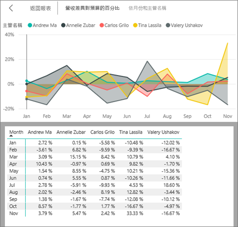
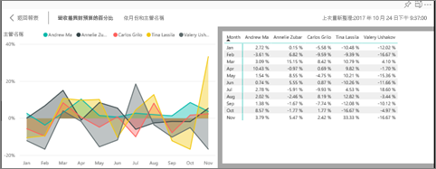

# 顯示用於建立視覺效果的資料
## 顯示資料
Power BI 視覺效果是使用您資料集中的資料所建構的。 如果您對背景資料有興趣，Power BI 可讓您「顯示」  用來建立視覺效果的資料。 當您選取 [顯示資料]  時，Power BI 會在視覺效果下方 (或旁邊) 顯示資料。

您也可以將用來建立視覺效果的資料匯出為 .xlsx 或 .csv 檔案，並在 Excel 中檢視。 如需詳細資訊，請參閱[從 Power BI 視覺效果匯出資料](power-bi-visualization-export-data.md)。

> [!NOTE]
> [顯示資料]  和 [匯出資料]  在 Power BI 服務和 Power BI Desktop 中均可使用。 但是，Power BI Desktop 提供額外一層的詳細資料。顯示記錄 [會顯示來自資料集的實際資料列](../desktop-see-data-see-records.md)  。
> 
> 

## 在 Power BI 服務中使用 [顯示資料] 
1. 在 Power BI 服務中，以[閱讀檢視或編輯檢視](../service-interact-with-a-report-in-editing-view.md)開啟報表，然後選取視覺效果。  在 Power BI Desktop 中，開啟報表檢視。
2. 若要顯示視覺效果背後的資料，請選取 [探索]   > [顯示資料]  。
   
   ![選取 [顯示資料]](media/service-reports-show-data/power-bi-show-data.png)
3. 根據預設，資料會顯示在視覺效果下方。
   
   
4. 若要變更方向，請從視覺效果右上角選取垂直版面配置 。
   
   
5. 若要將資料匯出為 .csv 檔案，請選取省略符號並選擇 [匯出資料]  。
   
    ![選取 [匯出資料]](media/service-reports-show-data/power-bi-export-data-new.png)
   
    如需將資料匯出到 Excel 的詳細資訊，請參閱[從 Power BI 視覺效果匯出資料](power-bi-visualization-export-data.md)。
6. 若要隱藏資料，請取消選取 [探索]   > [顯示資料]  。

## 後續步驟
[從 Power BI 視覺效果匯出資料](power-bi-visualization-export-data.md)    
[Power BI 報表中的視覺效果](power-bi-report-visualizations.md)    
[Power BI 報表](../consumer/end-user-reports.md)    
有其他問題嗎？ [試試 Power BI 社群](http://community.powerbi.com/)

