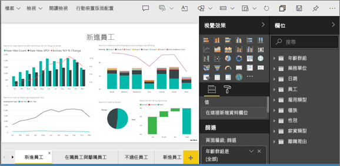
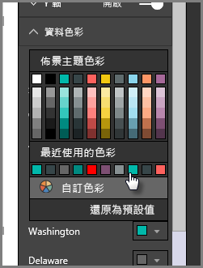
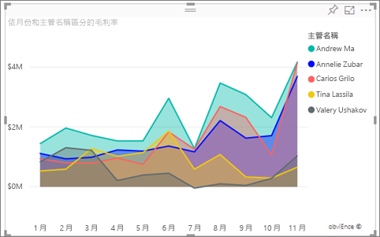
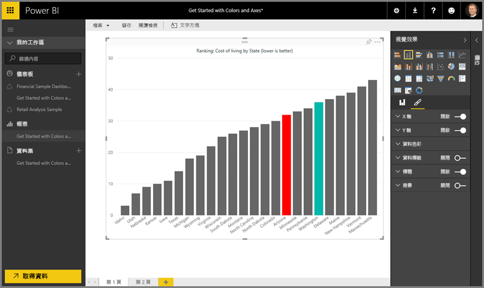
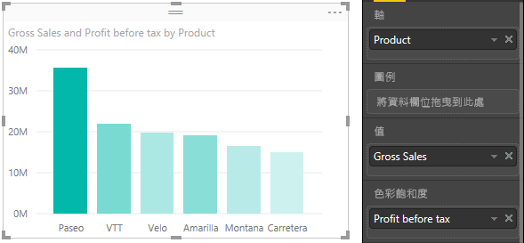
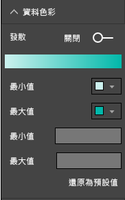
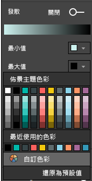
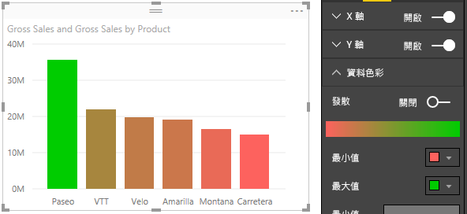
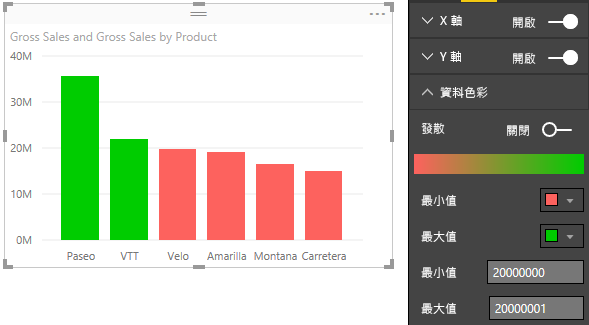

# 在 Power BI 中色彩格式化的秘訣和訣竅
Power BI 提供許多不同的方式，用來自訂您的儀表板和報表。 本文詳細說明一系列秘訣，讓您的 Power BI 視覺效果更吸引人、更加有趣，且視您的需求自訂。

這裡提供下列秘訣。 有其他絕佳的秘訣嗎？ 太棒了！ 請寄給我們，我們會考慮將您的秘訣加入這個清單。

* 變更單一資料點的色彩
* 根據數值設定圖表的色彩
* 根據欄位值設定資料點的色彩
* 自訂色階中所使用的色彩
* 使用發散色階
* 如何在 Power BI 中復原

若要進行任何變更，您必須編輯報表：從 [我的工作區]  窗格選取您的 [報表]  ，然後從頂端功能表區域選取 [編輯報表]  ，如下圖所示。 此範例使用**人力資源範例**。

![醒目提示的 [編輯報表] 報表畫布](media/service-tips-and-tricks-for-color-formatting/power-bi-edit.png)

當 [視覺效果]  窗格出現於 [報表]  畫布的右邊之後，您就已經準備好開始自訂了。

## 變更單一資料點的色彩
有時候您會想要醒目顯示一個特定的資料點。 可能是新產品上市的銷售數字，或推行新計畫之後提升的品質分數。 使用 Power BI 以及大部分視覺效果類型，您可以變更特定資料點的色彩來加以醒目顯示。

下列視覺效果會使用預設色彩，依員工來顯示銷售毛利率。 

很難看到 Annelie 的區域，因此讓我們使用色彩來更加突顯它。 以下是步驟：

展開 [資料色彩]  區段。 下列區段隨即出現。

![[格式化] 下的資料色彩選取區域](media/service-tips-and-tricks-for-color-formatting/power-bi-data-colors.png)

在此案例中，讓我們選取深而亮的色彩，且不同於 Valery 所使用的色彩。 依序選取 Annelie 色彩方塊中的向下箭號、[自訂色彩]，然後選擇亮藍色。

選取之後，Annelie 的區域便很容易與其他員工區別。 

即使您變更了視覺效果類型，然後返回，Power BI 仍會記住您的選擇，並將 [華盛頓]  保持為綠色。

您也可以變更多個資料項目的資料點色彩。 在下圖中，[亞歷桑那]  為紅色，而 [華盛頓]  仍然是綠色。

有各式各樣可以用色彩變出的花樣。 在下一節，我們要來看看漸層。

## 根據數值設定圖表的色彩
根據欄位數值來動態設定色彩，對於圖表用途很大。 這樣一來，除了用於設定長條圖的尺寸之外，您還可以顯示不同的值，並在單一圖表上顯示兩個值。 或者，您可以使用這個，醒目顯示超過 (或低於) 某個值的資料點 - 也許可以醒目顯示獲利率較低的區域。

下列章節將說明不同的方式，用來依據數值設定色彩。

## 根據值設定資料點的色彩
若要根據值變更色彩，請將您想要設定色彩的欄位拖曳到 [欄位] 窗格的 [色彩飽和度] 區域中。 在下圖中，[稅前收益] 已拖曳到 [色彩飽和度]。 如您所見，雖然 **Velo** 具有更高的**銷售毛額** (其資料行較高)，但 **Amarilla** 具有較高的**稅前收益** (其資料行的色彩飽和度更高)。

## 自訂色階中所使用的色彩
您也可以自訂用於色階的色彩。 展開 [資料色彩]  ，並查看用來視覺化資料所使用的色彩漸層。 根據預設，資料中的最小值會對應至最不飽和的色彩，而最大值則對應至最飽和的色彩。

色彩範圍會顯示在漸層列，其中顯示的範圍介於 **最小值** 和 **最大值** 的色彩值之間， **最小值** 的色彩在左側，而 **最大值** 的色彩在右側。

若要變更色階來使用不同範圍的色彩，請選取 [最小值] 或 [最大值] 旁邊的 [色彩] 下拉式清單，然後選取色彩。 下圖顯示「最大值」色彩變更為黑色，且漸層列顯示介於「最小值」與「最大值」之間的新色彩頻譜。

您也可以變更這些值對應至這些色彩的方式。 在下圖中， **最小值** 和 **最大值** 的色彩分別設定為橙色和綠色。

在第一張影像中，請注意圖表中的長條如何反映在列中的漸層；最大值為綠色，最小值為橙色，且兩者之間的每個長條顏色深淺介於綠色和橙色。

現在讓我們來看看，如果在 [最小值]  和 [最大值]  方塊中輸入數值，會發生什麼事，其中該方塊在 [最小值]  和 [最大值]  色彩選取器下方 (如下圖所示)。 讓我們把 [最小值]  設為 20,000,000，而 [最大值]  設為 20,000,001。

藉由設定這些值，漸層不再套用至 **最小值** 以下或 **最大值**以上的圖表；任何超過 **最大值** 的長條色彩皆以綠色顯示，而任何低於 **最小值** 的長條皆以紅色顯示。

## 使用發散色階
有時候您的資料可能會有自然發散色階。 例如溫度範圍在冰點有自然的中心，而獲益率分數有自然的中點 (零)。

若要使用發散色階，請滑動 [發散] 滑桿至 [開啟]。 當 [發散] 設為開啟後，另一個色彩選取器和值的方塊隨即出現，皆稱為**中心**，如下圖所示。

當 [發散]  滑桿設為開啟後，您可以分別設定 [最小值] 、[最大值]  和 [中心]  的色彩。 在下圖中， [中心]  設為 1，因此值超過 1 的列是綠色漸層，而低於 1 的長條是紅色。

## 如何在 Power BI 中復原
如同許多其他 Microsoft 服務和軟體，Power BI 提供簡單的方法，用來復原您的上一個命令。 例如，讓我們假設您變更資料點或一系列資料點的色彩，但您不喜歡視覺效果中出現的色彩。 您不記得之前所用的色彩了，但知道您想要回復該色彩！

若要 **復原** 上一個動作，或最後幾個動作，您只需要：

- 輸入 CTRL+Z

## 意見反應
您有想要分享的秘訣嗎？ 請寄給我們，我們會考慮將您的秘訣加入這裡。

>[!NOTE]
>當選取 [格式] 圖示時，Power BI Desktop 也會提供這些可用的色彩、軸和相關的自訂項目。

## 後續步驟
[開始使用色彩格式和軸屬性](service-getting-started-with-color-formatting-and-axis-properties.md)

