# 發佈給外部來賓使用者使用 Azure Active Directory B2B 的 Power BI 內容

**摘要：** 這是技術白皮書概述如何將內容發佈到組織外部的使用者使用 Azure Active Directory 企業對企業 (Azure AD B2B) 整合。

**寫入器：** Lukasz Pawlowski，Kasper de Jonge

**技術檢閱者：** Adam Wilson、 小看它們 Liu、 Qian Liang、 Sergei Gundorov、 Jacob Grimm、 Adam Saxton、 Maya Shenhav、 Nimrod Shalit，Elisabeth Olson

> [!NOTE]
> 您可選取瀏覽器的 [列印]，然後選取 [儲存為 PDF] 來儲存或列印本白皮書。

## 簡介

Power BI 可讓組織其企業的 360 度檢視，並讓每個人都在這些組織大刀使用資料做出明智的決策。 許多這些組織都有強式和受信任的關係，與外部合作夥伴，用戶端和約聘員工。 這些組織需要提供安全存取 Power BI 儀表板和報表，以在這些外部的協力廠商的使用者。

Power BI 與整合[Azure Active Directory 企業對企業 (Azure AD B2B)](https://docs.microsoft.com/azure/active-directory/b2b/what-is-b2b)到允許安全地散發 Power BI 組織 – 外部來賓使用者的內容，同時仍然保有控制和管理存取權內部資料。

這份白皮書涵蓋了所有所需的細節來了解與 Azure Active Directory B2B 的 Power BI 的整合。 我們將討論其最常見的使用情況、 安裝、 授權以及資料列層級安全性。

> [!NOTE]
> 在本白皮書中，我們將為 Azure AD 的 Azure Active Directory 和 Azure Active Directory 企業對企業與 Azure AD B2B。

## 案例

Contoso 是汽車製造商和適用於許多不同的供應商提供與所有元件、 教材，以及執行其製造作業所需服務的使用者。 Contoso 想要簡化其供應鏈物流和計劃，以使用 Power BI 來監視其供應鏈的關鍵效能度量。 Contoso 想要與外部的供應鏈夥伴 analytics 共用安全且易於管理的方式。

Contoso 可以啟用下列使用 Power BI 和 Azure AD B2B 的外部使用者體驗。

### 每個項目共用的臨機操作

Contoso 適用於讓建置 Contoso 汽車的 radiators 供應商。 通常，需要最佳化使用來自 Contoso 的汽車的所有資料 radiators 的可靠性。 Contoso 的分析師與工程師，供應商共用散熱可靠性報表使用 Power BI。 工程師會收到一封電子郵件，若要檢視報表的連結。

如上面所述，這個特定的共用是由商務使用者在需要時執行。 Power BI 所傳送給外部使用者的連結已連結的 Azure AD B2B 邀請的連結。 當外部使用者開啟連結時，會要求他們加入 Contoso 的 Azure AD 組織為來賓使用者。 在接受邀請後，連結會開啟特定報表或儀表板。 Azure Active Directory 管理員委派邀請組織的外部使用者的權限，並選擇這些使用者可以做什麼的這份文件的 [治理] 區段中所述，它們會接受邀請之後。 Contoso 分析師可以邀請來賓使用者，只是因為 Azure AD 系統管理員允許該動作和 Power BI 系統管理員允許使用者邀請來賓，對 Power BI 租用戶設定中檢視內容。

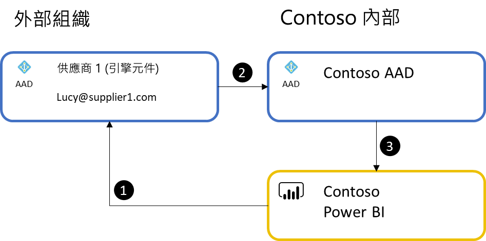

1. 此程序開始與外部使用者共用儀表板或報表的 Contoso 內部的使用者。 如果外部使用者不是已經來賓在 Contoso 的 Azure AD 中，它們均受邀。 包含至 Contoso 的 Azure 邀請的電子郵件地址傳送電子郵件是 AD
2. 收件者接受邀請給 Contoso 的 Azure AD 和新增為來賓使用者在 Contoso 的 Azure AD。
3. 收件者重新導向至 Power BI 儀表板、 報表或應用程式，這是唯讀的使用者。

處理程序會被視為臨機操作，因為在 Contoso 的商務使用者執行邀請有更多的動作視其商業用途。 項目共用的每一個都是外部使用者可以存取的單一連結檢視的內容。

一旦已邀請外部使用者存取 Contoso 資源，陰影帳戶可能在 Contoso Azure AD 中建立它們，它們不需要再次邀請。  第一次嘗試存取 Contoso 資源，像是 Power BI 儀表板，會經歷同意程序，兌換邀請。  如果沒有完成同意，就無法存取任何 Contoso 的內容。  如果他們有兌換其邀請，透過提供原始連結的問題，Azure AD 系統管理員可以重新傳送特定的邀請，才能兌換連結。

### 每個項目共用計劃

Contoso 會搭配執行可靠性分析 radiators 轉包商。 轉包商有一群 10 人需要存取 Contoso 的 Power BI 環境中的資料。 為 Contoso Azure AD 系統管理員是涉及邀請所有使用者，並處理任何新增/變更為轉包商異動的人員。 Azure AD 系統管理員會在轉包商的所有員工建立的安全性群組。 使用安全性群組，Contoso 的員工可以輕鬆地管理報表的存取權，並確保所有必要的轉包商的人員可以存取所有必要的報表、 儀表板和 Power BI 應用程式。 Azure AD 系統管理員也可以避免牽涉到在邀請程序完全委派信任的員工在 Contoso 或轉包商的 「 邀請 」 權限，以確保及時的人員選擇管理。

某些組織需要更充分掌控加入外部使用者時，許多使用者在外部組織或許多外部組織邀請。 在這些情況下，設定共用的計劃可用來管理共用，來強制執行組織的原則，以及甚至是委派至受信任的個人，以邀請和管理外部使用者的權限的小數位數。 Azure AD B2B 支援直接傳送計劃性的邀請[IT 系統管理員在 Azure 入口網站](https://docs.microsoft.com/azure/active-directory/b2b/add-users-administrator)，或透過[使用邀請管理員 API 的 PowerShell](https://docs.microsoft.com/azure/active-directory/b2b/customize-invitation-api)一組使用者可以在其中一個邀請，其中動作。 使用計劃性邀請方法，組織可以控制誰可以邀請使用者，並實作核准程序。 進階 Azure AD 功能，例如動態群組可讓您輕鬆自動維護安全群組成員資格。

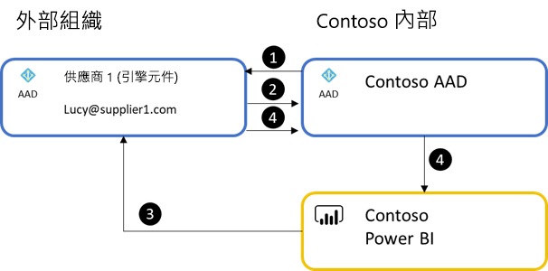

1. IT 系統管理員邀請來賓使用者以手動方式或透過 API 提供 Azure Active Directory 與處理程序顆星
2. 使用者接受邀請的組織。
3. 一旦使用者接受邀請，Power BI 中的使用者可以與外部使用者或它們位於的安全性群組共用報表或儀表板。 就像 Power BI 中的一般共用外部使用者會收到電子郵件，內含項目的連結。
4. 當他們在其目錄中的驗證 連結會傳遞至 Contoso 的外部使用者存取的 Azure AD，而且用來存取 Power BI 內容。

### 臨機操作或計劃共用 Power BI 應用程式

Contoso 有一組報表和儀表板，他們需要一個或多個供應商與共用。 若要確保所有必要的外部使用者擁有存取此內容，它會封裝成 Power BI 應用程式。 直接到應用程式存取清單，或透過安全性群組，可能會新增外部使用者。 有人在 Contoso 然後會傳送至所有外部的使用者，例如在電子郵件的應用程式 URL。 當外部使用者開啟連結時，會看到在單一的所有內容容易瀏覽體驗。

使用 Power BI 應用程式，可讓 Contoso 能夠針對其供應商建置 BI 入口網站輕鬆。 一個單一的存取清單控制存取減少浪費的時間檢查和設定項目層級權限的所有必要內容。 Azure AD B2B 會維護使用供應商的原生的身分識別，讓使用者不需要額外的登入認證的安全性存取權。 如果使用計劃性邀請使用安全性群組，應用程式的存取管理，人員旋轉或移出專案已經過簡化。 中的成員資格群組，以手動方式或利用[動態群組](https://docs.microsoft.com/azure/active-directory/b2b/use-dynamic-groups)，以便從供應商的所有外部使用者會自動新增至適當的安全性群組。

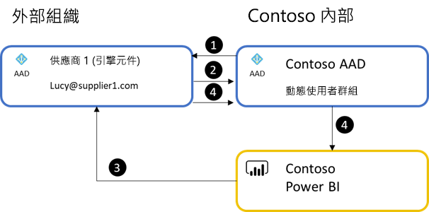

1. 在程序開始透過 Azure 入口網站或 PowerShell 的 Contoso 的 Azure AD 組織受邀的使用者
2. 使用者可以新增到使用者群組，Azure AD 中。 可以使用靜態或動態使用者群組，但動態群組，協助減少手動工作。
3. 外部使用者可以存取 Power BI 應用程式透過使用者群組。 URL 應直接傳送到外部的使用者，或放在網站上的應用程式他們擁有存取權。 Power BI 會盡力含有應用程式連結的電子郵件傳送給外部使用者，但使用時可以變更其成員資格的使用者群組，Power BI 並不會傳送給所有的外部使用者透過使用者群組管理。
4. 當外部使用者存取 Power BI 應用程式的 URL 時，他們會驗證由 Contoso 的 Azure AD 中，使用者安裝應用程式和使用者可以看到所有包含的報表與儀表板應用程式內。

應用程式也會有一項獨特功能，可讓應用程式作者，讓使用者登入時便可安裝自動為使用者、 應用程式。 這項功能只會自動安裝的外部使用者已經是 Contoso 的組織發行或更新應用程式時的一部分。 因此，最適合使用計劃性的邀請方法時，用，並取決於應用程式正在發行或更新之後會在使用者新增至 Contoso 的 Azure AD。 外部使用者一律可以安裝應用程式使用的應用程式連結。

### 註解和跨組織訂閱內容

當 Contoso 會繼續使用它的轉包商或供應商，外部工程師需要與 Contoso 的分析師密切合作。 Power BI 提供數個共同作業功能，幫助使用者溝通有關其可以取用的內容。 儀表板註解 （和即將報告 註解），可讓使用者討論他們會看到並詢問問題的報表作者與通訊的資料點。

目前，外部來賓使用者可以參與留下註解和讀取回覆註解。 不過，不同於內部的使用者，來賓使用者不能是@mentioned並不會收到通知，他們已收到的註解。 在本文撰寫之際，來賓使用者無法使用 Power BI 中的 [訂用帳戶] 功能。 在即將推出的版本中，將會提高這些限制和來賓使用者會收到一封電子郵件時的註解@mentions它們，或其包含在 Power BI 中內容的連結的電子郵件傳遞的訂用帳戶的時機。

### 在 Power BI 行動裝置應用程式中存取內容

在即將推出的版本中，當 Contoso 的使用者共用報表或儀表板與其外部的來賓對應項目，則 Power BI 會將傳送電子郵件通知的來賓。 當 guest 使用者開啟報表或儀表板，其行動裝置上的連結時，內容會以原生 Power BI 行動應用程式在其裝置上開啟，如果安裝。 來賓使用者接著可以在外部的租用戶，並回到其本身的內容，從其主租用戶，與他們共用的內容之間瀏覽。

> [!NOTE]
> 來賓使用者無法開啟 Power BI 行動裝置應用程式，並立即瀏覽至外部租用戶，他們必須開始外部租用戶中的項目連結。 描述常見的因應措施[散發之父組織的 Power BI 中的內容連結](#distributing-links-to-content-in-the-parent-organizations-power-bi)本文件稍後的章節。

### 跨組織編輯和管理 Power BI 內容

Contoso 及其供應商和轉包商日益密切合作。 通常轉包商的分析師需要額外度量資訊或資料的視覺效果可以加入至 Contoso 有與他們共用的報表。 資料應該位於 Contoso 的 Power BI 租用戶，但外部使用者應該能夠編輯、 建立新的內容，以及甚至是將它散發給適當的人員。

Power BI 會提供選項，可讓**外部來賓使用者可以編輯和管理內容**組織中。 根據預設，外部使用者擁有唯讀的耗用量導向經驗。 不過，這項新設定可讓 Power BI 系統管理員，若要選擇哪一個外部的使用者可以編輯和管理自己組織內的內容。 之後，外部使用者可以編輯儀表板的報表、 發行或更新應用程式、 工作區的工作，並連線到他們有權使用的資料。

區段啟用外部使用者，來編輯和管理 Power BI 中的內容在本文件稍後將詳細說明此案例。

## 使用 Power BI 和 Azure AD B2B 的組織關係

組織內部的 Power BI 的所有使用者時，沒有需要使用 Azure AD B2B。 不過，當兩個或多個組織想要在資料與深入解析上共同作業，Power BI 支援 Azure AD b2b 變得輕鬆又便宜若要這樣做。

以下是發生通常很適合用於在 Power BI 中的 Azure AD B2B 樣式跨組織共同作業的組織結構。 Azure AD B2B 的運作方式也會在大部分的情況下，但在某些情況下常見涵蓋在本文結尾處的替代方法是值得考慮。

### 案例 1:組織之間的直接共同作業

其散熱供應商的 Contoso 的關聯性是組織之間的直接共同作業的範例。 因為在 Contoso 有相對較少的使用者，而且需要使用 Azure AD B2B 的存取權散熱可靠性的詳細資訊，其供應商基礎的外部共用是理想。 很容易使用且容易管理。 這也是常見的模式，在諮詢服務顧問可能要建置組織的內容。

一般而言，此共用，就會發生一開始使用臨機操作每個項目共用。 不過，當小組成長或關聯性加深，計劃中的每個項目共用方法會變得的慣用的方法，以降低管理負擔。 此外，臨機操作或計劃共用的 Power BI 應用程式、 Commenting 和跨組織訂閱的內容，在行動裝置應用程式內容的存取權可以會進入播放，以及跨組織編輯和管理 Power BI 內容。 重要的是，如果這兩個組織的使用者有其各自的組織中的 Power BI Pro 授權，他們就可以在其他的 Power BI 環境中使用這些 Pro 授權。 這會提供有利授權，因為提出邀請的組織可能不需要支付外部使用者的 Power BI Pro 授權。 這在本文件稍後的 [授權] 區段中詳細討論。

### 案例 2:父代及其分公司或關係企業

某些組織結構就比較複雜，包括部分或全部擁有的子公司、 關係的企業或受管理的服務提供者關聯性。 這些組織擁有控股公司，例如父組織，但基礎組織運作以自主，有時在不同區域的需求。 這會導致每個擁有自己的 Azure AD 環境和個別的 Power BI 租用戶的組織。

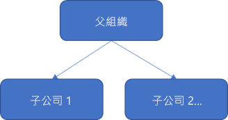

在此結構中，之父組織通常需要將其子公司標準化的深入解析。 一般而言，此共用，就會發生使用臨機操作或計劃共用 Power BI 應用程式方法中所示下圖中，因為它可讓標準授權內容散發給廣大的觀眾。 實際上會使用本文件稍早所述的所有案例的組合。

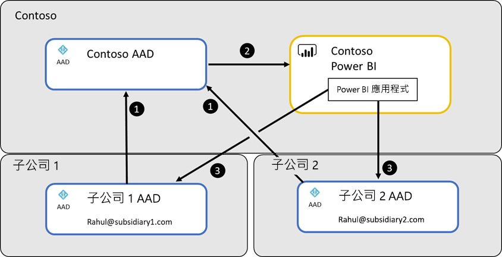

這會遵循下列程序：

1. 從每個分公司的使用者都邀請到 Contoso 的 Azure AD
2. 然後讓這些使用者存取所需的資料發行的 Power BI 應用程式
3. 最後，使用者開啟應用程式透過它們已經被指定來查看報表的連結

在此結構的組織所面對幾項重要挑戰：

- 如何發佈之父組織的 Power BI 中的內容連結
- 如何允許存取資料來源之父組織所裝載的分公司使用者

#### 散發之父組織的 Power BI 中的內容連結

三種方法常用來散發內容的連結。 第一個和大多數的 basic 會將此連結傳送給必要使用者應用程式，或將它放在從中開啟 SharePoint Online 網站。 使用者可以加入書籤的所需的資料更快速地存取瀏覽器中的連結。

第二種方法依賴的跨組織編輯和管理 Power BI 內容的功能。 之父組織可讓使用者從分公司存取其 Power BI，並控制他們可以透過權限存取。 這可讓存取 Power BI 首頁，分公司的使用者會看到它們共用父組織的租用戶中的內容的完整清單。 然後父組織的 Power BI 環境的 URL 會提供給分公司的使用者。

最後一個方法會使用每個分公司的 Power BI 租用戶內建立 Power BI 應用程式。 Power BI 應用程式包含儀表板[外部連結 選項設定的圖格](https://docs.microsoft.com/power-bi/service-dashboard-edit-tile#hyperlink)。 當使用者按下 [] 圖格時，便會進入適當的報表、 儀表板或在父組織的 Power BI 中的應用程式。 這個方法會有額外的好處應用程式可以自動安裝的分公司中的所有使用者，並會提供給他們，只要登入其自己的 Power BI 環境。 這種方法的好處是，它適用於 Power BI 行動應用程式，而且可以原生開啟連結。 您也可以結合這與第二種方法，若要啟用 Power BI 環境之間輕鬆切換。

#### 可讓分公司的使用者存取之父組織所裝載的資料來源

通常在分公司的分析師需要建立自己 analytics 中使用之父組織所提供的資料。 在此情況下，雲端資料來源常用來解決問題。

第一種方法會利用[Azure Analysis Services](https://docs.microsoft.com/azure/analysis-services/analysis-services-overview)來建置企業級資料倉儲提供分析師的需求，跨父系和其子公司所示的下列映像。 Contoso 可以主控資料，並使用功能，例如資料列層級安全性，以確保每個分公司中的使用者可以存取他們的資料。 在每個組織的分析師可以透過 Power BI Desktop 中存取資料倉儲，並將產生的分析發行至其個別的 Power BI 租用戶。

第二種方法會利用[Azure SQL Database](https://azure.microsoft.com/services/sql-database/)來建置關聯式資料倉儲來提供資料的存取權。 這樣的運作方式類似 Azure Analysis Services 的方法，但某些功能，例如資料列層級的安全性可能就很難部署和維護分公司之間。

但是到目前為止最常見的上述條件，也是可行的更複雜的方法。

### 案例 3:合作夥伴之間的共用的環境

Contoso 可以輸入到與競爭對手共同建置共用的組件列中的 汽車，而是分散在不同的品牌或不同區域中的車輛的合作關係。 這需要大量的共同作業和資料、 智慧和分析的 co-ownership 跨組織。 此結構也很常見諮詢服務產業的顧問小組可能會在其中專案為基礎的分析用戶端。

在實務上，這些結構會很複雜下, 圖所示，而且需要維護的人員。 若要能夠影響這個結構依賴編輯跨組織及管理 Power BI 內容的功能因為它可讓組織能夠重複使用其個別的 Power BI 租用戶所購買的 Power BI Pro 授權。

若要建立共用的 Power BI 租用戶，Azure Active Directory 必須建立，且至少一個 Power BI Pro 的使用者帳戶必須具有 active directory 中的使用者購買。 這位使用者邀請到共用的組織必要的使用者。 重要的是，在此案例中，Contoso 的使用者會被視為外部使用者時它們會共用組織的 Power BI 中運作。

此程序如下所示：

1. 共用的組織會建立為新的 Azure Active Directory 和新的組織中建立至少一個使用者帳戶。 該使用者應該已指派給他們的 Power BI Pro 授權。
2. 這位使用者再建立 Power BI 租用戶，並邀請夥伴組織 Contoso 與必要的使用者。 使用者也會建立 Azure Analysis Services 等任何共用的資料資產。 Contoso 和合作夥伴的使用者可以存取共用的組織的 Power BI 作為來賓使用者。 如果允許編輯和管理 Power BI 中的內容的外部使用者可以使用 Power BI 的首頁、 使用工作區中上, 傳或編輯內容和共用報表。 一般而言，所有共用的資產儲存及共用組織的存取。
3. 根據如何合約當事人同意以共同作業，可能會針對每個組織來開發自己專屬的資料和分析使用共用的資料倉儲資產。 它們可以散發到其各自的內部使用者使用其內部的 Power BI 租用戶。

### 案例 4:發佈到數百或數千個外部合作夥伴

雖然 Contoso 建立散熱可靠性報表中的一家供應商，立即 Contoso 想要建立數百個供應商的一組標準化的報告。 這可讓 Contoso 能夠確保所有的供應商擁有所需來改良或修正製造缺失的分析。

當組織需要將標準化的資料與深入解析，許多外部使用者/組織時，他們可以使用臨機操作或計劃共用 Power BI 應用程式案例來建置 BI 入口網站，快速而廣泛的開發成本。 這類入口網站中使用 Power BI 應用程式的建置程序涵蓋案例研究：建置 BI 入口網站中使用 Power BI + Azure AD B2B – 逐步指示，本文件稍後的資訊。

這個案例的一般變數時，組織會嘗試與取用者，分享深入解析，尤其是當想要使用 Azure B2C 與 Power BI。 Power BI 原生支援 Azure B2C。 如果您正在評估選項，在此情況下的，考慮使用替代的選項 2 中常見的替代方法在本文件稍後一節。

## 案例研究：建置 BI 入口網站中使用 Power BI + Azure AD B2B – 逐步指示

與 Azure AD B2B 的 power BI 的整合可讓 Contoso 順暢地輕鬆提供安全存取其 BI 入口網站中的來賓使用者。 Contoso 可以設定這三個步驟：

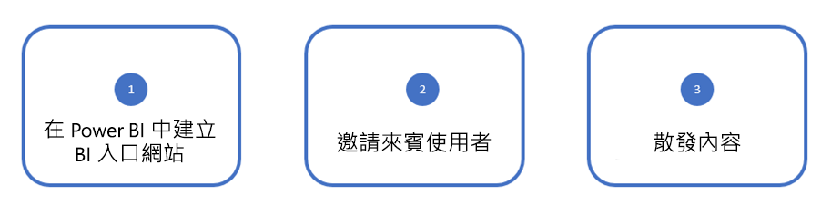

1. 在 Power BI 中建立 BI 入口網站

    Contoso 的第一個工作是在 Power BI 中建立其 BI 入口網站。 Contoso 的商務智慧入口網站將會包含特殊用途儀表板和報表，將可供許多內部與來賓使用者的集合。 如此一來在 Power BI 中的建議的方式是建置的 Power BI 應用程式。 深入了解[在 Power BI 中的應用程式](https://powerbi.microsoft.com/blog/distribute-to-large-audiences-with-power-bi-apps/)。

- Contoso 的 BI 小組會在 Power BI 中建立應用程式工作區

    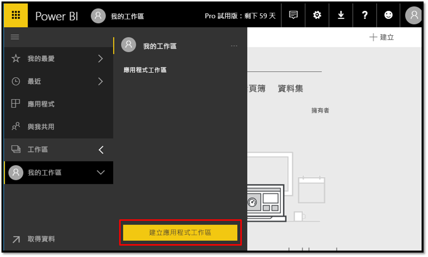
    

- 其他作者會新增至工作區

    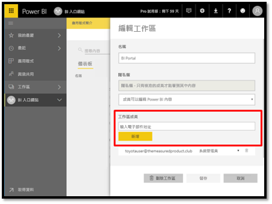

- 在工作區內建立內容

    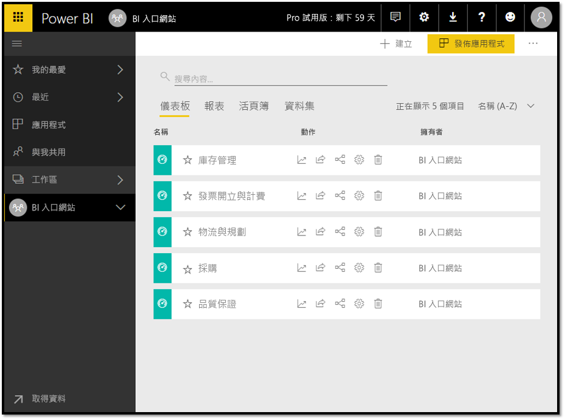

    現在，內容建立應用程式工作區中，Contoso 就邀請夥伴組織中的來賓使用者，若要使用此內容。

2. 邀請來賓使用者

    有兩種方法讓 Contoso 能夠邀請來賓使用者到其在 Power BI 中的 BI 入口網站：

    * 計劃性的邀請
    * 臨機操作的邀請

    **計劃性的邀請**

    在此方法中，Contoso 會邀請來賓使用者，事先其 Azure ad，然後再將 給他們的 Power BI 內容。 Contoso 可以邀請來賓使用者，從 Azure 入口網站或使用 PowerShell。 以下是可邀請來賓使用者，從 Azure 入口網站的步驟：

    - Contoso 的 Azure AD 系統管理員會瀏覽至**Azure 入口網站 > Azure Active Directory > 使用者和群組 > 的所有使用者 > 新增來賓使用者**

    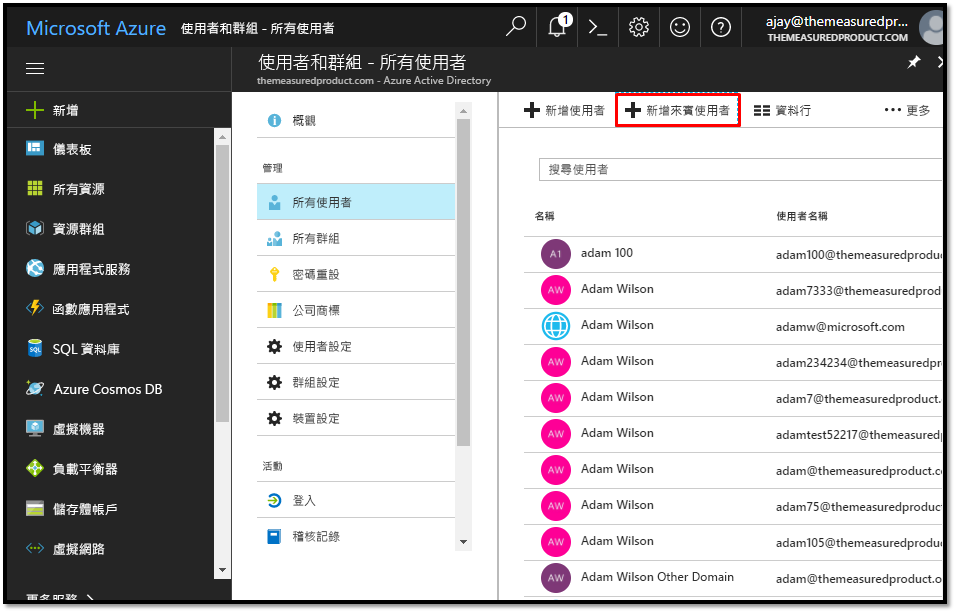

    - 新增來賓使用者邀請訊息，然後按一下 邀請

    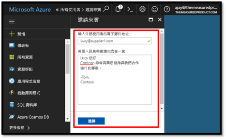

    > [!NOTE]
    > 若要邀請來賓使用者，從 Azure 入口網站，您需要 Azure Active Directory，您的租用戶的系統管理員。

    如果 Contoso 想要邀請多位來賓使用者，其做法使用 PowerShell。 Contoso 的 Azure AD 系統管理員會將所有來賓使用者的電子郵件地址儲存在 CSV 檔案。 以下是[Azure Active Directory B2B 共同作業程式碼與 PowerShell 範例](https://docs.microsoft.com/azure/active-directory/b2b/code-samples)和指示。

    之後的邀請來賓使用者會收到含有邀請連結的電子郵件。

    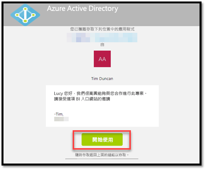

    一旦來賓使用者按一下連結時，他們可以存取在 Contoso Azure AD 租用戶中的內容。

    > [!NOTE]
    > 您可變更使用 Azure AD 品牌功能，如所述的邀請電子郵件的版面配置[此處](https://docs.microsoft.com/azure/active-directory/active-directory-b2b-invitation-email)。

    **臨機操作的邀請**

    如果 Contoso 不知道所有它要事先邀請的來賓使用者嗎？ 或者，如果 contoso BI 入口網站中建立分析師想要將內容發佈到來賓使用者自己？ 我們也支援此案例在 Power BI 中與臨時邀請。

    分析師可以只將外部使用者新增至應用程式的存取清單時它們會將其發行。 來賓使用者取得邀請，一旦他們接受它，它們會自動重新導向至 Power BI 內容。

    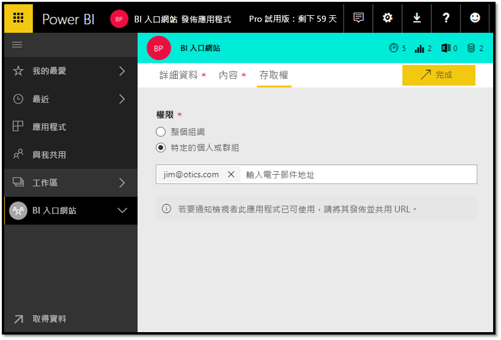

    > [!NOTE]
    > 邀請所需只有外部使用者受邀至您的組織第一次。

3. 散發內容

    現在，Contoso 的 BI 小組有 BI 入口網站中建立，而受邀來賓使用者，他們可以散發給其使用者其入口網站讓來賓使用者存取應用程式，然後發佈它。 Power BI 會自動完成先前新增至 Contoso 租用戶的來賓使用者的名稱。 臨機操作邀請其他來賓使用者也可以在此時加入。

    > [!NOTE]
    > 如果您可以使用安全性群組來管理外部使用者存取應用程式，使用計劃性邀請的方式，並直接與必須存取它的每個外部使用者共用的應用程式連結。 否則，外部使用者可能無法安裝，或從應用程式內檢視內容。 _

    來賓使用者會收到電子郵件應用程式的連結。

    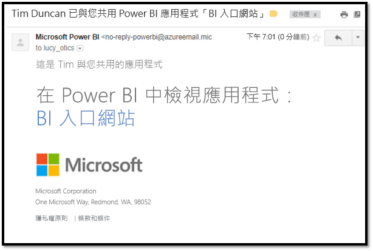

    按一下這個連結，來賓使用者會要求使用自己的組織身分識別進行驗證。

    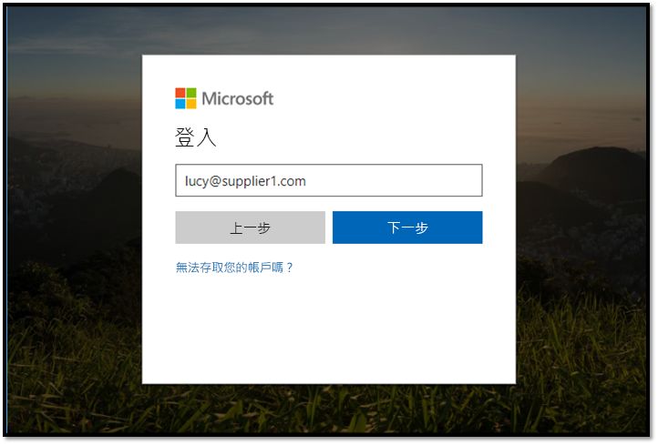

    一旦成功驗證，它們會重新導向至 Contoso 的 BI 應用程式。

    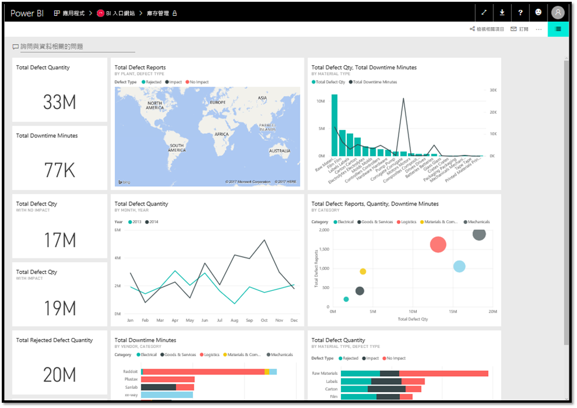

    來賓使用者接著可以藉由按一下電子郵件中的連結，或是加上書籤的連結取得至 Contoso 的應用程式。 Contoso 也可以讓它更容易來賓使用者新增至任何現有的外部網路入口網站的來賓使用者已使用此連結。

4. 後續步驟

    使用 Power BI 應用程式和 Azure AD B2B，Contoso 就可以快速建立 BI 入口網站，供其供應商，以無程式碼的方式。 這可大幅簡化散發給需要它的所有供應商的標準化的分析。

    雖然此範例會示範如何在單一的一般報表可以分配給供應商，Power BI 即可更進一步。 若要確保每個夥伴會看到僅與相關的資料本身，資料列層級安全性可以加入輕鬆的報表和資料模型。 本文件稍後的外部夥伴區段的資料安全性說明此程序的詳細資料。

    通常個別報表和儀表板需要要內嵌到現有的入口網站。 這也即可重複使用的許多技巧的範例所示。 不過，在這些情況下，它可能是內嵌的報表或儀表板直接從工作區的工作變得更容易。 邀請和指派的安全性權限的程序需要使用者保持不變。

## 深入探討：有何 Lucy 從 Supplier1 能夠從 Contoso 的租用戶存取 Power BI 內容？

既然我們已經看到如何 Contoso 是能夠順暢地散發給夥伴組織中的來賓使用者的 Power BI 內容，讓我們看看這在幕後的運作方式。

Contoso 的受邀[ lucy@supplier1.com ](mailto:lucy@supplier1.com)的目錄中，Azure AD 之間建立連結[ Lucy@supplier1.com ](mailto:Lucy@supplier1.com)和 Contoso Azure AD 租用戶。 此連結可讓 Azure AD 知道Lucy@supplier1.com可以存取 Contoso 租用戶中的內容。

當 Lucy 嘗試存取 Contoso 的 Power BI 應用程式時，Azure AD 會驗證 Lucy 可以存取 Contoso 租用戶，並提供 Power BI 的權杖，指出 Lucy 已經過驗證，若要存取 Contoso 租用戶中的內容。 Power BI 會使用此權杖授權，並確保 Lucy 確認可存取 Contoso 的 Power BI 應用程式。

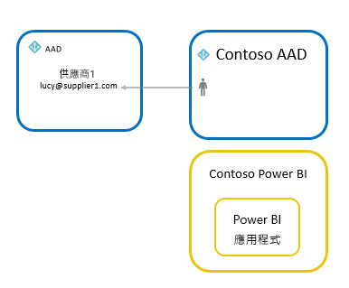

使用 Azure AD B2B 的 power BI 的整合會使用所有公司的電子郵件地址。 如果使用者沒有 Azure AD 身分識別，系統可能會提示他們建立一個。 下圖顯示詳細的流程：

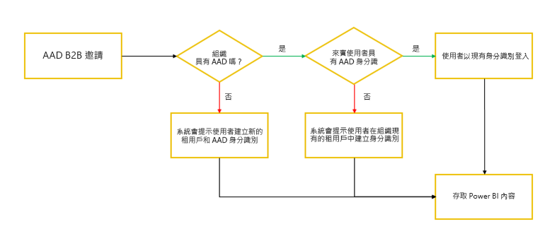

請務必以辨識會使用 Azure AD 帳戶，或建立的外部合作對象的 Azure AD 中，這將會讓它可能 Lucy 可以使用自己的使用者名稱和密碼，而她的認證將會自動停止使用其他租用戶時她當她的組織也會使用 Azure AD 時，離開公司。

## 授權

Contoso 可以選擇三種方法的其中一個授權來賓使用者從供應商與合作夥伴組織能夠存取 Power BI 內容。

> [!NOTE]
> _Azure AD B2B 的免費層就足以使用 Power BI 與 Azure AD B2B。某些進階的 Azure AD B2B 功能，例如動態群組需要額外的授權。請參閱 Azure AD B2B 文件以取得其他資訊：_ [_https://docs.microsoft.com/azure/active-directory/b2b/licensing-guidance_](https://docs.microsoft.com/azure/active-directory/b2b/licensing-guidance)

### 方法 1:Contoso 使用 Power BI Premium

使用此方法時，Contoso 購買 Power BI Premium 容量，並將其 BI 入口網站的內容指派給這個容量。 這可讓來自夥伴組織的來賓使用者，若要存取 Contoso 的 Power BI 應用程式，而不需要任何 Power BI 授權。

外部使用者也受到使用 Power BI Premium 中的內容時，唯一的體驗提供給 Power BI 中的 「 免費 」 使用者的耗用量。

Contoso 也可以利用其他 Power BI premium 其應用程式的功能增加重新整理頻率、 專用的容量和大型模型大小等。

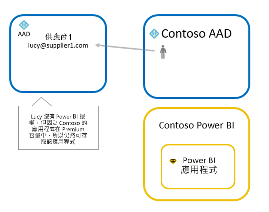

### 方法 2:Contoso 會將 Power BI Pro 授權指派給來賓使用者

使用此方法時，Contoso pro 會將授權指派給來賓使用者從夥伴組織，– 這可以從 Contoso 的 Microsoft 365 系統管理中心。 這可讓來自夥伴組織的來賓使用者，而不必自行購買授權存取 Contoso 的 Power BI 應用程式。 這可以是適用於與外部使用者的組織尚未尚未採用 Power BI 共用項目。

> [!NOTE]
> _Contoso 的 pro 授權適用於來賓使用者存取 Contoso 租用戶中的內容時，只有。Pro 授權，讓不在 Power BI Premium 容量中內容的存取權。不過，具有 Pro 授權的外部使用者會根據預設限制為使用唯一的體驗。這可以藉由使用中所述的方法是變更__讓外部使用者可以編輯和管理 Power BI 中的內容__本文件稍後的章節。_

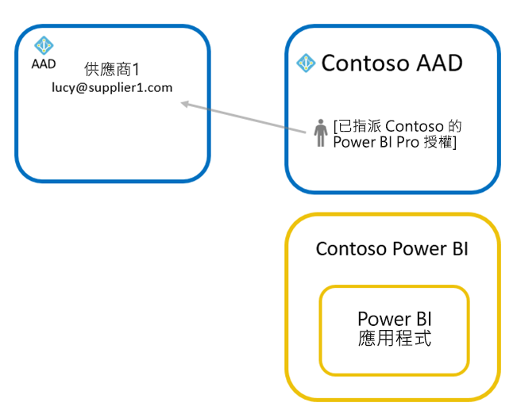

### 方法 3:來賓使用者攜帶自己的 Power BI Pro 授權

使用此方法時，供應商 1 會將 Power BI Pro 授權指派給 Lucy。 然後，他就可以存取 Contoso 的 Power BI 應用程式，使用此授權。 因為 Lucy 可以從自己的組織使用她的 Pro 授權，存取外部的 Power BI 環境時，這種方法有時稱為_自備授權_(BYOL)。 如果這兩個組織使用 Power BI，這會提供有利的授權，整體的分析解決方案，並將授權指派給外部使用者的額外負荷降到最低。

> [!NOTE]
> _提供給 Lucy 供應商 1 pro 授權適用於任何地方 Lucy 一定正來賓使用者的 Power BI 租用戶。Pro 授權，讓不在 Power BI Premium 容量中內容的存取權。不過，具有 Pro 授權的外部使用者會根據預設限制為使用唯一的體驗。這可以藉由使用中所述的方法是變更__讓外部使用者可以編輯和管理 Power BI 中的內容__本文件稍後的章節。_

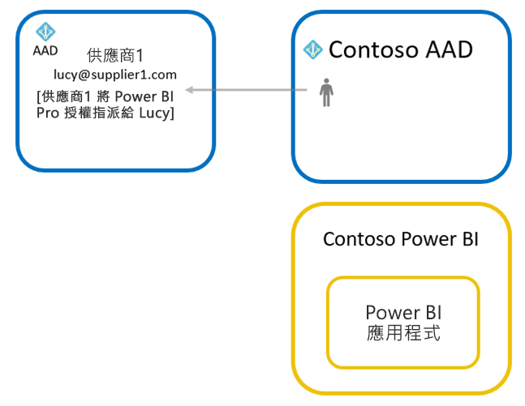

## 適用於外部合作夥伴的資料安全性

通常在使用多個外部的供應商，當 Contoso 必須確保每個供應商會看到自己的產品的相關資料。 以使用者為基礎的安全性和動態資料列層級安全性可讓您輕鬆實現使用 Power BI。

### 以使用者為基礎的安全性

Power BI 最強大功能之一是資料列層級安全性。 這項功能可讓 Contoso 能夠建立單一報表和資料集，但仍適用於每一位使用者不同的安全性規則。 如需深入的說明，請參閱[資料列層級安全性 (RLS)](https://powerbi.microsoft.com/documentation/powerbi-admin-rls/)。

使用 Azure AD B2B 的 power BI 的整合可讓 Contoso 能夠將資料列層級安全性規則指派給來賓使用者，只要他們受邀至 Contoso 租用戶。 如我們所見，Contoso 可以新增來賓使用者，透過已規劃或臨時邀請。 如果 Contoso 想要強制執行資料列層級安全性，強烈建議使用計劃性的邀請，以新增來賓使用者，之前的時間和共用內容之前將它們指派給安全性角色。 如果 Contoso 改為使用臨時邀請，可能會有一段時間，來賓使用者無法看到任何資料。

> [!NOTE]
> 這項延遲在存取時使用特定邀請受 RLS 的資料可能會導致支援要求，您的 IT 團隊，因為使用者會看到空白或中斷時收到電子郵件中開啟 共用連結，尋找報表/儀表板。 因此，強烈建議用於計劃性的邀請此 scenario.* *

讓我們逐步進行此程序使用的範例。

之前有提到，Contoso 供應商在世界各地，而且他們想要確定其供應商組織中的使用者，就是他們的領域從資料取得深入解析。  但從 Contoso 的使用者可以存取的所有資料。 而不是建立數個不同的報表，Contoso 會建立單一的報表，並篩選資料以檢視它的使用者。

若要確定 Contoso 可以篩選根據誰正在連線的資料，在 Power BI desktop 中建立兩個角色。 其中一個篩選 SalesTerritory 「 歐洲 」 的所有資料，另一個用於 「 北美洲 」。

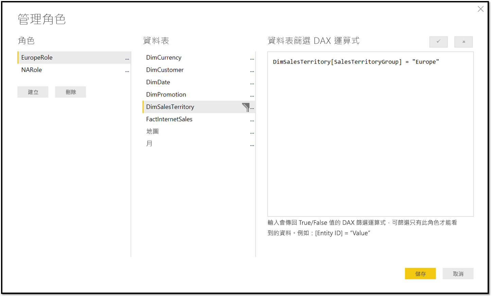

每當角色會定義於報表中，使用者必須指派給特定的角色，才能取得存取權的任何資料。 Power BI 服務內發生的角色指派 (**資料集 > 安全性**)

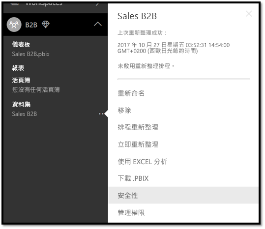

這會開啟的頁面，Contoso 的 BI 小組可以在其中看到兩個角色建立它們。  現在 Contoso BI 小組可以將使用者指派給角色。

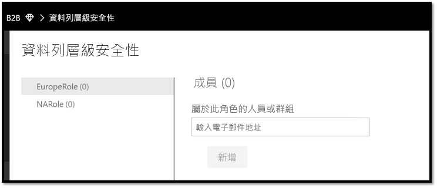

在範例中，Contoso 新增電子郵件地址夥伴組織中的使用者 」[adam@themeasuredproduct.com](mailto:adam@themeasuredproduct.com)「 歐洲角色：

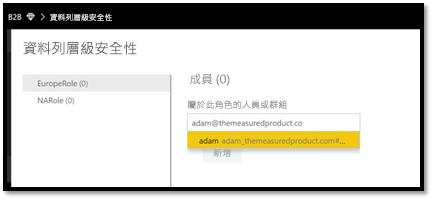

當 Azure AD 取得解決此時，Contoso 就可以看到顯示在視窗中可以新增名稱：

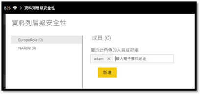

現在當這位使用者開啟與他共用的應用程式時，他只會看到來自歐洲的資料與報表：

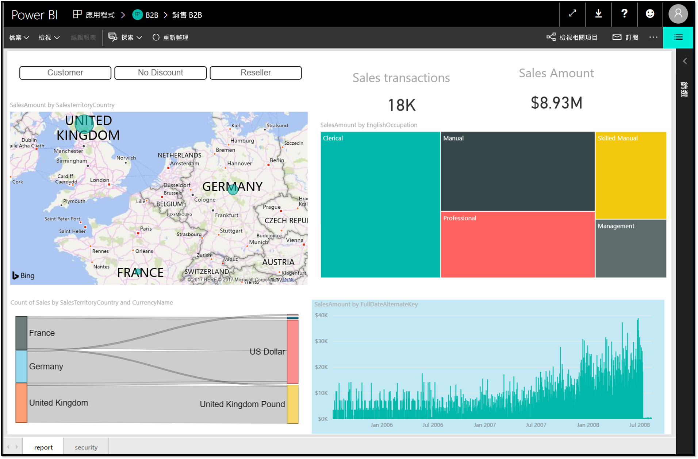

### 動態資料列層級安全性

若要查看如何動態資料列層級安全性 (RLS) 使用 Azure AD B2B 是另一個很有意思的主題。

簡單來說，動態資料列層級安全性的運作方式是在連接到 Power BI 之人員的使用者名稱所根據的模型中篩選資料。 而不是新增多個角色的使用者群組，您會在模型中定義的使用者。 我們將不會說明中詳述的模式。 Kasper de Jong 提供中的資料列層級安全性的所有版本上詳細的寫入[Power BI Desktop 動態安全性技](https://www.kasperonbi.com/power-bi-desktop-dynamic-security-cheat-sheet/)，然後在[本白皮書](https://msdn.microsoft.com/library/jj127437.aspx)。

讓我們看看一個小範例-Contoso 具有 sales 群組的簡單報表：

此報表需要兩個來賓使用者與內部使用者共用-內部的使用者可以看到所有項目，但來賓使用者只能看見群組現在他們擁有存取權。 這表示我們必須篩選僅適用於來賓使用者的資料。 若要適當地篩選資料，Contoso 使用動態 RLS 模式 （英文） 白皮書和部落格文章中所述。 這表示，Contoso 會將使用者加入本身的資料：

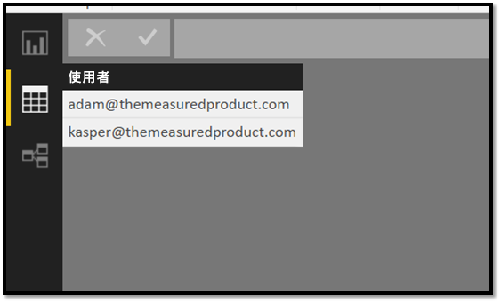

然後，Contoso 會建立篩選的資料適當地使用正確的關聯性的正確資料模型：

若要根據篩選資料會自動登入者，Contoso 必須連接的使用者在建立角色，會傳遞。 在此情況下，Contoso 會建立兩個角色 – 第一種是 「 securityrole 「 篩選目前的使用者名稱的登入 （這適用於 Azure AD B2B 來賓使用者甚至） 的 Power BI 使用者的使用者資料表。

Contoso 也會建立另一個 「 AllRole 」 可以看見其內部使用者 – 此角色沒有任何安全性述詞。

之後將 Power BI desktop 檔案上傳至服務，Contoso 可以將來賓使用者 」 SecurityRole"和"AllRole 」 的內部使用者

現在，當來賓使用者開啟報表時，它們只會看到銷售量從群組 a:

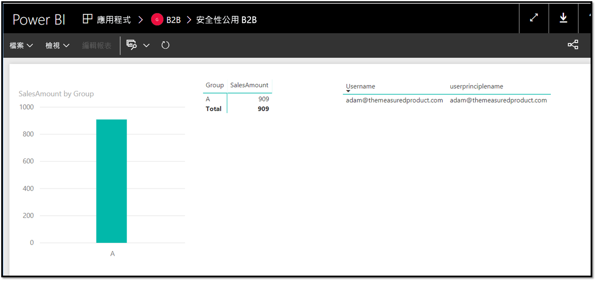

在右邊的矩陣中，您可以看到兩者都傳回的來賓使用者的電子郵件地址 username （） 和 userprincipalname （） 函式的結果。

現在，內部的使用者取得以查看所有的資料：

如您所見，動態 RLS 適用於內部或來賓使用者。

> [!NOTE]
> Azure Analysis Services 中使用的模型時，也適用於此案例。 通常您的 Azure Analysis Service 連線到相同的 Azure AD，為您的 Power BI-在此情況下，Azure Analysis Services 也會知道透過 Azure AD B2B 邀請的來賓使用者。

## 連線到內部部署資料來源

Power BI 提供的功能，運用之類的內部部署資料來源上的 contoso [SQL Server Analysis Services](https://powerbi.microsoft.com/documentation/powerbi-gateway-enterprise-manage-ssas/)或[SQL Server](https://powerbi.microsoft.com/documentation/powerbi-gateway-kerberos-for-sso-pbi-to-on-premises-data/)直接感謝與[部署在內部部署資料閘道](https://powerbi.microsoft.com/documentation/powerbi-gateway-onprem/). 甚至可以使用相同的認證，以搭配 Power BI 的資料來源登入。

> [!NOTE]
> 安裝閘道，以連接到 Power BI 租用戶時，您必須使用您的租用戶內建立的使用者。 外部使用者無法安裝閘道，並將它連接到您的租用戶。 _

對於外部使用者，這可能是比較複雜，因為外部的使用者通常不知道內部部署 AD。 Power BI 提供這個因應措施，讓 Contoso 系統管理員將外部使用者名稱對應到內部的使用者名稱，如中所述[管理您的資料來源-Analysis Services](https://powerbi.microsoft.com/documentation/powerbi-gateway-enterprise-manage-ssas/)。 例如， [ lucy@supplier1.com ](mailto:lucy@supplier1.com)可以對應至[lucy\_supplier1\_com #EXT@contoso.com](mailto:lucy_supplier1_com)。

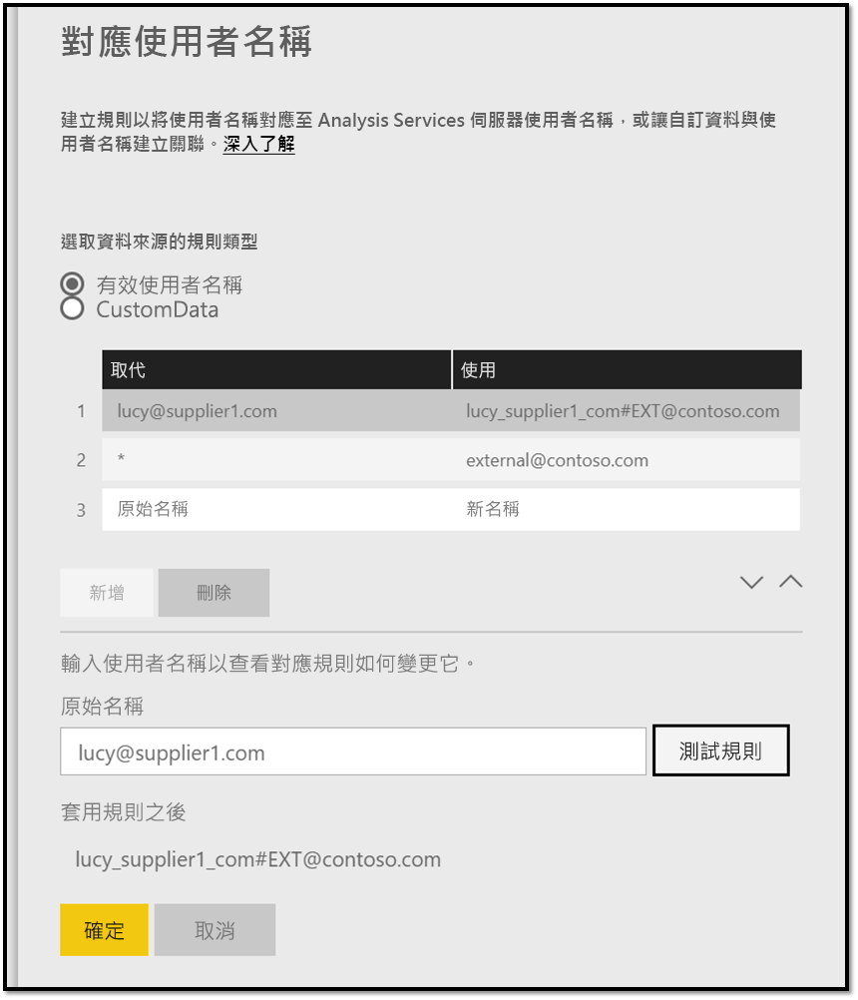

這個方法是沒問題，如果 Contoso 只有少數幾個使用者或 Contoso 如果可以將所有外部的使用者對應至單一的內部帳戶。 更複雜的案例，其中每位使用者都需要自己的認證，還有更進階的方法使用[AD 的自訂屬性](https://technet.microsoft.com/library/cc961737.aspx)中所述進行對應[管理您的資料來源-Analysis Services](https://powerbi.microsoft.com/documentation/powerbi-gateway-enterprise-manage-ssas/). 這可讓 Contoso 系統管理員在您的 Azure AD （也外部 B2B 使用者） 定義的每位使用者的對應。  透過使用指令碼或程式碼，因此 Contoso 可以完全自動對應邀請或排程的頻率上的 AD 物件模型，就可以設定這些屬性。

## 讓外部使用者可以編輯和管理 Power BI 中的內容

Contoso 可以允許外部使用者參與組織內的內容，如稍早所述的跨組織編輯和管理 Power BI 內容 區段。

> [!NOTE]
> 編輯和管理您組織的 Power BI 中的內容，使用者必須具有 Power BI Pro 授權，我的工作區 以外的工作區中。 使用者可以取得 Pro 授權，如同涵蓋 the_ _Licensing__section 的這份文件。_

Power BI 管理入口網站提供**允許外部來賓使用者編輯和管理組織中的內容**租用戶設定中設定。 根據預設，設定設為 停用，這表示外部使用者預設會取得受條件約束的唯讀體驗。 此設定適用於使用者在 Azure AD 中設定為來賓的 usertype。 下表描述使用者體驗，視其 UserType 和設定的設定方式而定的行為。

| **在 Azure AD 中的使用者類型** | **允許編輯和管理內容 設定的外部來賓使用者** | **行為** |
| --- | --- | --- |
| 來賓 | 已停用使用者 （預設值） | 每個項目耗用量只檢視。 允許唯讀存取報表、 儀表板和檢視透過 URL 傳送給來賓使用者時的應用程式。 Power BI 行動應用程式提供給來賓使用者的唯讀檢視。 |
| 來賓 | 啟用使用者 | 外部使用者取得給它們，但不提供某些功能完整的 Power BI 體驗，存取。 外部的使用者必須登入 Power BI 租用戶的資訊包含搭配使用 Power BI 服務的 URL。 首頁經驗，我的工作區中，根據權限可以瀏覽，使用者取得檢視及建立內容。    Power BI 行動應用程式提供給來賓使用者的唯讀檢視。 |

> [!NOTE]
> Azure AD 中的外部使用者也可以設定 UserType 成員。 這是目前不支援在 Power BI 中。

在 Power BI 管理入口網站中，會在下圖中顯示的設定。

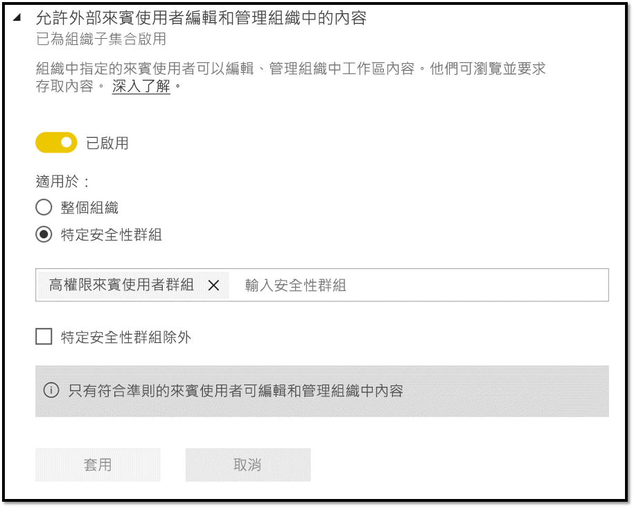

來賓使用者取得唯讀的預設經驗，以及它可以編輯和管理內容。 預設會停用，這表示所有來賓使用者都有唯讀的體驗。 Power BI 系統管理員可以啟用組織中的所有來賓使用者，或在 Azure AD 中定義的特定安全性群組的設定。 在下圖中，Contoso Power BI 系統管理員會建立在 Azure AD 來管理外部使用者可以編輯和管理 Contoso 租用戶中的內容中的安全性群組。

為了協助這些使用者能夠登入 Power BI，請將它們提供的租用戶 URL 中。 若要尋找租用戶 URL，請遵循下列步驟。

1. 在 Power BI 服務中，在頂端功能表中，選取 [說明] (**嗎？** ) 再**關於 Power BI**。
2. 尋找值旁邊**租用戶 URL**。 這是您可以分享給來賓使用者的租用戶 URL。

    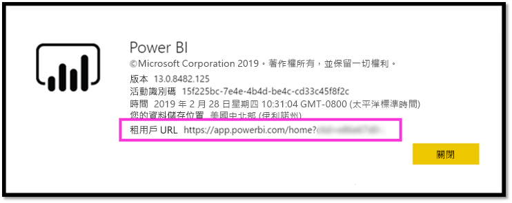

使用時允許外部來賓使用者編輯和管理組織中的內容，指定的來賓使用者存取貴組織的 Power BI，並看見任何他們具備權限的內容。 他們可以存取首頁，瀏覽和參與工作區的內容，安裝應用程式，在存取清單中，並且擁有我的工作區。 針對使用新工作區體驗的工作區，他們可以建立工作區管理員，或是成為工作區管理員。

> [!NOTE]
> 當使用這個選項，請務必先檢閱此文件的 [治理] 區段，因為預設 Azure AD 設定防止來賓使用者使用特定的功能，例如，可能會導致降低 experience.* * 的人員選擇器

透過編輯和管理組織租用戶設定中的內容 允許外部來賓使用者啟用的來賓使用者，一些體驗不會提供給他們。 若要更新或發行報表時，來賓使用者需要使用 Power BI 服務 web UI，包括取得 Power BI Desktop 檔案上傳的資料。 不支援下列體驗：

- 從 Power BI Desktop 直接發佈至 Power BI 服務
- 來賓使用者無法使用 Power BI Desktop 連接到 Power BI 服務中的服務資料集
- 繫結至 Office 365 群組的典型工作區：來賓使用者無法建立這些工作區的管理員，或成為這些工作區的管理員。 他們可以是成員。
- 工作區的存取清單不支援傳送臨時邀請
- Power BI Publisher for Excel 不支援來賓使用者
- 來賓使用者無法安裝 Power BI Gateway，並將它連接到您的組織
- 來賓使用者無法安裝應用程式並發佈到整個組織
- 來賓使用者無法使用、建立、更新或安裝組織內容套件
- 來賓使用者無法使用 [使用 Excel 分析]
- 來賓使用者不可為@mentioned在註解 （即將推出的版本中，這項功能將會新增）
- 來賓使用者無法使用 （即將推出的版本中，這項功能將會新增） 的訂用帳戶
- 如果來賓使用者要使用這項功能，則應具備工作或學校帳戶。 使用個人帳戶的來賓使用者體驗更多的限制，因為登入限制。

## 控管

### 其他會影響體驗與 Azure AD B2B 的 Power BI 中的 Azure AD 設定

當使用 Azure AD B2B 所共用，Azure Active Directory 系統管理員控制層面的外部使用者的體驗。 這些是在您的租用戶的 Azure Active Directory 設定內的外部共同作業設定 頁面來控制。

這裡可設定的詳細資訊：

[https://docs.microsoft.com/azure/active-directory/b2b/delegate-invitations](https://docs.microsoft.com/azure/active-directory/b2b/delegate-invitations)

> [!NOTE]
> 根據預設，會限制來賓使用者權限選項設為 [是]，讓 Power BI 中的來賓使用者具有特別有限體驗括住共用其中人員選擇器 Ui 不適用於這些使用者。 請務必使用您的 Azure AD 系統管理員，將它設定為 [否]，如下所示，以確保良好 experience.* *

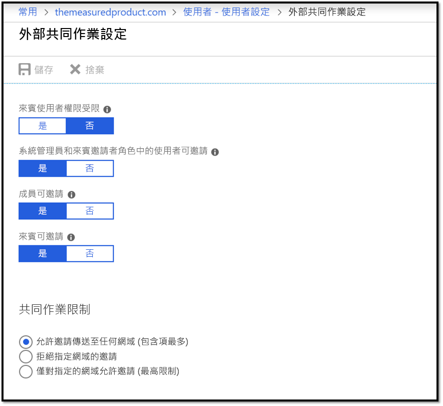

### 控制來賓邀請

Power BI 系統管理員可以控制瀏覽 Power BI 管理入口網站只適用於 Power BI 外部共用。 但租用戶系統管理員也可以控制外部共用與 Azure AD 的各種原則。  這些原則可讓租用戶系統管理員

- 關閉邀請使用者
- 只有系統管理員與來賓邀請者角色中的使用者可以邀請
- 系統管理員、 來賓邀請者角色與成員可以邀請
- 所有的使用者，包括來賓，都可以邀請

您可以閱讀更多這些原則的相關資訊[委派 Azure Active Directory B2B 共同作業邀請](https://docs.microsoft.com/azure/active-directory/active-directory-b2b-delegate-invitations)。

外部使用者的所有 Power BI 動作都還有[在我們的稽核入口網站中稽核](https://powerbi.microsoft.com/documentation/powerbi-admin-auditing/)。

### 來賓使用者的條件式存取原則

Contoso 可以強制執行存取內容，從 Contoso 租用戶的來賓使用者的條件式存取原則。 您可以找到詳細的指示，在[B2B 共同作業使用者的條件式存取](https://docs.microsoft.com/azure/active-directory/active-directory-b2b-mfa-instructions)。

## 常見的替代方法

雖然 Azure AD B2B 可讓您輕鬆地跨組織共用的資料和報表，有數種其他方法，常用，而且可能會優於在某些情況下。

### 替代選項 1:建立重複的身分識別夥伴使用者

使用此選項時，Contoso 必須手動建立重複的身分識別的每個合作夥伴使用者在 Contoso 租用戶中，如下圖所示。 然後在 Power BI 中，Contoso 可以共用指派的身分識別適當的報表、 儀表板或應用程式。

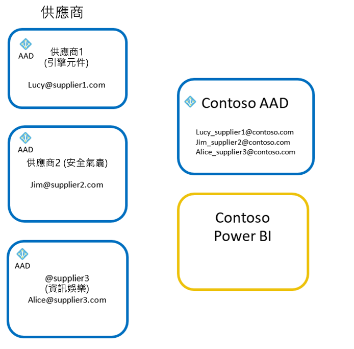

選擇此替代方案的原因：

- 使用者的身分識別會受到您的組織，因為任何相關服務，例如電子郵件、 SharePoint、 等等，但也您組織的控制項內。 您的 IT 系統管理員可以重設密碼、 停用帳戶的存取或稽核這些服務中的活動。
- 因此使用個人帳戶，進行其企業通常會限制存取特定服務的使用者可能需要的組織帳戶。
- 某些服務只能透過您的組織使用者。 例如，使用 Intune 來管理使用 Azure B2B 的外部使用者的個人/行動裝置上的內容不可能。

理由不能選擇此替代方案：

- 夥伴組織的使用者必須記住兩組認證 – 一個用來從其自己的組織和其他存取內容，從 Contoso 存取內容。 這是讓這些來賓使用者，以及許多的來賓使用者感到混淆這項體驗。
- Contoso 必須購買，並將每個使用者授權指派給這些使用者。 如果使用者需要收到電子郵件，或使用 office 應用程式，他們會需要適當的授權，包括 Power BI Pro 才能編輯和共用 Power BI 中的內容。
- Contoso 公司可能想要強制執行更嚴格的授權和相較於內部使用者的外部使用者的管理原則。 若要這麼做，Contoso 必須建立外部使用者的內部命名法，且所有 Contoso 使用者都需要了解此術語。
- 當使用者離開組織時，仍能夠存取 Contoso 資源，直到 Contoso 的系統管理員以手動方式刪除其帳戶
- Contoso 系統管理員必須管理的身分識別，用於進行來賓，包括建立、 密碼重設等。

### 替代選項 2:建立自訂的 Power BI Embedded 應用程式，以使用自訂驗證

Contoso 的另一個選項是建立自己自訂內嵌的 Power BI 應用程式使用自訂驗證 (['應用程式擁有資料'](https://docs.microsoft.com/power-bi/developer/embed-sample-for-customers))。 雖然許多組織並沒有時間或資源以建立自訂的應用程式，將 Power BI 內容給它們的外部合作夥伴，對於一些組織來說這是最好的方法，值得慎重考慮。

通常，組織有現有的 「 合作夥伴 」 入口網站，集中所有的組織資源的存取權的合作夥伴，提供隔離從內部組織的資源，並提供流暢的體驗，支援許多協力廠商的協力廠商和其個別的使用者。

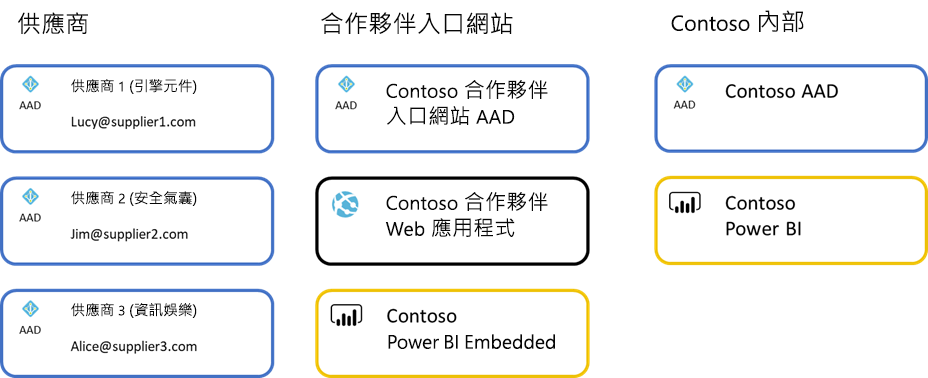

在範例中，每個供應商登入 Contoso 的合作夥伴入口網站的使用者，可以使用 AAD 身分識別提供者。 它無法使用 AAD B2B、 Azure B2C、 原生的身分識別，或與任意數目的其他身分識別提供者同盟。 使用者會登入，並存取合作夥伴入口網站建置使用 Azure Web 應用程式或類似的基礎結構。

Web 應用程式中內嵌 Power BI 報表從 Power BI Embedded 的部署。 Web 應用程式會簡化報表和所有相關的服務，旨在讓您輕鬆與 Contoso 進行互動的供應商的一致體驗的存取。 此入口網站的環境為與 Contoso 內部 AAD 隔離，以確保供應商 Contoso 的內部 Power BI 環境無法存取這些資源。 一般而言，資料會儲存在個別的協力廠商資料倉儲以確保隔離的資料。 這種隔離有優點，因為它會限制使用的外部使用者直接存取您的組織資料，限制可能可供外部使用者，哪些資料，並限制與外部使用者不會意外共用數目。

使用 Power BI Embedded，入口網站可以利用較有利的授權，則使用應用程式權杖或主要使用者加上 premium 容量購買在 Azure 模型中，可簡化疑慮將授權指派給使用者，並可以相應增加/相應減少基礎必須是 on使用方式。 入口網站可以提供整體更高的品質和一致的經驗，因為合作夥伴存取所有記住的協力廠商的需求而設計的單一入口網站。 最後，Power BI Embedded 基礎的解決方案通常會設計為多租用戶，因為它可讓您更輕鬆地確保夥伴組織之間的隔離。

選擇此替代方案的原因：

- 更輕鬆地管理夥伴組織的成長。 夥伴新增至個別的目錄與 Contoso 內部的 AAD 目錄隔離，因為它簡化了的治理職責，並協助防止意外共用給外部使用者的內部資料。
- 典型的合作夥伴入口網站是高度跨協力廠商品牌體驗一致的體驗，而且經過簡化，典型的合作夥伴的需求。 因此 Contoso 就可以獲得更好的整體體驗提供給協力廠商整合的單一入口網站中的所有必要的服務。
- 授權成本進階的案例，像是在 Power BI Embedded 的編輯內容都會受到 Azure 購買 Power BI Premium，而且不需要 Power BI Pro 授權給這些使用者指派。
- 如果做為多租用戶解決方案架構，請跨合作夥伴提供更好的隔離。
- 合作夥伴入口網站通常會包含其他的 Power BI 報表、 儀表板和應用程式之外的協力廠商的工具。

理由不能選擇此替代方案：

- 更多心力，才能建立、 操作和維護這類使得它成為大量投資資源和時間的入口網站。
- 解決方案的時間是遠超過使用 B2B 共用因為仔細規劃，因此需要跨多個工作流執行。
- 其中有較少的合作夥伴是可能太高，無法證明此替代方案所需的工作量。
- 特定共用的共同作業是由您的組織所面臨的主要案例。
- 報表和儀表板會為每個夥伴中不同。 此替代方案導入了管理額外負荷就直接與合作夥伴共用。

## 常見問題集

**可以 Contoso 傳送自動兌換邀請，以便使用者只是 「 隨時出發 」？還是使用者一律必須一路點選至兌換 URL？**

使用者必須一律逐一點選同意體驗才能存取內容。

如果您將邀請多位來賓使用者，我們建議您將這個委派從您的核心 Azure AD 系統管理員所[將使用者新增至資源組織中的來賓邀請者角色](https://docs.microsoft.com/azure/active-directory/active-directory-b2b-add-guest-to-role)。 這位使用者可以邀請夥伴組織中的其他使用者使用登入 UI、 PowerShell 指令碼，或 Api。 這會減少您的 Azure AD 系統管理員，來邀請或重新邀請傳送給使用者使用，夥伴組織的系統管理負擔。

**如果合作夥伴沒有多重要素驗證，可以 Contoso 強制來賓使用者的多重要素驗證？**

是。 如需詳細資訊，請參閱 < [B2B 共同作業使用者的條件式存取](https://docs.microsoft.com/azure/active-directory/active-directory-b2b-mfa-instructions)。

**B2B 共同作業如何受邀的合作夥伴使用同盟來新增自己的內部部署驗證時？**

如果合作夥伴具有與內部部署驗證基礎結構同盟的 Azure AD 租用戶，在內部部署單一登入 (SSO) 會自動達成。 如果合作夥伴沒有 Azure AD 租用戶，Azure AD 帳戶可能會建立新的使用者。

**可邀請來賓使用者，與取用者電子郵件帳戶嗎？**

Power BI 中支援邀請來賓使用者，與取用者電子郵件帳戶。 這包括網域，例如 hotmail.com、 outlook.com 及 gmail.com。 不過，這些使用者可能會遇到限制之外的使用者的工作或學校帳戶遇到。
