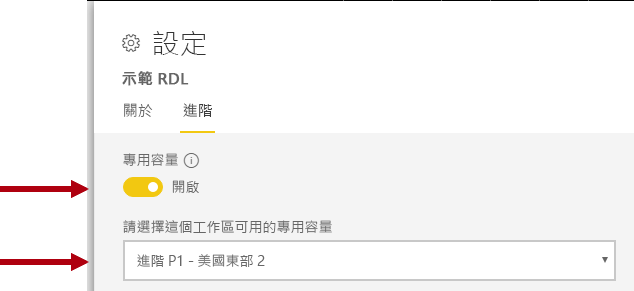

# 部署和管理 Power BI Premium 的容量

**摘要：** Power BI Premium 提供更一致的效能、對大型資料磁片區的支援, 以及您組織中所有人統一的自助和企業 BI 平臺的彈性。 這一層級的300技術白皮書專為 Power BI 系統管理員和內容作者和發行者而撰寫。 其目的在於協助他們瞭解 Power BI Premium 的潛能, 並說明如何設計、部署、監視和疑難排解可調整的解決方案。

**授權**[Peter Myers](https://www.linkedin.com/in/peterjsmyers)(資料平臺 MVP, 以及具有位解決方案的獨立 BI 專家)

**技術檢閱者：** Adam Saxton、Akshai Mirchandani、Bhavik 商家、David Magar、Josh Caplan、Michael Blythe、Nimrod Shalit、Olivier Matrat、Swati Gupta

**適用於︰** Power BI 服務、Power BI Premium 和 Azure Power BI Embedded 的容量

> [!NOTE]
> 您可選取瀏覽器的 [列印]，然後選取 [儲存為 PDF] 來儲存或列印本白皮書。

## Power BI 簡介

Power BI 是一種商務分析服務, 其設計目的是要提供快速、明智決策的深入解析。 自2015版起, it 很快就會成為一項熱門服務, 用來將最小組織的解決方案傳遞到最大的企業。

有兩種方式可供使用:作為雲端服務, 以及名為**Power BI 報表伺服器**的內部部署報表解決方案。 \[[sha-1](#endnote-01)\]

作為雲端服務的 Power BI 是軟體即服務 (SaaS) \[ [2](#endnote-02) \]。 它代表一組服務和應用程式, 可讓組織開發、部署、管理、共用解決方案, 以監視其業務。

這不是本白皮書的目的, 而是提供 Power BI 服務的完整描述。 相反地, 它會將焦點放在與 Power BI Premium 主旨相關的主題。 如需 Power BI 的一般資訊, 請參閱完整的[Power BI 檔](service-admin-premium-multi-geo.md)。 如需更詳細的 Power BI 服務說明, 並著重于達成執行良好的企業部署, 請參閱完整[規劃 Power BI 企業部署](https://aka.ms/pbienterprisedeploy)白皮書。

在本白皮書的主旨內容中, 本節介紹和描述容量、Power BI 內容類型、模型儲存模式和授權。 若要成功部署和管理 Power BI Premium, 必須瞭解這些主題。

### 容量

**容量**是一種核心 Power BI 概念, 代表用來裝載和傳遞 Power BI 內容的一組資源 (儲存體、處理器和記憶體)。 容量為「共用」或「專用」。 **共用容量**會與其他 Microsoft 客戶共用, 而**專用容量**會完全認可給單一客戶。 「 [Premium 容量](#premium-capacities)」主題中引進了專用容量。

在共用容量中, 工作負載會在與其他客戶共用的計算資源上執行。 由於容量必須共用資源, 因此會強加限制以確保「公平播放」, 例如模型大小上限 (1 GB) 和每日重新整理頻率上限 (每天八次)。

### 工作區

Power BI 的工作區位於容量內, 並代表安全性、共同作業和部署容器。 每個 Power BI 使用者都有個人工作區，稱為**我的工作區**。 可建立額外的工作區來啟用共同作業和部署，這些工作區稱為**應用程式工作區**。 根據預設, 會在共用容量中建立工作區 (包括個人工作區)。

### Power BI 內容類型

若要介紹 Power BI Premium 主題, 請務必先徹底討論 Power BI 架構, 包括基本的內容類型。

所有 Power BI 內容都會在工作區中儲存及管理, 這些都是 Power BI 內容的容器。 每個 Power BI 使用者都有自己的個人工作區, 但一般的最佳作法是建立應用程式工作區。 應用程式工作區可讓內容的共同擁有權, 以及在內容上進行協同作業的能力。 它們也能讓您將內容分段和散發給廣大的觀眾, 做為應用程式。

下列 Power BI 內容會儲存在工作區中:

- 資料流程
- 資料集
- 活頁簿
- 報表
- 儀表板

#### 資料流程

Power BI 資料流程可協助組織統一不同來源的資料。 您可以將它們視為準備和暫存的資料, 以用於模型中, 不過, 它們無法直接當做報告的來源使用。 他們會利用廣泛的 Microsoft 資料連線器集合, 讓您能夠從內部部署和雲端式資料來源內嵌資料。

資料流程只能在應用程式工作區中建立及管理, 而且它們會以實體的形式儲存在 Common Data Model (CDM) 的 Azure Data Lake Storage Gen2 中。 一般而言, 這些排程會定期重新整理, 以儲存最新的資料。

如需進一步資訊, 請參閱[Power BI (預覽) 檔中的自助式資料準備](service-dataflows-overview.md)。

#### 資料集

Power BI 資料集代表可供報告和視覺效果使用的資料來源。 有許多類型的資料集, 由下列方式建立:

- 連接到不是裝載于 Power BI 容量中的現有資料模型
- 上傳包含模型的 Power BI Desktop 檔案
- 上傳 Excel 活頁簿 (包含一或多個 Excel 資料表及/或活頁簿資料模型), 或上傳逗號分隔值 (CSV) 檔案
- 使用 Power BI 服務建立發送、串流或混合式串流資料集

除了串流資料集\[ [3](#endnote-03) \]以外, 資料集代表利用 Analysis Services 成熟模型化技術的資料模型。

請注意, 在檔集中, 有時術語的資料集和模型是可互換的。 一般來說, 從 Power BI 服務的觀點來看, 它稱為「**資料集**」, 而從開發觀點來看, 它稱為「模型」 ( **model**)。 在本白皮書的內容中, 它們的意義相當相同。

##### 外部主控的模型

連接到外部裝載的模型牽涉到安裝內部[部署資料閘道](service-gateway-onprem.md), 以連線至 SQL Server Analysis Services, 不論是內部部署或 VM 裝載的基礎結構即服務 (IaaS)。 Azure Analysis Services 不需要閘道。 當現有的模型投資存在時, 通常會形成企業資料倉儲 (EDW) 的一部分, 這種情況通常很合理。 它可讓 Power BI 使用 Power BI 報表使用者的身分識別, 來執行**即時連接**(LC) 來 Analysis Services, 並藉由強制資料許可權來進行。 針對 SQL Server Analysis Services, 支援多維度模型 (cube) 和表格式模型。 如下圖所示, 即時串連資料組會將查詢傳遞至外部裝載的模型。

##### Power BI Desktop 開發的模型

Power BI Desktop-適用于 Power BI 開發的用戶端應用程式-可用來開發實際上是 Analysis Services 表格式模型的模型。 您可以從資料流程匯入資料來開發模型, 然後再與其他資料來源整合。 雖然如何達成模型化的細節不在此白皮書的範圍內, 但請務必瞭解有三種不同類型或模式的模型, 可以使用 Power BI Desktop 來開發。 這些模式會決定要將資料匯入模型中, 還是要將它保留在資料來源中。 這三種模式如下:匯入、DirectQuery 和複合。 [模型儲存模式](#model-storage-modes)主題將涵蓋每種模式的完整討論。

在 Power BI desktop 中開發的外部裝載模型和模型, 可以強制執行資料列層級安全性 (RLS) 來限制特定使用者可抓取的資料。 例如, 指派給「銷售者」安全性群組的使用者, 只能針對其獲指派的銷售領域, 查看其報表資料。 RLS 角色可以是動態或靜態的。 **動態角色**會由報表使用者篩選, 而**靜態角色**會針對指派給該角色的所有使用者套用相同的篩選。

##### Excel 活頁簿模型

建立以 Excel 活頁簿或 CSV 檔案為基礎的資料集, 會導致自動建立模型。 Excel 資料表和 CSV 資料會匯入以建立模型資料表, 而 Excel 活頁簿資料模型則會轉而建立 Power BI 模型。 在所有情況下, 檔案資料都會匯入模型中。

然後, 可以針對代表模型 Power BI 資料集來進行區別:

- 它們可以裝載于 Power BI 服務中, 或由外部裝載, Analysis Services
- 他們可以儲存匯入的資料, 也可以將傳遞查詢要求發出至基礎資料來源, 或兩者的混合

以下是有關代表模型 Power BI 資料集之重要事實的摘要:

- SQL Server Analysis Services 的主控模型需要閘道才能執行 LC 查詢
- 匯入資料的 Power BI 主控模型
  - 必須完全載入記憶體中, 才能進行查詢
  - 需要重新整理才能讓資料保持在最新的, 而且當無法直接透過網際網路存取來源資料時, 必須牽涉到閘道
- 使用 DirectQuery (DQ) 儲存模式的 Power BI 主控模型需要來源資料的連接。 查詢模型時, Power BI 會發出來源資料的查詢, 以取得目前的資料。 當無法透過網際網路直接存取來源資料時, 此模式必須牽涉到閘道。
- 模型可能會強制執行 RLS 規則, 強制篩選準則來限制特定使用者的資料存取

若要成功部署和管理 Power BI Premium, 請務必瞭解模型的裝載位置、其儲存模式、閘道的任何相依性、匯入的資料大小, 以及重新整理類型和頻率。 這些可能會對 Power BI Premium 資源造成重大影響。 此外, 模型設計本身 (包括其資料準備查詢和計算) 可以加入考慮的混合。

也請務必瞭解, Power BI 裝載的匯入模型可以根據排程重新整理, 或由 Power BI 服務中的使用者視需要觸發。

本技術白皮書稍後會在[優化模型](#optimizing-models)主題中討論設計優化模型。

#### 活頁簿

Power BI 活頁簿是 Power BI 內容類型\[ [4](#endnote-04) \]。 這些是已上傳至 Power BI 服務的 Excel 活頁簿, 不應與建立資料集 (模型) 的已上傳 Excel 活頁簿混淆。 活頁簿內容類型代表與活頁簿的連接, 您可以將它上傳至 Power BI 服務或保留在 OneDrive 或 SharePoint Online 上的雲端存放裝置中。

請務必瞭解, 此內容類型無法當做 Power BI 資料視覺效果的資料來源使用。 相反地, 您可以使用 Excel Online, 將它開啟為 Power BI 服務中的活頁簿。 此內容類型的主要目的是要讓舊版 Excel 活頁簿報表可從 Power BI 服務中存取, 並允許將其資料視覺效果釘選到 Power BI 儀表板。

如需進一步資訊, 請參閱[從 Excel 活頁簿檔案取得資料檔案](service-excel-workbook-files.md)。

#### 報表

報表有兩種類型:Power BI 報表和編頁報表。

**Power BI 報表**提供僅連接至單一資料集的互動式資料視覺效果體驗。 報表通常是設計來鼓勵使用者參與, 讓他們能夠與一組絕佳的功能互動, 包括篩選、切割、交叉篩選和反白顯示、向上切入、向下切入、深入瞭解、問 & 自然語言質疑、焦點、頁面導覽、精選、觀賞書簽等等。

在本白皮書的內容中, 請務必瞭解 Power BI 架構、Power BI 報表設計和使用者互動如何影響 Power BI 服務資源:

- 若要載入以匯入模型為基礎的報表並與之互動, 此模型必須完全載入至記憶體 (不論是裝載在 Power BI 服務中, 或託管于外部)
- 每個報表視覺效果都會藉由查詢模型來發出查詢以抓取資料
- 一般而言, 篩選和交叉分析篩選器互動牽涉到查詢模型。 例如, 變更交叉分析篩選器選取專案預設會要求重載第\[ [5](#endnote-05)頁上的每個視覺效果\]
- Power BI 報表不保證顯示目前的資料, 而且可能需要使用者重新整理報表, 才能重載報表頁面及其視覺效果
- 使用者可以與問 & 自然語言功能來提出問題, 提供 Power BI 的報表設計允許它, 而資料集代表 Power BI 裝載的資料匯入模型, 或設定為啟用 Q & 的 LC 資料集

允許發行和轉譯 SQL Server Reporting Services (SSRS) 報表 (\*.rdl 格式) 的編頁報表。 如其名所示, 當需求需要列印到固定頁面大小, 或必須完全展開資料的變數清單時, 通常會使用編頁報表。 例如, 針對多頁轉譯 (而不是在視覺效果中滾動) 和列印所設計的發票。

這兩種支援的報表類型為報表作者提供選擇, 讓他們能夠根據需求和預定用途來選取類型。 一般來說, Power BI 報表適用于互動式體驗, 可讓使用者從資料探索及探索見解, 而編頁報表則更適合參數導向的頁面配置。

不論何種報表類型, 達到回應式報表載入和資料更新 (篩選或參數變更時) 都是提供可靠且良好的使用者體驗的必要項。

#### 儀表板

Power BI 儀表板的目的是要提供監視體驗, 而且在概念上與 Power BI 報表非常不同。 儀表板的設計目的是要在單一畫面上顯示, 以表達磚中的值和資料視覺效果。 一般而言, 儀表板提供的互動體驗比 Power BI 報表少, 有些儀表板設計則不需要互動。 例如, 在伺服器聊天室中的非觸控螢幕上顯示的自動儀表板。 另一個重要的差異是, 儀表板可能會顯示來自多個資料集之來源資料的磚, 而 Power BI 報表只能以單一資料集為基礎。

請務必瞭解, 儀表板的設計是要快速載入, 並隨時表示最新的資料 (Power BI 服務)。 它會藉由快取磚查詢結果來達到這個效果, 而且它會針對每個儀表板執行此程式。 事實上, 它必須針對有權存取儀表板的每個使用者執行這項工作, 而這些人員是以強制執行動態 RLS 的模型為基礎。

Power BI 服務在重新整理 Power BI 裝載的匯入模型之後, 會立即自動更新儀表板查詢快取。 在 LC 和 DQ 模型的情況下, 資料集擁有者可以控制 Power BI 服務更新快取的頻率, 這可設定為每隔15分鐘一次, 或一周的時間不頻繁。 請注意, LC 查詢快取更新會先查詢模型中繼資料, 以判斷自上次快取更新之後是否已進行模型重新整理, 而且不會在重新整理失敗時繼續更新快取。 這種檢查無法用於 DQ 模型, 因此無論來源資料是否已變更, 都會發生快取更新。

根據 DQ 和 LC 模型的儀表板查詢快取更新, 可能會對 Power BI 服務資源和外部資料源產生顯著的影響。 假設有20個磚的儀表板, 全都以 Azure Analysis Services 模型為基礎, 它會強制執行動態 RLS 並每小時重新整理一次, 而此儀表板會與100使用者共用。 如果將資料集設定為每小時重新整理一次, 這會導致至少 2000 (20 x 100) 個 LC 查詢。 這可能會對 Power BI 服務和外部資料源造成大量負載, 而且它也可能會超過對可用資源施加的限制。 容量資源和限制會在[容量節點](#capacity-nodes)主題中加以說明。

使用者可以利用各種方式與儀表板互動, 而這需要 Power BI 服務資源。 具體來說, 他們可以:

- 觸發儀表板磚的重新整理, 這會導致視需要重新整理所有相關的 Power BI 裝載資料匯入模型
- 與 Q & 自然語言功能以提出問題 (提供儀表板設計允許它, 而資料集是 Power BI 裝載的資料匯入模型, 或設定為啟用 Q & A 的 LC 資料集)
- 使用 [快速見解] 功能可讓 Power BI 從基礎資料集探索深入解析, 並以顯示和描述它們的視覺效果回應 (提供磚是以 Power BI 裝載資料匯入模型的資料集為基礎)
- 在儀表板磚上設定警示, 要求 Power BI 服務將閾值與磚值 (可能頻率為每小時) 進行比較, 並在超出臨界值時通知使用者 (提供圖格會顯示單一數值, 並根據Power BI 裝載資料匯入模型的資料集

### 模型儲存模式

回想一下, Power BI Desktop 可讓您以三種模式的其中一種來開發模型。 請務必瞭解每個資料模型儲存模式的原理, 以及對 Power BI 服務資源可能造成的影響。 本節介紹這三種模式。 本白皮書稍後的優化模型主題將進一步詳細討論這些功能。

#### 匯入模式

匯入模式是最常用來開發模型的模式, 因為與記憶體中查詢相關聯的效能非常快速、可供模型化使用的設計彈性, 以及特定 Power BI 服務功能的支援 (Q & A、快速見解等等)。 這是建立新的 Power BI Desktop 解決方案時的預設模式。

請務必瞭解匯入的資料一律會儲存至磁片, 而且必須完全載入至記憶體中, 才能進行查詢或重新整理。 在記憶體中, 匯入模型就能達到神速快速查詢結果的速度。 也請務必瞭解, 沒有將匯入模型部分載入記憶體中的概念。

重新整理時, 資料會經過壓縮和優化, 然後由 VertiPaq 儲存引擎儲存至磁片。 從磁片載入記憶體時, 可以查看10倍的壓縮, 因此可以合理預期 10 GB 的來源資料會壓縮成大約 1 GB 的大小。 磁片上的儲存體大小可達到 20% 的最大縮減。 \[[6](#endnote-06)\]

您可以透過三種方式來達成設計彈性。 資料建模者可以:

- 藉由從多個資料來源快取資料來整合資料-不論資料來源類型和格式為何
- 建立資料準備查詢時, 運用整組 Power Query 公式語言 (非正式稱為 M) 函數
- 透過使用計算結果欄、計算資料表和量值所達成的商務邏輯來增強模型時, 運用整組資料分析運算式 (DAX) 函數

如下圖所示, 匯入模型可以整合來自任何數目之支援資料來源類型的資料。

不過, 雖然有一些與匯入模型相關聯的優勢, 但也有一些缺點:

- 在 Power BI 可以查詢模型之前, 必須先將整個模型載入至記憶體, 這可能會對可用的資源施加壓力, 因為模型的數量和大小會成長
- 模型資料只會與最新的重新整理一樣, 因此匯入模型需要重新整理, 最好是以排程為基礎
- 完整的重新整理將會移除所有資料表中的所有資料, 並從資料來源將其重載。 這在 Power BI 服務和資料來源的時間和資源方面可能非常昂貴。 Power BI 確實支援累加式重新整理, 這可避免截斷和重載整個資料表, 而這會在[優化 Power BI](#optimizing-power-bi-hosted-models)裝載的模型主題中討論。

從 Power BI 服務資源的觀點來看, 匯入模型需要:

- 查詢或重新整理時, 有足夠的記憶體可載入模型
- 處理資源和額外的記憶體資源以重新整理資料

#### DirectQuery 模式

在 DirectQuery (DQ) 模式中開發的模型不會匯入資料。 相反地, 它們只包含查詢將原生查詢發出至基礎資料來源時的中繼資料。

有兩個主要的原因是考慮開發 DQ 模型。 第一個原因是資料磁片區太大-即使套用了資料縮減方法, 也就是載入模型或實際重新整理。 第二個原因是當報表和儀表板需要傳遞「近乎即時」的資料時, 除了可在排程的重新整理限制 (一天中提供專用容量的48次) 之外

有數個與 DQ 模型相關聯的優點:

- 匯入模型大小限制不適用
- 模型不需要重新整理
- 報表使用者會在與報表篩選和交叉分析篩選器互動時看到最新的資料, 並且可以重新整理整份報表以取得目前的資料
- 根據 DQ 模型, 儀表板圖格可以每隔15分鐘自動更新一次

不過, 有許多與 DQ 模型相關聯的缺點和限制:

- 模型必須以單一支援的資料來源為基礎, 因此任何資料整合都必須已在資料來源中完成。 支援的資料來源為關聯式和分析系統, 並支援許多熱門的資料\[存放區[7](#endnote-07) \]。
- 效能可能會變慢, 可能會對 Power BI 服務造成負面影響 (查詢可能會耗用大量 CPU), 以及資料來源 (不會針對分析查詢優化)
- Power Query 查詢不能過於複雜, 而且只能轉換成 M 個運算式和函式, 而這些函數可以轉換成資料來源所瞭解的原生查詢
- DAX 函數僅限於可以轉換成資料來源所瞭解之原生查詢的函式, 而且不支援匯出資料表或內建時間智慧功能
- 根據預設, 需要抓取超過1000000個數據列的模型查詢將會失敗
- 具有多個視覺效果的報表和儀表板可能會顯示不一致的結果, 尤其是當資料來源為 volatile 時
- 問 & A 和快速見解不受支援

從 Power BI 服務資源的觀點來看, DQ 模型需要:

- 查詢時要載入模型的最小記憶體 (僅限中繼資料)
- 產生及處理傳送至資料來源之查詢的重要處理器資源有時

如需詳細資訊, 請參閱在[Power BI Desktop 檔中使用直接查詢](desktop-use-directquery.md)。

#### 複合模式

以複合模式開發的模型允許設定個別模型資料表的儲存模式。 因此, 它支援混合匯入和 DQ 資料表。 它也支援計算資料表 (以 DAX 定義) 和多個 DQ 資料來源。

資料表儲存模式可以設定為 [匯入]、[DirectQuery] 或 [雙重]。 設定為 [雙重儲存模式] 的資料表同時是 [匯入] 和 [DirectQuery], 這可讓 Power BI 服務依據查詢來決定要在查詢上使用的最有效率模式。

複合模型致力於提供最佳的匯入和 DirectQuery 模式。 適當設定時, 可以結合記憶體內部模型的高查詢效能, 以及從資料來源中取出近乎即時資料的能力。

開發複合模型的資料建模者可能會在 [匯入] 或 [雙重儲存模式] 和 [DirectQuery] 模式中的事實類型資料表中設定維度類型的資料表。 例如, 假設模型具有雙重模式的產品維度類型資料表和 DirectQuery 模式中的銷售事實類型資料表。 產品資料表可以有效率且快速地從記憶體中查詢, 以轉譯報表交叉分析篩選器。 然後, 可以在加入相關 Product 資料表的 DirectQuery 模式下查詢 Sales 資料表。 後者的查詢可能會產生單一有效率的原生查詢, 以聯結產品和銷售資料表, 並依交叉分析篩選器值進行篩選。

一般而言, 與每個模型模式相關聯的優點和缺點, 可以視為在複合模型中套用至資料表儲存模式。

如需進一步資訊, 請參閱在[Power BI Desktop 檔中使用複合模型](desktop-composite-models.md)。

### 授權

Power BI 有三個授權:

- Power BI 免費版
- Power BI Pro
- Power BI Premium

**Power BI 的免費**授權可讓個人透過發佈模型和報表, 登入 Power BI 服務並在其個人工作區中工作。 請務必瞭解, 您不能使用此授權來共用 Power BI 內容。 如其名所示, 此授權是免費的。

**Power BI Pro**授權可讓個人在應用程式工作區中建立及共同作業, 以及共用和散發 Power BI 內容。 他們也可以設定其資料集的重新整理, 以自動將資料保持在最新, 包括從內部部署資料來源。 此外, 他們還可以審核及管理資料的存取和使用方式。 除非使用者與 Power BI Premium 專用容量相關聯, 否則需要此授權才能接收其他人的共用內容。

**Power BI Premium**授權是租使用者層級授權, 將在[Power BI Premium 簡介](#introducing-power-bi-premium)一節中討論。

如需 Power BI 授權的進一步資訊, 請參閱[Power BI 定價](https://powerbi.microsoft.com/pricing/)頁面。

## Power BI Premium 簡介

Power BI Premium 提供統一的自助和企業 BI 平臺, 具備規模、可靠的效能和可預測的成本。 它主要是藉由提供專用資源來執行組織的 Power BI 服務, 以達到此目的。

此外, Power BI Premium 提供許多企業功能:

- 符合成本效益的內容發佈, 可讓 Power BI 內容共用至無限制的 Power BI 免費使用者, 包括外部使用者
- 支援較大的資料\[集大小[8](#endnote-08)\]
- 資料流程和資料集的更新頻率較高 (每天最多48次)
- 資料流程和資料集的累加式重新整理
- 資料流程連結實體和平行執行轉換
- 編頁報表
- Power BI 報表伺服器, 適用于內部部署報告
- 能夠代表應用程式使用者 (PaaS) 將內容內嵌在應用程式中

其中許多功能都可以運用來提供有效率且可調整的企業解決方案, 並涵蓋在[優化 Premium 容量](#optimizing-premium-capacities)一節中。

### 訂閱和授權

Power BI Premium 是兩個 SKU (庫存單位) 系列的可用租用戶層級 Office 365 訂閱：

- **EM**適用于內嵌的 Sku (EM1-EM3 逐月), 需要每年承諾用量, 每月計費
- **P** Sku (P1-P3) 適用于內嵌和企業功能, 需要每月或每年的承諾用量, 每月計費, 並包含安裝 Power BI 報表伺服器內部部署的授權

另一種方法是購買具有單一 SKU 系列的 Azure Power BI Embedded 訂用帳戶:僅適用于內嵌和容量測試用途**的**Sku (A1-A6)。

所有 sku 都提供 v 核心來建立容量\[ [9](#endnote-09) \], 但 EM sku 僅限於較小的擴展內嵌。 本白皮書的重點在於 P Sku, 而討論的大部分內容也與 A Sku 相關。

相較於 Premium 訂閱 SKU，Azure SKU 不需要時間履約承諾，且按小時計費。 它們提供完整的彈性，允許相應增加、相應減少、暫停、繼續和刪除。

Azure Power BI Embedded 主要超出本白皮書的範圍, 但在測試方法主題中, 我們將討論這項功能, 以做為測試和測量工作負載的實際和經濟選項。

如需 Azure Sku 的進一步資訊, 請參閱[azure Power BI Embedded 檔](/azure/power-bi-embedded/)。

Power BI Premium 訂閱是由管理員在 Microsoft 365 系統管理中心購買。 具體而言, 只有 Office 365 全域管理員或計費管理員可以購買 Sku。

購買之後, 租使用者會收到對應的 v 核心數目, 以指派給容量-這稱為「 **v 核心**共用」。 例如，購買 P3 SKU 可提供租用戶 32 個 V 核心。

如需詳細資訊, 請參閱[如何購買 Power BI Premium](service-admin-premium-purchase.md)檔。

### Premium 容量

相對於工作負載在與其他客戶共用的計算資源上執行的共用容量,**專用的容量**是供組織獨佔使用。 它會與專用的計算資源隔離, 為裝載的內容提供可靠且一致的效能。

本白皮書的重點在於**Premium 容量**, 這表示它與任何 EM 或 P sku 相關聯。

#### 容量節點

如訂閱和授權主題中所述, 有兩個 Power BI Premium SKU 系列:EM 和 P。所有 Power BI Premium Sku 都以容量節點的形式提供, 每個都代表一組由處理器、記憶體和儲存體組成的資源量。 除了資源以外, 每個 SKU 都有每秒 DirectQuery (DQ) 和即時連線 (LC) 連接數的操作限制, 以及平行模型重新整理的次數。

處理是透過在後端與前端之間平均分配的固定數目 V 核心來完成。

**後端 V 核心**負責核心 Power BI 功能，包括查詢處理、快取管理、執行 R 服務、模型重新整理、自然語言處理 (問與答)，以及在伺服器端轉譯報表和影像。 後端 v 核心會指派固定的記憶體數量, 主要用來裝載也稱為作用中資料集的模型。

**前端 v 核心**負責 web 服務、儀表板和報表檔管理、訪問版權管理、排程、api、上傳和下載, 以及一般都是與使用者體驗相關的所有專案。

儲存體設定為每個容量節點 100 TB。

下表說明每個 Premium SKU (和相同大小的 SKU) 的資源和限制。

| 容量節點 | V 核心總數 | 後端 V 核心 | RAM (GB) | 前端 V 核心 | DQ/LC (每秒) | 模型重新整理平行處理原則 |
| --- | --- | --- | --- | --- | --- | --- |
| EM1/A1 | 1 | 0.5 | 2.5 | 0.5 | 3.75 | 1 |
| EM2/A2 | 2 | 1 | 5 | 1 | 7.5 | 2 |
| EM3/A3 | 4 | 2 | 10 | 2 | 15 | 3 |
| P1/A4 | 8 | 4 | 25 | 4 | 30 | 6 |
| P2/A5 | 16 | 8 | 50 | 8 | 60 | 12 |
| P3/A6 | 32 | 16 | 100 | 16 | 120 | 24 |
| | | | | | | |

#### 容量工作負載

容量工作負載是提供給使用者的服務。 根據預設, Premium 和 Azure 容量僅支援與執行中 Power BI 無法停用之查詢相關聯的資料集工作負載。

您可以針對編頁報表、資料流程和 AI 啟用其他工作負載。 每個額外的工作負載都需要設定可供工作負載使用的最大記憶體 (以總可用記憶體的百分比表示)。

#### 容量功能

無論何時, Power BI 服務都會致力於充分利用容量資源, 同時不會超出容量所強加的限制。

容量作業會分類為互動或背景。 互動式作業包括轉譯要求及回應使用者互動 (篩選、問與答查詢等)。 一般而言, 匯入模型查詢會耗用記憶體資源, 同時查詢 LC/DQ 模型會耗用大量 CPU。 背景作業包括資料流程和匯入模型重新整理，以及儀表板查詢快取。

請務必瞭解, 互動式作業一律優先于背景作業, 以確保最佳的使用者體驗。 如果資源不足，背景作業會新增至佇列，等到資源釋放後再處理。 背景作業 (例如資料集重新整理和 AI 函式) 可以由 Power BI 服務來停止中間進程, 並新增至佇列。

匯入模型必須完全載入記憶體中, 才能進行查詢或重新整理。 Power BI 服務使用精密的演算法來管理記憶體使用量, 以確保最大的可用記憶體使用, 並可達到過量使用的容量:雖然容量可以儲存許多匯入模型 (每個 Premium 容量最多 100 TB), 但當其合併的磁片儲存體超過支援的記憶體時 (以及查詢和重新整理需要額外的記憶體), 則它們無法全部載入至記憶體同樣的時間。

因此, 匯入模型會根據使用方式, 載入和移除記憶體。 系統會在查詢時載入匯入模型 (互動式作業), 而不是在記憶體中, 或在重新整理時 (背景作業)。

從記憶體中移除模型稱為「收回」, 它是 Power BI 可以根據模型大小快速執行的作業。 如果容量未發生任何記憶體壓力，則模型會直接載入至記憶體並保留在其中。 \[[10不過,](#endnote-10)當沒有足夠的記憶體可用來載入模型時, Power BI 服務首先必須釋放記憶體。\] 它會藉由尋找過去三分鐘\[  \]內未使用的模型, 然後將其收回, 藉以偵測已變成非作用中的模型來釋放記憶體。 如果沒有要收回的非使用中模型，Power BI 服務會試圖收回已針對背景作業載入的模型。 這可能包括收回背景工作負載 (例如 AI 工作負載)。 最後一種辦法是在30秒的失敗\[嘗試次數[11](#endnote-11) \]之後, 互動式作業會失敗。 在此情況下, 報表使用者會正常地通知失敗, 並建議稍後再試一次。

重要的是, 資料集收回是正常且預期的行為。 它會透過載入和卸載總大小可能超過可用記憶體的模型，盡可能最大限度地提高記憶體使用量。 這是根據設計而來，且對報表使用者完全透明。 高收回率不一定代表提供給容量的資源不足。 不過，如果查詢或重新整理回應由於高收回率而變慢，則可能會成為問題。

重新整理匯入模型時, 一定會耗用海量儲存體, 因為模型必須載入記憶體中, 而且需要額外的記憶體才能進行處理。 完整重新整理可能會用到模型所需記憶體數量約兩倍。 這可確保即使在處理時, 也可以查詢模型 (查詢會傳送到現有的模型, 直到重新整理完成, 而且新的模型資料可供使用)。 請注意, 累加式重新整理會需要較少的記憶體, 而且可以更快完成, 因此可以大幅降低容量資源的壓力。 對模型進行重新整理也可能會耗費大量 CPU，特別是如果模型具有複雜的 Power Query 轉換，或是具有複雜或以大型資料表為基礎的計算資料表/資料行。

類似重新整理的查詢-需要將模型載入到記憶體中。 如果記憶體不足，則 Power BI 服務會嘗試收回非使用中的模型；如果不可行 (因為所有模型都在使用中)，則會將重新整理作業排入佇列。 重新整理通常需要大量 CPU, 甚至比查詢更多。 因此，並行重新整理數目有容量限制，設定為後端 V 核心數目的 1.5 倍 (無條件進位)。 如果並行重新整理數目太多，則會將排程重新整理排入佇列。 發生這些情況時，重新整理需要更長的時間才能完成。 請注意, 視需要重新整理 (由使用者要求或 API 呼叫所觸發) 將會重\[試三次[11](#endnote-11) \], 如果沒有足夠的資源, 則會失敗。

## 管理 Power BI Premium

管理 Power BI Premium 牽涉到購買訂用帳戶, 以及建立、管理和監視 Premium 容量。

### 建立和管理容量

**Power BI 系統管理員**入口網站的 [**容量設定**] 頁面會顯示已購買且可用的 v 核心數目 (亦即, 尚未指派容量), 並列出 Premium 容量。 此頁面可讓 Office 365 全域管理員或 Power BI 服務系統管理員從可用的 v 核心建立 Premium 容量, 或修改現有的 Premium 容量。

建立 Premium 容量時, 需要系統管理員定義:

- 容量名稱 (租使用者內的唯一)
- 容量管理員
- 容量大小
- 資料常駐\[的區域[12](#endnote-12)\]

至少必須指派一個容量系統管理員。 指派為容量管理員的使用者可以:

- 將工作區指派給容量
- 管理使用者權限, 以新增額外的容量管理員或具有指派許可權的使用者 (讓他們可以將工作區指派給容量)
- 管理工作負載, 以設定編頁報表和資料流程工作負載的最大記憶體使用量
- 重新開機容量, 以在系統超載\[ [13](#endnote-13)的情況下重設所有作業\]

容量管理員無法存取工作區內容 (除非明確指派的工作區許可權), 而且他們無法存取所有 Power BI 的管理區域 (除非明確指派), 例如使用計量、audit 記錄或租使用者設定。 重要的是, 容量管理員沒有建立新容量或擴充現有容量的許可權。 此外, 它們會依每個容量來指派, 以確保它們只能查看和管理指派給它們的容量。

您必須從可用的 SKU 選項清單中選取容量大小, 而這會受限於集區中可用的 v 核心數目。 您可以從集區建立多個容量, 這可能來自一或多個已購買的 Sku。 例如, P3 SKU (32 v 核心) 可用來建立三個容量: 一個 P2 (16 個 v 核心) 和兩個 P1 (2 x 8 個 v 核心)。 藉由建立較小的大小容量, 可改善效能和規模, 而本主題將在[優化 Premium 容量](#optimizing-premium-capacities)一節中討論。 下圖顯示虛構 Contoso 組織的範例設定, 其中包含五個 Premium 容量 (3 x P1 和 2 x P3), 每個內含應用程式工作區, 以及多個共用容量的工作區。

Premium 容量可以指派給 Power BI 租使用者的主區域以外的區域, 以提供系統管理控制 Power BI 內容所在的資料中心 (在定義的地理區域內)。 \[[12](#endnote-12)\]

Power BI 服務系統管理員和 Office 365 全域管理員可以修改 Premium 容量。 具體來說, 他們可以:

- 變更容量大小以相應增加或相應減少資源。 不過, 不可能將 P SKU 降級為 EM SKU, 或升級為相反的情況。
- 新增或移除容量管理員
- 新增或移除具有指派許可權的使用者
- 新增或移除其他工作負載
- 變更區域

需要指派許可權才能將工作區指派給特定的 Premium 容量。 許可權可以授與給整個組織、特定的使用者或群組。

根據預設, Premium 容量支援與執行 Power BI 查詢相關聯的工作負載。 它也支援三個額外的工作負載:**編頁報表**、**資料流程**和**AI**。 每個工作負載都需要設定可供工作負載使用的最大記憶體 (以總可用記憶體的百分比表示)。 請務必瞭解, 增加的最大記憶體配置可能會影響可以裝載的現用模型數目, 以及重新整理的輸送量。

記憶體會以動態方式配置給資料流程，但會以靜態方式配置給編頁報表。 以靜態方式配置最大記憶體的原因是, 編頁報表是在容量包含的安全空間內執行。 設定編頁報表記憶體時應特別小心, 因為它會減少載入模型的可用記憶體。

|                     | EM3                      | P1                       | P2                      | P3                       |
|---------------------|--------------------------|--------------------------|-------------------------|--------------------------|
| 編頁報表 | N/A | 20% 預設值；10% 最小值 | 20% 預設值；5% 最小值 | 20% 預設值；2.5% 最小值 |
| 資料流程 | 預設 20%；最小 8%  | 預設 20%；最小 4%  | 預設 20%；最小 2% | 預設 20%；最小 1%  |
| AI | N/A | 20% 預設值;最少 20%  | 20% 預設值；10% 最小值 | 20% 預設值；5% 最小值  |
| | | | | |

您可以刪除 Premium 容量, 而不會導致刪除其工作區和內容。 相反地, 它會將任何指派的工作區移至共用容量。 在不同區域中建立 Premium 容量時, 工作區將會移至主要區域的共用容量。

### 將工作區指派給容量

在 [**工作**區] 窗格中, 您可以將工作區指派給**Power BI 系統管理員** **入口網站**中的 Premium 容量或應用程式工作區。

容量管理員以及 Office 365 全域管理員或 Power BI 服務系統管理員, 都可以在**Power BI 系統管理員**  **入口網站**中大量指派工作區。 大量指派可套用至:

- **依使用者的工作區**:這些使用者所擁有的所有工作區 (包括個人工作區) 都會指派給 Premium 容量。 當工作區已指派給不同的 Premium 容量時, 這將包括重新指派。 此外, 也會將工作區指派許可權指派給使用者。

- **特定工作區**
- **整個組織的工作區**:所有工作區 (包括個人工作區) 都會指派給 Premium 容量。 此外, 所有目前和未來的使用者都會獲得指派的工作區指派許可權。 \[[14](#endnote-14)\]

您可以使用 [**工作區**] 窗格, 將工作區新增至 Premium 容量, 讓使用者同時是工作區系統管理員並具有指派許可權。

工作區系統管理員可以從容量中移除工作區 (到共用容量), 而不需要指派許可權。 從專用容量中移除工作區, 可有效地將工作區重新放置到共用容量。 請注意, 從 Premium 容量中移除工作區可能會產生負面結果, 例如, 共用內容變成無法供 Power BI 免費授權的使用者使用, 或已排程的重新整理在超過支援的額度時暫停依共用容量。

在 Power BI 服務中, 可透過裝飾工作區名稱的菱形圖示輕鬆地識別指派給 Premium 容量的工作區。

### 監視容量

監視 Premium 容量可讓系統管理員瞭解容量的執行方式。 您可以使用[Power BI Premium 容量計量應用程式](service-admin-premium-monitor-capacity.md)或[Power BI 系統管理員入口網站](service-admin-premium-monitor-portal.md)來監視容量。

#### 解讀計量

應監視計量, 以建立對資源使用量和工作負載活動的基本瞭解。 如果容量變慢, 請務必瞭解要監視哪些計量, 以及您可以進行的結論。

在理想的情況下, 查詢應該在一秒內完成, 以提供可回應的體驗給報表使用者並啟用更高的查詢輸送量。 當背景處理常式 (包括重新整理) 需要較長的時間才能完成時, 通常會比較不重要。

一般來說, 緩慢的報告可能會指出過度加熱的容量。 當報表無法載入時, 這表示有過度熱的容量。 在這兩種情況下, 根本原因可能是由許多因素所造成, 包括:

- **失敗的查詢**肯定表示記憶體不足的壓力, 而且無法將模型載入記憶體中。 Power BI 服務會嘗試在失敗前30秒載入模型。

- **過多的查詢等候時間**可能是由數個原因所造成:
  - Power BI 服務需要先收回模型, 然後再載入待查詢的模型 (回想一下, 較高的資料集收回率並不表示容量壓力, 除非伴隨長時間的查詢等候時間, 指出記憶體已失效)
  - 模型載入時間 (尤其是等待將大型模型載入記憶體中)
  - 長時間執行的查詢
  - 太多 LC\DQ 連接 (超過容量限制)
  - CPU 飽和度
  - 頁面上具有過多視覺效果的複雜報表設計 (回想一下, 每個視覺效果都是一個查詢)
- **長時間查詢期間**可能表示模型設計並未優化, 特別是當有多個資料集在容量中作用中, 而且只有一個資料集正在產生長時間查詢期間。 這表示容量夠大, 而且內部問題的資料集是次佳的, 或只是緩慢。 長時間執行的查詢可能會造成問題, 因為它們會封鎖存取其他進程所需的資源。
- **長時間重新整理等候時間或 AI 呼叫等待時間**指出記憶體不足, 因為有許多使用中的模型耗用記憶體, 或有問題的重新整理封鎖了其他重新整理 (超過平行重新整理限制)。

如需如何使用計量的詳細說明, 請見[優化 Premium 容量](#optimizing-premium-capacities)一節。

## 優化 Premium 容量

當發生 Premium 容量效能問題時, 常見的第一種方法是優化或調整已部署的解決方案, 以還原可接受的回應時間。 覆寫的理由是要避免購買額外的 Premium 容量, 除非可以加以調整。

需要額外的 Premium 容量時, 本節稍後會討論兩個選項:

- 相應增加 Premium 容量
- 新增 Premium 容量

最後, 測試方法和 Premium 容量大小會在本節中結束。

### 一般最佳作法

當您努力達到最佳使用率和效能時, 有一些最佳作法可在面板上做為一般建議。 它們包括：

- 使用應用程式工作區, 而不是個人工作區
- 將商務關鍵性和自助 BI (SSBI) 分隔成不同的容量

  

- 如果只與 Power BI Pro 使用者共用內容, 則可能不需要將內容儲存在專用容量中
- 當您想要達到特定的重新整理時間, 或需要特定功能 (例如大型資料集或編頁報表) 時, 請使用專用容量

### 解決常見的問題

優化 Power BI Premium 部署是一個複雜的主題, 其中包含對工作負載需求、可用資源及其有效使用的瞭解。

本主題說明七個常見的支援問題、描述可能的問題和說明, 以及如何識別和解決這些問題的相關資訊。

#### 為什麼容量變慢, 我可以做什麼？

有許多原因會導致較慢的 Premium 容量。 此問題需要進一步的資訊, 以瞭解緩慢的意義。 報表的載入速度是否緩慢？ 還是無法載入？ 當使用者與報表互動時, 報表視覺效果是否會使載入或更新變慢？ 重新整理需要比預期更長的時間才能完成, 或先前經驗過？

瞭解原因之後, 您就可以開始進行調查。 下列六個問題的回應將協助您解決更具體的問題。

#### 哪些內容使用了我的容量？

您可以使用**Power BI Premium 容量計量**應用程式來依容量篩選, 以及查看工作區內容的效能計量。 您可以針對 Premium 容量中儲存的所有內容, 依小時檢查過去七天內的效能計量和資源使用量。 這通常是在針對 Premium 容量效能的一般考慮進行疑難排解時, 所要採取的第一步。

要監視的重要計量包括:

- 平均 CPU 和高使用率計數
- 平均記憶體和高使用率計數, 以及特定資料集、資料流程和編頁報表的記憶體使用量
- 已載入記憶體中的使用中資料集
- 查詢持續時間的平均值和上限
- 平均查詢等候時間
- 平均資料集和資料流程重新整理時間
- 平均 AI 呼叫時間和等候時間

此外, 在 [Power BI Premium 容量計量] 應用程式中, [使用中記憶體] 會顯示配置給無法收回之報表的記憶體總量, 因為它在過去三分鐘內已在使用中。 重新整理等候時間的高尖峰可能與大型和/或作用中的資料集相互關聯。

「依平均持續時間的前5個」圖表會反白顯示前五個資料集、編頁報表、資料流程和 AI 呼叫耗用容量資源。 前五個清單中的內容是調查和可能優化的候選項目。

#### 為什麼報表變慢？

下表顯示可能的問題, 以及識別和處理它們的方法。

##### 容量資源不足

| 可能的說明 | 如何識別 | 如何解決 |
| --- | --- | --- |
| 高總使用中記憶體 (無法收回模型, 因為它正在過去三分鐘內)   查詢等候時間的多個高尖峰   重新整理等候時間的多個高尖峰 | 監視記憶體計量\[ [18](#endnote-18) \]和收回計數\[ [19](#endnote-19)\] | 減少模型大小, 或轉換為 DirectQuery 模式-請參閱本節中的[優化模型](#optimizing-models)主題   相應增加容量   將內容指派至不同的容量 |

##### 效率不佳的報表設計

| 可能的說明 | 如何識別 | 如何解決 |
| --- | --- | --- |
| 報表頁面包含許多視覺效果 (互動式篩選可以觸發每個視覺效果至少一個查詢)   視覺效果會抓取比所需更多的資料 | 審核報表設計   訪談報表使用者以瞭解他們與報告的互動方式   監視資料集查詢\[計量[20](#endnote-20)\] | 重新設計每頁視覺效果較少的報表 |

##### 資料集緩慢 (尤其是當報表先前執行良好時)

| 可能的說明 | 如何識別 | 如何解決 |
| --- | --- | --- |
| 越來越大的匯入資料量   複雜或效率不佳的計算邏輯, 包括 RLS 角色   模型未完全優化   (DQ/LC)閘道延遲   緩慢的 DQ 來源查詢回應時間 | 審查模型設計   監視閘道效能計數器 | 請參閱本節中的[優化模型](#optimizing-models)主題 |

##### 高並行報表使用量

| 可能的說明 | 如何識別 | 如何解決 |
| --- | --- | --- |
| 高查詢等候時間   CPU 飽和度   已超過 DQ/LC 連接限制 | 監視 CPU 使用率\[ [21](#endnote-21) \]、查詢等候時間, 以及 DQ/LC 使用率\[ [22](#endnote-22) \]計量 + 查詢持續時間-如果變動可能表示並行處理問題 | 相應增加容量, 或將內容指派至不同的容量   重新設計每頁視覺效果較少的報表 |

#### 為什麼無法載入報表？

當報表無法載入時, 這是最糟的情況, 因此請確定容量的記憶體不足且過度熱。 當所有載入的模型都在主動查詢中, 因此無法收回, 而且任何重新整理作業已暫停或延遲時, 就可能發生這種情況。 Power BI 服務將會嘗試載入資料集30秒, 而使用者會正常地通知失敗, 並建議稍後再試一次。

目前沒有計量可監視報表載入失敗。 您可以藉由監視系統記憶體來找出此問題的可能性, 特別是最高使用率和最高使用率的時間。 「高資料集收回」和「長資料集重新整理平均等候時間」可能會建議此問題發生。

如果只是偶爾才會發生這種情況, 這可能不會被視為優先的問題。 報告使用者會收到服務忙碌中的通知, 而且應該在短時間後重試。 如果這種情況過頻繁, 可以藉由相應增加 Premium 容量或將內容指派至不同的容量來解決問題。

容量管理員 (和 Power BI 服務系統管理員) 可以監視**查詢失敗**計量, 以判斷發生此狀況的時間。 它們也可以重新開機容量, 並在系統超載時重設所有作業。

#### 為什麼重新整理不會在排程開始？

不保證排程的重新整理開始時間。 回想一下, Power BI 服務一律會優先處理背景作業的互動式作業。 Refresh 是在符合兩個條件時可能會發生的背景作業:

- 有足夠的記憶體
- 不超過 Premium 容量支援的並行重新整理次數

當條件不符合時, 會將重新整理排入佇列, 直到條件較好為止。

若要進行完整重新整理, 請記得至少需要兩個目前的資料集記憶體大小。 如果沒有足夠的記憶體可供使用, 則無法開始重新整理, 直到模型收回釋出記憶體為止-這表示在一或多個資料集變成非作用中並可收回之前, 會延遲。

回想一下, 支援的並行重新整理數目上限設定為後端 v 核心的1.5 倍, 無條件進位。

排定的重新整理會在下一次排程的重新整理因開始而無法開始之前失敗。 從 UI 手動觸發的視需要重新整理, 會在失敗前嘗試執行最多三次。

容量管理員 (和 Power BI 服務系統管理員) 可以監視**平均重新整理等候時間 (分鐘)** 計量, 以判斷排程時間與作業開始之間的平均延遲。

雖然不是通常是系統管理優先順序, 但若要影響即時資料重新整理, 請確定有足夠的記憶體可用。 這可能牽涉到將資料集隔離到已知足夠資源的容量。 系統管理員也可以協調資料集擁有者, 以協助錯開或減少排程的資料重新整理時間, 以將衝突降到最低。 請注意, 系統管理員無法查看重新整理佇列, 也不可能取得資料集排程。

#### 為什麼重新整理變慢？

重新整理可能會變慢, 或認為速度變慢 (如先前的常見問題)。

當重新整理的事實很慢時, 可能是由數個原因所造成:

- CPU 不足 (重新整理可能會耗用大量 CPU)
- 記憶體不足, 導致重新整理暫停 (這需要重新整理才能在條件 recommence 時重新開機)
- 非容量原因, 包括資料來源系統回應、網路延遲、不正確許可權或閘道輸送量
- 資料量-設定累加式重新整理的好理由, 如下所述

容量管理員 (和 Power BI 服務系統管理員) 可以監視 [平均重新整理**持續時間 (分鐘)** ] 計量, 以判斷一段時間的比較基準測試, 以及用來判斷平均延遲的平均重新整理**等候時間 (分鐘)** 度量在排程時間與作業開始之間的平均延隔之間。

累加式重新整理可以大幅減少資料重新整理持續時間, 特別是針對大型模型資料表。 累加式重新整理有四個相關聯的優點:

- 重新整理**的速度較快**:在重新整理多個資料分割時, 只有一部分的資料表需要載入、減少 CPU 和記憶體使用量, 而且平行處理原則可能較高
- **只有在必要時才會進行**重新整理:累加式重新整理原則可以設定為只有在資料變更時才載入
- 重新整理**更可靠**:較短的執行與變動資料來源系統的連線較不容易中斷連接
- **模型會保持修剪**:累加式重新整理原則可以設定為自動移除超過滑動時間範圍的歷程記錄

如需詳細資訊, 請參閱[Power BI Premium 檔中](service-premium-incremental-refresh.md)的累加式重新整理。

#### 為什麼資料重新整理未完成？

當資料重新整理作業開始但無法完成時, 可能是因為幾個原因:

- 記憶體不足, 即使 Premium 容量中只有一個模型, 亦即模型大小非常大
- 非容量原因, 包括資料來源系統中斷連接、不正確許可權或閘道錯誤

容量管理員 (和 Power BI 服務系統管理員) 可以監視**因記憶體不足**計量而造成的重新整理失敗。

#### 為什麼 AI 呼叫失敗？

AI 呼叫可能會因為許多原因而失敗。 啟動 AI 工作負載所需的最小記憶體為 5 GB, 但這可能不足以用於某些輸入資料集。 比方說, 自動化機器學習模型定型需要至少兩次, 有時會多次輸入資料集大小。 此外, 如果 AI 呼叫需要超過兩個小時才能完成, 則會終止。 針對未在兩個小時內完成的自動化機器學習模型定型呼叫, 會傳回在這兩個小時內找到的最佳模型。  AI 呼叫也可以由互動式要求中斷, 其優先順序較高。

系統管理員應該監視 AI 等候時間, 以取得優先的其他要求的正負號。 系統管理員也可以確保有足夠的記憶體可供 AI 工作負載相對於輸入資料大小。 這可能牽涉到將 AI 工作負載隔離到已知具有足夠資源的容量。 系統管理員也可以協調資料流程擁有者, 以協助錯開或減少資料流程重新整理時間, 以將衝突降到最低。 請注意, 系統管理員不可能看到 AI 呼叫佇列。

### 優化模型

最佳的模型設計非常重要, 可提供有效率且可調整的解決方案。 不過, 它已超出本白皮書的範圍, 以提供完整討論。 相反地, 本節將提供優化模型時要考慮的重要區域。

#### 優化 Power BI 主控的模型

優化 Premium 容量中裝載的模型, 可以在資料來源和模型層達到。

請考慮匯入模型的優化可能性:

在資料來源層:

- 關聯式資料來源可以透過預先整合資料、套用適當的索引、定義符合累加式重新整理週期的資料表分割區, 以及具體化計算 (用來取代計算) 來確保最快的可能重新整理。模型資料表和資料行, 或將計算邏輯新增至 views
- 非關聯式資料來源可以與關聯式存放區預先整合
- 確保閘道擁有足夠的資源, 最好是在專用的機器上, 具有足夠的網路頻寬, 且接近資料來源

在模型層:

- Power Query 查詢設計可以最小化或移除複雜的轉換, 特別是合併不同資料來源 (資料倉儲在其「提取-轉換-載入」階段期間達成此目的) 的轉換。 此外, 若要確保設定適當的資料來源隱私權層級, 這可以避免要求 Power BI 載入完整的結果, 以產生跨查詢的合併結果。
- 模型結構會決定要載入的資料, 並直接影響模型大小。 其設計目的是要避免藉由移除資料行、移除資料列 (特別是歷程資料) 或載入摘要資料 (代價是載入詳細資料) 來載入不必要的資料。 藉由移除不會非常有效率地儲存或壓縮的高基數資料行 (尤其是文字資料行), 可以達到大幅減少的大小。
- 您可以藉由設定單一方向關聯性來改善模型查詢效能, 除非有充分的理由要允許雙向篩選。 也請考慮使用 CROSSFILTER 函式, 而不是雙向篩選。
- 匯總資料表可以藉由載入預先匯總的資料來達到快速查詢回應, 不過這會增加模型的大小, 並導致較長的重新整理時間。 一般來說, 匯總資料表應該保留給非常大型的模型或複合模型設計。
- 計算資料表和資料行會增加模型大小, 並導致較長的重新整理時間。 一般而言, 當資料在資料來源中具體化或計算時, 可以達到較小的儲存體大小和更快速的重新整理時間。 如果無法這麼做, 使用 Power Query 自訂資料行可提供改善的儲存壓縮。
- 可能有機會調整量值和 RLS 規則的 DAX 運算式, 也許是重寫邏輯以避免成本高昂的公式
- 累加式重新整理可以大幅減少重新整理的時間, 並節省記憶體和 CPU。 您也可以設定累加式重新整理, 以移除歷程記錄資料保留模型大小。
- 當查詢模式不同且衝突時, 模型可以重新設計成兩個模型。 例如, 某些報表會顯示所有歷程記錄的高階匯總, 並可容忍24小時的延遲。 其他報表則與今天的資料相關, 而且需要對個別交易的細微存取。 請建立兩個針對每項需求優化的模型, 而不是設計單一模型來滿足所有報表。

請考慮 DirectQuery 模型的優化可能性。 當模型發出查詢要求給基礎資料來源時, 資料來源優化對於傳遞回應式模型查詢而言非常重要。

 

在資料來源層:

- 您可以將資料來源優化, 藉由預先整合資料 (這在模型層不可行)、套用適當的索引、定義資料表資料分割、具體化摘要資料 (使用索引視圖) 和, 來確保最快的可能查詢將計算量降到最低。 當傳遞查詢只需要篩選和執行索引資料表或 views 之間的內部聯結時, 就會達到最佳體驗。
- 確保閘道擁有足夠的資源, 最好是在專用的機器上, 具有足夠的網路頻寬, 且接近資料來源的鄰近程度

在模型層:

- Power Query 查詢設計最好不要套用轉換, 否則請嘗試將轉換保持為絕對最小值
- 您可以藉由設定單一方向關聯性來改善模型查詢效能, 除非有充分的理由要允許雙向篩選。 此外, 模型關聯性應該設定為採用參考完整性 (當發生這種情況時), 而且會導致使用更有效率的內部聯結 (而不是外部聯結) 來進行資料來源查詢。
- 避免建立 Power Query 查詢自訂資料行或模型計算結果欄-可能的話, 將這些資料來源中的它們具體化
- 可能有機會調整量值和 RLS 規則的 DAX 運算式, 也許是重寫邏輯以避免成本高昂的公式

請考慮複合模型的優化可能性。 回想一下, 複合模型可以混合使用匯入和 DirectQuery 資料表。

- 一般而言, 匯入和 DirectQuery 模型的優化主題適用于使用這些儲存模式的複合模型資料表。
- 一般來說, 您可以將維度類型資料表 (代表商業實體) 設定為雙儲存模式和事實類型資料表 (通常是代表操作事實的大型資料表) 做為 DirectQuery 儲存模式, 以達到平衡的設計。 雙重儲存模式表示匯入和 DirectQuery 儲存模式, 而這可讓 Power BI 服務判斷在產生傳遞的原生查詢時所使用的最有效率儲存模式。
- 確保閘道擁有足夠的資源, 最好是在專用的機器上, 具有足夠的網路頻寬, 且接近資料來源
- 設定為匯入儲存模式的匯總資料表, 可以在用來摘要 DirectQuery 儲存模式事實類型資料表時, 提供大幅的查詢效能增強功能。 在此情況下, 匯總資料表會增加模型的大小並增加重新整理時間, 通常這是可接受的更快速查詢取捨。

#### 優化外部託管模型

[優化 Power BI 託管模型](#optimizing-power-bi-hosted-models)主題中所討論的許多優化可能性也適用于使用 Azure Analysis Services 和 SQL Server Analysis Services 開發的模型。 清除例外狀況是目前不支援的某些功能, 包括複合模型和匯總資料表。

外部裝載資料集的另一個考慮是相對於 Power BI 服務的資料庫主控。 針對 Azure Analysis Services, 這表示在與 Power BI 租使用者 (家庭地區) 相同的區域中建立 Azure 資源。 針對 SQL Server Analysis Services, 對於 IaaS, 這表示將 VM 裝載在相同的區域中, 而在內部部署中, 這表示要確保設定有效率的閘道。

另外, 請注意, Azure Analysis Services 資料庫和 SQL Server Analysis Services 表格式資料庫需要將其模型完全載入記憶體中, 而且隨時都能維持在支援查詢的時間。 如同 Power BI 服務, 如果模型必須在重新整理期間維持在線上, 則需要有足夠的記憶體來重新整理。 不同于 Power BI 服務, 沒有任何概念會根據使用方式, 將模型自動過時或記憶體用盡。 因此, Power BI Premium 可提供更有效率的方法, 以較低的記憶體使用量來最大化模型查詢。

### 容量規劃

Premium 容量的大小會決定其可用的記憶體和處理器資源, 以及容量加諸的限制。 Premium 容量的數目也是一個考慮, 因為建立多個 Premium 容量有助於隔離工作負載。 請注意, 儲存體是每個容量節點 100 TB, 而這對任何工作負載而言可能都是足夠的。

判斷 Premium 容量的大小和數目可能是一項挑戰, 特別是您所建立的初始容量。 容量調整大小的第一個步驟是瞭解代表預期的日常使用量的平均工作負載。 請務必瞭解, 並非所有工作負載都相等。 例如, 在頻譜-100 並行使用者存取單一報表頁面 (其中包含單一視覺效果) 的一端, 很容易就能實現。 不過, 在第一方-100 的並行使用者存取100不同的報表時, 在報表頁面上具有100的視覺效果, 將會對容量資源做出非常不同的需求。

因此, 容量管理員必須考慮您的環境特有的許多因素、內容和預期的使用方式。 覆寫的目標是要最大化容量使用率, 同時提供一致的查詢時間、可接受的等候時間, 以及收回率。 考慮因素可能包括:

- **模型大小和資料特性**:匯入模型必須完全載入記憶體中, 以允許查詢或重新整理。 LC/DQ 資料集可能需要大量的處理器時間, 而且可能會有大幅的記憶體來評估複雜的量值或 RLS 規則。 記憶體和處理器大小, 而 LC/DQ 查詢輸送量則受到容量大小的限制。
- **並行**使用中模型:不同匯入模型的並行查詢, 會在它們保留在記憶體中時, 提供最佳的回應性和效能。 應該有足夠的記憶體來裝載所有高度查詢的模型, 還有額外的記憶體可讓其重新整理。
- 匯**入模型**重新整理:重新整理類型 (完整或增量)、Power Query 查詢和計算資料表/資料行邏輯的持續時間和複雜度, 可能會影響記憶體, 特別是處理器的使用量。 並行重新整理受限於容量大小 (1.5 x 後端 v 核心, 無條件進位)。
- **並行查詢**:當處理器或 LC/DQ 連線超過容量限制時, 許多並行查詢可能會導致無回應的報表。 這特別適用于包含許多視覺效果的報表頁面。
- **資料流程、編頁報表和 AI 函數**:容量可設定為支援資料流程、編頁報表和 AI 函式, 每個都需要可設定的容量記憶體上限百分比。 記憶體會以動態方式配置給資料流程, 但會以靜態方式配置給編頁報表和 AI 工作負載。

除了這些因素以外, 容量管理員也可以考慮建立多個容量。 多個容量允許隔離工作負載, 並可加以設定, 以確保優先順序的工作負載具有保證的資源。 例如, 您可以建立兩個容量, 以將商務關鍵性工作負載與自助 BI (SSBI) 工作負載分開。 業務關鍵的容量可以用來隔離大型公司模型, 其提供保證的資源, 並僅將撰寫存取權授與 IT 部門。 SSBI 容量可以用來裝載越來越多的較小模型, 並將存取權授與商務分析師。 SSBI 容量有時可能會遇到可容忍的查詢或重新整理等候。

經過一段時間, 容量管理員可以在工作區之間移動內容, 或在容量之間移動工作區, 以及相應增加或相應減少容量, 以平衡容量。 一般而言, 若要裝載較大的模型, 您可以相應放大, 並以更高的平行存取規模。

回想一下, 購買授權會提供具有 v 核心的租使用者。 購買**P3**訂用帳戶可以用來建立一個或多達四個 Premium 容量, 也就是 1 x P3 或 2 x P2, 或 4 x P1。 此外, 在將 P2 容量轉換為 P3 容量之前, 可將考慮提供給分割 v 核心以建立兩個 P1 容量。

### 測試方法

一旦決定容量大小, 就可以藉由建立受控制的環境來執行測試。 實際且經濟的選項是建立 Azure (A Sku) 容量, 並注意 P1 容量的大小與 A4 容量相同, 而且 P2 和 P3 容量的大小與 A5 和 A6 容量相同。 Azure 容量可以快速建立, 並以每小時為單位計費。 因此, 測試完成後, 您可以輕鬆地將其刪除, 以停止累積成本。

測試內容可以新增至 Azure 容量上建立的工作區, 然後身為單一使用者可以執行報表, 以產生實際且具代表性的查詢工作負載。 如果有匯入模型, 則應該同時執行每個模型的重新整理。 然後, 您可以使用監視工具來檢查所有計量, 以瞭解資源使用率。

測試必須是可重複的:測試應該執行數次, 而且每次都應該傳遞大約相同的結果。 這些結果的平均值可用來在實際執行的情況下推斷和預估工作負載。

如果您已經有要對其進行負載測試的容量和報表, 請使用[PowerShell 負載產生工具](https://aka.ms/PowerBILoadTestingTool)來快速產生負載測試。 此工具可讓您預估每個報表有多少個實例可以在一小時內執行。 您可以使用此工具來評估個別報表轉譯的容量能力, 或平行呈現數個不同的報表。 如需詳細資訊, 請參閱[影片 Microsoft Power BI:Premium 容量](https://www.youtube.com/watch?time_continue=1860&v=C6vk6wk9dcw)。

若要產生更複雜的測試, 請考慮開發可模擬實際工作負載的負載測試應用程式。 如需詳細資訊, 請參閱網路研討會:[使用 Visual Studio 負載測試 Power BI 應用程式的負載測試](https://blogs.msdn.microsoft.com/charles_sterling/2018/04/04/webinar-load-testing-power-bi-applications-with-visual-studio-load-test/)。

## 探索真實世界案例

在本節中, 將會引進數個真實世界案例, 以說明常見的問題或挑戰、如何識別它們, 以及如何協助解決這些狀況:

- [將資料集保持在最新狀態](#keeping-datasets-up-to-date)
- [識別回應緩慢的資料集](#identifying-slow-responding-datasets)
- [識別偶爾回應緩慢資料集的原因](#identifying-causes-for-sporadically-slow-responding-datasets)
- [判斷是否有足夠的記憶體](#determining-whether-there-is-enough-memory)
- [判斷是否有足夠的 CPU](#determining-whether-there-is-enough-cpu)

這些步驟和圖表和資料表範例來自 Power BI 系統管理員可存取的**Power BI Premium 容量計量應用程式**(app)。

### 將資料集保持在最新狀態

在此案例中, 當使用者抱怨報表資料有時似乎是舊的或「過時」時, 就會觸發調查。

在應用程式中, 系統管理員會與重新整理視覺效果互動, 並依**最大等候時間**統計資料的遞減順序來排序資料集。 這可協助他們顯示具有最長等候時間的資料集 (依工作區名稱分組)。

此外, 在每**小時平均重新整理等候時間**視覺效果中, 他們會注意到每天4PM 的重新整理等候時間一直持續進行。

這些結果有幾個可能的解釋:

- 太多次重新整理嘗試可能會同時發生, 超過容量節點加諸的限制 (在 P1 上使用預設記憶體配置的六次並行重新整理)

- 要重新整理的資料集可能太大, 而無法放入可用的記憶體 (需要至少2倍的記憶體才能進行完整重新整理)
- 效率不佳的 Power Query 邏輯可能會導致在資料集重新整理期間發生記憶體使用量尖峰。 在忙碌的容量上, 這可能偶爾會達到實體限制、重新整理失敗, 而且可能會影響容量上的其他報表檢視作業。
- 需要保留在記憶體中的經常查詢資料集可能會影響其他資料集重新整理的能力, 因為可用記憶體有限

為了協助您調查這一點, Power BI 系統管理員可以尋找:

- 資料重新整理時的可用記憶體不足, 當可用記憶體小於要重新整理的資料集大小的2倍時
- 尚未重新整理, 而且在重新整理之前不在記憶體中的資料集, 但在大量重新整理時間, 已開始顯示互動式流量。 若要查看任何給定時間已載入記憶體中的資料集, Power BI 系統管理員可以查看應用程式中 [**資料集**] 索引標籤的 [資料集] 區域, 然後按一下 [**每小時載入的資料集計數**] 中的其中一個橫條來交叉篩選至特定時間。 本機尖峰時間 (如下圖所示) 表示將多個資料集載入記憶體中的一小時, 這可能會延遲排程重新整理的開始
- 已將資料重新整理排程為啟動時, 增加的資料集收回時間, 表示在重新整理之前, 提供太多不同的互動式報表導致記憶體不足的壓力。 「**每小時資料集收回」和「記憶體耗用量**」視覺效果可以清楚指出收回中的尖峰。

下圖顯示已載入資料集的本機尖峰, 這會建議互動式查詢延遲開始重新整理。 在**每小時載入的資料集計數**中選取一段時間, 視覺效果會交叉篩選**資料集大小**。

Power BI 系統管理員可以採取下列步驟來嘗試解決此問題, 以確保有足夠的記憶體可供資料重新整理開始:

- 聯絡資料集擁有者, 並要求他們錯開和空間資料重新整理排程
- 藉由移除不必要的儀表板或儀表板磚, 特別是強制執行資料列層級安全性
- 藉由優化 Power Query 邏輯、模型計算的資料行或資料表、減少資料集大小, 或設定較大的資料集來執行累加式資料重新整理, 來加速資料重新整理

### 識別回應緩慢的資料集

在此案例中, 當使用者抱怨特定報表花費較長的時間來開啟, 而且有時會停止回應時, 就會觸發調查。

在應用程式中, Power BI 系統管理員可以使用 [**查詢持續**時間] 視覺效果, 依遞減的**平均持續時間**排序資料集來判斷最差的執行資料集。 此視覺效果也會顯示資料集查詢計數, 讓您可以查看資料集的查詢頻率。

Power BI 系統管理員可以參考**查詢持續時間散發**視覺效果, 其中顯示篩選過的時間週期內貯存查詢效能 (< = 30 毫秒, 0-100 毫秒等) 的整體分佈。 一般來說, 接受一秒或更少的查詢會被大部分的使用者回應。花費較長時間的查詢通常會造成效能不佳的認知。

「**每小時查詢持續時間」發佈**視覺效果可讓 Power BI 系統管理員識別一小時的期間, 其中的容量效能可能被視為不佳。 表示查詢持續時間超過一秒的橫條圖區段越大, 使用者會感覺到效能不佳的風險就越大。

視覺效果是互動式的, 當選取橫條的區段時, 會交叉篩選報表頁面上對應的**查詢持續**時間資料表視覺效果, 以顯示它所代表的資料集。 這種交叉篩選可讓 Power BI 系統管理員輕鬆地識別哪些資料集的回應速度很慢。

下圖顯示依**每小時查詢持續時間分佈**所篩選的視覺效果, 著重在一小時的值區中最差的執行資料集。 

一旦識別出在特定1小時的時間範圍內執行不佳的資料集, Power BI 系統管理員就可以調查效能不佳是否由多載的容量所造成, 或是因為設計不佳的資料集或報表。 為了達到此目的, 他們可以參考**查詢等候時間**視覺效果, 並以遞減的平均查詢等候時間排序資料集。 如果有大量的查詢正在等候, 資料集的高需求可能是許多查詢等候的原因。 如果平均查詢等候時間是重大的 (> 100 毫秒), 則可能值得檢查資料集和報表, 以查看是否可以進行優化。 例如, 可能較少的視覺效果用於給定的報表頁面或 DAX 運算式優化。

在資料集中建立查詢等候時間的可能原因有好幾個:

- 一種最理想的模型設計、量值運算式, 或甚至是報表設計-所有的情況, 都可能導致耗用高階 CPU 的長時間執行查詢。 這會強制新的查詢等待, 直到 CPU 執行緒變成可用狀態, 並可建立在尖峰上班時間內經常看到的群組效果 (考慮交通)。 [**查詢等候**] 頁面將是主要的資源, 用以判斷資料集是否有高平均查詢等候時間。
- 大量的並行容量使用者 (數百到數千個) 取用相同的報表或資料集。 即使是設計良好的資料集, 也可以執行得不到並行臨界值。 這通常是由單一資料集所表示, 顯示比其他資料集顯示更高的查詢計數值 (也就是一個資料集的300K.wvx 查詢, 與所有其他資料集的 < 30K 查詢相比)。 在某個時間點, 此資料集的查詢會開始錯開, 而這將會出現在 [**查詢持續**時間] 視覺效果中。
- 同時查詢許多不同的資料集, 因而導致資料集因為頻繁地迴圈進出記憶體而變得不盡相同。 這會導致使用者在將資料集載入記憶體時遇到效能不佳的情況。 若要確認這一點, Power BI 系統管理員可以參考**每小時資料集收回和記憶體耗用量**視覺效果, 這可能表示已將大量的資料集載入記憶體中, 因而重複收回。

### 識別偶爾回應緩慢資料集的原因

在此案例中, 當使用者描述報表視覺效果有時會覺得回應速度很慢或可能變得沒有回應時, 就會觸發調查, 但在其他情況下, 他們會可接受回應。

在應用程式中,**查詢持續**時間區段用來以下列方式尋找發生原因的資料集:

- 在 [**查詢持續**時間] 中, 視覺化系統管理員依資料集篩選資料集 (從查詢的最上層資料集開始), 並檢查**每小時查詢分佈**視覺效果中的交叉篩選列。
- 當單一小時橫條圖顯示所有查詢持續時間群組和該資料集的其他一小時橫條 (也就是色彩之間的比率大幅變更) 之間的比率明顯變更時, 就表示此資料集在中顯示了偶爾的變更性能.
- 一小時的長條顯示執行不良查詢的異常部分, 指出該資料集受到有雜訊的鄰近效果影響的時間範圍, 由其他資料集的活動造成。

下圖顯示1月30日的一小時, 其中資料集效能的重要慢了一些會以 "(3, 10s]" 執行持續時間值區的大小表示。 按一下該小時的長條, 就會顯示在這段期間載入記憶體中的所有資料集, 因此呈現候選的因果資料集, 因而造成雜訊的鄰近效果。

一旦識別出有問題的 timespan (也就是在上圖中的1月30日), Power BI 系統管理員就可以移除所有資料集篩選, 然後只依據該時間範圍進行篩選, 以判斷在這段期間主動查詢的資料集。 有雜訊的鄰近效果資料集通常是最常查詢的資料集, 也可能是最長的平均查詢持續時間之一。

此問題的解決方法可能是在不同的 Premium 容量上, 將問題的資料集散佈在不同的工作區上, 或是在支援資料集大小、耗用量需求和資料重新整理模式時, 于共用容量上散發。

反向也可能是 true。 Power BI 系統管理員可以識別資料集查詢效能大幅改善的時間, 然後尋找消失的內容。 如果該時間點遺失了特定資訊, 則可能有助於指向造成的問題。

### 判斷是否有足夠的記憶體

若要判斷是否有足夠的記憶體可完成其工作負載, Power BI 系統管理員可以參考應用程式之 [**資料集**] 索引標籤中的 [**耗用的記憶體百分比**] 視覺效果。 **全部**(總計) 記憶體代表載入記憶體中的資料集所耗用的記憶體, 不論它們是否為主動查詢或處理。 [使用中記憶體] 代表目前正在處理之資料集所耗用的記憶體。

在狀況良好的容量中, 視覺效果看起來會像這樣, 顯示所有 (總計) 和使用中記憶體之間的間隙:

在遇到記憶體壓力的容量中, 相同的視覺效果會清楚顯示使用中記憶體和總記憶體匯總, 這表示無法在該時間點將其他資料集載入記憶體中。 在此情況下, Power BI 系統管理員可以按一下 [**容量重新開機**] (在管理員入口網站的 [容量設定] 區域的 [**高級選項**] 中)。 重新開機容量會導致所有資料集從記憶體中清除, 並允許它們視需要重載到記憶體中 (藉由查詢或資料重新整理)。

### 判斷是否有足夠的 CPU

一般來說, 容量的平均 CPU 使用率應維持低於 80%。 超過此值表示容量已接近 CPU 飽和度。

CPU 飽和度的效果是由因在嘗試處理所有作業時執行許多 CPU 內容切換而耗費較長時間的作業來表示。 在具有大量並行查詢的 Premium 容量中, 這會以高查詢等候時間來表示。 高查詢等候時間的結果, 速度比平常慢。 Power BI 系統管理員可以藉由查看**每小時查詢等候時間分佈**視覺效果, 輕鬆地識別 CPU 何時飽和。 查詢等候時間計數的定期尖峰會指出可能的 CPU 飽和度。

在背景作業中, 有時會偵測到類似的模式 (如果它們會影響 CPU 飽和度)。 Power BI 系統管理員可以針對特定資料集尋找重新整理時間的定期尖峰, 這可能表示當時的 CPU 飽和 (可能是因為其他正在進行的資料集重新整理和/或互動式查詢)。 在此情況下, 在應用程式中參考**系統**視圖可能不一定會顯示 CPU 處於 100%。 [**系統**] 視圖會顯示每小時的平均值, 但 CPU 可能會變得飽和幾分鐘的繁重作業, 這會顯示為等待時間的尖峰。

有更多的細節可查看 CPU 飽和度的效果。 雖然等待的查詢數目很重要, 但查詢等候時間一定會發生在某些程度, 而不會造成明顯效能降低。 某些資料集 (具有 contact.html 平均查詢時間, 指出複雜度或大小) 比較容易受到 CPU 飽和度的影響。 為了輕鬆地識別這些資料集, Power BI 系統管理員可以在**每小時等候時間分佈**視覺效果中, 尋找橫條色彩組合的變更。 在找出極端列之後, 他們可以尋找在該時間內有查詢等候的資料集, 並查看與平均查詢持續時間相較之下的平均查詢等候時間。 當這兩個計量的大小相同, 而且資料集的查詢工作負載不是簡單的時, 可能是因為 CPU 不足而影響資料集。

當多個使用者 (也就是在定型會話中) 的高頻率查詢的短突發時間取用資料集時, 這種效果可能特別明顯, 這會在每次激增時導致 CPU 飽和。 在此情況下, 此資料集上的重要查詢等候時間可能會有經驗, 而且會影響容量中的其他資料集 (有雜訊的鄰近效果)。

在某些情況下, Power BI 系統管理員可以藉由建立儀表板 (以快取磚的任何資料集重新整理來定期查詢), 而不是報表, 要求資料集擁有者建立較不穩定的查詢工作負載。 這有助於在載入儀表板時避免尖峰。 對於指定的商務需求, 此解決方案可能不一定可行, 不過, 它可以是避免 CPU 飽和度的有效方式, 而不需要變更資料集。

## 結論

Power BI Premium 提供更一致的效能、對大型資料磁片區的支援, 以及您組織中所有人統一的自助和企業 BI 平臺的彈性。 這一層級的300技術白皮書專為 Power BI 系統管理員和內容作者和發行者而撰寫。 其目的在於協助他們瞭解 Power BI Premium 的潛能, 並說明如何設計、部署、監視和疑難排解可調整的解決方案。

若要部署和管理 Power BI Premium 容量, 系統管理員和模型開發人員需要非常瞭解容量功能、如何管理和監視, 以及如何優化模型, 以便適當地回應發生效能問題和瓶頸。

## 結束附注

\[1\]這份技術檔是關於 Power BI 雲端服務所支援的 Power BI Premium, 因此 Power BI 報表伺服器不在範圍內, 除非有安裝 Power BI 報表伺服器所需的授權包含在部分Power BI Premium Sku。

\[2\] Power BI 做為雲端服務, 以代表應用程式使用者來內嵌內容時, 即為平臺即服務 (PaaS)。 這種內嵌類型可透過不同的兩個產品來達成, 其中一個是 Power BI Premium。

\[3\]推送、串流和混合式資料集不會儲存在 premium 容量中, 因此在部署、管理和監視 Premium 容量時不會有任何考慮。

\[4\]個做為 Power BI 內容類型的 Excel 活頁簿不會儲存在 premium 容量中, 因此在部署、管理或監視 premium 容量時不會有任何考慮。

\[5\]視覺效果可以設定為略過交叉分析篩選器互動。 如需進一步資訊, 請參閱[Power BI 報表檔中的視覺效果互動](service-reports-visual-interactions.md)。

\[6\]您可以藉由比較 Power BI Desktop 檔案大小與工作管理員記憶體 (針對檔案), 來判斷大小的差異。

\[7\] Microsoft 資料來源支援包括 SQL Server、Azure 資料磚塊、Azure HDInsight Spark (搶鮮版 (Beta))、Azure SQL Database 和 Azure SQL 資料倉儲。 如需其他來源的詳細資訊, 請參閱[Power BI 檔中的直接查詢所支援的資料來源](desktop-directquery-data-sources.md)。

\[8\] Power BI Premium 支援上傳 Power BI Desktop (.pbix) 檔案, 大小上限為 10 GB。 上傳之後, 資料集的大小最高可增加至 12 GB, 因為重新整理的結果。 最大上傳大小會因 SKU 而有所不同。 如需詳細資訊, 請參閱[大型資料集的 Power BI Premium 支援](service-premium-large-datasets.md)檔。

\[9\]個不超過四個 v 核心的 sku 不會在專用基礎結構上執行。 這包括 EM1、EM2、A1 和 A2 Sku。

\[10\]但罕見, 模型可能會因為服務作業而從記憶體中卸載。

\[11\]這些時間隨時可能會變更。

\[12\]這稱為多地理位置, 目前處於預覽狀態。 多地理位置部署的原理通常適用于公司或政府的合規性, 而不是效能和規模。 報表和儀表板載入仍牽涉到對中繼資料的主區域要求。 如需詳細資訊, 請參閱[Power BI Premium 的多地理位置支援 (預覽)](service-admin-premium-multi-geo.md)檔。

\[13\]使用者可能會造成效能問題, 其方式是使用作業來多載 Power BI 服務、撰寫過於複雜的查詢、建立迴圈參考等等。

\[14\]不建議指派整個組織工作區的選項, 而且偏好使用更具目標的方法。 一般來說, 將個人工作區用於生產內容並不是最佳作法。

\[15\]您可以監視應用程式或 Azure 入口網站中的 sku, 但不能在 Power BI 系統管理員入口網站中。 若要監視 Sku, 如果尚未將應用程式新增至資源的「讀者」角色, 則重新整理報表將會失敗。 如需詳細資訊, 請參閱[監視器 Power BI Premium 和 Power BI Embedded 容量](service-admin-premium-monitor-capacity.md)檔。

\[當\] CPU 或記憶體不足而無法啟動時, 16 次重新整理可能會等候。

\[17\]記憶體中的資料集大小可以大於磁片上的大小, 最多 20%。

\[18\]個平均記憶體使用量 (gb) 和最高記憶體耗用量 (gb)

\[19\]資料集收回

\[20\]個資料集查詢, 資料集平均查詢持續時間 (毫秒), 資料集等候計數, 和資料集平均等候時間 (毫秒)

\[21\] cpu 高使用率計數和最高使用率的 cpu 時間 (過去七天)

\[22\]個 dq/lc 高使用率計數, 以及最高使用率的 dq/lc 時間 (過去七天)