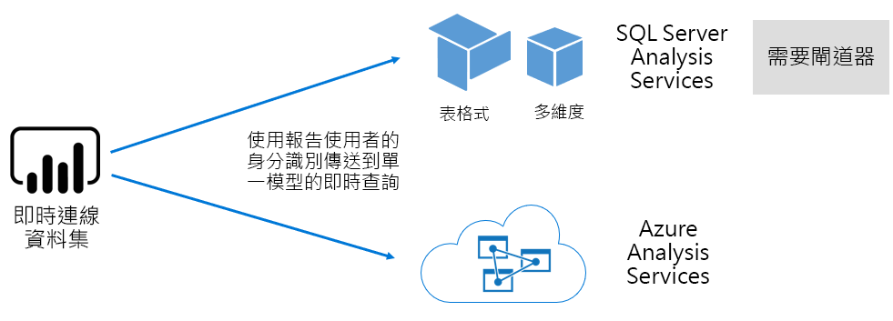
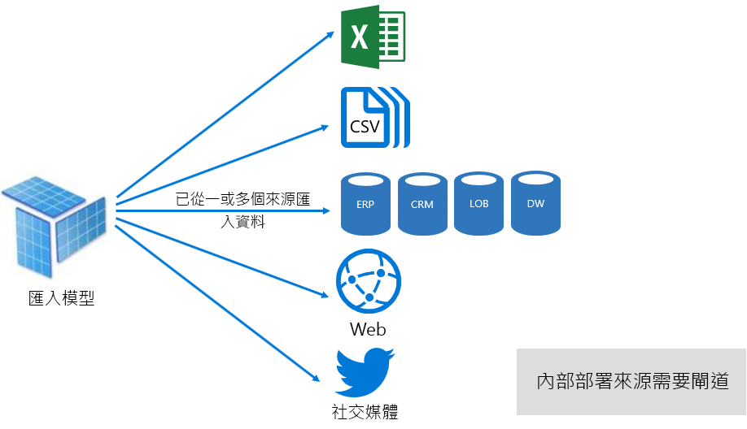
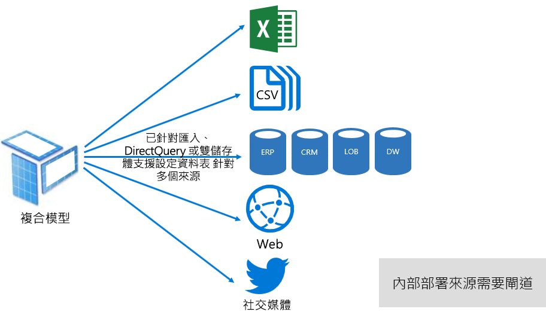
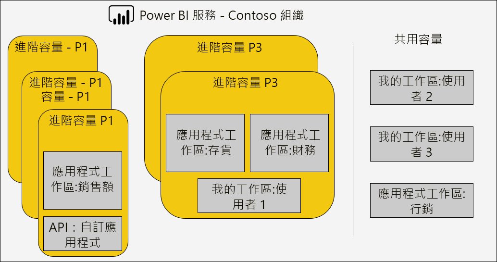
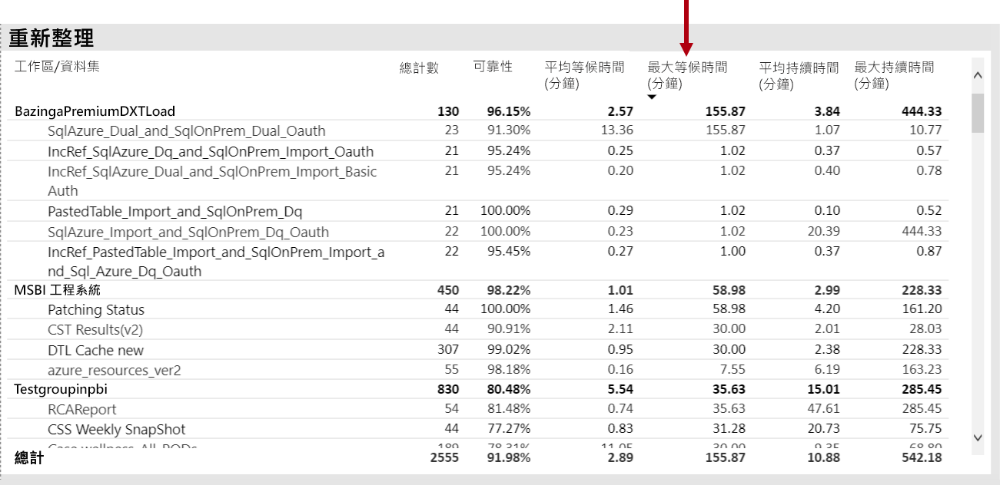
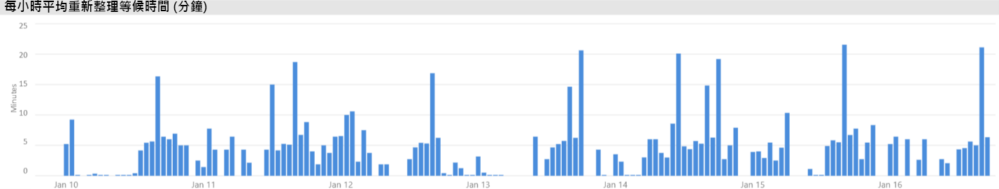
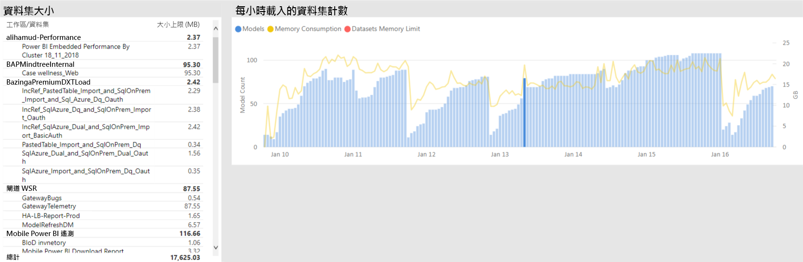
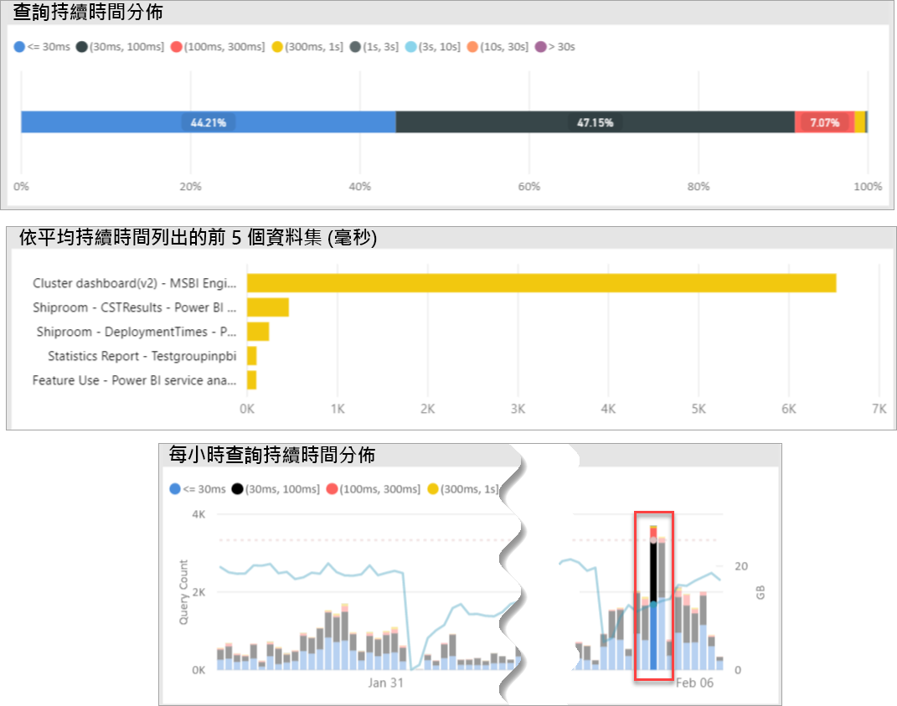
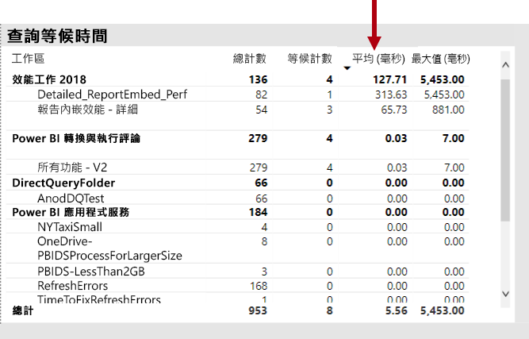
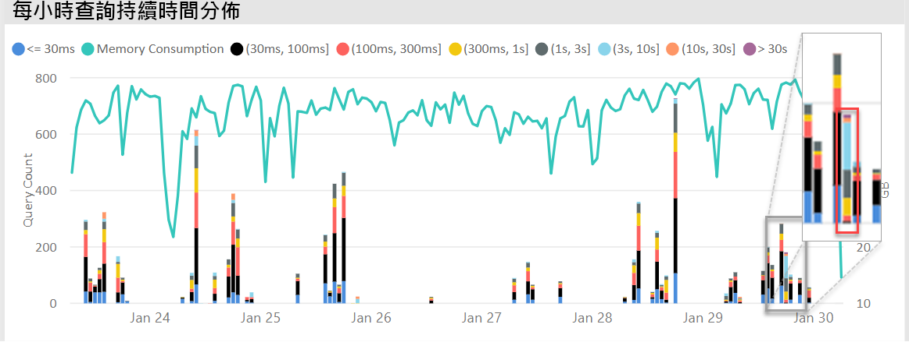

# 部署及管理 Power BI Premium 容量

**摘要：** Power BI Premium 提供更一致的效能、 支援大型的資料磁碟區，以及整合的自助和企業 BI 平台的彈性，您的組織中的每個人。 已針對 Power BI 管理員和內容作者及發行者的寫入此技術等級 300 的技術白皮書。 它的目標是協助他們了解 Power BI Premium 的潛能，並說明如何設計、 部署、 監視和疑難排解可調整的解決方案。

**作者：** [Peter Myers](https://www.linkedin.com/in/peterjsmyers) (資料平台 MVP，以及獨立的 BI 專家與位元解決方案）

**技術檢閱者：** Adam Saxton、 Akshai Mirchandani、 Bhavik 商家、 David Magar、 Josh Caplan、 Michael Blythe、 Nimrod Shalit、 撰文 Matrat、 Swati Gupta

**適用於︰** Power BI 服務、 Power BI Premium 和 Azure Power BI Embedded 容量

> [!NOTE]
> 您可選取瀏覽器的 [列印]  ，然後選取 [儲存為 PDF]  來儲存或列印本白皮書。

## Power BI 簡介

Power BI 是商務分析服務，旨在提供深入見解讓快速、 明智的決策。 自 2015年發行以來就已迅速成為用來針對提供的解決方案的組織最小到最大的熱門服務的企業。

它可供有兩種：為雲端服務，以及內部部署報告方案，名為**Power BI 報表伺服器**。 \[[1](#endnote-01)\]

雲端服務是軟體做為服務 (SaaS) 的 power BI \[ [2](#endnote-02)\]。 它代表一組服務和應用程式，讓組織開發、 部署、 管理、 共用的解決方案可監視其業務。

它不提供 Power BI 服務的完整描述本白皮書的目的。 相反地，它著重於主題相關的 Power BI Premium 的主體。 如需 Power BI 的一般資訊，請參閱全方位[Power BI 文件](service-admin-premium-multi-geo.md)。 Power BI 服務，並著重於達到良好的企業部署的詳細說明，請參閱全方位[規劃 Power BI 企業部署](https://aka.ms/pbienterprisedeploy)（英文） 白皮書。

在本白皮書中的主體內容中，這一節會介紹，並說明容量、 Power BI 內容類型、 模型儲存模式和授權。 了解這些主題是基本成功地部署及管理 Power BI Premium。

### 容量

**容量**是核心 Power BI 的概念代表一組資源 （儲存體、 處理器和記憶體） 用來裝載及傳遞 Power BI 內容。 可能是共用或專用容量。 A**共用的容量**是與其他 Microsoft 用戶端共用，而**專用容量**完全致力於單一客戶。 專用的容量中引進[Premium 容量](#premium-capacities)主題。

在共用容量中，工作負載會與其他客戶共用計算資源上執行。 容量必須共用資源，限制是為了確保 「 公平播放 」，例如最大的模型大小 (1 GB) 和最大每日重新整理每天的頻率 （8 倍）。

### 工作區

Power BI 工作區位於容量和它們所代表的安全性、 共同作業和部署容器。 每個 Power BI 使用者都有個人的工作區，稱為**我的工作區**。 可以建立額外的工作區，以啟用共同作業和部署，以及這些值稱為**應用程式工作區**。 根據預設，工作區 （包括個人工作區） 會建立在共用的容量。

### Power BI 內容類型

為了介紹 Power BI Premium 的主題，請務必啟動 Power BI 架構，包括基本的內容類型的完整討論。

所有的 Power BI 內容是儲存和管理工作區，其是 Power BI 內容的容器。 每個 Power BI 使用者擁有自己個人工作區中，但是一般的最佳作法是建立應用程式工作區。 應用程式工作區可讓 co-ownership 內容與內容共同作業的能力。 它們也提供階段，然後將內容發佈到各種對象做為應用程式的能力。

下列的 Power BI 內容會儲存在工作區：

- 資料流程
- 資料集
- 活頁簿
- 報表
- 儀表板

#### 資料流程

Power BI 資料流程協助組織整合來自不同來源的資料。 它們可以視為做為資料準備，並在模型中，使用暫存，但它們不能用於直接做為來源報表。 它們運用廣泛集合的 Microsoft 資料連接器，啟用來自內部部署與雲端為基礎的資料來源的資料擷取。

資料流程可以只建立和管理應用程式工作區，而儲存為實體中常見資料模型 (CDM) 在 Azure Data Lake 儲存體 Gen2。 一般而言，排定以週期性來儲存最新的資料重新整理。

如需詳細資訊，請參閱[在 Power BI （預覽） 中的自助資料準備](service-dataflows-overview.md)文件。

#### 資料集

Power BI 資料集代表資料供報告和視覺效果的來源。 有許多類型的資料集所建立：

- 連接到現有的資料模型不是裝載在 Power BI 容量
- 包含模型的 Power BI Desktop 檔案上傳
- 上傳 Excel 活頁簿 （包含一或多個 Excel 資料表及/或活頁簿資料模型） 或逗號分隔值 (CSV) 檔案上傳
- 使用 Power BI 服務來建立推播、 串流處理或串流資料集的混合式

除了串流資料集\[ [3](#endnote-03)\]，資料集代表資料模型，這會利用 Analysis Services 的成熟的模型化技術。

請注意，在文件，有時候術語資料集和模型是可互換。 一般而言，從 Power BI 服務觀點來看它指**資料集**，和開發的觀點而言，它指**模型**。 在本白皮書的內容中，它們表示同樣的情形。

##### 外部裝載模型

連接到外部裝載模型，包括安裝[內部部署資料閘道](service-gateway-onprem.md)來連接到 SQL Server Analysis Services，無論是內部部署或虛擬機器裝載基礎結構做為-即服務 (IaaS)。 Azure Analysis Services 不需要閘道。 這種情況下合理模型上的投資存在時，通常會形成組件的企業資料倉儲 (EDW)。 它可讓 Power BI 執行**即時連線**(LC) Analysis services 和是藉由強制執行資料的權限，使用 Power BI 報表使用者的身分識別。 SQL Server Analysis Services，則支援多維度模型 (cube) 和表格式模型。 如下圖所示，即時連線資料集就會將查詢傳遞到外部託管的模型。

##### Power BI Desktop 開發模型

Power BI Desktop 用戶端應用程式適用於 Power BI 開發-可用來開發模型，這實際上是 Analysis Services 表格式模型。 從資料流程，然後才能與其他資料來源匯入資料，可以開發模型。 雖然模型可以達成的方式將詳細超出本白皮書的範圍，請務必了解，有三種不同類型或模式的模型可以使用 Power BI Desktop 中開發。 這些模式會決定資料是否匯入至模型，或是否會一直留在資料來源。 三種模式如下：匯入、 DirectQuery，以及複合。 每一種模式的完整討論涵蓋[模型的儲存模式](#model-storage-modes)主題。

外部裝載模型和開發 Power BI desktop 中的模型，可以強制執行資料列層級安全性 (RLS) 來限制可以針對特定使用者擷取的資料。 例如，指派給 [銷售員] 安全性群組的使用者只能檢視指派給銷售區域的報表資料。 RLS 角色可以是動態或靜態。 **動態的角色**篩選報表使用者，雖然**靜態角色**套用相同的篩選指派給角色的所有使用者。

##### Excel 活頁簿模型

建立資料集，根據 Excel 活頁簿或 CSV 檔案會自動建立模型。 Excel 資料表和 CSV 資料將匯入 Excel 活頁簿資料模型會調換的情形，來建立 Power BI 模型時，建立模型資料表。 在所有情況下，檔案資料會匯入模型。

然後，差異，可以進行有關代表模型的 Power BI 資料集：

- 它們裝載在 Power BI 服務中，或從外部所裝載的 Analysis Services
- 它們可以儲存匯入的資料，或它們可以發出傳遞查詢要求給基礎資料來源或兩者的混合

以下是有關 Power BI 資料集代表模型的重要事實的摘要：

- 裝載 SQL Server Analysis Services 模型需要的閘道執行 LC 查詢
- Power BI 裝載模型匯入資料
  - 必須是完全載入記憶體，以便可以進行查詢
  - 需要將資料保持在最新狀態，重新整理，而且必須包含閘道，來源資料無法存取時直接透過網際網路
- Power BI 裝載模型使用 DirectQuery (DQ) 儲存模式需要連線到來源資料。 查詢模型時，Power BI 就會發出查詢來擷取目前的資料來源資料。 來源資料無法存取時直接透過網際網路，此模式必須牽涉到閘道。
- 模型可能會強制執行 RLS 規則，來強制執行篩選，以限制特定使用者的資料存取

已成功部署和管理 Power BI Premium，務必了解模型的裝載位置、 其儲存模式、 閘道，匯入的資料任何的大小相依性，並重新整理類型及頻率。 這些可以都深深左右著 Power BI Premium 的資源上。 此外，本身包括其資料準備查詢和計算模型設計可以新增要考量的組合。

它也是一定要了解 Power BI 裝載匯入模型可以根據排程重新整理，或會觸發 Power BI 服務中的使用者依需求。

設計最佳化的模型將在這篇技術文章中稍後討論[最佳化模型](#optimizing-models)主題。

#### 活頁簿

Power BI 活頁簿是 Power BI 內容類型\[ [4](#endnote-04)\]。 也就是已上傳至 Power BI 服務，且不應混淆與建立資料集 （模型） 的上傳 Excel 活頁簿的 Excel 活頁簿。 活頁簿的內容類型表示活頁簿，或是要上傳至 Power BI 服務，或保留在 OneDrive 或 SharePoint Online 上的雲端儲存體的連接。

請務必了解這個內容類型不提供 Power BI 資料視覺效果的資料來源。 相反地，它可以開啟活頁簿，Power BI 服務中使用 Excel Online。 此內容類型的主要目的是要允許舊版 Excel 活頁簿報表，可從在 Power BI 服務中，並允許其資料視覺效果釘選到 Power BI 儀表板。

如需詳細資訊，請參閱[從 Excel 活頁簿檔案取得資料](service-excel-workbook-files.md)文件。

#### 報表

有兩種類型的報表：Power BI 報表和編頁的報表。

**Power BI 報表**提供互動式資料視覺效果體驗連接到單一資料集。 報表通常會設計成鼓勵使用者參與，讓它們能夠互動與非經常性的陣列的功能，包括篩選、 配量，交叉篩選及反白顯示、 向上切入、 向下鑽研、 鑽研，問與答自然語言質疑，把焦點放，頁面上，瀏覽、 聚焦、 檢視書籤，和更多功能。

在本白皮書的內容中，務必了解如何在 Power BI 架構中，Power BI 報表設計和使用者互動都會影響 Power BI 服務資源上：

- 若要載入報表並與其互動以匯入模型為基礎，該模型必須是完全載入記憶體 （不論裝載於 Power BI 服務或外部裝載）
- 每個報表視覺效果會發出查詢來擷取資料，藉由查詢模型
- 一般而言，篩選和交叉分析篩選器的互動涉及查詢模型。 例如，變更交叉分析篩選器選取項目-依預設-需要重新載入頁面上的每個視覺效果\[ [5](#endnote-05)\]
- Power BI 報表並不保證能夠顯示目前的資料，而且可能需要使用者重新整理報表以重新載入報表頁面和其視覺效果
- 使用者可以參與的問與自然語言提出問題、 提供 Power BI 報表設計功能允許和資料集代表 Power BI 裝載的資料匯入模型或 LC 資料集設定為啟用問與答

**編頁報表**允許發行集和轉譯的 SQL Server Reporting Services (SSRS) 報表 (\*.rdl 格式)。 就其名所示，常用或有變數的清單，必須完全展開的資料的需求決定需要固定的頁面大小的列印時分頁的報表。 例如，專為多頁面轉譯 （而非視覺效果內捲動） 發票和列印。

兩個支援的報表類型提供選擇適用於報表作者，進而將選取的類型根據需求和您想要使用。 一般而言，Power BI 報表十分適用於互動式體驗，可讓使用者瀏覽及探索的資料，而參數導向的頁面配置更適合編頁的報表。

無論報告類型 （變更篩選或參數） 時，達到回應報表負載和資料更新是一定要提供可靠且運作良好的使用者體驗。

#### 儀表板

Power BI 儀表板的用意在於提供監視體驗，並在概念上非常不同，從 Power BI 報表。 儀表板上的單一窗格顯示旨在 express 圖格中的值和資料視覺效果。 一般而言，儀表板會提供於 Power BI 報表、 較少的互動體驗，必須要有任何互動的某些儀表板設計。 例如，在伺服器機房中非觸控式螢幕上顯示的自動儀表板。 另一個重要差異是儀表板可能會顯示來源資料是來自多個資料集，Power BI 時，報告只會根據單一資料集的圖格。

請務必了解儀表板可快速載入，以及將最新資料表示 （已知的 Power BI 服務） 完全時間。 它的做法是快取並排顯示查詢結果，而且這每個儀表板。 事實上，它必須將此動作為每個使用者擁有存取權以強制執行動態 RLS 的模型為基礎的儀表板。

Power BI 服務會自動更新儀表板查詢快取重新整理 Power BI 裝載匯入模型之後，立即。 LC 和 DQ 模型，在資料集擁有者會有某種程度的控制在 Power BI 服務更新快取，可以設定為經常當做每隔 15 分鐘，或者為每週一次的頻率。 請注意 LC 查詢快取更新會先查詢以判斷是否模型重新整理發生於上次的快取更新，它將不會繼續因為發生重新整理時更新快取模型中繼資料。 這項檢查不可能的 DQ 模型，因此快取將會更新來源資料是否已變更或不。

儀表板查詢快取更新根據的 DQ，LC 模型可能會嚴重影響 Power BI 服務資源和外部資料來源。 請考慮與 20 的圖格，所有的 Azure Analysis Services 模型，它會強制動態 RLS，重新整理每小時和每 100 位使用者與共用此儀表板為基礎的儀表板。 如果資料集設定重新整理每隔一小時，這會導致至少 2000 (20 x 100) LC 查詢。 這可以將極大的負載放在 Power BI 服務和外部資料來源，它也可能會超出限制加諸於可用的資源。 容量資源與限制所述[容量節點](#capacity-nodes)主題。

使用者可以與儀表板以各種方式，需要 Power BI 服務資源互動。 具體來說，他們可以：

- 觸發重新整理儀表板圖格，可能會導致所有相關的 Power BI 裝載的資料匯入模型的依需求重新整理
- 使用問與答自然語言功能，來詢問問題 （提供儀表板設計允許及資料集是 Power BI 裝載的資料匯入模型或 LC 資料集設定為啟用問與答）
- 使用具有 Power BI 快速深入剖析功能探索基礎資料集，與回應，其中顯示，並說明它們 （提供 圖格會根據 Power BI 裝載的資料匯入模型的資料集） 的視覺效果的深入剖析
- 在儀表板磚，需要比較臨界值可能是頻率為每小時-圖格的值-，以及超過閾值時通知使用者的 Power BI 服務中設定警示 (提供圖格會顯示單一數值，並為基礎是 Power BI 裝載的資料匯入模型的資料集）

### 模型儲存模式

您應該記得，Power BI Desktop 可讓開發中其中三個模式的模型。 請務必了解每個資料模型儲存模式和 Power BI 服務資源的可能影響的基本原理。 本節將介紹所有的三種模式。 這些將在本白皮書中最佳化模型 > 主題中稍後會詳細討論。

#### 匯入模式

匯入模式是最常見的模式，用來開發模型，因為極快速的效能與記憶體中查詢，可用來製造，設計彈性相關聯，並且支援特定 Power BI 服務功能 （問與答、 深入資訊摘要等等。)。 建立新的 Power BI Desktop 方案時，它就會是預設模式。

請務必了解匯入的資料一律會儲存至磁碟，而且必須是完全載入至記憶體，以進行查詢，或重新整理。 一次在記憶體中，匯入模型達到神速的查詢結果。 它也是一定要了解沒有匯入模型部分載入到記憶體的概念。

當重新整理資料壓縮和最佳化，然後儲存至磁碟的 VertiPaq 儲存引擎。 當從磁碟載入記憶體，就能夠 10 倍壓縮，請參閱 <，所以合理預期可以壓縮約 1 GB 大小的 10 GB 的來源資料。 在磁碟上的儲存體大小可以降低在最上層的 20%達到此目的。 \[[6](#endnote-06)\]

設計彈性可以三種方式來達成。 資料製造模型者可以：

- 藉由快取多個資料來源-不論資料來源類型和格式的資料整合資料
- 建立資料準備查詢時利用完整的 Power Query 公式語言 （非正式地稱為 「 M 」） 的函式
- 運用 Data Analysis Expressions (DAX) 函數的整組時增強具有導出資料行、 導出的資料表與量值來達成的商務邏輯的模型

如下圖所示，匯入模型可以整合任何數目的支援的資料來源類型的資料。

不過，吸引人的優點與匯入模型相關聯時，有缺點太：

- 整個模型必須載入到記憶體，Power BI 才能查詢模型，可以在可用的資源放置不足的壓力，因為模型的大小與數量成長之前
- 模型資料只會維持為最新的重新整理，並因此必須重新整理時，最好是根據排程匯入模型
- 完整的重新整理將會移除所有資料表中的所有資料，並從資料來源重新載入。 這可以是非常耗用大量時間和 Power BI 服務和資料來源的資源。 Power BI 沒有支援累加式重新整理，如此可避免截斷並重新載入整個資料表，並說明這一點[Optimizing Power BI-Hosted 模型](#optimizing-power-bi-hosted-models)主題。

從 Power BI 服務資源的角度，匯入模型需要：

- 記憶體不足，無法載入模型，它會查詢，或重新整理時
- 處理資源並額外的記憶體資源，以重新整理資料

#### DirectQuery 模式

開發的 DirectQuery (DQ) 模式的模型不會匯入資料。 相反地，它們只包含中繼資料，當查詢至基礎資料來源的問題原生查詢。

有兩個主要的原因，請考慮開發 DQ 模型。 第一個原因是當資料磁碟區太大-即使是資料縮減方法會套用-載入模型或實際重新整理。 第二個原因時，報表和儀表板需要提供 「 即時 」 資料，但能達到排程的重新整理限制 （48 天次專用的容量） 內。

有數個與 DQ 模型相關聯的優點：

- 匯入模型大小限制並不適用於
- 模型不需要重新整理
- 使用報表篩選和交叉分析篩選器，互動時，報表使用者會看到最新的資料，並可重新整理整份報表來擷取目前的資料
- 儀表板圖格時，根據 DQ 模型，可自動更新頻率為每隔 15 分鐘

不過，有許多缺點和 DQ 模型相關聯的限制：

- 單一支援的資料來源，必須為基礎的模型，因此任何資料整合，必須已達成的資料來源中。 支援的資料來源為關聯式和分析系統，支援許多熱門的資料存放區\[ [7](#endnote-07)\]。
- 效能可能很慢，可能造成負面影響 （查詢可以是非常耗用 CPU 資源） 的 Power BI 服務和資料來源 （可能不會針對分析查詢最佳化）
- Power Query 查詢不能過於複雜，並限制在 M 運算式和函式，可以調換的情形，以了解資料來源的原生查詢
- DAX 函數僅限於那些可以調換的情形，以了解資料來源的原生查詢，而且沒有不支援導出的資料表或內建的時間智慧功能
- 根據預設，模型的查詢需要超過 1 百萬個資料列擷取將會失敗
- 報表和儀表板與多個視覺效果可以顯示不一致的結果，尤其是當資料來源為 volatile
- 問與答不支援快速深入剖析

從 Power BI 服務資源的角度，DQ 模型需要：

- 最少的記憶體模型 （僅限中繼資料） 載入查詢時
- 有時相當多的處理器資源，以產生和處理傳送至資料來源的查詢

如需詳細資訊，請參閱[Power BI Desktop 中使用 Directquery](desktop-use-directquery.md)文件。

#### 複合模式

開發複合模式的模型可讓設定個別的模型資料表的儲存模式。 因此，它會支援各種匯入和 DQ 資料表。 此外，它也會支援導出的資料表 （定義使用 DAX） 和多個 DQ 資料來源。

資料表儲存體模式可以設定 Import、 DirectQuery 或雙重為。 資料表設定為雙重的儲存模式是匯入和 DirectQuery，而且這可讓 Power BI 服務，以判斷要使用查詢的查詢為基礎的最有效率的模式。

複合模型盡可能提供最佳的匯入和 DirectQuery 模式。 適當地設定它們可以將高查詢效能的記憶體中模型以接近即時的資料，從資料來源擷取的能力。

可為開發複合模型的資料建模者很可能設定維度類型的資料表匯入] 或 [雙重儲存模式和事實類型表格在 DirectQuery 模式中。 比方說，考慮雙重模式和 DirectQuery 模式中的銷售事實類型資料表與 Product 維度類型資料表的模型。 Product 資料表無法有效率且快速地從查詢在記憶體內來轉譯報表的交叉分析篩選器。 然後可以在 DirectQuery 模式下，聯結到相關的產品資料表查詢 Sales 資料表。 第二個查詢可能會讓加入產品和銷售資料表和篩選的交叉分析篩選器值的單一有效原生查詢的產生。

一般情況下的優點和缺點，每個模型的模式與關聯可以視為要套用至複合模型中的資料表儲存體模式。

如需詳細資訊，請參閱[在 Power BI Desktop 中使用複合模型](desktop-composite-models.md)文件。

### 授權

Power BI 具有三個授權：

- Power BI 免費版
- Power BI Pro
- Power BI Premium

**Power BI Free**授權可讓個人能夠登入 Power BI 服務和處理其個人的工作區中的發行模型和報表。 請務必了解不可以使用此授權共用 Power BI 內容。 此授權，正如其名，是免費的。

**Power BI Pro**授權，可讓個人能夠建立和應用程式工作區中共同作業和共用和散發 Power BI 內容。 他們也可以設定他們的資料集，會自動將資料保持在最新狀態，包括從內部部署資料來源的重新整理。 此外，它們可以稽核，而且管理資料存取和使用方式。 此授權，才能接收來自其他人的共用的內容，除非使用者是 Power BI Premium 專用容量相關聯。

**Power BI Premium**授權是以租用戶層級的授權，並討論在[介紹 Power BI Premium](#introducing-power-bi-premium)一節。

如需 Power BI 授權的進一步資訊，請參閱[Power BI 定價](https://powerbi.microsoft.com/pricing/)頁面。

## Power BI Premium 簡介

Power BI Premium 提供統一的自助和企業 BI 平台規模、 可靠的效能，也可預見的成本。 它主要的做法是提供來執行您的組織的 Power BI 服務的專用的資源。

此外，Power BI Premium 提供許多企業級功能：

- 符合成本效益的內容發佈，啟用無限制的 Power BI Free 使用者，包括外部使用者的 Power BI 內容共用
- 支援較大的資料集大小\[ [8](#endnote-08)\]
- 更高的重新整理速率的資料流程和資料集 （每日最多 48 次）
- 累加式重新整理的資料流程和資料集
- 資料流程連結實體和平行執行的轉換
- 編頁報表
- Power BI 報表伺服器，如在內部部署報告
- 代表應用程式使用者 (PaaS) 時，將內容內嵌在應用程式的能力

這些功能可以用來提供有效率且可調整的企業解決方案，並涵蓋[最佳化 Premium 容量](#optimizing-premium-capacities)一節。

### 訂用帳戶和授權

Power BI Premium 是租用戶層級 Office 365 訂用帳戶可用的 SKU （庫存單位） 的兩個系列：

- **EM** Sku (EM1-EM3) 內嵌，需要每年的承諾用量，依按月計費
- **P** Sku (P1-P3) 內嵌和企業功能，需要每月或每年承諾用量，每月結算，並包含安裝 Power BI 報表伺服器內部的授權

替代方法是購買 Azure Power BI Embedded 的訂閱具有單一的 SKU 系列：**A** (A1-A6) 的內嵌和 Sku 僅供測試的容量。

所有 Sku 都提供來建立容量的 v 核心\[ [9](#endnote-09)\]，但不允許的較小的規模內嵌的 EM Sku。 雖然本白皮書的焦點是 P Sku，不過大部分的討論內容也是也與 A Sku。

相較於 Premium 訂用帳戶 Sku、 Azure Sku 需要沒有綁約時間及每小時計費。 它們提供完整的彈性，啟用相應增加、 相應減少、 暫停、 繼續及刪除。

Azure 的 Power BI Embedded 多半不在範圍內，如本白皮書中，但它做為實際且經濟的選項，測試和測量工作負載將測試方法主題中討論。

如需 Azure Sku 的詳細資訊，請參閱[Azure Power BI Embedded 文件](/azure/power-bi-embedded/)。

由系統管理員在 Microsoft 365 系統管理中心購買 power BI Premium 訂用帳戶。 具體來說，只有 Office 365 全域系統管理員或計費系統管理員可以購買的 Sku。

一經購買，租用戶會收到相對數目的 v 核心可指派給容量-這稱為**v 核心集區**。 例如，購買 P3 SKU 可提供 32 個 v 核心與租用戶。

如需詳細資訊，請參閱[如何購買 Power BI Premium](service-admin-premium-purchase.md)文件。

### Premium 容量

相較於工作負載與其他客戶共用計算資源執行的位置共用的容量**專用容量**供組織的獨佔使用。 它會使用專用的運算資源可提供裝載內容的可靠且一致效能隔離。

本白皮書的焦點**Premium 容量**，亦即它會有任何的 EM 或 P Sku 相關聯。

#### 容量的節點

為訂用帳戶和授權主題中所述，有兩個 Power BI Premium SKU 系列：EM 和 P.所有 Power BI Premium Sku 都時才為容量節點，可使用每個都代表一段處理器、 記憶體和儲存體所組成的資源。 除了資源外，每個 SKU 都有每秒的 DirectQuery (DQ) 和即時連線 (LC) 連線數目操作的限制，和平行的模型數目會重新整理。

處理固定數目的 v 核心後, 端與前端之間平均分配，即可達成。

**後端 v 核心**負責核心 Power BI 功能，包括查詢處理、 快取管理、 執行 R services、 模型重新整理、 自然語言處理 （問與答），以及伺服器端轉譯的報表和影像。 後端 v 核心會指派固定的數量的記憶體，也就是主要用於主應用程式模型也稱為作用中的資料集。

**前端 v 核心**負責 web 服務、 儀表板和報表文件管理、 存取權限管理、 排程、 Api、 上傳和下載，並通常用於與使用者相關的所有項目體驗。

存放裝置會設為 100 TB，每個容量節點。

資源和每個進階 SKU 的限制 （和對等程式碼大小 SKU） 下表所述。

| 容量的節點 | V 核心總數 | 後端 V 核心 | RAM (GB) | 前端 V 核心 | DQ/LC （每秒） | 模型重新整理平行處理原則 |
| --- | --- | --- | --- | --- | --- | --- |
| EM1/A1 | 1 | 0.5 | 2.5 | 0.5 | 3.75 | 1 |
| EM2/A2 | 2 | 1 | 5 | 1 | 7.5 | 2 |
| EM3/A3 | 4 | 2 | 10 | 2 | 15 | 3 |
| P1/A4 | 8 | 4 | 25 | 4 | 30 | 6 |
| P2/A5 | 16 | 8 | 50 | 8 | 60 | 12 |
| P3/A6 | 32 | 16 | 100 | 16 | 120 | 24 |
| | | | | | | |

#### 容量的工作負載

容量的工作負載是向使用者提供的服務。 根據預設，Premium 和 Azure 的容量會支援只有資料集的工作負載與執行無法停用的 Power BI 查詢相關聯。

編頁的報表、 資料流程，與 AI 都可以啟用其他的工作負載。 每個額外的工作負載需要設定可供工作負載的記憶體上限 （以總可用記憶體的百分比表示）。

#### 容量的函式

不論何時，Power BI 服務會努力發揮最大容量資源時不超過限制加諸的容量。

容量的作業會分類為 「 互動式或背景。 互動式作業包括轉譯要求和回應使用者互動 （篩選、 問與答查詢等）。 一般而言，匯入模型查詢時，記憶體資源密集型查詢 LC/DQ 模型是需要大量 CPU 的。 背景作業包含資料流程，並匯入模型重新整理，和儀表板查詢快取。

請務必了解，互動式作業一律優先於背景作業，以確保最可能的使用者體驗。 如果有資源不足，背景作業加入佇列以便處理時的資源釋出。 背景作業，例如資料集重新整理和 AI 函式，可能是由 Power BI 服務已停止中間的程序，並新增至佇列。

匯入模型必須是完全載入記憶體，以便它們可以進行查詢，或重新整理。 Power BI 服務會管理使用使用方式的複雜演算法，以確保最大可用記憶體的使用，而且可達到的過量使用容量的記憶體：雖然您可以針對容量來存放許多匯入模型中 (最多每 Premium 容量 100 TB)，其結合的磁碟儲存體超過支援的記憶體 （與額外的記憶體和所需的查詢重新整理），然後所有無法載入它們寫入記憶體中相同的時間。

因此，匯入模型就會載入-並從-根據使用的記憶體中移除。 匯入模型時查詢的 （互動式作業） 和尚不在記憶體中，或載入時重新整理 （背景作業）。

模型，以從記憶體移除就所謂**收回**，而且 Power BI 可以快速地執行，根據的模型大小的作業。 如果容量在未發生任何記憶體不足的壓力，則模型會直接載入到記憶體，並保留在。 \[[10](#endnote-10) \]不過，當記憶體不足，無法載入模型可用時，Power BI 服務必須先以釋出記憶體。 它會釋出記憶體藉由偵測已成為非作用中搜尋模型，在過去三分鐘內未使用的模型\[ [11](#endnote-11)\]，並接著將收回。 如果不有任何非作用中的模型，以收回，Power BI 服務會試圖收回背景作業載入的模型。 這可能包括類似的 AI 工作負載的背景工作負載的收回。 最後的手段，在 30 秒的失敗嘗試後\[ [11](#endnote-11)\]，是要讓互動式作業失敗。 在此情況下，報表會通知使用者，依正常程序的失敗的建議，請稍後再試。

它是特別要強調的資料集收回是正常且符合預期的行為。 它會致力於最大化記憶體使用量，透過載入和卸載其合併的大小可能會超過可用記憶體的模型。 這是根據設計，以及報表使用者完全透明。 高收回率並不一定代表過去資源容量。 不過，如果查詢或重新整理回應性高的收回速率因為發生問題，他們可以成為問題。

匯入模型的重新整理永遠會耗用大量記憶體，因為模型必須載入到記憶體，而且所處理的額外記憶體。 完整的重新整理可以使用大約兩倍的模型所需的記憶體數量。 這可確保即使在處理時，可以查詢模型 （重新整理已完成，且新的模型資料可供使用之前，查詢會傳送到現有的模型）。 請注意，累加式重新整理需要較少的記憶體和更快，無法完成，而且因此可大幅降低容量資源的壓力。 重新整理也可以是需要大量 CPU 的模型，特別是具有複雜的 Power Query 轉換或導出的資料表/資料行的複雜或大型的資料表為基礎。

重新整理-例如查詢-要求模型載入記憶體。 如果沒有足夠記憶體，Power BI 服務會嘗試收回非作用中的模型，並不可行 （為所有模型都是作用中），如果重新整理作業已排入佇列。 重新整理會通常非常大量 CPU、 更容易與查詢。 基於這個理由，有的並行重新整理，設定為 1.5 x 的後端 v 核心，無條件進位數目數目的容量限制。 如果有太多的並行重新整理，排程的重新整理將會排入佇列。 這些情況下發生時，花較長時間重新整理完成。 依需求重新整理 （由使用者要求或 API 呼叫觸發） 會重試三次的附註\[ [11](#endnote-11)\]，失敗，如果仍有沒有足夠的資源。

## 管理 Power BI Premium

管理 Power BI Premium 包括購買訂用帳戶，以及建立、 管理和監視 Premium 容量。

### 建立及管理容量

**容量設定**頁**Power BI 系統管理員**入口網站會顯示購買的 v 核心數目和可用 (也就是尚未以指派給容量)，並列出 Premium 容量。 頁面可讓 Office 365 全域系統管理員或 Power BI 服務系統管理員來建立進階容量，從可用的 v 核心，或修改現有的 Premium 容量。

在建立進階容量時，系統管理員，才能定義：

- 容量名稱 （租用戶內是唯一的）
- 容量 admin(s)
- 容量大小
- 資料存放區的區域\[ [12](#endnote-12)\]

必須指派至少一個容量管理員。 使用者指派為容量管理員可以：

- 將工作區指派給容量
- 管理使用者權限，以新增額外的容量管理員或具有指派權限 （若要讓他們能夠將工作區指派給容量） 的使用者
- 管理工作負載，來設定用於分頁的報表及資料流程工作負載的最大記憶體使用量
- 重新啟動的容量，以重設所有的作業，如果系統多載\[ [13](#endnote-13)\]

容量管理員無法存取工作區的內容，（除非明確指派工作區的權限），它們不需要所有的 Power BI 管理區域的存取權 （除非明確指派） 例如使用量計量、 稽核記錄檔或租用戶設定。 重要的是，容量管理員沒有權限來建立新的容量，或調整現有的容量。 此外，它們已被指派，在每個容量為基礎，確保他們可以只檢視和管理指派給容量。

可用的 v 核心集區中的數，必須從可用的 SKU 選項清單這受限於選取容量大小。 可從無法從其中一個來源的集區中建立多個容量，或購買更多的 Sku。 比方說，P3 SKU （32 個 v 核心） 無法用來建立三個的容量： 一個 P2 （16 個 v 核心），和兩個 P1 （2 x 8 個 v 核心）。 藉由建立較小大小的容量，則可能達到更佳的效能和規模和本主題會討論[最佳化 Premium 容量](#optimizing-premium-capacities)一節。 下圖顯示範例設定在虛構的 Contoso 組織，五個的 Premium 容量所組成 (P1 和 2 x 3 x P3) 與每個包含的應用程式工作區，並在共用容量中的數個工作區。

進階容量可以指派給提供 Power BI 內容位於哪一個資料中心 （在定義的地理區域） 上的系統管理控制的 Power BI 租用戶住家所在區域以外的區域中。 \[[12](#endnote-12)\]

Power BI 服務系統管理員和 Office 365 全域系統管理員可以修改進階容量。 具體來說，他們可以：

- 變更容量大小，以相應增加或相應減少資源。 不過，不可能降級為 EM SKU，P SKU，或升級，反之亦然。
- 新增或移除容量管理員
- 新增或移除具有指派權限的使用者
- 新增或移除額外的工作負載
- 變更區域

指派權限，才能將工作區指派給特定的 Premium 容量。 權限可以授與整個組織、 特定使用者或群組。

根據預設，Premium 容量會支援與執行 Power BI 查詢相關聯的工作負載。 它也支援三個額外的工作負載：**編頁報表**，**資料流程**，以及**AI**。 每個工作負載需要設定可供工作負載的記憶體上限 （以總可用記憶體的百分比表示）。 請務必了解可裝載的作用中模型的數目和重新整理的輸送量可能影響增加最大記憶體配置。

記憶體會以動態方式配置給資料流程，但會以靜態方式配置給編頁報表。 靜態配置的最大記憶體的原因是已編頁的報表執行受保護的自主空間的容量內。 設定分頁報表的記憶體，因為它會減少可用的記憶體載入模型時請務必小心。

|                     | EM3                      | P1                       | P2                      | P3                       |
|---------------------|--------------------------|--------------------------|-------------------------|--------------------------|
| 編頁報表 | N/A | 20% 預設值；10% 最小值 | 20% 預設值；5% 最小值 | 20% 預設值；2.5% 最小值 |
| 資料流程 | 預設 20%；最小 8%  | 預設 20%；最小 4%  | 預設 20%；最小 2% | 預設 20%；最小 1%  |
| AI | N/A | 20%的預設值;最小的 20%  | 20% 預設值；10% 最小值 | 20% 預設值；5% 最小值  |
| | | | | |

刪除 Premium 容量可能並不會刪除其工作區和內容。 相反地，它會將任何指派的工作區移至共用容量中。 不同的區域中建立的 Premium 容量時，工作區將會移至共用容量的主要區域中。

### 將工作區指派給容量

工作區可以指派給進階容量**Power BI 系統管理員** **入口網站**或-應用程式工作區-在**工作區**窗格。

容量管理員，以及 Office 365 全域系統管理員或 Power BI 服務系統管理員，就可以大量指派工作區中的**Power BI 系統管理員** **入口網站**。 大量指派可以套用至：

- **使用者的工作區**:這些使用者，包括個人的工作區所擁有的所有工作區指派給 Premium 容量。 已指派給不同的 Premium 容量時，這包括工作區重新指派。 此外，使用者也會指派工作區指派權限。

- **特定工作區**
- **整個組織的工作區**:所有的工作區，包括個人工作區，會指派給 Premium 容量。 此外，所有目前和未來的使用者指派工作區指派權限。 \[[14](#endnote-14)\]

工作區可以利用加入至進階容量**工作區**窗格提供使用者的工作區管理員，而且有指派權限。

![使用 [工作區] 窗格工作區指派給進階容量](media/whitepaper-premium-deployment/assign-workspace-capacity.png)

工作區系統管理員可以移除從容量 （以共用的容量） 的工作區，而不需要指派權限。 有效地移除專用容量的工作區時，重新放置工作區到共用的容量。 請注意，從 Premium 容量移除工作區可能會有負面的後果，導致，例如，共用的內容變成無法使用 Power BI 免費授權的使用者或暫停排定的重新整理在超過支援的額度時藉由共用容量。

在 Power BI 服務中，指派給進階容量的工作區輕鬆地識別工作區名稱的裝飾的菱形圖示。

### 監視容量

監視 Premium 容量提供系統管理員了解如何執行容量。 會監視容量，請使用[Power BI Premium 容量度量的應用程式](service-admin-premium-monitor-capacity.md)或[Power BI 管理入口網站](service-admin-premium-monitor-portal.md)。

#### 解譯計量

應該監視計量，以建立基本了解資源使用狀況和工作負載活動。 如果容量速度變慢，請務必了解，所要監視哪些計量，而且可以作結論。

在理想情況下，查詢應該傳遞給報表使用者的回應性體驗，並啟用更高的查詢輸送量秒內完成。 這通常是較小者值得關注時 （包括重新整理） 的背景程序需要較長的時間才能完成。

一般情況下，速度緩慢的報表可以是過度暖氣容量的指示。 當報表無法載入時，這會是容量的過度熱烈的指示。 在任一情況下，根本原因可能是能歸因於許多因素，包括：

- **無法查詢**當然表示記憶體不足的壓力，及模型無法載入到記憶體。 Power BI 服務會嘗試載入模型，而失敗之前的 30 秒。

- **過多的查詢等候時間**可以是由多種原因造成：
  - Power BI 服務的第一個需要收回模型，然後將載入要查詢的模型 （請記得，較高的資料集的收回速率單獨不是容量壓力的情況下表示除非伴隨長時間查詢等候時間，表示記憶體過度置換）
  - 模型載入時間 （特別是大型模型載入到記憶體等候）
  - 長時間執行的查詢
  - 太多 LC\DQ 連線 （超過容量限制）
  - CPU 飽和
  - 在頁面上 （請記得每個視覺效果是查詢） 的複雜報表設計與過多的視覺效果
- **長時間查詢的持續時間**可能表示，模型設計沒有最佳化，特別是當多個資料集裡所有作用中的容量，而且只有一個資料集產生長時間查詢的持續時間。 這可能表示，也充分資源容量，並在問題資料集是次佳或只是速度很慢。 長時間執行的查詢可能會造成問題，因為它們可以封鎖其他處理序所需的資源的存取權。
- **長時間重新整理等候時間或 AI 呼叫等候時間**指出沒有足夠的記憶體，因為許多作用中的模型使用的記憶體，或有問題的重新整理會封鎖其他重新整理 （超過平行重新整理限制）。

如何使用計量的詳細的說明涵蓋接下來[最佳化 Premium 容量](#optimizing-premium-capacities)一節。

## 最佳化的 Premium 容量

Premium 容量的效能問題發生時，常見的第一個方法是最佳化，或調整已部署的解決方案，若要還原的可接受的回應時間。 覆寫的基本原理是為了避免購買額外的進階容量，除非可以對齊。

需要額外的 Premium 容量時，有兩個選項將在本節中稍後會討論：

- 相應增加的 Premium 容量
- 加入新的 Premium 容量

最後，測試方法和 Premium 容量大小會推斷這一節。

### 一般最佳作法

努力達成最佳的使用率與效能有時可以在當作一般建議所採取的一些最佳作法。 這些包括：

- 使用應用程式工作區，而不個人的工作區
- 將重要的商務和自助商務智慧 （ssbi） 帶分隔成不同的容量

  

- 如果只與 Power BI Pro 的使用者共用內容，可能會有不需要將內容儲存在專用容量
- 當想要達到一個特定的重新整理的時間，或特定的功能是必要的例如大型資料集，或是編頁報表，請使用專用的容量

### 解決常見的問題

最佳化 Power BI Premium 的部署是一個複雜的主題包含了解工作負載需求、 可用的資源和其有效地使用。

本主題說明七個常見的支援問題，說明可能的問題和說明，以及如何找出並解決這些問題的詳細資訊。

#### 為什麼會變慢，容量和怎麼辦？

有許多原因可能造成慢速的 Premium 容量。 這個問題需要進一步資訊來了解為何慢。 會報告載入速度緩慢？ 或者，它們無法載入？ 速度很慢載入或更新時與報表互動的使用者報表視覺效果嗎？ 會重新整理花費的時間才能完成，或先前發生？

掌握了解原因，您可以接著開始調查。 下列六個問題的回應將會協助您解決多個特定的問題。

#### 內容會佔用我容量？

您可以使用**Power BI Premium 容量計量**篩選的容量，並檢閱工作區內容的效能度量的應用程式。 您可檢閱過去七天內，針對儲存在進階容量內的所有內容的每小時的效能計量和資源使用情況。 這通常是 Premium 容量效能相關的一般問題的疑難排解時所要採取的第一個步驟。

若要監視的關鍵計量包括：

- 平均 CPU 時間和使用率過高的計數
- 平均記憶體使用率過高的計數和特定的資料集、 資料流程和分頁的報表中的記憶體使用量
- 使用中載入記憶體中的資料集
- 平均值和最大的查詢持續時間
- 平均的查詢等候時間
- 平均的資料集和資料流程重新整理時間
- AI 平均呼叫時間和等候次數

此外，Power BI Premium 容量計量應用程式中，使用中記憶體會顯示無法被收回，因為它是在過去三分鐘內的使用中的報表配置的記憶體總數量。 重新整理的等候時間高突然增加大型及/或作用中的資料集與相互關聯。

「 前 5 的平均持續時間 」 圖表會反白顯示前五個資料集、 編頁的報表、 資料流程和 AI 耗用容量資源的呼叫。 前五個清單中的內容是調查和可能的最佳化候選項目。

#### 為什麼是報告變慢？

下表顯示可能的問題和找出並處理它們的方式。

##### 沒有足夠的容量資源

| 可能的解釋 | 如何找出 | 解決方式 |
| --- | --- | --- |
| 高作用中記憶體總計 （模型不能被收回，因為它是在過去三分鐘內的使用中）   在 查詢等候時間的多個高尖峰   重新整理中的多個高尖峰等候時間 | 監視記憶體計量\[ [18](#endnote-18)\]，和收回計數\[ [19](#endnote-19)\] | 減少模型大小，或將轉換成 DirectQuery 模式中-請參閱[最佳化模型](#optimizing-models)這一節的主題   相應增加容量   將內容指派給不同容量 |

##### 效率不佳的報表設計

| 可能的解釋 | 如何找出 | 解決方式 |
| --- | --- | --- |
| 報表頁面包含許多視覺效果 （互動式篩選可觸發每個視覺效果傳送至少一個查詢）   視覺效果擷取超過所需的詳細資料 | 檢閱報表設計   若要了解它們如何與報表互動的訪談報表使用者   監視資料集查詢計量\[ [20](#endnote-20)\] | 使用較少的視覺效果，每個頁面的重新設計報表 |

##### 資料集變慢 （尤其是當報告有先前執行也）

| 可能的解釋 | 如何找出 | 解決方式 |
| --- | --- | --- |
| 越來越多大量匯入資料   複雜或效率不佳的計算邏輯，包括 RLS 角色   不完全最佳化的模型   (DQ/LC)閘道延遲   DQ 來源查詢回應時間很慢 | 檢閱模型的設計   監視閘道效能計數器 | 請參閱[最佳化模型](#optimizing-models)這一節的主題 |

##### 高並行的報表使用情況

| 可能的解釋 | 如何找出 | 解決方式 |
| --- | --- | --- |
| 高查詢等候時間   CPU 飽和   超過 DQ/LC 連線限制 | 監視 CPU 使用率\[ [21](#endnote-21)\]，查詢等候時間和 DQ/LC 使用率\[ [22](#endnote-22) \]計量 + 查詢持續時間 – 如果可以將變動表示發生並行問題 | 相應增加容量，或將內容指派給不同容量   使用較少的視覺效果，每個頁面的重新設計報表 |

#### 為何報表無法載入嗎？

無法載入報表時，最糟的狀況，並確定登入。 沒有足夠的記憶體容量，以及是過度加熱。 這可能是載入的所有模型會主動查詢，而因此無法被收回，且任何重新整理作業已暫停或延遲。 Power BI 服務會嘗試將資料集載入 30 秒，而且使用者依正常程序通知而失敗的建議，請稍後再試。

目前沒有任何計量來監視報表載入失敗。 您可以監視的系統記憶體，特別是最高使用率和最高使用量的時間，以識別此問題的可能性。 高的資料集區收回和長時間的資料集重新整理的平均等候時間可能會建議，發生此問題。

如果發生這種情況非常偶爾才，這可能不會視為優先性的問題。 服務忙碌中，而它們應該在一小段時間後重試，則報表使用者會收到通知。 如果發生這種情況頻率太高，就可以解決問題向上調整進階容量，或將內容指派給不同的容量。

容量管理員 （及 Power BI 服務系統管理員） 可以監視**查詢失敗**計量，以判斷當發生這種情況。 它們也可以重新啟動的容量，重設系統超載時的所有作業。

#### 為什麼重新整理不啟動排程？

不保證已排程的重新整理開始時間。 您應該記得，在 Power BI 服務將一律排定優先順序互動式作業透過背景作業。 重新整理是兩個條件符合時，可能會發生在背景作業：

- 沒有足夠的記憶體
- 未超過支援的並行重新整理 Premium 容量的數目

當不符合條件時，重新整理已排入佇列，直到條件為有利。

完整的重新整理，您應該記得至少兩倍目前的資料集的記憶體大小是必要項。 如果找不到有足夠的記憶體，然後無法開始重新整理，直到模型收回會釋出記憶體-這表示一個或多個資料集變成非作用中且可收回之前的延遲。

回想一下，支援的最大並行重新整理數目設定為 1.5 倍後端 v 核心，無條件進位。

時無法開始進行下一個排定的重新整理到期開始之前，排程的重新整理將會失敗。 從 UI 手動觸發依需求重新整理會嘗試執行而失敗之前最多三次。

容量管理員 （及 Power BI 服務系統管理員） 可以監視**平均重新整理等候時間 （分鐘）** 計量來判斷已排程的時間和作業的開始之間的平均延遲。

雖然通常不會重新整理系統管理的優先順序，來影響在工作階段資料，確保有足夠的記憶體。 這可能牽涉到隔離資料集加入至已知的資源不足，無法使用的容量。 此外，也可以幫助您交錯進行，或減少排程的資料重新整理時間，以減少衝突的資料集擁有者可以協調系統管理員。 請注意，不可能讓系統管理員來檢視重新整理佇列，或擷取資料集的排程。

#### 為何會變慢的重新整理？

重新整理可能會很緩慢-認知會變慢 （如先前的一般問題位址）。

當重新整理事實上很慢時，它可以是由多種原因造成：

- CPU 資源不足 （重新整理可以是非常耗用 CPU 資源）
- 記憶體不足，導致重新整理暫停 （這需要條件何時有利於 recommence 從頭開始重新整理）
- 非容量考量，包括資料來源系統回應能力、 網路延遲、 無效的權限或閘道輸送量
- 資料磁碟區-的好理由，若要設定累加式重新整理，如下所述

容量管理員 （及 Power BI 服務系統管理員） 可以監視**平均的重新整理期間 （分鐘）** 計量來判斷的基準測試來比較經過一段時間，而**平均重新整理等候時間 （分鐘）** 度量，以判斷之間的平均延遲平均排定的時間與作業的開始之間的延遲。

累加式重新整理可以大幅降低資料重新整理的持續時間，特別是針對大型模型資料表。 有四個累加式重新整理相關聯的優點：

- **重新整理會更快**:資料表的子集需要載入，減少 CPU 和記憶體使用量，以及重新整理多個資料分割時，平行處理原則可能會更高版本
- **只在需要時，就會發生重新整理**:累加式重新整理原則可以設定為載入只有當資料已變更
- **重新整理會更可靠**:較不容易發生中斷連線時，短執行變動性的資料來源系統連線
- **模型保持修剪**:累加式重新整理原則可以設定為自動移除記錄以外的時間滑動視窗

如需詳細資訊，請參閱[累加式重新整理 Power BI Premium 中](service-premium-incremental-refresh.md)文件。

#### 原因是資料重新整理未完成？

當資料重新整理開始，但無法完成時，它可以是由多種原因造成：

- 沒有足夠記憶體，即使在 Premium 容量中，只有一個模型也就是模型大小非常大
- 非容量的原因，包括資料來源，系統中斷連線 」、 「 不正確的權限或 「 閘道 」 錯誤

容量管理員 （及 Power BI 服務系統管理員） 可以監視**重新整理失敗因記憶體不足**計量。

#### 為何 AI 呼叫失敗？

AI 呼叫失敗的原因很多。 若要啟動的 AI 工作負載是 5 GB，但這不可能足夠用於某些輸入資料集，所需的最小記憶體。 比方說，自動化的機器學習服務模型的訓練需要至少兩次，或多次的輸入資料集大小。 此外，如果花超過兩個小時才能完成，便會終止的 AI 呼叫。 自動化的機器學習服務不在兩個小時，這兩個小時中找到的最佳模型完成的模型訓練呼叫會傳回。  AI 呼叫也會更高的優先順序的互動式要求中斷作業。

系統管理員應該監視 AI 徵兆的其他要求優先順序的等候時間。 系統管理員也可以確保有足夠的記憶體可供 相對於輸入的資料大小的 AI 工作負載。 這可能是隔離已知有足夠的資源容量的 AI 工作負載。 此外，也可以系統管理員可以協調使用資料流程的擁有者，可以協助交錯進行，或減少資料流程的重新整理時間，將衝突降至最低。 請注意，不可能系統管理員檢視 AI 呼叫佇列。

### 最佳化模型

最佳的模型設計，請務必提供一個有效率且可調整的解決方案。 不過，它是超出本白皮書的範圍提供的完整討論。 相反地，這一節將提供重點考量最佳化模型時。

#### 最佳化 Power BI 裝載模型

Premium 容量中所裝載的最佳化模型可以達成的資料來源和模型層。

請考慮匯入模型的最佳化可能性：

在資料來源層級：

- 關聯式資料來源可以透過預先整合的資料，套用適當的索引，累加式重新整理期間，定義對齊的資料表資料分割和具體化計算最佳化以確保最快速的可能重新整理 （取代計算建立資料表和資料行的模型） 或計算邏輯新增至檢視
- 與關聯式存放區可以預先整合的非關聯式資料來源
- 請確定閘道有足夠的資源，最好是在專用的機器，具有足夠的網路頻寬和接近資料來源

在模型層：

- Power Query 查詢的設計可以最小化或移除複雜的轉換，尤其是合併不同資料來源 （資料倉儲達到此目的在其擷取-轉換-載入 」 階段）。 此外，確保會設定適當的資料來源的隱私權等級，這可以避免需要 Power BI 載入完整的結果，以產生在查詢之間的合併的結果。
- 模型結構決定要載入的資料，並會直接影響模型大小。 它可設計以避免載入不必要的資料，藉由移除資料行、 移除資料列 （尤其是當歷史資料），或藉由載入摘要的資料 （但會犧牲正在載入詳細的資料）。 可藉由移除高基數的資料行 （尤其是文字資料行） 不會儲存或壓縮非常有效率的方式設定了大幅的大小縮減。
- 藉由設定單向關聯性，除非有充足的理由来允許雙向篩選，可以改善模型的查詢效能。 請考慮也使用 CROSSFILTER 函數，而不雙向篩選。
- 能夠快速查詢回應載入預先摘要的資料，彙總資料表，不過這樣會增加模型和結果的大小，在較長的重新整理時間。 一般而言，彙總資料表應該保留非常大的模型或複合模型設計。
- 導出的資料表和資料行增加模型大小，並導致較長的重新整理時間。 一般而言，較小的儲存體大小和更快的重新整理時可達成時具體化或導出資料來源中的資料。 如果這不可行，則使用 Power Query 自訂資料行可以提供改善的存放區壓縮。
- 可能有機會來微調 RLS 規則，可能重新撰寫邏輯，以避免昂貴的公式的量值的 DAX 運算式
- 累加式重新整理可以大幅減少重新整理時間，並節省記憶體和 CPU。 若要移除保留模型大小修剪的歷史資料也可以設定累加式重新整理。
- 模型無法重新設計為兩個模型，有不同，衝突的查詢模式時。 比方說，有些報表有高層級彙總所有歷程記錄，而且可以透過允許 24 小時的延遲。 其他報表關心的今天的資料，並需要細微存取個別的交易。 而不是設計來滿足所有報表的單一模型，建立適用於每個需求的兩個模型。

請考慮為 DirectQuery 模型最佳化可能性。 模型對基礎資料來源發出查詢要求，資料來源的最佳化是傳遞回應模型查詢的關鍵。

 

在資料來源層級：

- 資料來源可以最佳化以確保最快可以查詢透過預先整合的資料 （也就是不可能在模型層），將套用適當的索引，定義資料表資料分割，具體化摘要的資料 （與索引檢視表），以及計算數量降至最低。 通過查詢必須只篩選，並執行索引的資料表或檢視之間的內部聯結時，就被達成最佳的體驗。
- 請確定閘道有足夠的資源，最好是在專用的機器，具有足夠的網路頻寬和接近資料來源

在模型層：

- 設計應該最好是會套用任何轉換，而 power Query 查詢否則會嘗試將轉換成 「 絕對最小值
- 藉由設定單向關聯性，除非有充足的理由来允許雙向篩選，可以改善模型的查詢效能。 此外，關聯性模型應該設定為假設 （這種情況時），強制執行參考完整性，而會使用更有效率的內部聯結 （而不外部聯結） 的資料來源查詢。
- 避免建立 Power Query 查詢自訂資料行或模型的導出資料行-具體化這些在可能時，資料來源
- 可能有機會來微調 RLS 規則，可能重新撰寫邏輯，以避免昂貴的公式的量值的 DAX 運算式

請考慮最佳化可能性的複合模型。 您應該記得複合模型可讓各種匯入和 DirectQuery 的資料表。

- 通常，Import 和 DirectQuery 模型的最佳化主題適用於使用這些儲存模式的複合模型資料表。
- 一般而言，為雙重的儲存體模式和事實類型資料表 （通常是大型資料表，表示作業的事實） 就可以獲得平衡的設計藉由設定維度類型資料表 （代表商業實體），做為 DirectQuery 儲存模式。 雙重的儲存模式表示同時匯入和 DirectQuery 儲存模式，而這可讓 Power BI 服務，以判斷產生通過的原生查詢時要使用最有效率的儲存模式。
- 請確定閘道有足夠的資源，最好是在專用的機器，具有足夠的網路頻寬和接近資料來源
- 彙總資料表設定為匯入儲存體模式可以提供大幅的查詢效能增強功能時用來彙總 DirectQuery 儲存模式的事實類型資料表。 在此情況下，彙總資料表將會增加模型的大小，並增加重新整理時間，並通常這是可接受的取捨，加快查詢的功能。

#### 最佳化外部裝載模型

中所討論的許多最佳化可能性[Optimizing Power BI-Hosted 模型](#optimizing-power-bi-hosted-models)主題也適用於開發與 Azure Analysis Services 和 SQL Server Analysis Services 的模型。 清除例外狀況，是目前不支援，包括複合模型和彙總資料表特定功能。

外部裝載的資料集的另一項考量是相對於 Power BI 服務中裝載的資料庫。 Azure Analysis services，這表示 Power BI 租用戶 （主要區域） 位於相同區域中建立 Azure 資源。 SQL Server Analysis services，iaas，這表示裝載在相同區域中，VM 與內部，它的目的是確保有效的閘道安裝程式。

順帶一提，它可能是感興趣，請注意，Azure Analysis Services 資料庫和 SQL Server Analysis Services 表格式資料庫需要其模型可完全載入到記憶體，以支援查詢，它們保留在所有時間。 Power BI 服務，例如需要足夠的記憶體，如果在重新整理期間，模型必須保持 online 重新整理。 不同於 Power BI 服務中，沒有概念模型會自動過時流入和流出根據使用的記憶體。 Power BI Premium，因此，提供更有效率的方式，以最大化查詢使用較低的記憶體使用量的模型。

### 容量規劃

進階容量的大小會決定其可用的記憶體和處理器資源和容量加諸的限制。 Premium 容量的數目也會考量，以建立多個進階容量可以協助找出彼此的工作負載。 請注意，儲存體是 100 TB，每個容量節點，這是很多個足夠的任何工作負載。

決定的大小和數目的 Premium 容量可能相當困難，特別是針對您所建立的初始容量。 第一個步驟是要了解代表預期的每日使用量的平均工作負載的容量大小設定。 請務必了解，並非所有的工作負載會相等。 例如其中一端-100 個並行的使用者存取單一報表頁面，其中包含單一視覺效果是範圍的輕鬆就可達成的。 -另一端的範圍-100 位並行使用者，存取不同的 100 份報表，每個都具有 100 的視覺效果在報表頁面上，將會讓容量資源非常不同的需求。

容量管理員，因此必須考慮許多因素，包括特定對您的環境、 內容和預期的使用方式。 覆寫的目的是要最大化容量使用率，同時提供一致的查詢時間、 可接受的等候時間和收回率。 考量因素包括：

- **模型大小和資料的特性**:匯入模型必須是完全載入至記憶體，以允許的查詢，或重新整理。 LC/DQ 資料集可能需要相當多的處理器時間和評估複雜的量值或 RLS 規則可能是嚴重的記憶體。 記憶體和處理器大小和 LC/DQ 查詢輸送量會受限於容量大小。
- **並行作用中的模型**:並行查詢的不同匯入模型會提供最佳的回應速度及效能時它們留在記憶體中。 應該要有足夠的記憶體來裝載所有大量查詢的模型，使用額外的記憶體，以允許其重新整理。
- **匯入模型重新整理**:重新整理類型 （完整或累加）、 持續時間和 Power Query 查詢與導出的資料表/資料行的邏輯的複雜性可能會影響記憶體和特別的處理器使用量。 並行重新整理會受限於容量大小 （1.5 x backend v 核心，無條件進位）。
- **並行查詢**:可能會造成許多並行查詢，在沒有回應會報告當處理器或 LC/DQ 連線超過容量限制。 這是特別針對包含許多視覺效果的報表頁面。
- **資料流程，編頁報表及 AI 函式**:可以設定容量，以支援資料流程、 編頁的報表及 AI 函式，藉由每個要求的可設定的最大容量的記憶體百分比。 資料流程，以動態方式配置的記憶體，但它以靜態方式配置給分頁的報表和 AI 工作負載。

除了這些因素，容量管理員可以考慮建立多個的容量。 多項職能，允許的工作負載隔離，而且可以設定以確保優先權工作負載都有保證的資源。 比方說，可以建立兩個的容量，來分開自助商務智慧 （ssbi） 帶工作負載的商務關鍵性工作負載。 商務關鍵性容量可用來找出大型公司的模型，並提供保證的資源，而撰寫的 IT 部門只授與存取權。 SSBI 容量可用來裝載具有存取權授與商務分析師的較小的模型，且數目不斷增加。 SSBI 容量有時可能會遇到查詢或重新整理是可容忍的等候。

經過一段時間，容量管理員就可以平衡工作區容量跨工作區或容量之間的工作區之間移動內容，以及相應增加或減少容量。 一般而言，若要裝載較大您相應增加和更高的並行存取您的模型相應放大。

您應該記得，購買的授權提供給租用戶的 v 核心。 購買**P3**訂用帳戶可用來建立一個，或最多四個進階容量，也就是 P3，或 x P2，2 或 4 x 1 x P1。 此外，轉換 P2 容量 P3 容量之前, 的考量可以提供給分割的 v 核心來建立兩個 P1 容量。

### 測試方法

容量大小是一旦決定後，執行測試，可以藉由建立受控制的環境。 實用又經濟的選項是建立 Azure (Sku) 容量是 P1 容量相同的大小為 A4 容量，為 p2 和 P3 容量相同的大小 A5 和 A6 容量，分別。 Azure 的容量可以快速建立，並每小時計費。 因此，測試完成之後，您可以輕鬆地刪除停止產生成本。

測試內容可以新增至 Azure 的容量，在建立工作區，然後以單一使用者可以執行報表，以產生實際的代表性工作負載的查詢。 匯入模型時，應該也執行每個模型的重新整理。 監視工具則可用來檢閱所有的計量，以了解資源使用率。

請務必測試是可重複：測試應執行數次，它們應該提供大約相同的結果每次。 這些結果的平均值可進行推斷，並評估條件，則為 true 的生產環境工作負載。

若要產生的壓力測試，請考慮開發負載測試模擬實際的工作負載的應用程式。 如何達成此目的的細節已超出本白皮書的範圍。 如需詳細資訊包括的程式碼範例，請參閱[負載測試 「 Power BI 應用程式與 Visual Studio 負載測試](https://blogs.msdn.microsoft.com/charles_sterling/2018/04/04/webinar-load-testing-power-bi-applications-with-visual-studio-load-test/)網路研討會。

## 探索真實世界案例

在本節中，將會介紹幾個真實世界案例說明常見的問題或挑戰、 如何找出它們，以及如何協助解決這些問題：

- [讓資料集保持在最新狀態](#keeping-datasets-up-to-date)
- [識別緩慢回應的資料集](#identifying-slow-responding-datasets)
- [識別原因偶爾緩慢回應的資料集](#identifying-causes-for-sporadically-slow-responding-datasets)
- [判斷是否有足夠的記憶體](#determining-whether-there-is-enough-memory)
- [判斷是否有足夠的 CPU](#determining-whether-there-is-enough-cpu)

步驟，以及圖表和資料表的範例是來自**Power BI Premium 容量計量應用程式**（應用程式），Power BI 系統管理員將擁有存取權。

### 保留資料集最多的日期

在此案例中，當使用者抱怨報表資料有時出現舊或 「 過時 」 時，已觸發調查。

在 應用程式時，系統管理員互動**重新整理**視覺效果，排序資料集**最大等待時間**統計資料，以遞減順序。 這可協助他們顯示有資料集，最久的等候時間分組的工作區名稱。

此外，在**每小時平均重新整理等候的時間**視覺效果中，客戶發現重新整理的等候時間一致尖峰大約下午 4 點每一天。

有數個可能的解釋，對於這些結果：

- 重新整理嘗試次數過多可能會發生在同一時間，超過容量節點 （在預設記憶體配置為 P1 的六個並行更新） 所加諸的限制

- 若要重新整理的資料集可能太大而無法放入可用的記憶體 （需要至少 2 倍完整的重新整理所需的記憶體）
- 效率不佳的 Power Query 邏輯可能會導致資料集重新整理期間的記憶體使用量暴增。 在忙碌的容量這可以偶爾會觸達實體的限制，無法重新整理，並有可能會影響其他報表來檢視作業的容量。
- 要儲存於記憶體中的經常查詢資料集可能會影響其他資料集重新整理，因為有限的可用記憶體的能力

若要協助調查此問題，Power BI 系統管理員可以尋找：

- 當時的資料重新整理，當可用記憶體少於 2 倍的重新整理資料集大小的可用記憶體不足
- 資料集，不正在重新整理，且未在記憶體中的重新整理之前尚未啟動沈重的重新整理期間顯示互動式的流量。 若要查看哪些資料集已載入至記憶體一次 Power BI 系統管理員可以查看的資料集區**資料集**索引標籤中的應用程式和跨篩選至指定的時間，其中一個橫條中按一下**每小時載入資料集計數**。 本機特殊圖文集 （下圖中顯示） 表示當多個資料集已載入至記憶體，可能會延遲排程的重新整理的開始小時
- 若要開始，表示有高的記憶體不足的壓力所提供太多不同的互動式報表重新整理的時間之前造成排程資料重新整理時，就會放置採取更高的資料集區收回。 **每小時的資料集區收回和記憶體耗用量**視覺效果可清楚指出收回的暴增情況。

下圖顯示本機突然增加，在載入資料集，這表示互動式查詢延遲的重新整理的啟動。 選取時段以**每小時載入資料集計算**視覺效果會交叉篩選**資料集大小**視覺化。

Power BI 系統管理員可以嘗試採取步驟，以確保有足夠的記憶體，僅適用於資料重新整理，以為著手解決此問題：

- 連絡資料集擁有者和要求他們以交錯進行，並分開的資料重新整理排程
- 減少資料集查詢負載，藉由移除不必要的儀表板或儀表板圖格，特別是那些強制執行資料列層級安全性
- 最佳化 Power Query 邏輯，以加速完成資料重新整理，模型導出資料行或資料表，減少資料集的大小，或設定要執行累加式資料的較大型資料集重新整理

### 識別緩慢回應的資料集

在此案例中，調查已觸發時使用者抱怨特定報表花了很長的時間，若要開啟，且有時會停止回應。

在 應用程式，可以使用 Power BI 系統管理員**查詢持續時間**視覺效果，則依遞減排序資料集來判斷表現最差的資料集**平均持續時間**。 此視覺效果也會顯示資料集查詢計數，因此您可以看到資料集查詢的頻率。

Power BI 系統管理員可以參考**查詢持續時間分佈**視覺效果，其中會顯示的貯體的查詢效能的整體分佈 (< = 30 毫秒，0-100 毫秒，等等) 篩選的時間週期。 一般而言，大部分的使用者;，採取一秒或更少視為回應的查詢需要較長時間的查詢，通常會建立效能不佳的感覺。

**每小時的查詢持續時間分佈**視覺效果，可讓 Power BI 系統管理員，以識別當處理能力效能可能有已發現的一小時期間，不佳。 愈多列區段代表查詢持續時間超過一秒，較大的使用者將會察覺效能不佳的風險。

視覺效果為互動式，並選取列的區段時，相對應**查詢持續時間**資料表視覺效果在報表頁面上會顯示它所代表的資料集進行交叉篩選。 此交叉篩選可讓 Power BI 系統管理員更容易找出其資料集回應速度較慢。

下圖顯示篩選的視覺效果**每小時的查詢持續時間分佈**、 焦表現最差一小時的貯體中的資料集。 

一旦識別特定的 1 小時時間範圍中的不佳的執行資料集，Power BI 系統管理員可以調查效能降低是否起因於多載的容量，或因為不良設計資料集或報表。 若要達到此目的，他們可以參考**查詢等候時間**視覺效果和排序資料集，則依遞減平均查詢等候時間。 如果大量百分比的查詢正在等候，較高的需求，為資料集可能是許多查詢等待的原因。 如果平均查詢等候時間可能很大 （> 100 毫秒），您也可以檢閱的資料集和報表以查看 如果可以進行最佳化。 例如，可能是較少的視覺效果上指定報表頁面或 DAX 運算式最佳化。

有數個可能的原因，查詢等候時間組建設定中的資料集：

- 次佳的模型設計、 量值運算式或甚至是報表設計-所有的情況下，可能造成長時間執行的耗用高 CPU 的查詢。 這會強制等候，直到 CPU 執行緒可供使用，且可以建立群組效果 （考慮場流量壅塞災難），在尖峰營業時間內中經常會看到新的查詢。 **查詢等候**頁將會是主要的資源，以判斷資料集是否有高的平均查詢等候時間。
- 大量的並行容量使用者 （數百至數千個） 使用相同的報表或資料集。 設計更完善的資料集可以超過並行臨界值的格式不執行。 這通常會由單一資料集的查詢計數比其他資料集顯示顯示大幅較高的值 (也就是 300 K 查詢的一個資料集相較於 < 30k 查詢對於所有其他資料集)。 在查詢等候此資料集將會啟動以交錯進行，而且這都顯示在某個時間點**查詢持續時間**視覺化。
- 許多不同查詢的資料集同時也會造成過度置換為資料集經常循環流入和流出記憶體。 這會導致資料集載入至記憶體時，發生效能變慢的使用者。 若要確認這一點，Power BI 系統管理員可以參考**每小時的資料集區收回和記憶體耗用量**視覺效果，這可能表示有大量的資料集載入到記憶體正在重複收回。

### 識別原因偶爾緩慢回應的資料集

在此案例中，當使用者所述，有時候感受到視覺效果的報表來回應變慢，或可能會變得沒有回應，但在其他時候他們已接受回應觸發調查。

在 app 中，**查詢持續時間**區段用來以下列方式尋找發生錯誤之資料集：

- 在 **查詢持續時間**visual 系統管理員已篩選的資料集 （從最上層查詢的資料集開始） 的資料集，並檢查中的交叉篩選直條**每小時的查詢分佈**視覺化。
- 當單一的一小時橫條會顯示重大變更與其他的一小時長條，該資料集的所有查詢持續時間群組之間的比率 （也就是色彩之間的比例變更大幅），這表示此資料集示範偶爾發生變更效能。
- 顯示不規則的部分不佳的執行查詢，一小時長條表示的 timespan，其中該資料集已受其他資料集的活動所造成的吵雜鄰居 」 效果。

下圖顯示於 1 月 30 日的一小時發生重大的近來的資料集的效能時，所指定的大小 」 （3,10s]"執行持續時間貯體。 按一下該列的一小時，會顯示所有資料集載入至記憶體中，在這段時間，因此呈現造成吵雜的芳鄰效果的候選項目發生錯誤之資料集。

一旦識別有問題的時間範圍 （也就是在 1 月 30 日止在上圖中） 的 Power BI 系統管理員可以移除所有的資料集篩選，然後篩選只能由該時間範圍，以判斷哪些資料集已積極地查詢在這段期間。 吵雜的芳鄰效果發生錯誤之資料集通常是最上層的查詢資料集或一率最高平均查詢持續時間。

此問題的解決方案可能是將支援的資料集，透過不同的工作區或共用的容量，如果資料集的大小、 消耗需求和資料重新整理模式上不同的 Premium 容量的罪魁禍首。

反向可能也為 true。 Power BI 系統管理員可以識別當資料集查詢效能大幅改善的時間，然後尋找什麼消失。 如果遺漏在該時間點的特定資訊，，可能有助於指向而造成的問題。

### 決定是否沒有足夠的記憶體

若要判斷是否有足夠的記憶體容量，以完成其工作負載，Power BI 系統管理員可以參考**耗用的記憶體百分比**中的視覺效果**資料集**應用程式 索引標籤。 **所有**記憶體 （總計） 表示載入記憶體，不論其為主動查詢或處理的資料集所耗用的記憶體。 **Active**記憶體代表正在主動處理的資料集所耗用的記憶體。

狀況良好的容量中視覺效果看起來像這樣，顯示所有 （總計） 之間的間距和作用中的記憶體：

相同的視覺效果功能，發生記憶體不足的壓力，清楚地顯示作用中的記憶體和總記憶體結合，這表示，就無法載入記憶體中的其他資料集，在該點的時間。 Power BI 系統管理員可以在此情況下，按一下 **容量重新啟動**(在**進階選項**的系統管理員入口網站的 容量設定 區域)。 容量結果在中重新啟動所有的資料集正在從記憶體排清，並且允許使用者重新載入到記憶體中視需要 （藉由查詢或資料重新整理）。

### 決定是否沒有足夠的 CPU

一般情況下，平均 CPU 使用率的容量，應保持低於 80%。 超過這個值表示容量已接近 CPU 飽和。

作業花費的時間比所應因執行許多 CPU 內容切換，因為它會嘗試處理所有作業的容量來表示 CPU 飽和的效果。 在進階容量較高的並行查詢，這會由高查詢等候時間。 高查詢等候時間的結果會是比平常慢回應性。 當 CPU 已飽和藉由檢視時，Power BI 系統管理員可以輕鬆地識別**每小時查詢等候時間散發**視覺化。 定期的尖峰，查詢的等候計數表示潛在的 CPU 飽和的時間。

類似的模式只有參與 CPU 飽和的情況下，有時候可以在背景作業中偵測。 Power BI 系統管理員可以查看針對特定的資料集，可能表示 CPU 飽和 （可能是因為其他進行中的資料集重新整理和/或互動式查詢所使用） 時的重新整理時間定期的尖峰。 在此情況下，指**系統**應用程式中的檢視可能不一定會顯示表示 CPU 就是 100%。 **系統**檢視會顯示每小時的平均值，但 CPU 可以變成飽和的數分鐘的繁重的作業，其顯示為尖峰在等候時間。

有更多細節，以查看 CPU 飽和的效果。 雖然等候的查詢數目很重要，查詢等候時間會永遠發生在某個程度，而不會造成明顯的效能降低。 某些資料集 （以較長者平均查詢時，表示複雜或大小） 是更容易發生 CPU 飽和的效果比其他項目。 若要輕鬆地識別這些資料集，Power BI 系統管理員可以尋找中橫條的色彩組合中的變更**每小時的等待時間分佈**視覺化。 之後找出極端值列，它們可以尋找已在這段期間的查詢等候資料集，並也查看相較於平均查詢持續時間的平均查詢等候時間。 當這兩個計量屬於相同，而且非一般資料集的查詢工作負載時，可能是大小的資料集大小的受到 CPU 資源不足。

簡短的高載的高頻率查詢多個使用者 （也就是在訓練課程中），導致在每個高載期間的 CPU 飽和中取用資料集時，這種效果可能特別顯著。 在此情況下，可以發生大量的查詢等候時間，在此資料集，以及影響在容量 （吵雜的芳鄰效果） 中的其他資料集。

在某些情況下，Power BI 系統管理員可以要求資料集擁有者，建立更少變動性的查詢工作負載，藉由建立儀表板 （定期使用的任何資料集的查詢重新整理快取的圖格） 而非報表。 這有助於防止暴增，載入儀表板時。 此解決方案不一定可將指定的商務需求，不過它可以為有效的方法，以避免 CPU 飽和，而不進行變更的資料集。

## 結論

Power BI Premium 提供更一致的效能、 支援大型的資料磁碟區，以及整合的自助和企業 BI 平台的彈性，您的組織中的每個人。 已針對 Power BI 管理員和內容作者及發行者的寫入此技術等級 300 的技術白皮書。 它的目標是協助他們了解 Power BI Premium 的潛能，並說明如何設計、 部署、 監視和疑難排解可調整的解決方案。

若要部署及管理 Power BI Premium 容量，系統管理員 」 和 「 模型開發人員必須非常了解如何容量函式、 如何它們可以受到管理及監視，和如何模型可以進行最佳化，以適當地回應效能問題和瓶頸應該發生。

## 結束資訊

\[1\]這篇技術文章關於 Power BI Premium，這些僅適用於 Power BI 雲端服務，所以 Power BI 報表伺服器不在範圍中，除了安裝所需的授權的狀態並 Power BI 報表伺服器包含一些Power BI Premium Sku。

\[2\]作為雲端服務時用來將代表應用程式使用者的內容內嵌的 power BI 是平台為-即服務 (PaaS)。 這種類型的內嵌可透過不同的兩個產品，其中之一就是 Power BI Premium。

\[3\]推送、 串流和混合式資料集不會儲存在進階容量，所以無法部署、 管理和監視 Premium 容量時的考量。

\[4\]做為 Power BI 內容類型的 Excel 活頁簿不會儲存在進階容量，所以無法部署、 管理或監視 Premium 容量時的考量。

\[5\]視覺效果可以設定為忽略交叉分析篩選器互動。 如需詳細資訊，請參閱[Power BI 報表中的視覺效果互動](service-reports-visual-interactions.md)文件。

\[6\]藉由比較工作管理員之檔案的記憶體使用 Power BI Desktop 檔案的大小，您可以判斷大小差異。

\[7\]支援 Microsoft 資料來源包括 SQL Server、 Azure Data Bricks、 Azure HDInsight Spark (Beta)、 Azure SQL Database 和 Azure SQL 資料倉儲。 如需其他來源的資訊，請參閱[支援的 Power BI 中的 Directquery 資料來源](desktop-directquery-data-sources.md)文件。

\[8\] power BI Premium 支援上傳 Power BI Desktop (.pbix) 檔案最大值為 10 GB 的大小。 上傳之後，資料集可以成長最多 12 GB 的大小，因為重新整理。 上傳大小上限視 SKU 而異。 如需詳細資訊，請參閱[大型資料集的 Power BI Premium 支援](service-premium-large-datasets.md)文件。

\[9\]具有少於四個 v 核心不會在專用的基礎結構上執行的 Sku。 這包括 EM1、 EM2，A1 和 A2 Sku。

\[10\]雖然很罕見，模型可能是因為服務作業的記憶體中卸載。

\[11\]這些執行時間可能會有所變更，在任何時間。

\[12\]這指多地理位置，目前處於預覽狀態。 是合乎常理的多地理位置部署通常是針對企業或政府合規性，而不是效能和規模。 報表和儀表板載入仍然包含中繼資料的主要區域的要求。 如需詳細資訊，請參閱[Power BI premium （預覽） 的多地理位置支援](service-admin-premium-multi-geo.md)文件。

\[13\]使用者可以多載 Power BI 服務工作使用、 撰寫過於複雜的查詢、 建立循環參考等會導致效能問題。

\[14\] ，不建議指派整個組織的工作區的選項，並更具針對性的方法非常適合。 一般而言，它不是最佳做法是使用個人工作區的實際執行內容。

\[15\]就可以監視應用程式中或在 Azure 入口網站中，但不是會在 Power BI 管理入口網站中的 A Sku。 若要監視的 Sku，如果應用程式尚未加入至資源的 「 讀者 」 角色，將會失敗的報表重新整理。 如需詳細資訊，請參閱[監視 Power BI Premium 和 Power BI Embedded 容量](service-admin-premium-monitor-capacity.md)文件。

\[16\]重新整理可以等待當沒有足夠的 CPU 或記憶體來啟動。

\[17\]記憶體中的資料集大小可能大於最多 20%的磁碟上的大小。

\[18\]平均記憶體使用量 (GB) 和最高記憶體耗用量 (GB)

\[19\]資料集區收回

\[20\]資料集查詢，資料集平均查詢持續時間 （毫秒），資料集的 Wait 計數，以及資料集的平均等候時間 （毫秒）

\[21\] CPU 高使用量計數和 CPU 時間的最高使用量 （過去七天）

\[22\] DQ/LC 高使用率的計數和 DQ/LC 時間最高使用量 （過去七天）