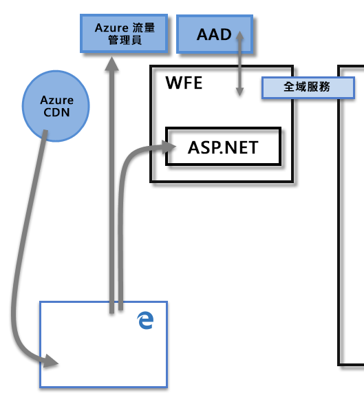
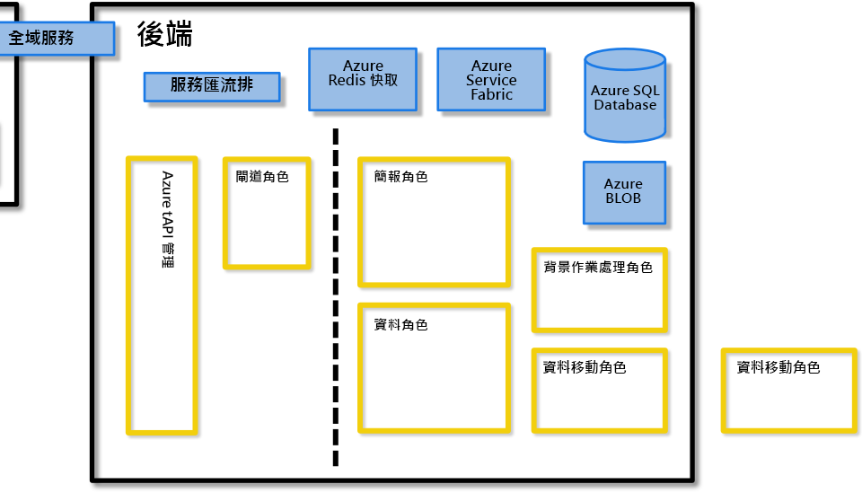
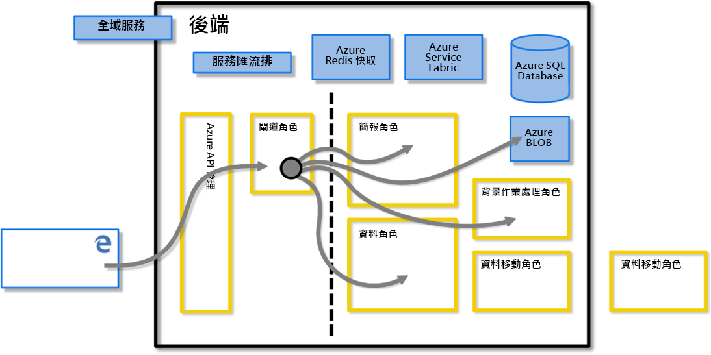
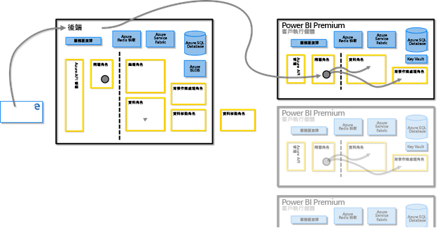
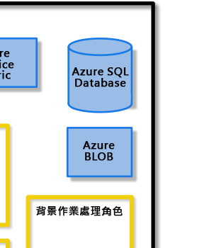
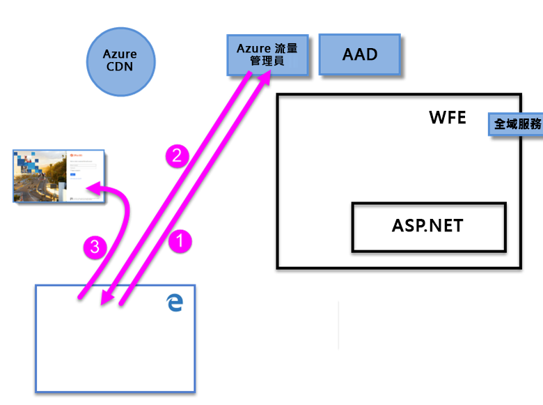
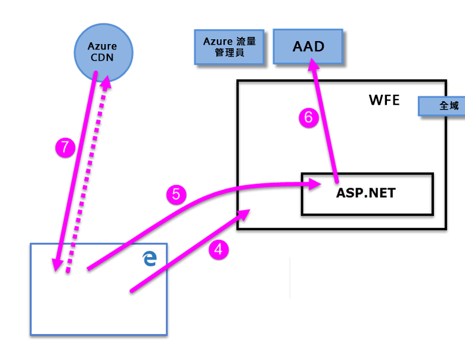

# Power BI 安全性白皮書

**摘要：** Power BI 是 Microsoft 提供的線上軟體服務（*SaaS*或軟體即服務），可讓您輕鬆快速地建立自助商業智慧儀表板、報表、資料集和視覺效果。 使用 Power BI，您可以連線到許多不同的資料來源、結合與塑造來自這些連線的資料，然後建立與其他人共用的報表和儀表板。

**寫入器：** David Iseminger

**技術審核者：** Pedram Rezaei、Cristian Petculescu、Siva Harinath、Tod Manning、Haydn Richardson、Adam Wilson、Ben Childs、Robert Bruckner、Sergei Gundorov、Kasper de Jonge

**適用物件：** Power BI SaaS、Power BI Desktop、Power BI Embedded、Power BI Premium

> [!NOTE]
> 您可選取瀏覽器的 [列印]，然後選取 [儲存為 PDF] 來儲存或列印本白皮書。

## 簡介

**Power BI** 是 Microsoft 提供的線上軟體服務 (稱為 _SaaS_ 或軟體即服務)，讓您輕鬆快速地建立自助商業智慧儀表板、報表、資料集和視覺效果。 使用 Power BI，您可以連線到許多不同的資料來源、結合與塑造來自這些連線的資料，然後建立與其他人共用的報表和儀表板。

Power BI 服務受 [Microsoft Online Services 條款](https://www.microsoftvolumelicensing.com/DocumentSearch.aspx?Mode=3&amp;DocumentTypeId=31)和 [Microsoft 隱私權聲明](https://www.microsoft.com/privacystatement/OnlineServices/Default.aspx)制約管轄。 如需資料處理的位置，請參閱 Microsoft Online Services 條款中的資料處理位置條款。 [Microsoft 信任中心](https://www.microsoft.com/trustcenter)是 Power BI 有關合規性資訊的主要資源。 Power BI 小組致力於為客戶創造最新的創新和生產力。 Power BI 目前位於[Office 365 合規性架構](https://go.microsoft.com/fwlink/p/?LinkID=618494)的第 D 層。

本文透過 Power BI 架構的說明來描述 Power BI 安全性，並說明使用者如何向 Power BI 驗證以及建立資料連線，然後描述 Power BI 如何透過服務儲存及移動資料。 最後一節專門針對安全性相關問題，為每個問題提供答案。

## Power BI 架構

**Power BI** 服務是建置在 Microsoft 的[雲端運算平台](https://azure.microsoft.com/overview/what-is-azure/) **Azure** 上。 Power BI 目前部署在世界各地的許多資料中心，向這些資料中心服務的客戶提供許多主動部署，以及作為每個主動部署備份使用之同等數目的被動部署。

每個 Power BI 部署均由兩個叢集組成：Web 前端 (**WFE**) 叢集和**後端**叢集。 這兩個叢集如下圖所示，為本文其餘部分的背景。 

Power BI 使用 Azure Active Directory (**AAD**) 來驗證與管理帳戶。 Power BI 也會使用 **Azure 流量管理員 (ATM)** ，將使用者流量導向至由用戶端嘗試連線之 DNS 記錄所決定的最近資料中心，以便進行驗證程序及下載靜態內容和檔案。 Power BI 使用地理位置最接近的 WFE，有效率地將必要的靜態內容和檔案散發給使用者，但使用**Azure 內容傳遞網路（CDN）** 傳遞的自訂視覺效果除外。

### WFE 叢集

**WFE** 叢集管理 Power BI 的初始連接和驗證程序，其使用 AAD 驗證用戶端並提供權杖，以便進行 Power BI 服務的後續用戶端連接。

當使用者嘗試連線到 Power BI 服務時，用戶端的 DNS 服務可與 **Azure 流量管理員**通訊，尋找具有 Power BI 部署的最近資料中心。 如需此程序的詳細資訊，請參閱[適用於 Azure 流量管理員的效能流量路由方法](https://azure.microsoft.com/documentation/articles/traffic-manager-routing-methods/#performance-traffic-routing-method)。

距離使用者最近的 WFE 叢集負責管理登入和驗證序列 (本文稍後會加以描述)，並在驗證成功之後向使用者提供 AAD 權杖。 WFE 叢集內的 ASP.NET 元件會剖析要求，以判斷使用者所屬的組織，然後諮詢 Power BI **全域服務**。 全域服務是全球所有 WFE 和後端叢集間共用的單一 Azure 資料表，可將使用者和客戶組織對應到裝載其 Power BI 租用戶的資料中心。 WFE 可對瀏覽器指定應裝載組織租用戶的後端叢集。 驗證使用者後，後續的用戶端互動會直接在後端叢集進行，且 WFE 不需要充當這些要求的中間人。

### Power BI 後端叢集

**後端**叢集是驗證過的用戶端與 Power BI 服務互動的方式。 **後端**叢集會管理視覺效果、使用者儀表板、資料集、報表、資料儲存體、資料連線、資料重新整理，以及與 Power BI 服務互動的其他層面。

**閘道角色** 擔任使用者要求與 Power BI 服務之間的閘道。 使用者不會與閘道角色以外的任何角色直接互動。

**重要事項：** 請務必注意，_只有_Azure API 管理（**APIM**）和閘道（**GW**）角色可透過公用網際網路存取。 這些角色提供驗證、授權、DDoS 保護、節流、負載平衡、路由及其他功能。

上方**後端**叢集影像中的虛線清楚劃分使用者能夠存取的唯二角色 (虛線左側)，以及只有系統可以存取的角色。 當已驗證的使用者連線到 Power BI 服務時，用戶端的連線和任何要求 (由**閘道角色**和 **Azure API 管理**接受及管理) ，會代表使用者與 Power BI 服務的其餘部分互動。 例如，當用戶端嘗試檢視儀表板時， **閘道角色** 會接受該要求，然後另外傳送要求給 **簡報角色** ，以擷取瀏覽器呈現儀表板所需的資料。

### Power BI Premium

**Power BI Premium** 為 Power BI 活動需要專用資源的訂閱者，提供專用的已佈建分割服務工作區。 當客戶註冊 Power BI Premium 訂用帳戶時，會透過 **Azure Resource Manager** 建立 Premium 容量。 該訂用帳戶的推出會指派一組合乎訂用帳戶層級的虛擬機器，在裝載其 Power BI 租用戶的資料中心內 (多地理位置環境除外，如本文件稍後所述)，起始為 **Azure Service Fabric** 部署。

建立之後，所有與 Premium 叢集的通訊都會通過 Power BI 後端叢集路由，且用戶端專用 **Power BI Premium** 訂用帳戶虛擬機器的連線會建立於此叢集中。

### 資料儲存體架構

Power BI 使用兩個主要的存放庫來存放及管理資料：使用者上傳的資料通常會傳送至 **Azure BLOB** 儲存體，而所有中繼資料及系統本身的成品則存放在 **Azure SQL Database** 的防火牆後。

例如，當使用者將 Excel 活頁簿匯入 Power BI 服務時，會建立記憶體內部的 Analysis Services 表格式資料庫，而資料存放在記憶體內部不超過一小時 (或直到系統發生記憶體不足的壓力)。 資料也會傳送至 **Azure BLOb** 儲存體。

有關使用者 Power BI 訂用帳戶的中繼資料，例如儀表板、報表、最近使用的資料來源、工作區、 組織資訊，租用戶資訊，以及有關系統的其他中繼資料，都存放在 **Azure SQL Database** 中並予以更新。 存放在 Azure SQL Database 中的所有資訊，使用 [Azure SQL 的透明資料加密](https://msdn.microsoft.com/library/dn948096.aspx) (TDE) 技術完整加密。 所有存放在 Azure BLOb 儲存體中的資料也予以加密。 如需載入、存放及移動資料的程序詳細資訊，請參閱＜資料儲存和移動＞一節。

## 建立租用戶

租用戶是 Azure AD 服務的專用執行個體，而該服務則是組織在註冊 Azure、Microsoft Intune、Power BI 或 Office 365 等 Microsoft 雲端服務時所收到並擁有的。 每個 Azure AD 租用戶彼此有別，各自獨立。

租用戶可裝載公司中的使用者及其相關資訊：密碼、使用者設定檔資料、權限等等。 它也包含群組、應用程式，以及與組織及其安全性有關的其他資訊。 如需詳細資訊，請參閱[什麼是 Azure AD 租用戶](https://msdn.microsoft.com/library/azure/jj573650.aspx#BKMK_WhatIsAnAzureADTenant)。

Power BI 租用戶是建立在視為最接近國家/地區 (或區域)，並在 Azure Active Directory 中提供租用戶狀態資訊的資料中心內，此資訊是在 Office 365 或 Power BI 服務一開始佈建時所提供。 目前，Power BI 租用戶不會從該資料中心位置移出。

### 多地理位置 (Multi-Geo)

有些組織需要 Power BI 根據業務需求存在多個地理位置或區域。 例如，企業可能會有其在美國的 Power BI 租使用者，但也可能在其他地理區域（例如澳大利亞）中執行業務，而且需要某些 Power BI 資料維持在該遠端區域的待用狀態，以符合當地法規。 從2018的後半部開始，在一個地理位置中具有主要租使用者的組織也可以布建及存取位於另一個地理位置的 Power BI 資源。 為此功能稱為**多地理位置**，以便在本文件中參考。

多地理位置資訊的最新和主要文章是[設定 Power BI Premium 的多地理位置支援](service-admin-premium-multi-geo.md)一文。 

在不同的地理位置操作時，應該在當地法律和法規的內容中評估多項技術詳細資料。 這些詳細資料包括下列各項：

- 遠端查詢執行層裝載于遠端容量區域，以確保資料模型、快取和大部分的資料處理都會保留在遠端容量區域中。 有一些例外狀況，如[Power BI Premium 的多地理位置一](service-admin-premium-multi-geo.md)文所述。
- 儲存在遠端區域中的快取查詢文字和對應的結果將會留在該區域中，不過，傳輸中的其他資料可能會在多個地理位置來回移動。
- 已發佈（上傳）至 Power BI 服務多地理位置容量的 .PBIX 或 .XLSX 檔案，可能會導致複本暫時儲存在 Power BI 的租使用者區域的 Azure Blob 儲存體中。 在這種情況下，會使用 Azure 儲存體服務加密（SSE）來加密資料，並在檔案內容處理和傳送至遠端區域完成後，將複本排程為垃圾收集。 
- 跨多地理位置環境中的區域移動資料時，來源區域中的資料實例將會在7-30 天內刪除。 

### 資料中心和地區設定

Power BI 僅於特定區域提供，根據區域資料中心部署 Power BI 叢集的位置而定。 Microsoft 計劃將其 Power BI 基礎結構擴充至額外的資料中心。

下列連結提供 Azure 資料中心的其他資訊。

- [Azure 區域](https://azure.microsoft.com/regions/) – Azure 全球出現位置的相關資訊
- [依區域劃分的 Azure 服務](https://azure.microsoft.com/regions/#services) – Microsoft 提供之各區域的 Azure 服務 (基礎結構服務及平台服務) 完整清單。

目前，Power BI 服務可在特定區域中使用，如[Microsoft 信任中心](https://www.microsoft.com/TrustCenter/CloudServices/business-application-platform/data-location)所述，由資料中心提供服務。 以下連結顯示 Power BI 資料中心的地圖，您可將滑鼠暫留在區域上，以查看位於該區域的資料中心：

* [Power BI Datacenters](https://www.microsoft.com/TrustCenter/CloudServices/business-application-platform/data-location) (Power BI 資料中心)

Microsoft 也為各國政府提供資料中心。 如需國家/地區雲端的 Power BI 服務可用性詳細資訊，請參閱 [Power BI 國家/地區雲端](https://powerbi.microsoft.com/clouds/)。

如需資料存放位置和使用方式的詳細資訊，請參閱 [Microsoft Trust Center](https://www.microsoft.com/TrustCenter/Transparency/default.aspx#_You_know_where) (Microsoft 信任中心)。 [Microsoft Online Services 條款](https://www.microsoftvolumelicensing.com/DocumentSearch.aspx?Mode=3&amp;DocumentTypeId=31)的**資料處理條款**會指定客戶待用資料的相關位置。

## 使用者驗證

Power BI 服務的使用者驗證包含一系列的要求、回應，並在使用者的瀏覽器和 Power BI 服務或 Power BI 所使用的 Azure 服務之間重新導向。 該順序描述 Power BI 中的使用者驗證程序。 如需組織使用者驗證模型 (登入模型) 選項的詳細資訊，請參閱 [Choosing a sign-in model for Office 365](https://blogs.office.com/2014/05/13/choosing-a-sign-in-model-for-office-365/)(選擇 Office 365 的登入模型)。

### 驗證順序

Power BI 服務的使用者驗證順序如下列步驟中所述，請見下列圖示。

1. 使用者可在 Power BI 位址的網址列 (例如 https://app.powerbi.com) ) 中鍵入 Power BI 位址，或在 Power BI 登陸頁面 (https://powerbi.microsoft.com) ) 選取 [登入]，以從瀏覽器起始對 Power BI 服務的連線。 連線是使用 TLS 1.2 和 HTTPS 來建立，而瀏覽器和 Power BI 服務之間所有後續的通訊則使用 HTTPS。 要求傳送至 **Azure 流量管理員**。

2. **Azure 流量管理員**會檢查使用者的 DNS 記錄，以判斷已部署 Power BI 的最近資料中心，並以應傳送使用者之目標 WFE 叢集的 IP 位址來回應 DNS。

3. 然後 WFE 會將使用者重新導向至 Microsoft Online Services 登入頁面。

    

1. 使用者驗證之後，登入頁面會將使用者導向到之前判斷的最近 Power BI 服務 **WFE 叢集**。

2. 瀏覽器提交取自於成功登入 Microsoft Online Services 的 Cookie，由 **WFE 叢集**內的 **ASP.NET 服務**檢查。

3. WFE 叢集會使用 **Azure Active Directory** (**AAD**) 服務進行檢查，以驗證使用者的 Power BI 服務訂用帳戶，並取得 AAD 安全性權杖。 當 AAD 傳回使用者成功驗證及 AAD 安全性權杖時，WFE 叢集會諮詢 **Power BI**** 全域服務**，如此可維護租用戶及其 Power BI 後端叢集位置的清單，判斷哪一個 Power BI 服務叢集包含使用者的租用戶。 然後，WFE 叢集將使用者導向至其租用戶所在的 Power BI 叢集，將項目集合傳回至使用者的瀏覽器：

      - **AAD 安全性權杖**
      - **工作階段資訊**
      - 使用者可與其通訊及互動的**後端**叢集網址

1. 然後，使用者瀏覽器會連絡指定的 Azure CDN，或針對某些 WFE 檔案，下載指定通用檔案的集合，它們是啟用瀏覽器與 Power BI 服務互動所需的檔案。 瀏覽器頁面接著會包含 Power BI 服務瀏覽器工作階段期間的 AAD 權杖、工作階段資訊、相關的後端叢集位置，以及從 Azure CDN 和 WFE 叢集下載的檔案集合。

這些項目完成後，瀏覽器就會開始連絡指定的後端叢集，使用者也會開始與 Power BI 服務互動。 從此時開始，所有對 Power BI 的呼叫都會使用特定後端叢集，且所有呼叫都會包含使用者的 AAD 權杖。 AAD 權杖的逾時為一小時；如果使用者的工作階段保持開啟，WFE 會定期重新整理權杖，以保留存取權。

## 資料儲存和移動

在 Power BI 服務中，資料狀態為「待用」 (目前未處理可供 Power BI 使用者使用的資料) 或「正在處理」(例如：正在執行查詢、正在處理資料連線和模型、正將資料及/或模型上傳至 Power BI 服務，以及使用者或 Power BI 服務會對正在存取或更新之資料採取的其他動作)。 正在處理的資料稱為「正在處理的資料」。 Power BI 中的待用資料已加密。 正在傳輸的資料，表示 Power BI 服務正在傳送或接收的資料也會加密。

Power BI 服務管理資料的方式，也會依是否使用 **DirectQuery** 存取資料或匯入而不同。 Power BI 的使用者資料有兩種：由 DirectQuery 存取的資料和不由 DirectQuery 存取的資料。

**DirectQuery** 是資料來源的原生資料語言 (例如 T-SQL 或其他原生資料庫語言) 中，已從 Microsoft 資料分析運算式 (DAX) 語言轉譯的 Power BI 使用者查詢，DAX 是 Power BI 和其他 Microsoft 產品建立查詢所用的語言。 與 DirectQuery 建立關聯的資料僅依參考儲存，這表示當 DirectQuery 不在作用中時，來源資料不會存放在 Power BI 中 (用來顯示儀表板和報表的視覺效果資料除外，如後文＜正在處理的資料 (資料移動)＞一節所述)。 之所以儲存 DirectQuery 資料的參考，是為了在執行 DirectQuery 時允許存取該資料。 DirectQuery 包含執行查詢的所有必要資訊，包括連接字串和用來存取資料來源的認證，讓 DirectQuery 連線到包含的資料來源以自動重新整理。 使用 DirectQuery，基礎資料模型資訊會併入 DirectQuery。

匯入資料集的查詢包含「不」直接轉譯成任何基礎資料來源原生語言的 DAX 查詢集合。 匯入查詢不包含基礎資料的認證，除非它是透過 [Power BI Gateway](service-gateway-onprem.md) 存取的內部部署資料，查詢僅儲存內部部署資料的參考，否則基礎資料會載入 Power BI 服務。

下表會根據使用的查詢類型描述 Power BI 資料。 **X** 會在使用相關查詢類型時，表示 Power BI 資料是否存在。

|  |匯入  |DirectQuery  |Live connect  |
|---------|---------|---------|---------|
|結構描述     |     X    |    X     |         |
|資料列資料     |    X     |         |         |
|視覺效果資料快取     |    X     |     X    |    X     |

DirectQuery 和其他查詢之間的差異決定 Power BI 服務處理待用資料的方式，以及查詢本身是否加密。 下列各節描述待用和移動中的資料，並描述加密、位置和處理資料的程序。

### 待用資料

資料待用時，Power BI 服務會使用下列各小節所述的方式儲存資料集、報表和儀表板磚。 如前所述，Power BI 中的待用資料已加密。 ETL 在下列各節中表示擷取、轉換和載入。

#### 加密金鑰

- Azure Blob 的加密金鑰會在 Azure Key Vault 中儲存並加密。
- Azure SQL Database TDE 技術的加密金鑰是由 Azure SQL 自行管理。
- 資料移動服務和內部部署資料閘道的加密金鑰儲存位置：
  - 客戶基礎結構的內部部署資料閘道 – 適用於內部部署資料
  - 資料移動角色 – 適用於雲端式資料來源

用來加密 Windows Azure Blob 儲存體之內容加密金鑰 (CEK) 是隨機產生的 256 位元金鑰。 CEK 用來加密內容的演算法是 AES\_CBC\_256。

用來加密 CEK 之金鑰加密金鑰 (KEK) 則是預先定義的 256 位元金鑰。 KEK 加密 CEK 的演算法是 A256KW。

以修復金鑰為基礎的閘道加密金鑰絕不能離開內部部署基礎結構。 Power BI 無法存取加密的內部部署認證值，也無法攔截這些認證；Web 用戶端使用與其通訊所用之特定閘道建立關聯的公開金鑰來加密認證。

針對雲端式資料來源，資料移動角色使用 [Always Encrypted](https://msdn.microsoft.com/library/mt163865.aspx) 方法加密加密金鑰。 您可以深入了解 [Always Encrypted 資料庫功能](https://msdn.microsoft.com/library/mt163865.aspx)。

#### 資料集

1. 中繼資料 (資料表、資料行、量值、計算、連接字串等等)

    a. 針對 Analysis Services 內部部署，除了在 Azure SQL 中儲存加密之資料庫的參考外，服務中不儲存任何內容。

    b. ETL、DirectQuery 和推送資料的所有其他中繼資料都會加密並儲存在 Azure Blob 儲存體中。

1. 原始資料來源的認證
  
      a. Analysis Services 內部部署 – 不需要任何認證；因此，不會儲存任何認證。

      b. DirectQuery – 視模型是否直接在服務中建立，其會存放在連接字串並在 Azure Blob 中加密；或者，如果模型從 Power BI Desktop 匯入，則認證加密存放在資料移動的 Azure SQL Database 中。 加密金鑰的存放位置是在客戶基礎結構閘道上執行的電腦。

      c. 推送的資料 – 不適用

      d. ETL

      - **Salesforce** 或 **OneDrive** – 重新整理權杖會加密儲存在 Power BI 服務中的 Azure SQL Database。
      - 否則：
        - 如果設定重新整理資料集，則認證會加密儲存在資料移動中的 Azure SQL Database。 加密金鑰的存放位置是在客戶基礎結構閘道上執行的電腦。
        - 如未設定重新整理資料集，則不儲存資料來源的任何認證

1. 資料

    a. 內部部署和 DirectQuery 的 Analysis Services – Power BI 服務中不存放任何內容。

    b. ETL – 在 Azure Blob 儲存體中加密，但目前 Power BI 服務之 Azure Blob 儲存體中的所有資料都使用 [Azure 儲存體服務加密 (SSE)](https://docs.microsoft.com/azure/storage/common/storage-service-encryption)，也稱為伺服器端加密。 多地理位置也使用 SSE。

    c. 推送資料 v1 – 在 Azure Blob 儲存體中儲存加密，但目前 Power BI 服務之 Azure Blob 儲存體中的所有資料都使用 [Azure 儲存體服務加密 (SSE)](https://docs.microsoft.com/azure/storage/common/storage-service-encryption)，也稱為伺服器端加密。 多地理位置也使用 SSE。 推送資料 v1 從2016開始已停止。 

    d. 推送資料 v2 – 在 Azure SQL 儲存加密。

Power BI 使用用戶端的加密方法，利用加密區塊鏈結 (CBC) 模式和進階加密標準 (AES) 來加密其 Azure Blob 儲存體。 您可以[深入了解用戶端加密](https://azure.microsoft.com/documentation/articles/storage-client-side-encryption/)。

Power BI 以下列方式提供資料完整性監視：

* 針對 Azure SQL 中的待用資料，Power BI 會使用 dbcc、TDE 和常數的頁面總和檢查碼作為 SQL 原生供應項目的一部分。

* 針對 Azure Blob 儲存體中的待用資料，Power BI 會使用用戶端加密和 HTTPS 將資料傳輸至儲存體，此儲存體會在資料擷取期間檢查完整性。 您可以[深入了解 Azure Blob 儲存體安全性](https://azure.microsoft.com/documentation/articles/storage-security-guide/)。

#### 報表

1. 中繼資料 (報表定義)

   a. 報表可以是 Office 365 的 Excel 報表或 Power BI 報表。 下列適用於以報表類型為基礎的中繼資料：
        
    &ensp; &ensp;。 Excel 報表中繼資料會以加密方式儲存在 SQL Azure 中。 中繼資料也會儲存在 Office 365 中。

    &ensp; &ensp; b。 Power BI 報表會以加密方式儲存在 Azure SQL database 中。

2. 靜態資料

   靜態資料包括背景映像和自訂視覺效果等成品。

    &ensp; &ensp;。 使用 Office 365 Excel 建立的報表，不儲存任何內容。

    &ensp; &ensp; b。 Power BI 報表的靜態資料會在 Azure Blob 儲存體中儲存加密。

3. 緩衝區

    &ensp; &ensp;。 使用 Office 365 Excel 建立的報表，不快取任何內容。

    &ensp; &ensp; b。 Power BI 報表中顯示的視覺效果資料會在 Azure SQL Database 中快取加密。
 

4. 發佈到 Power BI 的原始 Power BI Desktop (.pbix) 或 Excel (.xlsx) 檔案

    有時候 .xlsx 或 .pbix 檔案的複本或陰影複製會儲存在 Power BI 的 Azure Blob 儲存體中，而發生此情形時，會加密資料。 所有儲存在 Power BI 服務 Azure Blob 儲存體中的這類報表，都使用 [Azure 儲存體服務加密 (SSE)](https://docs.microsoft.com/azure/storage/common/storage-service-encryption)，也稱為伺服器端加密。 多地理位置也使用 SSE。

#### 儀表板和儀表板磚

1. 快取 – 儀表板視覺效果所需要的資料，通常是在 Azure SQL Database 中快取及儲存加密。 其他磚，例如從 Excel 或 SQL Server Reporting Services (SSRS) 釘選的視覺效果，則儲存在 Azure Blob 作為映像，也會加密。

2. 靜態資料 – 包含背景映像和自訂視覺效果等成品，則儲存加密在 Azure Blob 儲存體中。

不論使用何種加密方法，Microsoft 會代客戶管理祕密存放區或 Azure Key Vault 中的金鑰加密作業。

### 暫時存放在靜態裝置上的資料

非變動裝置是指具有不會持續電源的記憶體的裝置。 下列描述暫時存放在靜態裝置上的資料。 

#### 資料集

1. 中繼資料 (資料表、資料行、量值、計算、連接字串等等)

2. 部分結構描述的相關成品可在計算節點的磁碟上儲存一段限定時間。 有些成品也可以在 Azure REDIS 快取中不加密儲存一段限定時間。

3. 原始資料來源的認證

    a. 內部部署 Analysis Services – 不存放任何內容

    b. DirectQuery – 視模型是否直接在服務中建立，其會存放在連接字串中，加密格式為儲存在同一位置純文字的加密金鑰 (以及加密的資訊)；或者，如果模型從 Power BI Desktop 匯入，則認證不會存放在靜態裝置中。

    > [!NOTE]
    > 從2017開始，服務端模型建立功能已停止。

    c. 推送的資料 – 無 (不適用)

    d. ETL – 無 (無任何內容存放在計算節點上，也和前文＜待用資料＞一節所述一致)
4. 資料

    有些資料成品可在計算節點的磁碟上存放一段限定時間。

### 正在處理的資料

正在處理之資料是正被使用者使用或存取的資料。 例如，當使用者存取資料集、修訂或修改儀表板或報表時，重新整理、或可能發生其他資料存取活動時，資料狀態即為正在處理。 發生前述任一事件並正在處理資料時，Power BI 服務的**資料角色**會建立記憶體內部 Analysis Services (AS) 資料庫，而資料集會載入至記憶體內部 Analysis Services 資料庫。 無論此資料集是否以 DirectQuery 為基礎，載入 AS 資料庫的資料都不加密，以允許**資料角色**存取，並保存在記憶體中供日後存取，直到 Power BI 服務不再需要此資料集為止。 針對使用 Power BI Premium 訂用帳戶的客戶，Power BI 會在客戶另行佈建的 Power BI 虛擬機器集合中，建立記憶體內部 Analysis Services (AS) 資料庫。

開始處理資料後，包括一開始將資料載入 Power BI，Power BI 服務就會快取加密 **Azure SQL Database** 中的視覺效果資料，不論資料集是否以 DirectQuery 為基礎。

為監視正在處理之資料的資料完整性，Power BI 使用 HTTPS、TCP/IP 和 TLS 來確定資料已加密，並在傳輸期間保持其完整性。

## 資料來源的使用者驗證

在每個資料來源中，使用者會根據登入建立連接，並使用這些認證來存取資料。 然後，使用者可以根據基礎資料建立查詢、儀表板和報表。

當使用者共用查詢、儀表板、報表或任何視覺效果時，能否存取該資料和這些視覺效果，取決於基礎資料來源是否支援角色層級安全性 (RLS)。

如果基礎資料來源能因應 **Power BI 的***角色層級安全性 (RLS)** ，則 Power BI 服務會套用該角色層級安全性，而認證不足無法存取基礎資料 (可能是用於儀表板、報表或其他資料成品的查詢) 的使用者，看不到需要足夠使用者權限的資料。 如果使用者存取基礎資料之方式不同於儀表板或報表建立者的方式，則視覺效果和其他成品只會根據此使用者所擁有的資料存取層級顯示資料。

如果資料來源**不**適用 RLS，則基礎資料來源會套用 Power BI 登入認證；或者，如果在連線期間提供其他認證，則套用這些提供的認證。 當使用者從非 RLS 資料來源將資料載入 Power BI 服務時，資料會存放在 Power BI 中，如本文件的＜資料儲存和移動＞一節所述。 針對非 RLS 資料來源，當與其他使用者共用資料 (例如透過儀表板或報表)，或重新整理資料時，即會使用原始的認證存取或顯示資料。

如需對比 RLS 及非 RLS 資料來源的快速範例，請想像 Sam 建立了報表和儀表板，然後與 Abby 和 Ralph 共用它們。 如果報表和儀表板中使用的資料來源來自**不**支援 RLS 的資料來源，則 Abby 和 Ralph 都可以看到 Sam 包含在儀表板中的資料 (已上傳到 Power BI 服務)，且 Abby 和 Ralph 都能夠資料互動。 相反地，如果 Sam 使用不支援 RLS 的資料來源建立報表和儀表板，然後與 Abby 和 Ralph 共用它，則當 Abby 嘗試檢視儀表板時，會發生下列狀況：

1. 因為儀表板來自 RLS 資料來源；所以，當 Power BI 服務查詢資料來源以擷取與儀表板基礎查詢建立關聯之連接字串中指定的最新資料集時，儀表板視覺效果會短暫顯示「正在載入」訊息。

2. 存取並擷取資料的根據是 Abby 的認證和角色，儀表板和報表只會載入 Abby 有足夠授權得以處理的資料。

3. 儀表板和報表中的視覺效果會按 Abby 的角色層級顯示。

如果 Ralph 想要存取共用的儀表板或報表，就會根據其角色層級依序發生相同的狀況。

## Power BI 和 ExpressRoute

透過 Power BI 和 ExpressRoute，您可以建立從組織到 Power BI (或使用 ISP 設備代管) 的私人網路連線，藉由略過網際網路，更妥善地保護您機密的 Power BI 資料和連線。

ExpressRoute 是 Azure 服務，可讓您在 Azure 資料中心 (Power BI 所在位置) 與內部部署基礎結構之間建立私人連線，或在 Azure 資料中心與代管環境之間建立私人連線。 如需詳細資訊，請參閱 [Power BI 和 ExpressRoute](service-admin-power-bi-expressroute.md) 一文。

## Power BI 行動版

Power BI 行動版是針對三個主要行動平臺設計的應用程式集合： Android、iOS 和 Windows Mobile。 Power BI 行動裝置應用程式的安全性考量分成兩類：

* 裝置通訊
* 裝置上的應用程式和資料

針對**裝置通訊**，所有 Power BI 行動版應用程式都與 Power BI 服務通訊，並使用與瀏覽器所使用的相同連線與驗證順序 (如本技術白皮書前述的詳細描述)。 iOS 和 Android Power BI 行動應用程式會在應用程式本身啟動瀏覽器工作階段，而 Windows 行動應用程式會啟動代理來與 Power BI 建立通訊通道。

下表列出基於行動裝置平台之 Power BI 行動版憑證型驗證 (CBA) 的支援：

| **CBA 支援** | **iOS** | **Android** | **Windows** |
| --- | --- | --- | --- |
| **Power BI** (登入服務) | 受支援 | 受支援 | 不支援 |
| **SSRS ADFS** (連線至 SSRS 伺服器) | 不支援 | 支援 | 不支援 |

Power BI 行動版應用程式會主動與 Power BI 服務通訊。 遙測用於收集行動應用程式使用量統計資料和類似資料，這些資料會傳輸至用於監視使用量和活動的服務；個人資料不會使用遙測資料傳送。

Power BI **裝置上的應用程式**在裝置上儲存的資料有助於使用應用程式：

* Azure Active Directory 和重新整理權杖使用業界標準安全措施來以安全機制儲存在裝置上。

* 資料會快取在裝置的儲存體中，不會直接由應用程式本身加密

* 設定也會儲存在未加密的裝置上，但不會儲存實際的使用者資料。

Power BI 行動版的資料快取會在裝置上保留兩週，或是直到應用程式刪除、使用者登出 Power BI 行動版，或使用者無法登入 (例如權杖到期事件或變更密碼)。 資料快取包括先前從 Power BI 行動版應用程式存取的儀表板和報表。

Power BI 行動版應用程式不會查看裝置上的資料夾。 

可以使用 Power BI 行動版的三個平台都支援 Microsoft Intune (提供行動裝置和應用程式管理的軟體服務)。 啟用和設定 Intune 後，將會加密行動裝置上的資料，且 Power BI 應用程式本身不能安裝在 SD 卡上。 您可以[深入了解 Microsoft Intune](https://www.microsoft.com/cloud-platform/microsoft-intune)。

## Power BI 安全性問題和回答

下列問題是 Power BI 常見的安全性問題和回答。 這些內容根據其新增至本白皮書的時間進行排序，以便在文件更新時供您快速找出新問題和回答。 最新的問題會新增至此清單的結尾。

**使用 Power BI 時，使用者如何連線至資料來源並存取？**

* **Power BI 認證和網域認證：** 使用者使用電子郵件地址登入 Power BI;當使用者嘗試連線到資料資源時，Power BI 會傳遞 Power BI 登入電子郵件地址作為認證。 針對網域連線資源 (內部部署或雲端式)，目錄服務會將登入電子郵件與「使用者主體名稱」 ([UPN](https://msdn.microsoft.com/library/windows/desktop/aa380525(v=vs.85).aspx)) 比對，以判斷是否有足夠的認證允許存取。 至於使用工作電子郵件地址登入 Power BI 的組織 (他們使用同一電子郵件登入工作資源，例如 _david@contoso.com_ )，可以流暢對應；至於不使用工作電子郵件地址的組織 (例如 _david@contoso.onmicrosoft.com_ )，則必須建立目錄對應，才能使用 Power BI 登入認證存取內部部署資源。

* **SQL Server Analysis Services 和 Power BI：** 針對使用內部部署 SQL Server Analysis Services 的組織，Power BI 提供 Power BI 內部部署資料閘道（這是**閘道**，如上一節中所述）。  Power BI 內部部署資料閘道可以對資料來源 (RLS) 實施角色層級安全性。 如需 RLS 的詳細資訊，請參閱本文件稍早所述的**資料來源的使用者驗證**。 如需閘道的詳細資訊，請參閱內部[部署資料閘道](service-gateway-onprem.md)。

  此外，組織也可以使用 Kerberos 來進行**單一登入** (SSO)，並從 Power BI 順暢地連線至內部部署資料來源，例如 SQL Server、SAP HANA 和 Teradata。 如需詳細資訊和特定設定需求，請參閱[**使用 Kerberos 進行 SSO，從 Power BI 到內部部署資料來源**](https://docs.microsoft.com/power-bi/service-gateway-kerberos-for-sso-pbi-to-on-premises-data)。

* **非網域**連線：對於未加入網域且不具備角色層級安全性（RLS）的資料連線，使用者必須在連接順序期間提供認證，Power BI 接著會傳遞至資料來源以建立建立. 如果具有足夠的權限，資料會從資料來源載入 Power BI 服務。

**Power BI 如何傳輸資料？**

* Power BI 要求和傳輸的所有資料都會在傳輸過程中使用 HTTPS 進行加密，以從資料來源連線至 Power BI 服務。 會建立與資料提供者之間的安全連線，且唯有在建立該連線後，資料才能周遊網路。

**Power BI 如何快取報表、儀表板或模型資料，且其是否安全？**

* 存取資料來源時，Power BI 服務會遵循本文件先前＜資料儲存和移動＞一節中概述的程序。

**用戶端是在本機快取網頁資料嗎？**

* 瀏覽器用戶端存取 Power BI 時，Power BI Web 伺服器會將 _Cache-Control_ 指示詞設定為 _no-store_。 _no-store_ 指示詞會指示瀏覽器不快取使用者正在檢視的網頁，而不是將網頁儲存在用戶端的快取資料夾中。

**那麼，以角色為基礎的安全性、共用報表或儀表板，以及資料連線呢？如何在資料存取、儀表板的查看、報表存取或重新整理方面運作？**

* 針對已啟用**非角色層級安全性 (RLS)** 的資料來源，如果透過 Power BI 與其他使用者共用儀表板、報表或資料模型，則該資料即可供與其共用的使用者檢視和互動。 Power BI 「不會」針對資料的原始來源重新驗證使用者；資料一旦上傳至 Power BI 後，對來源資料進行驗證的使用者需負責管理哪些其他使用者和群組可以檢視資料。

  當與支援 **RLS** 的資料來源 (例如 Analysis Services 資料來源) 建立資料連線時，只有儀表板資料會在 Power BI 中快取。 每次在 Power BI 中檢視或存取報表或資料集 (使用支援 RLS 之資料來源的資料) 時，Power BI 服務都會存取資料來源，根據使用者的認證來取得資料；如果有足夠的權限，則資料會為載入至該使用者的報表或資料模型中。 如果驗證失敗，使用者會看到錯誤。

  如需詳細資訊，請參閱本文件稍早所述的＜資料來源的使用者驗證＞一節。

**我們的使用者會隨時連線到相同的資料來源，有些則需要不同于其網域認證的認證。他們要如何避免每次建立資料連線時都必須輸入這些認證？**

* Power BI 提供 [Power BI Personal Gateway](https://support.powerbi.com/knowledgebase/articles/649846)，此功能可讓使用者為多個不同的資料來源建立認證，並在後續存取每個資料來源時自動使用這些認證。 如需詳細資訊，請參閱 [Power BI Personal Gateway](https://support.powerbi.com/knowledgebase/articles/649846)。

**Power BI 群組如何運作？**

* Power BI 群組可讓使用者在已建立的小組中快速且輕鬆地共同建立儀表板、報表和資料模型。 例如，如果您有 Power BI 群組，其中包含您所屬小組的每個人，則您可以從 Power BI 中選取群組來輕鬆與小組中的每個人共同作業。 Power BI 群組相當於 Office 365 萬用群組 (您可以[了解](https://support.office.com/Article/Find-help-about-Groups-in-Office-365-7a9b321f-b76a-4d53-b98b-a2b0b7946de1)、[建立](https://support.office.com/Article/View-create-and-delete-Groups-in-the-Office-365-admin-center-a6360120-2fc4-46af-b105-6a04dc5461c7) 並 [管理](https://support.office.com/Article/Manage-Group-membership-in-the-Office-365-admin-center-e186d224-a324-4afa-8300-0e4fc0c3000a))，並使用與 Azure Active Directory 所使用的相同驗證機制來保護資料。 您可以[在Power BI 中建立群組](https://support.powerbi.com/knowledgebase/articles/654250)，或在 Microsoft 365 系統管理中心建立萬用群組，兩者對於在 Power BI 中建立群組都具有相同的結果。

  請注意，與 Power BI 群組共用的資料，會遵循與 Power BI 中任何共用資料相同的安全性考量。 針對**非 RLS** 資料來源，Power BI **不會**針對資料的原始來源重新驗證使用者，且資料一旦上傳至 Power BI 後，對來源資料進行驗證的使用者需負責管理哪些其他使用者和群組可以檢視資料。 如需詳細資訊，請參閱本文件稍早所述的＜資料來源的使用者驗證＞一節。

  您可以取得 [Power BI 中群組](https://support.powerbi.com/knowledgebase/articles/654247)的詳細資訊。

**內部部署資料閘道和個人閘道會使用哪些埠？是否有任何需要允許連接的功能變數名稱？**

* 您可以在下列連結取得此問題的詳細解答：[閘道埠](/data-integration/gateway/service-gateway-communication#ports)

**使用內部部署資料閘道時，如何使用修復金鑰及其儲存位置？那麼安全認證管理呢？**

* 在閘道安裝和設定期間，系統管理員會鍵入閘道**修復金鑰**。 該**修復金鑰**用來產生強式**AES**對稱金鑰。 同時也會建立**RSA**非對稱金鑰。

    這些產生的金鑰 (**RSA** 和 **AES**) 會儲存於本機電腦上的檔案中。 此外，該檔案也會受到加密。 只有該特定的 Windows 電腦，以及該特定的閘道服務帳戶，才能解密該檔案的內容。

    當使用者在 Power BI 服務 UI 中輸入資料來源認證時，認證會使用瀏覽器中的公開金鑰進行加密。 閘道會使用 RSA 私密金鑰解密認證，並使用 AES 對稱金鑰重新加密，然後將資料儲存在 Power BI 服務中。 使用此程序，Power BI 服務永遠無法存取未加密的資料。

**內部部署資料閘道會使用哪些通訊協定？如何確保安全？**

* 閘道支援下列兩種通訊協定：

  - **AMQP 1.0 – TCP + TLS**：此通訊協定需要開啟埠443、5671-5672 和9350-9354 以進行外寄通訊。 此通訊協定為優先選項，因為具有較低的通訊額外負荷。

  - **Https –透過 HTTPs + TLS 的 websocket**：此通訊協定只會使用埠443。 WebSocket 由單一 HTTP 連線訊息啟動。 一旦建立通道後，通訊本質上為 TCP + TLS。 您可以藉由修改[內部部署閘道一文](/data-integration/gateway/service-gateway-communication#force-https-communication-with-azure-service-bus)中所述的設定，強制閘道使用此通訊協定。

**Power BI 中 Azure CDN 的角色是什麼？**

* 如先前所述，Power BI 使用 **Azure 內容傳遞網路** (CDN)，以根據地理的地區設定有效率地散發必要的靜態內容和檔案給使用者。 為了探索進一步的詳細資料，Power BI 服務會使用多個 **CDN**，透過公用網際網路有效率地將必要的靜態內容和檔案散發給使用者。 這些靜態檔案包括產品下載 (例如 **Power BI Desktop**、**內部部署資料閘道**或來自不同獨立服務提供者的 Power BI 應用程式)、用來起始及建立任何與 Power BI 服務後續連線的瀏覽器設定檔，以及初始的安全 Power BI 登入頁面。

  根據初始連線至 Power BI 服務期間提供的資訊，使用者瀏覽器會連絡指定的 Azure **CDN** (對某些檔案則是 **WFE**) 下載指定通用檔案的集合，其為啟用瀏覽器與 Power BI 服務互動所需的檔案。 然後，瀏覽器頁面會包含 Power BI 服務瀏覽器工作階段期間的 AAD 權杖、工作階段資訊、相關的**後端**叢集位置，以及從 Azure **CDN** 和 **WFE** 叢集下載的檔案集合。

**針對自訂視覺效果，Microsoft 是否會在將項目發行至資源庫前，執行任何自訂視覺效果程式碼的安全性或隱私權評定？**

* 否。 客戶應負責檢閱自訂視覺效果程式碼，並判斷程式碼是否可靠。 因為所有自訂視覺效果程式碼都會在沙箱環境內執行，所以自訂視覺效果中的不當程式碼並不會對 Power BI 服務的其他部分造成影響。

**有其他 Power BI 視覺效果會在客戶網路外傳送資訊嗎？**

* 是。 Bing 地圖服務和 ESRI 視覺效果會因使用這些服務的視覺效果而在 Power BI 服務外傳輸資料。 如需詳細資訊以及 Power BI 外租用戶流量的詳細描述，請參閱 [**Power BI 和 ExpressRoute**](service-admin-power-bi-expressroute.md)。

**針對範本應用程式，Microsoft 是否會在將專案發行至資源庫之前，先執行範本應用程式的任何安全性或隱私權評估？**
* 否。 應用程式發行者負責內容，而客戶必須負責審查並判斷是否信任範本應用程式發行者。 

**是否有可將資訊傳送至客戶網路外的範本應用程式？**
* 是。 客戶必須負責審查發行者的隱私權原則，並決定是否要在租使用者上安裝範本應用程式。 此外，發行者也會負責通知應用程式的行為和功能。

**那麼資料主權呢？我們可以在位於特定地理位置的資料中心布建租使用者，以確保資料不會離開國家/地區框線嗎？**

* 特定地理位置中的某些客戶可在國家/地區雲端中建立租用戶，其中的資料儲存和處理會和所有其他資料中心分開。 因為有獨立的資料信任者代表 Microsoft 負責運作國家/地區雲端 Power BI 服務，所以國家/地區雲端的安全性類型稍有不同。

  客戶也能在特定區域設定租用戶，但該類租用戶不會有 Microsoft 提供的個別資料信任者。 國家/地區雲端和正式運作之商用 Power BI 服務的定價不同。 如需國家/地區雲端的 Power BI 服務可用性詳細資訊，請參閱 [Power BI 國家/地區雲端](https://powerbi.microsoft.com/clouds/)。

**Microsoft 如何將連接視為具有 Power BI Premium 訂用帳戶的客戶？這些連線與針對非 Premium Power BI 服務所建立的連線不同嗎？**

* 為具有 Power BI Premium 訂閱的客戶所建立的連線會實施 [Azure 企業對企業 (B2B)](https://docs.microsoft.com/azure/active-directory/active-directory-b2b-what-is-azure-ad-b2b) 授權程序，會使用 Azure Active Directory (AD) 來啟用存取控制和授權。 Power BI 會處理來自 Power BI Premium 訂閱者到 Power BI Premium 資源的連線，與任何其他 Azure AD 使用者無異。

## 結論

Power BI 服務架構是以兩個叢集為基礎：Web 前端 (WFE) 叢集和後端叢集。 WFE 叢集負責 Power BI 服務的初始連接和驗證；驗證後，便會由後端來處理所有後續使用者互動。 Power BI 分別使用 Azure Active Directory (AAD) 來儲存及管理使用者身分識別，以及使用 Azure Blob 和 Azure SQL Database 來管理資料和中繼資料的儲存。

Power BI 中的資料儲存和資料處理，會根據是否使用 DirectQuery 存取資料而有所不同，而資料在雲端或內部部署也會產生影響。 Power BI 也能實施資料列層級安全性 (RLS)，以及和提供內部部署資料存取權的閘道互動。

## 意見反應與建議

非常感謝您的意見反應。 期盼您對改進、新功能、對本白皮書的闡明或其他和 Power BI 相關的內容提出建議。 請將您的建議傳送至 [pbidocfeedback@microsoft.com](mailto:pbidocfeedback@microsoft.com)。

## 其他資源

如需更多有關 Power BI 的資訊，請參閱以下資源。

- [Power BI 中的群組](https://support.powerbi.com/knowledgebase/articles/654247)
- [開始使用 Power BI Desktop](https://support.powerbi.com/knowledgebase/articles/471664)
- [Power BI REST API - Overview](https://msdn.microsoft.com/library/dn877544.aspx) (Power BI REST API - 概觀)
- [Power BI API reference](https://msdn.microsoft.com/library/mt147898.aspx) (Power BI API 參考)
- [On-premises data gateway (內部部署資料閘道)](service-gateway-onprem.md)
- [Power BI 和 ExpressRoute](service-admin-power-bi-expressroute.md)
- [Power BI 國家/地區雲端](https://powerbi.microsoft.com/clouds/)
- [Power BI Premium](https://aka.ms/pbipremiumwhitepaper)
- [針對從 Power BI 到內部部署資料來源的 SSO 使用 Kerberos](service-gateway-sso-overview.md)
